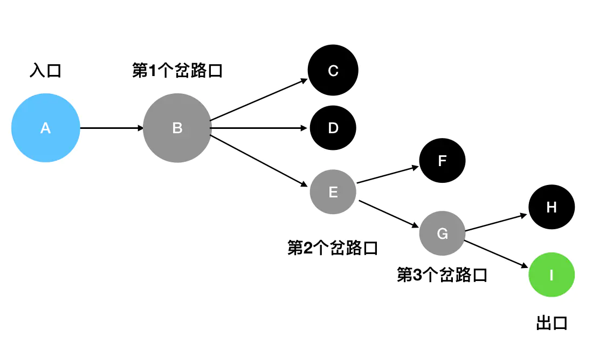
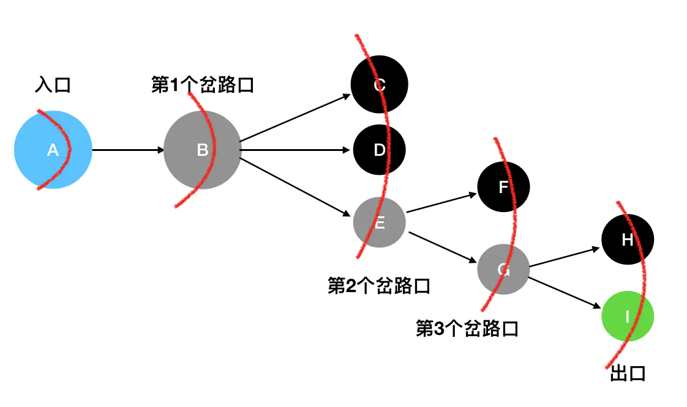
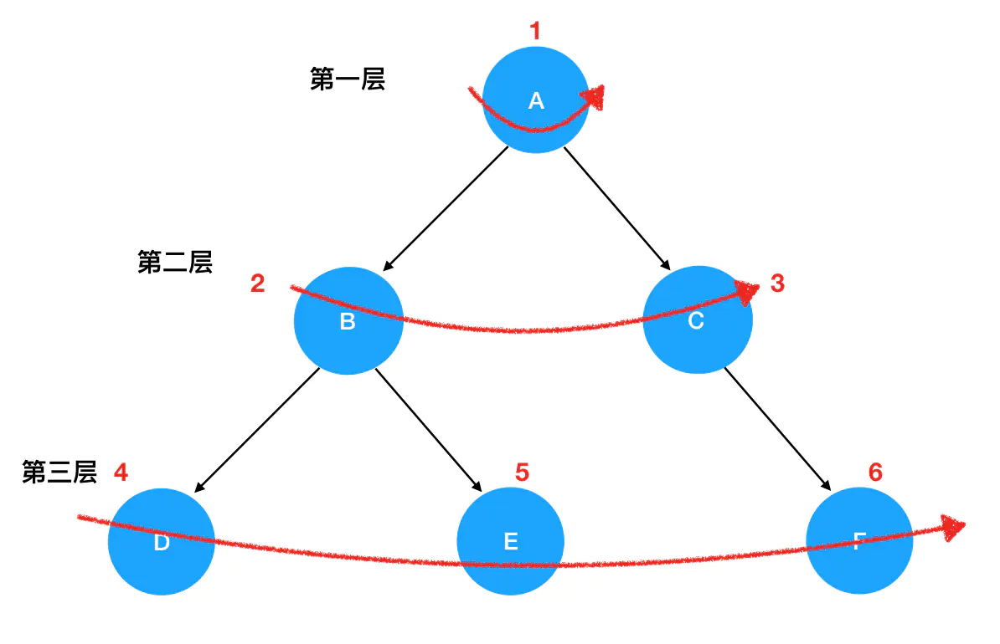

---
tags:
  - algorithm
---

# DFS和BFS
搜索树和图有两种基本策略：

* 深度优先搜索 DFS，Deep First Search
* 广度优先搜索 BFS，Breath First Search

## 深度优先搜索
贯彻了「不撞南墙不回头」的原则，只要没有碰壁就决不选择其它的道路，坚持向当前道路的深处挖掘（一直走到尾），常用于暴力搜索所有状态。深度优先搜索的核心思想是试图**穷举**所有的完整路径，以找到可行的路径。

穷举法基本过程：

* 从入口位置为起点往前走
* 在前进的过程中可能遇到分支，只能选择其中的一条，然后继续前进（往后可能会不止一次遇到分支，每遇到一个新的分支，需要做一次选择）
* 选择的这条分支未必是一条通路，如果走到最后发现此路不通，那么你就要退回到离你最近的那个分叉路口
* 然后尝试看其它的分支能不能走通
* 如果当前的岔路口分叉出去的所有道路都走不通，那么就需要退回到当前岔路口的上一个岔路口，进一步去寻找新的路径
* 不断依次探寻分支，「最坏」的情况是穷举完所有分支，尝试到最后一种情况找到通路

通过**栈结构**和**递归**编码实现深度优先搜索 DFS，因为在尝试分支岔路口时，会不断重复前进、后退的操作，其实和栈结构的入栈、出栈过程类似（后进先出），而二叉树的遍历一般使用递归来实现。



把迷宫中的每一个坐标看做是栈里的一个元素，用栈来模拟这个过程（依次从上到下尝试分支）：

1. 从 `A` 出发（`A`入栈），经过了`B`（`B`入栈），接下来面临 `C`、`D`、`E`三条路。这里按照从上到下的顺序来走（你也可以选择其它顺序），先走`C`（`C`入栈）。
2. 发现 `C`是死胡同，后退到最近的岔路口 `B`（`C`出栈），尝试往`D`方向走（`D`入栈）。
3. 发现`D` 是死胡同，，后退到最近的岔路口 `B`（`D`出栈），尝试往`E`方向走（`E`入栈）。
4. `E` 是一个岔路口，眼前有两个选择：`F` 和 `G`。按照从上到下的顺序来走，先走`F`（`F`入栈）。
5. 发现`F` 是死胡同，后退到最近的岔路口 `E`（`F`出栈），尝试往`G`方向走（`G`入栈）。
6. `G` 是一个岔路口，眼前有两个选择：`H` 和 `I`。按照从上到下的顺序来走，先走`H`（`H`入栈）。
7. 发现 `H` 是死胡同，后退到最近的岔路口 `G`（`H`出栈），尝试往`I`方向走（`I`入栈）。
8. `I` 就是出口，成功走出迷宫。

最后栈里保留的元素依次是`A`、`B`、`E`、`G`、`I`，因此 `A`->`B`->`E`->`G`->`I` 就是走出迷宫的路径。

实际上使用[先序遍历](二叉树遍历.md#先序遍历)二叉树的所有结点就是 DFS 深度优先搜索思想的一种实现，可以说深度优先搜索过程就类似于树的先序遍历，是树的先序遍历的推广：

* 从根结点出发，输出当前的结点内容，然后访问左侧的子结点（递归调用函数）
* 如果左子树同样存在左侧子结点，就头也不回地继续访问下去
* 一直到左侧子结点为空时，才退回到距离最近的父结点，再尝试去访问父结点的右侧子结点（递归调用函数）

在这个递归函数中，递归式用来先后遍历左子树、右子树（分别探索不同的道路），递归边界是在识别到结点为空时会直接返回（撞到了南墙）。

```js
// 先序遍历二叉树所有结点
// 入参是树的根结点对象
function preorder(root) {
    // 递归边界，root 为空
    if(!root) {
        return
    }

    // 输出当前遍历的结点值
    console.log('当前遍历的结点值是：', root.val)
    // 递归遍历左子树
    preorder(root.left)
    // 递归遍历右子树
    preorder(root.right)
}
```

在递归函数的底层就是用**栈结构**来实现的，JS 会维护一个叫「函数调用栈」的东西，`preorder` 每调用一次自己，相关调用的上下文就会被 `push` 进函数调用栈中；待函数执行完毕后，对应的上下文又会从调用栈中被 `pop` 出来（函数被递归调用时，较深的调用层会先被计算返回，然后其上一层函数才可以继续执行，这和栈后进先出类似）。因此，即便二叉树的递归调用过程中，并没有出现栈这种数据结构，也依然改变不了递归的本质是栈的事实。

## 广度优先搜索
广度优先搜索 BFS 关心的是**眼下自己能够直接到达的所有坐标**，其动作有点类似于「扫描」，经过一层层的结点扫描，找到可以通往下一层的入口，最后达到出口。

BFS 的遍历规则基本过程：

* 站在入口处（第一层），「扫描」下一层可以直接能抵达的岔路口
* 依次访问这些通路，记下哪些通路可以再到达下一层，记下这些结点
* 依次访问这些结点，看这些结点中哪些可以访问下一层，再记下可行的结点
* 重复「扫描」
* 直到最后到达出口

在分层遍历的过程中有两个规律：

* 每访问完毕一个坐标，这个坐标在后续的遍历中都不会再被用到了，也就是说它可以被丢弃掉。
* 站在某个确定坐标的位置上，我们所观察到的可直接抵达的坐标，是需要被记录下来的，因为后续的遍历还要用到它们。



丢弃已访问的坐标、记录新观察到的坐标，这个顺序符合「先进先出」的原则，因此可以使用**队列结构**编码实现广度优先搜索 BFS。

用一个队列 `queue` 模拟 BFS 过程：

1. 初始化先将入口 `A` 入队。
2. 访问入口 `A` 发现直接能抵达的坐标只有`B`，访问完毕后将`A`出队，将`B`入队。
3. 访问 `B` 发现直接能抵达的坐标变成了 `C`、`D` 和 `E`，于是把这三个坐标记为下一层的访问对象，访问完毕后将`B`出队，将下一层结点全部入队
4. 访问第三层，这里按照从上到下的顺序，先访问 `C`（访问完毕后 `C` 出队）和 `D`（访问完毕后 `D` 出队），然后访问 `E`（访问完毕后 `E` 出队）。访问 `C` 处和 `D` 处都没有见到新的可以直接抵达的坐标，所以不做额外的动作。但是在 `E` 处我们见到了可以直接抵达的 `F` 和 `G`，因此把 `F` 和 `G` 记为下一层（第四层）需要访问的对象，`F`、`G`依次入队（`queue`里现在是 `F`、`G`）。
5. 访问第五层。第五层按照从上到下的顺序，先访问的是 `H`（访问完毕后 `H` 出队），发现从 `H` 出发没有可以直接抵达的坐标，因此不作额外的操作。接着访问 `I`（访问完毕后 `I` 出队），发现 `I` 就是出口，问题得解（此时 `queue` 队列已经被清空）。

:bulb: 在这个过程里循环往复地依次访问队列里已经有的坐标，将其出队；记录从当前坐标出发可直接抵达的所有坐标，将其入队（先进先出）。

实际上使用[迭代遍历中的**层次遍历**](二叉树遍历.md)二叉树的所有结点就是 BFS 广度优先搜索思想的一种实现，即按照从上到下的层次顺序，从左到右地遍历一个二叉树。



```js
// BFS 伪代码
function BFS(root) {
    const queue = [] // 初始化队列queue
    // 根结点首先入队
    queue.push(root)
    // 队列不为空，说明没有遍历完全
    while(queue.length) {
        const top = queue[0] // 取出队头元素
        // 访问 top
        console.log(top.val)
        // 如果左子树存在，左子树入队
        if(top.left) {
            queue.push(top.left)
        }
        // 如果右子树存在，右子树入队
        if(top.right) {
            queue.push(top.right)
        }
        queue.shift() // 访问完毕，队头元素出队
        // 继续执行迭代，取出队列下一个队头元素
    }
}
```