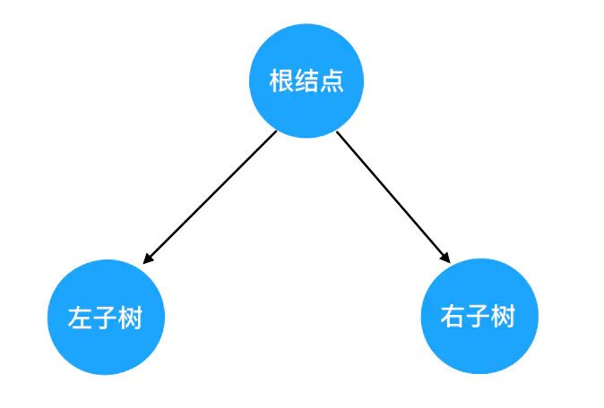
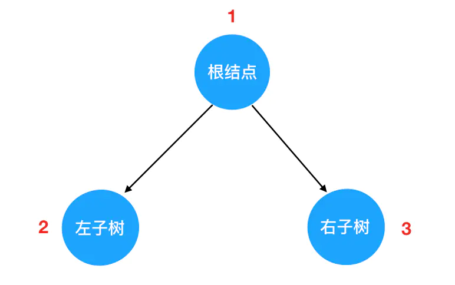
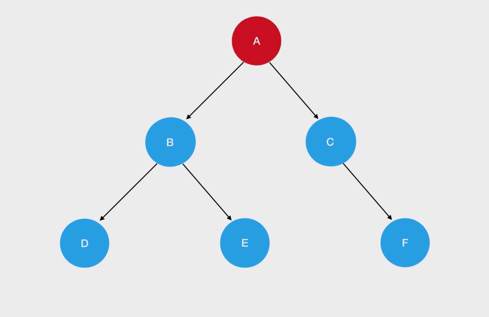
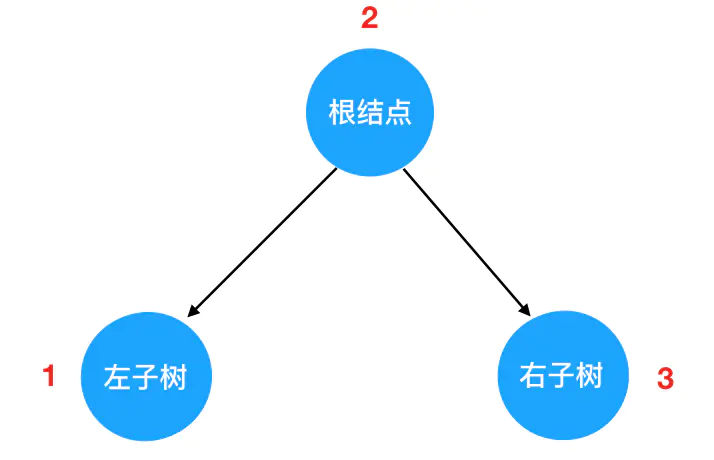
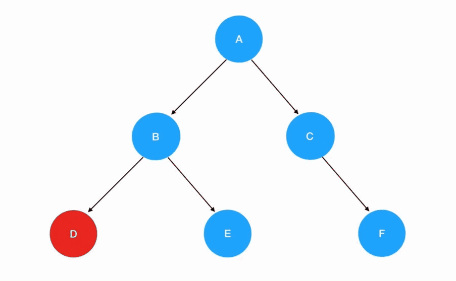
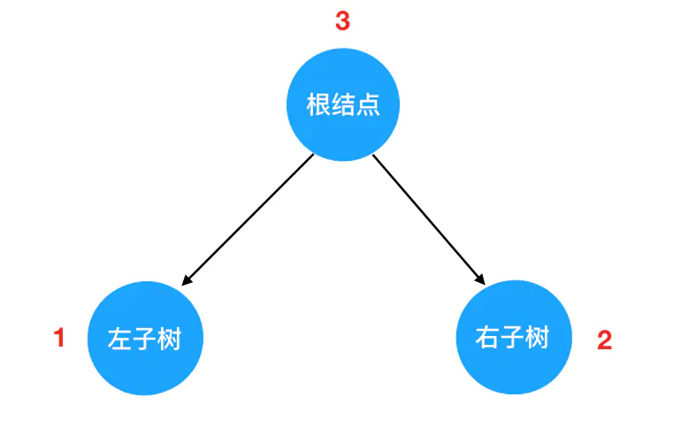

---
tags:
  - algorithm
---

# 二叉树遍历
以一定的顺序规则，逐个访问二叉树的所有结点，这个过程就是二叉树的遍历。

```js
// 构造二叉树
function TreeNode(val) {
    this.val = val;
    this.left = this.right = null;
}

// root
const root =  new TreeNode('A');

// left node
const leftNode = new TreeNode('B');
root.left = leftNode;
leftNode.left = new TreeNode('D');
leftNode.right = new TreeNode('E');

// right node
const rightNode = new TreeNode('C');
root.right = rightNode;
rightNode.right = new TreeNode('F');

// 二叉树数据结构
// root = {
//   val: "A",
//   left: {
//     val: "B",
//     left: {
//       val: "D"
//     },
//     right: {
//       val: "E"
//     }
//   },
//   right: {
//     val: "C",
//     right: {
//       val: "F"
//     }
//   }
// };
```

由于二叉树都是由三部分组成的：根节点、左子树、右子树。而且左右子树都是二叉树，因此可以将子树也「分解」看作由这个基本结构组成的。因此对树的遍历，就可以看做是对这三个部分的遍历。




按照实现方式的不同，遍历方式又可以分为以下两种：

* **递归遍历**：基于根结点的遍历分别被安排在了首要位置、中间位置和最后位置（根结点的遍历的时机），可以将递归遍历方法分为先序遍历、中序遍历、后序遍历
    * **先序遍历**：根结点 -> 左子树 -> 右子树
    * **中序遍历**：左子树 -> 根结点 -> 右子树
    * **后序遍历**：左子树 -> 右子树 -> 根结点
* **迭代遍历**：层次遍历


## 递归遍历
:bulb: 编程语言中，函数**直接或间接调用函数本身**，则该函数称为递归函数。

### 先序遍历




* 先序遍历的**递归式**：每一次重复的内容是 `根结点 -> 左子树 -> 右子树`
* 先序遍历的**递归边界**：当我们发现遍历的目标树为空的时候，停止递归调用

```js
// 先序遍历函数
// 入参是树的根结点对象
funciton preorder(root) {
    if(root) {
        // 输出当前遍历的结点值
        console.log('当前遍历的结点值是：', root.val);
        // 递归遍历左子树
        preorder(root.left);
        // 递归遍历右子树
        preorder(root.right);
    } else {
        // 递归边界，当结点为空时返回
        return
    }
}

// 运行结果
preorder(root);

// 当前遍历的结点值是： A
// 当前遍历的结点值是： B
// 当前遍历的结点值是： D
// 当前遍历的结点值是： E
// 当前遍历的结点值是： C
// 当前遍历的结点值是： F
```

### 中序遍历




* 中序遍历的**递归式**：每一次重复的内容是 `左子树 -> 根结点 -> 右子树`
* 中序遍历的**递归边界**：当我们发现遍历的目标树为空的时候，停止递归调用

:bulb: 与先序遍历的唯一发生改变的是递归式里调用递归函数的顺序，**左子树的访问会优先于根结点**

```js
// 中序遍历函数
// 入参是树的根结点对象
function inOrder(root) {
  if (root) {
    // 递归遍历左子树
    inOrder(root.left);
    // 输出当前遍历的结点值
    console.log('当前遍历的结点值是：', root.val);
    // 递归遍历右子树
    inOrder(root.right);
  } else {
    // 递归边界，当结点为空时返回
    return
  }
}

// 运行结果
inOrder(root);

// 当前遍历的结点值是： D
// 当前遍历的结点值是： B
// 当前遍历的结点值是： E
// 当前遍历的结点值是： A
// 当前遍历的结点值是： C
// 当前遍历的结点值是： F
```

### 后序遍历



* 后序遍历的**递归式**：每一次重复的内容是 `左子树 -> 右子树 -> 根结点`
* 后序遍历的**递归边界**：当我们发现遍历的目标树为空的时候，停止递归调用

:bulb: 与先序遍历的唯一发生改变的是递归式里调用递归函数的顺序，**左子树和右子树的访问会优先于根结点**

```js
// 后序遍历函数
// 入参是树的根结点对象
function postOrder(root) {
    if(root) {
        // 递归遍历左子树
        postOrder(root.left);
        // 递归遍历右子树
        postOrder(root.right);
        // 输出当前遍历的结点值
        console.log('当前遍历的结点值是：', root);
    } else {
        // 递归边界，当结点为空时返回
        return
    }
}

// 运行结果
postOrder(root);

// 当前遍历的结点值是： D
// 当前遍历的结点值是： E
// 当前遍历的结点值是： B
// 当前遍历的结点值是： F
// 当前遍历的结点值是： C
// 当前遍历的结点值是： A
```

## 迭代遍历

### 先序遍历
> 题目描述：给定一个二叉树，返回它的前序（先序）遍历序列。
>
> 示例: 输入: [1,null,2,3]
> ```
> 1
>  \
>   2
>  /
> 3
> ```
> 输出: [1,2,3]


::: alert-info
一个思维工具：**递归和栈**有着脱不开的干系，当可以用递归做出来的题，而需要使用其他解法，此时我们本能地往**栈**上想。
:::

题目中的出参是一个数组（结点的值），它可以看作是是一个栈的出栈序列，因此只需要合理地安排结点入栈和出栈的时机，使结点出栈序列符合二叉树的前序遍历规则即可。


前序遍历的规则是 **先遍历根结点、然后遍历左树、最后遍历右树**，这正是我们所期望的出栈序列；而按道理入栈序列和出栈序列相反， 即按道理结点入栈应该按照 `右->左->根` 的顺序，:warning: 但我们先接触到的**起点就是根结点**，因此第一步需要将根结点执行一次先入栈，然后马上出栈的操作，保证第一次出栈是根节点。

然后就在每一轮迭代中取出栈顶的元素（后 `push` 入栈的结点）作为当前的根结点，将值添加到结果数组，并将其右、左子树 `push` 到栈中，这样就可以构成所需的栈元素层叠关系，将根元素和左树先输出，后输出右树。

先序迭代遍历的出入栈顺序：

1. 将当前根结点入栈
2. 取出栈顶结点，将结点值 `push` 进结果数组
3. 若栈顶结点有右孩子，则将右孩子入栈（当下下轮的结点的根结点）
4. 若栈顶结点有左孩子，则将左孩子入栈（当下一轮的结点的根结点）

重复 2、3、4 步骤，通过 `push` 和 `pop`（前期会交替执行 `push` 和 `pop` 操作，后期只有一直执行 `pop` 操作） 操作直至栈空，遍历完整个二叉树。

```js
/**
 *
 * @param {TreeNode} root
 * @return {number[]}
 */
const preorderTraversal = function (root) {
  // 初始化结果数组
  let res = [];
  // 初始化栈结构
  let stack = [];
  // 迭代边界条件
  if (!root) {
    return res;
  }
  // 首先将根节点入栈
  stack.push(root);
  // 进行迭代，当栈不为空就不断重复入栈、出栈操作
  while (stack.length) {
    // 将栈顶结点出栈，作为当前的根节点
    let cur = stack.pop();
    // 将结点值 push 到结果数组的尾部
    res.push(cur.val);
    // 若当前子树有右孩子，先将其入栈
    if (cur.right) {
      stack.push(cur.right);
    }
    // 若当前子树有左孩子，后将其入栈
    if (cur.left) {
      stack.push(cur.left);
    }
  }

  // 返回结果数组
  return res;
}
```