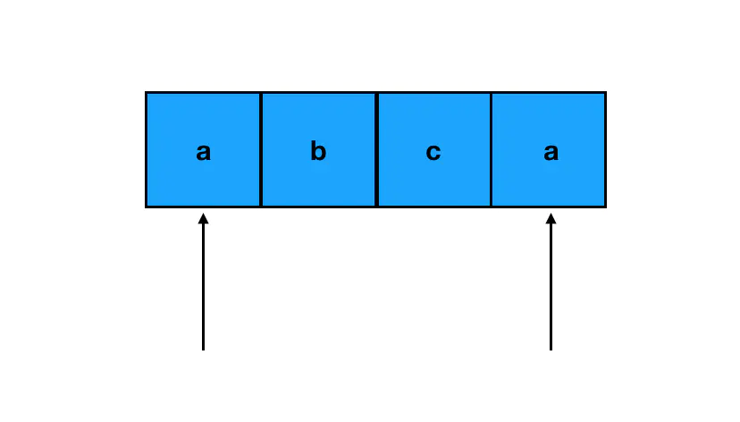
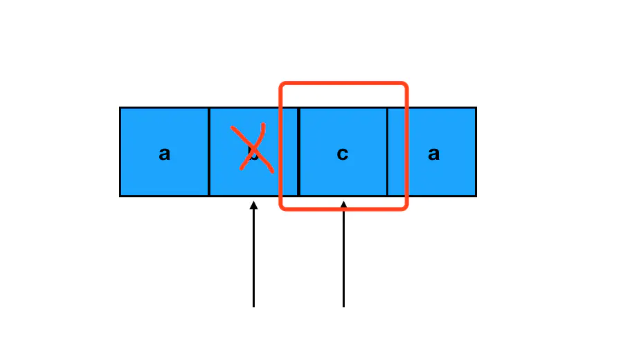

# 字符串应用

## 反转字符串
利用 `split()` 和 `join()` 方法实现字符串和数组的转换，期间调用 JavaScript 内置翻转数组元素序列的 API 方法 `reverse()` 实现翻转字符串

```js
const str = "reverse";
const res = str.split('').reverse().join('');
console.log(res);   // esrever
```

一个应用是判断字符串是否为**回文字符串**（即字符串正着读和倒着读都一样），可以根据定义判断字符串反转后是否与原字符串相等；或者从中间位置「劈开」，判断两个子串在内容上是**完全对称**的。

```js
// 方法一
function isPalindrome(str) {
  const res = str.split('').reverse().join('');
  return str === res;
}

// 方法二
function isPalindrome(str) {
    const len = str.length;
    // 遍历前半部分，判断和后半部分是否对称
    for(let i=0; i<len/2; i++) {
        if(str[i] !== str[len-i-1]) {
            return false;
        }
    }
    return true;
}
```

## 回文字符串的衍生问题
> 真题描述：给定一个非空字符串 `s`，最多删除一个字符。判断是否能成为回文字符串。
>
> 示例 1：输入: `"aba"` 输出: `true`
> 示例 2：输入: `"abca"` 输出: `true` 解释: 你可以删除 `c` 字符。
> :bulb: 字符串只包含从 a-z 的小写字母。字符串的最大长度是 50000。

字符串题干中若有「回文」关键字，那么利用其对称性 和 双指针方法，足以解决大部分的回文字符串衍生问题。

对于该问题首先是初始化两个指针，一个指向字符串头部，另一个指向尾部



如果两个指针所指的字符恰好相等，那么这两个字符就符合了回文字符串对对称性的要求，跳过它们往下走即可。如果两个指针所指的字符串不等，那么就意味着不对称发生了，可以删掉其中一个数，因此我们可以分别对左指针字符和右指针字符尝试进行「跳过」，看看区间在 `[left+1, right]` 或 `[left, right-1]` 的字符串是否回文



假如我们跳过了 `b`，`[left+1, right]` 的区间就是 `[2, 2]`，它对应 `c` 这个字符，单个字符一定回文。这样一来，删掉 `b` 之后，左右指针所指的内部区间是回文的，外部区间也是回文的，即整个字符串就是一个回文字符串了。

```js
function validPalindrome(s) {
  const len = s.length;
  // 初始化左右指针
  let l = 0, r = len - 1;
  // 从字符串两头逼近字符串中间，遍历每个前后相应字符是否相等
  while(l<r && s[l] === s[r]) {
    l++;
    r--;
  }

  // 如果出现前后不相等的字符可以尝试两种跳过的方式
  // 尝试跳过左侧元素
  if(isPalindrome(l+1, r)) {
    return true;
  }
  // 尝试跳过右侧元素
  if(isPalindrome(l, r-1)) {
    return true;
  }

  // 判断字符串是否为回文字符串
  function isPalindrome(sl, sr) {
    while(sl<sr) {
      if(s[sl] !== s[sr]) {
        return false;
      }
    }
    return true
  }
  // 默认返回 false
  return false;
}
```

## 正则表达式
> 真题描述： 设计一个支持以下两种操作的数据结构：
> ```js
> void addWord(word)
> bool search(word)
> ```
> 其中 `search(word)` 可以搜索文字或正则表达式字符串，字符串只包含字母 `.` 或 a-z 。`.` 表示任何一个字母。
>
>示例：
> ```js
> addWord("bad")
> addWord("dad")
> addWord("mad")
> search("pad")   // false
> search("bad")   // true
> search(".ad")   // true
> search("b..")   // true
> ```
> :bulb: 你可以假设所有单词都是由小写字母 a-z 组成的。

创建一个类支持方法 `addWord()` 和 `search()`，由于字符串既可以被添加、又可以被搜索，因此添加时一定要被存起来，因为需要被检索，可以考虑以字符串的长度为 `key`，相同长度的字符串存在一个数组中，这样可以提高我们后续定位的效率。

`search()` 方法既可以搜索文字，又可以搜索正则表达式。因此我们在搜索前需要基于用户的输入创建正则表达式对象，然后使用正则表达式对象方法 `reg.test(str)` 匹配字符串，可以基于所需匹配字符串的长度作为  `key` 直接定位需要遍历的字符串数组，用 `some()` 方法来遍历数组中的字符并返回一个布尔值。

```js
/**
 * 构造函数
 */
const WordDictionary = function() {
  // 初始化一个对象字面量，承担 Map 的角色
  this.words = {}
}

/**
  添加字符串的方法
 */

WordDictionary.prototype.addWord = function(word) {
  // 若该字符串对应长度的数组已经存在，则只做添加
  if(this.words[word.length]) {
    this.words[word.length].push(word)
  } else {
    // 若该字符串对应长度的数组还不存在，则先创建
    this.words[word.length] = [word]
  }
}

/**
  搜索字符串的方法
 */

WordDictionary.prototype.search = function(word) {
  const len = word.length;
  // 若该字符串长度在 Map 中对应的数组根本不存在，则可判断该字符串不存在
  if (!this.words[len]) {
    return false
  }

  const reg = new RegExp(word);

  return this.words[len].some(item => {
    return reg.test(item);
  })

}

const word = new WordDictionary();
word.addWord("bad")
word.addWord("dad")
word.addWord("mad")
console.log(word.search("pad")) // false
console.log(word.search("bad")) // true
console.log(word.search(".ad")) // true
console.log(word.search("b..")) // true
```
