---
tags:
  - algorithm
---

# 数据结构

前端需要掌握的数据结构：

- 数组（包括复合数组）
- 栈
- 队列
- 链表
- 树（一般是二叉树）

:bulb: 由于 JavaScript 中字符串和数组关联紧密，关键知识点重复度较高，在解决字符串问题时可以借鉴数组的知识。

## 数组
JavaScript 原生支持数组结构，可以「开箱即用」不必自行模拟实现。

### 创建数组
* 方法一：方括号+元素内容

```js
const arr = [1, 2, 3, 4];
```

* 方法二：构造函数 `Array()`

```js
// 当以构造函数的形式创建数组时，若不传任何参数，得到的就会是一个空数组，等价于 const arr = []
const arr = new Array();
```
:bulb: 在算法题中我们初始化一个数组时，并不知道它内部元素的情况，推荐使用构造函数创建数组的方法

:bulb: 如果需要创造**指定长度的空数组**，可以向数组构造函数传递**一个数字作为参数**

```js
// 得到一个长度为 7 的空数组
const arr = new Array(7)
```

如果希望每个元素指定一个值来初始化数组，可以调用 `fill()` 方法

```js
// 得到一个长度为7，且每个元素都初始化为1的数组
const arr = (new Array(7)).fill(1)
```

### 数组访问
直接在中括号中指定其索引即可访问数组中特定的元素

```js
// 访问索引下标为 0 的元素，即第一个元素
arr[0]
```

### 数组遍历
遍历数组即访问到数组中的每个元素，并且一般同时知道当前元素的索引。

:bulb: 如果没有特殊的需要统一使用 for 循环来实现遍历，因为从性能上看 for 循环遍历起来是最快的。

* for 循环
以循环参数作为索引，即数组的下标，通过迭代循环参数依次访问数组的每个值

```js
// 获取数组长度
const len = arr.length;
// 遍历数组
for(let i=0; i<len; i++) {
    // 输出数组当前元素值和索引
    console.log(arr[i], i);
}
```

* forEach 方法
通过数组特有的 `forEach()` 方法循环每一个元素，其中传入函数的**第一个入参和第二个入参分别是当前元素的及其对应索引**，在回调函数中可以进行相应的调用

```js
arr.forEach(item, index) {
    // 输出数组元素值和索引
    console.log(item, index);
}
```

* map 方法
方法 `map()` 在调用形式上与 forEach 无异，区别在于它会根据传入的函数逻辑对数组中每个元素进行处理、进而**返回一个全新的数组**。

```js
let newArr = arr.map((item, index) => {
    // 输出数组的元素值和索引
    console.log(item, index);
    // 在当前元素基础上 + 1 作为新元素返回
    return  item+1
})
```

### 增加元素
* unshift 方法
添加元素到数组的头部

```js
const arr = [1, 2];
arr.unshift(0);   // [0, 1, 2]
```

* push 方法
添加元素到数组的尾部

```js
const arr = [1, 2];
arr.push(3);   // [1, 2, 3]
```

* splice 方法
添加元素到数组任何位置

:bulb: 第一个入参是起始的索引值，第二个入参表示**需要从起始的索引开始（包含）删除的元素个数（如果设置为 `0` 就表示不删除任何元素）**，第三个入参开始表示需要添加到数组里的元素的值

```js
const arr = [1, 2];
arr.splice(1, 0, 3);   // [1, 3, 2]
```

示例从 `arr[1]` 开始，删掉 `0` 个元素，并且在索引为 `1` 的地方新增了值为 `3` 的元素，因为删掉的元素是 `0` 个，所以说 `arr[1]` 中原有的元素值 `2` 仍然会被保留下来；同时因为我们后面又指定了 `arr[1]` 处需要新增一个元素 `3`，那么这个 `3` 就会把原来 `arr[1]` 这个地方的元素给「挤到后面去」，这样就做到了在数组中任意位置进行元素的新增。

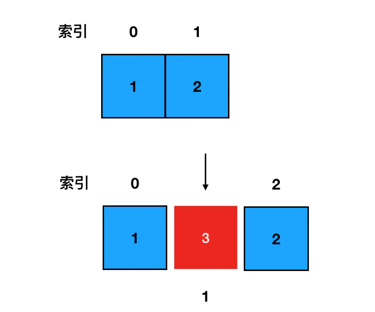

### 删除元素
* shift 方法
删除数组头部的元素

```js
const arr = [1, 2, 3];
arr.shift();   // [2, 3]
```

* pop 方法
删除数组尾部的元素

```js
const arr = [1, 2, 3];
arr.pop();   // [1, 2]
```

* splice 方法
删除数组任意位置的元素

:bulb: 第一个入参是起始的索引值，第二个入参表示**需要从起始的索引开始（包含）删除的元素个数（如果设置为 `0` 就表示不删除任何元素）**

```js
const arr = [1, 2];
arr.splice(1, 1);   // [2]
```

### 二维数组
普通常见的一维数组的元素是数字而非数组，整个数组的结构看上去像一条「线」。二维数组其实就是数组套数组，也就是**每个元素都是数组**，二维数组更像是一个「面」。

:bulb: 在数学中形如这样长方阵列排列的复数或实数集合，被称为「矩阵」，因此二维数组的别名就叫**矩阵**。

```js
const arr = [
  [1,2,3,4,5],
  [1,2,3,4,5],
  [1,2,3,4,5],
  [1,2,3,4,5],
  [1,2,3,4,5]
]
```

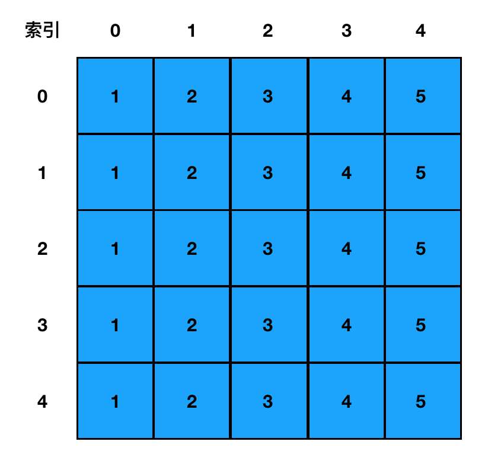

* 图示**每一行，就代表着一个数组元素**，如第 `0` 行就代表着数组中 `arr[0]` 这个数组元素，其内容是 `[1,2,3,4,5]`
* 每一行中的每一列，则代表一个确切的值，如第 `0` 行第 `1` 列，就代表着数组中 `arr[0][1]` 这个元素，其值为`2`，是一个确切的 number。

#### 二维数组初始化
:warning: `fill()` 方法的局限性：当给 `fill()` 传递一个入参时，如果这个入参的类型是**引用类型**，那么填充的其实就是入参的**引用**，即所有元素都是**对应了同一个引用、指向的是同一块内存空间，它们本质上是同一个数组**。

```js
// 对长度为 7 的数组进行初始化，每个元素都是一个空数组
const arr =(new Array(7)).fill([])

// 修改其中一个元素
arr[0][0] = 1
// 实际上其他元素的值也都会跟着发生改变
```

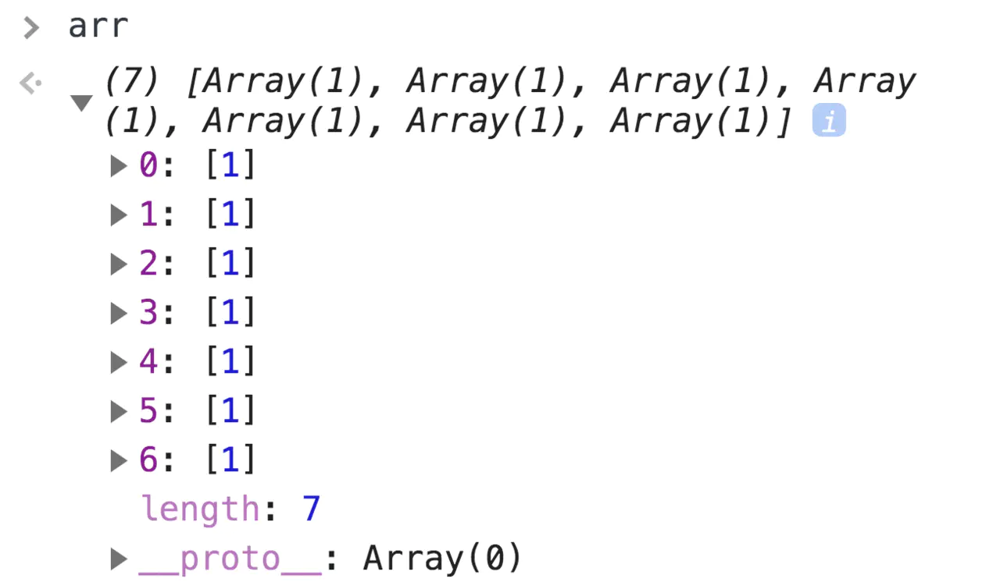


本着安全的原则二维数组初始化方法直接使用非常简单（而且性能也不错）的 for 循环来解决，for 循环中每一次迭代我们都通过 `[]` 创建一个新的数组，这样便不会有引用指向问题带来的尴尬。

```js
const len = arr.length
for(let i=0; i<len; i++) {
    // 将数组的每一个坑位初始化为数组
    arr[i] = []
}
```

#### 二维数组的访问
需要的是两层循环访问二维数组

```js
// 缓存外部数组的长度
const outerLen = arr.length;
// 使用两层循环遍历
for(let i=0; i<outerLen; i++) {
  // 缓存内部数组的长度
  const innerLen = arr[i].length;
  for(let j=0; j<innerLen; j++) {
    // 输出数组的值和索引
    console.log(arr[i][j], i, j);
  }
}
```

:bulb: 一维数组用 for 循环遍历只需一层循环，二维数组是两层，三维数组就是三层。依次类推 **N 维数组需要 N 层循环来完成遍历**。

## 栈和队列
数组的增删操作可以说是没有任何限制的，允许我们在任何位置执行想要的操作。而栈和队列这两种运算受限的**线性表**完全可以把栈和队列都看作是**「特别的数组」**，它们的实现一般都要依赖于数组。

栈和队列两者的区别在于，它们各自对数组的**增删**操作有着不一样的限制：

* **栈 Stack**：后进先出 LIFO，Last In First Out 的数据结构，只能用 `pop()` 和 `push()` 方法在尾部完成增删的数组
* **队列 Queue**：先进先出 FIFO，First In First Out 的数据结构，只能用 `shift()` 和 `push()` 方法分别在头部删除和在尾部添加元素的数组

### 栈
栈 Stack 是一种后进先出 LIFO，Last In First Out 的数据结构，在 JavaScript 中可以认为**栈就是限制只能用 push 来添加元素，同时只能用 pop 来移除元素的一种特殊的数组**

* 只允许从尾部添加元素，使用 `push()` 方法
* 只允许从尾部取出元素，使用 `pop()` 方法

```js
// 初始状态
const stack = [];

// 入栈过程
stack.push("可爱多");
stack.push("巧乐兹");
stack.push("光明奶砖");

// 出栈过程，栈不为空时一直执行下去
while(stack.length) {
    // 单纯访问栈顶部元素（不出栈）
    const top = stack[stack.length - 1];
    // 将顶部元素出栈
    stack.pop();
}

// 查看栈，栈空
stack;   // []
```

### 队列
队列 queue 是一种先进先出 FIFO，First In First Out 的数据结构，在 JavaScript 中可以认为**队列就是限制只能用 push 来添加元素，同时只能用 shift 来移除元素的一种特殊的数组**

* 只允许从尾部添加元素，使用方法 `push()` 方法
* 只允许从头部移除元素，使用方法 `shift()` 方法

```js
// 初始状态
const queue = [];

// 进入队列
queue.push('Ben');
queue.push('Tom');
queue.push('Thomson');

// 出队列，队列不为空时一直执行下去
while(queue.length) {
    // 单纯访问队列头部元素（不出队）
    const top = queque[0];
    console.log(top);
    // 出队
    queue.shift();
}

// 查看队列，队空
queue;   // []
```

## 链表
链表和数组类似，是另一种线性结构的有序列表，有且仅有一个**前驱**、有且仅有一个**后继**。JS 中的链表是以嵌套的对象的形式来实现的

```js
{
    // 数据域
    val: 1,
    // 指针域，指向下一个结点
    next: {
        val: 2,
        next: ...
    }
}
```

* **数据域**：存储的是当前结点所存储的数据值
* **指针域**：代表下一个结点（后继结点）的引用， 有了 `next` 指针来记录后继结点的引用，每一个结点至少都能知道自己后面的元素，原本相互独立的结点之间就有了如下的联系。要想访问链表中的任何一个元素，我们都得从起点结点开始，逐个访问 next，一直访问到目标结点为止。

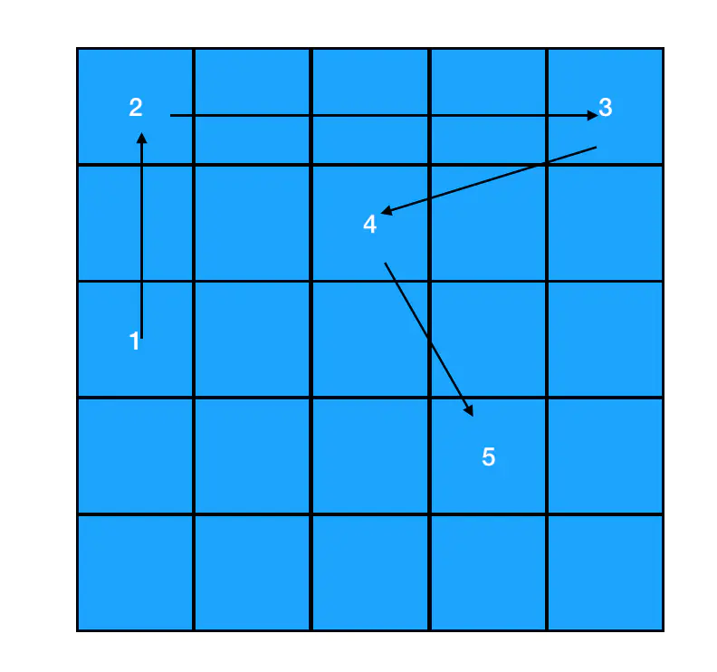


:bulb: 为了确保起点结点是可抵达的，我们有时还会设定一个 `head` 指针来专门指向链表的开始位置。

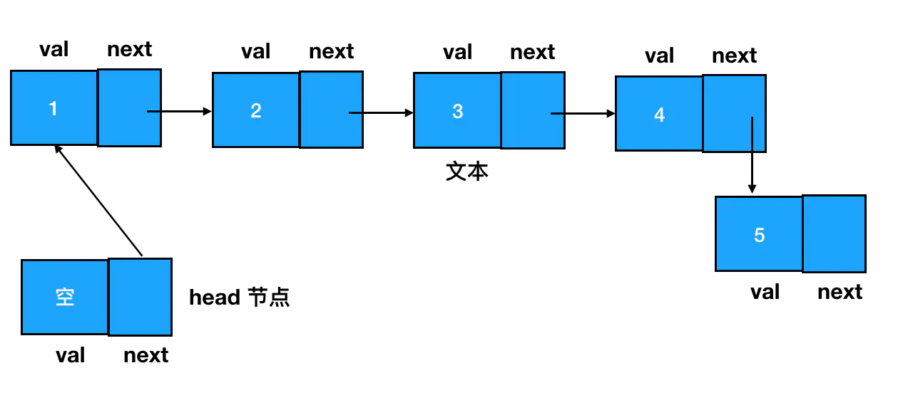

### 链表和数组异同
链表和数组不同点在于：

* 链表中数据单位的名称叫做「结点」，而结点和结点的分布**在内存中可以是离散的**。
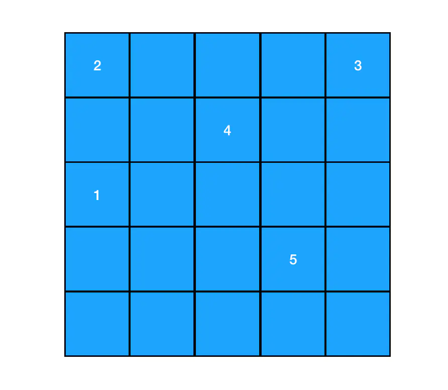
* 数组在内存中最为关键的一个特征，就是元素与元素之间紧紧相连，它们一般是**对应一段位于自己上界和下界之间的、一段连续的内存空间**。

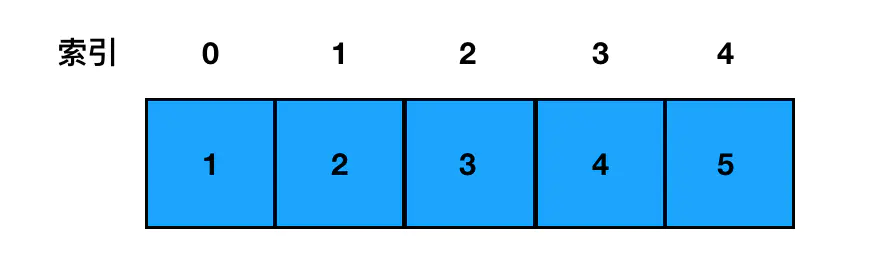

正是由于数组中的元素是连续的，每个元素的内可存地址以根据其索引距离数组头部的距离来计算出来，因此对数组来说，每一个元素都可以**通过数组的索引下标直接定位**。

但对链表来说，元素和元素之间似乎毫无内存上的瓜葛可言，但是通过创建指针来实现元素之间的关联，每一个结点的结构都包括了两部分的内容：**数据域**和**指针域**。

:bulb: 链表和数组的优缺点：
* 链表的插入/删除效率较高，而访问效率较低（需要使用指针 `next` 遍历前面的元素才可以访问到目标元素）
* 数组的访问效率较高（直接使用索引定位访问元素），而插入效率较低（如果要在任意位置删除一个元素，那么该位置往后的所有元素，都需要往前挪一个位置；如果要在任意位置新增一个元素，那么该位置往后的所有元素也都要往后挪一个位置。）

### 链表结点的创建
定义一个构造函数用以创建链表节点

```js
function ListNode(val) {
    this.val = val;
    this.next = null;
}

// 在使用构造函数创建结点时，传入 val （数据域对应的值内容）、指定 next （下一个链表结点）即可
const node1 = new ListNode(1);
const node2 = new ListNode(2);
node1.next = node2;
```

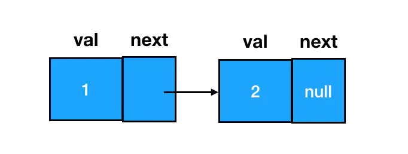

### 链表元素的添加
:bulb: 链表的结点间关系是通过 `next` 指针来维系的，因此链表元素的添加本质上都是在围绕 `next` 指针做文章。

* 直接在链表尾部添加结点，改变最后一个 `next` 指针即可

```js
const node3 = new ListNode(3);
node2.next = node3;
```

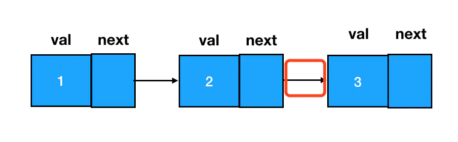

* 在任意两结点间插入一个新结点，需要变更的是**前驱结点**和**目标结点**的 `next` 指针指向

```js
// 创建结点
const node3 = new ListNode(3);
// 修改前驱结点和目标结点的指针域，将结点插入到两个结点间
// 把 node3 的 next 指针指向 node2
node3.next = node1.next;
// 把 node1 的 next 指针修改为指向 node3
node1.next = node3;
```

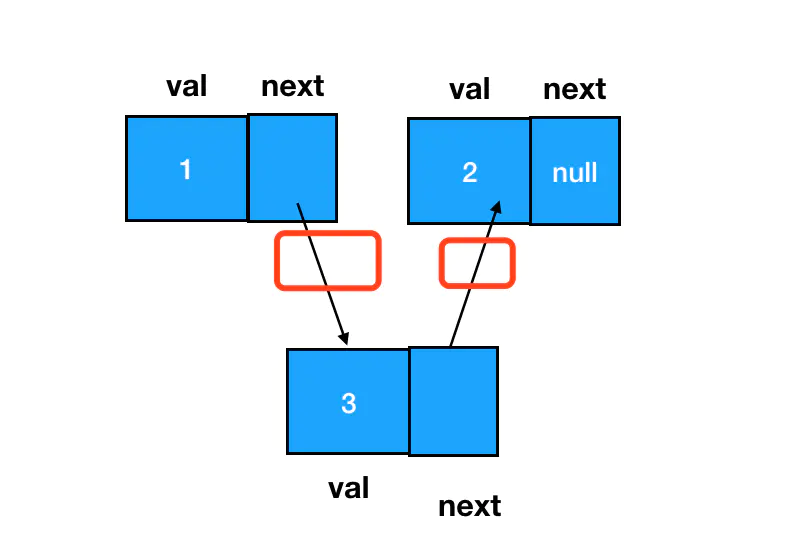

### 链表元素的删除
:bulb: 链表元素的删除也是非常高频的操作，:warning: 删除的标准是：在链表的遍历过程中，无法再遍历到某个结点的存在。我们直接让需要删除的目标结点的的前驱结点 `next` 指针跳过它，指向需要删除的目标结点的后继即可，因此仍然把重心放在对 `next` 指针的调整上。当一个结点完全不可抵达时， JavaScript 的垃圾回收器就会自动回收掉。

:bulb: 涉及链表删除操作的题目中，重点不是定位目标结点，而是**定位目标结点的前驱结点**。

```js
// 删除 node3 结点
node1.next = node3.next;

// 实现相同功能的另一种写法，只需要拿到前驱结点 node1 即可
// 利用 node1 定位 node3 及其后继结点
const target = node1.next;
// 重定向
node1.next = target.next;
```

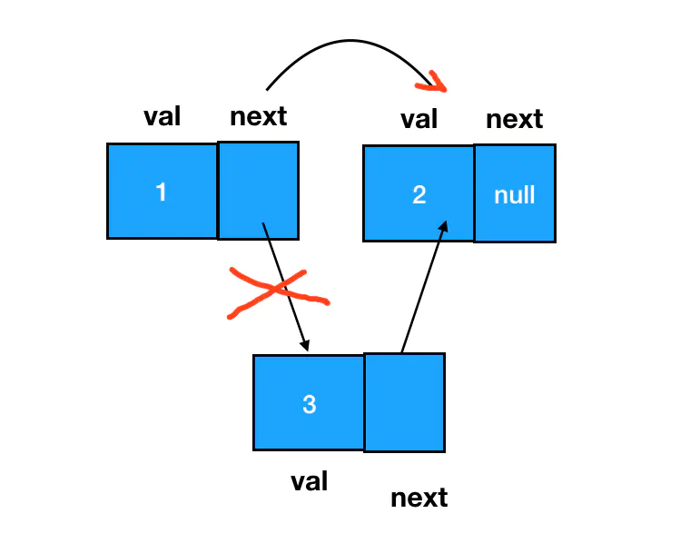

## 树
数据结构中的树是对现实世界中树的一层简化：
* 把树根抽象为「根结点」
* 树枝抽象为「边」
* 树枝的两个端点抽象为「结点」
* 树叶抽象为「叶子结点」

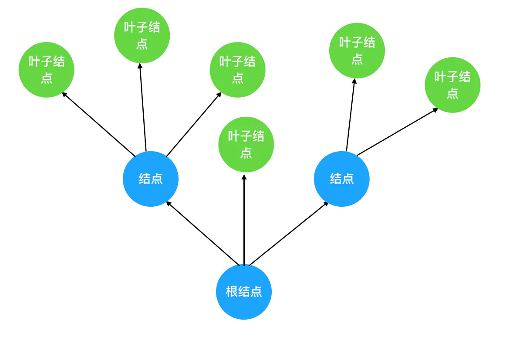

把这棵抽象后的树颠倒一下，就得到了计算机中的树结构。**树的层次计算规则：根结点所在的那一层记为第一层，其子结点所在的就是第二层，以此类推。**

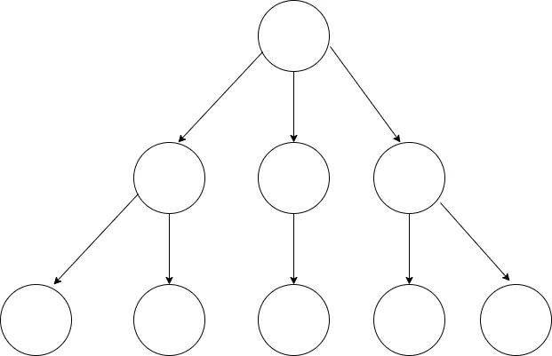

相关概念：

* 结点高度：叶子结点高度记为 1，每向上一层高度就加 1，逐层向上累加至目标结点时，所得到的的值就是目标结点的高度。
* 树的高度：树中结点的最大高度，称为「树的高度」。
* 度：一个结点开叉出去多少个子树，被记为结点的「度」。比如上图中根结点的度就是 `3`
* 叶子结点：叶子结点就是度为 `0` 的结点，因为它们是最后一层的结点

### 二叉树
二叉树是指满足以下要求的树：它可以没有根结点，作为一棵空树存在；如果它不是空树，那么必须由根结点、左子树和右子树组成，**且左右子树都是二叉树**。

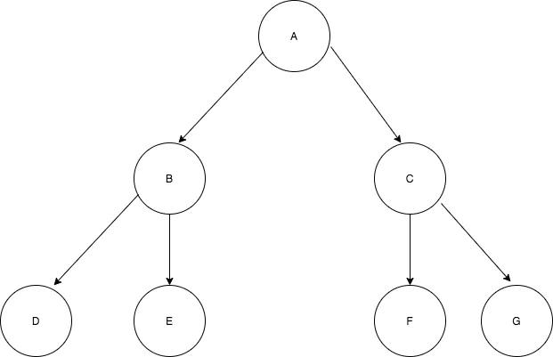

:warning: **二叉树不能被简单定义为每个结点的度都是 2 的树**，因为普通的树并不会区分左子树和右子树，但与之区别的是在二叉树中，左右子树的位置是严格约定、不能交换的。

### 二叉树实现
在 JS 中，二叉树使用对象来定义。它的结构分为三块：

* 数据域
* 左侧子结点（左子树根结点）的引用
* 右侧子结点（右子树根结点）的引用

通过构造函数创建结点，把左侧子结点和右侧子结点都预置为空，再设置结点的左右引用即可创建二叉树

```js
// 二叉树结点的构造函数
function TreeNode(val) {
    this.val = val;
    this.left = this.right = null;
}

// 新建一个二叉树结点
const node = new TreeNode(1);
// 然后可以基于这个结点为根结点，我们可以通过给 left/right 赋值拓展其子树信息，延展出一棵二叉树
```

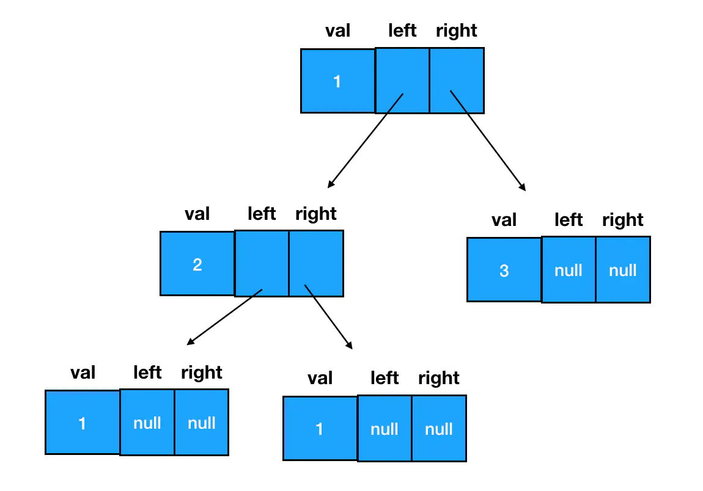

