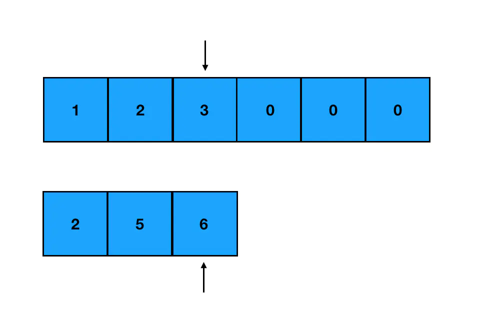
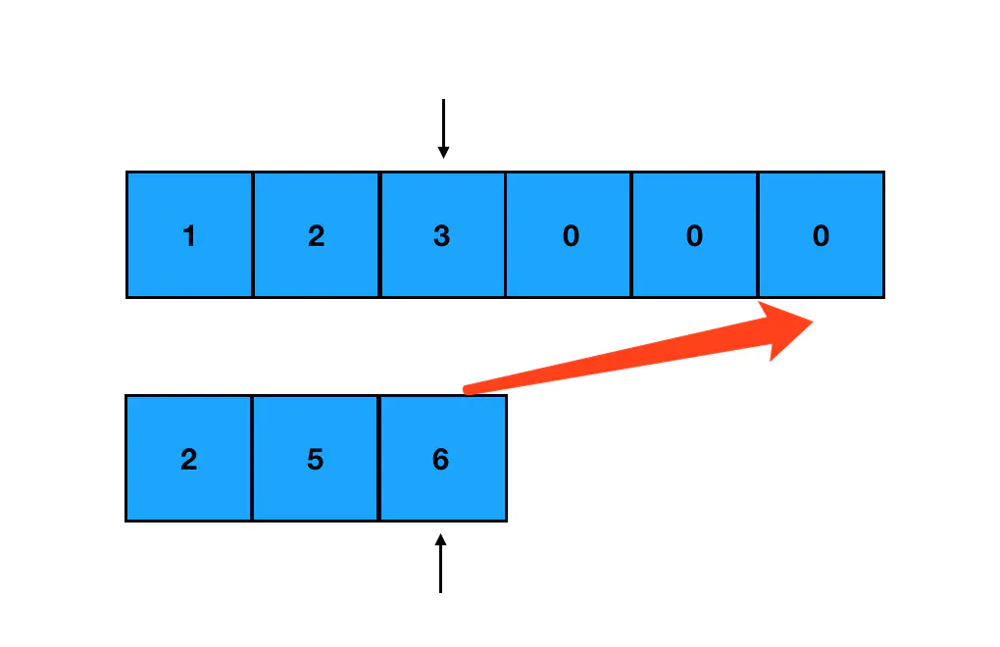
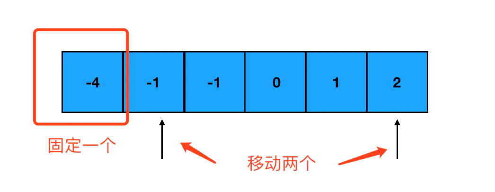

---
tags:
  - algorithm
---

# 数组应用

## 两数求和问题

> 真题描述： 给定一个整数数组 `nums` 和一个目标值` target`，请你在该数组中找出**和为目标值的那 两个 整数**，并返回他们的数组下标。假设每种输入只会对应一个答案，而且不能重复利用这个数组中同样的元素。
>
> 示例：给定 `nums = [2, 7, 11, 15], target = 9` 因为 `nums[0] + nums[1] = 2 + 7 = 9` 所以返回 `[0, 1]`

* 解法一：使用循环迭代数组，计算「当前数」与其后方各数的和，直到和为 `target`

```js
function twoSum (nums, target) {
    let len = nums.length;
    for(let i=0; i<len; i++) {
        for(let j = i+1; j < len; j++) {
            if(nums[i]+num[j] === target) {
                return [i, j]
            }
        }
    }
}
```

:bulb: 两层循环很多情况下都意味着 O(n^2) 的复杂度，考虑能不能**用空间换时间，把它优化成一层循环**。

* 解法二：使用**求和问题转化为求差问题**的方法优化，然后增加一个**映射 Map 来记录已经遍历过的数字及其对应的索引值**。这样就可以**利用一次循环迭代**，在 Map 里去查询寻找 `target` 与当前遍历数的差值是否已经在前面的数字中**出现过**了，而不需要重复遍历。

```js
/**
* @param {number[]} nums
* @param {number} target
* @return {number[]}
*/

// 使用对象模拟 Map
const  twoSum = function(nums, target) {
    // 「缓存」数据的对象
    let diffs = {};
    const len = nums.length;
    for(let i=0; i<len; i++) {
        // 判断 target 与当前数值的差值是否存在于对象中
        if(diffs[target - nums[i]] !== undefined) {
            return [diffs[target - nums[i]], i]
        }
        // 若没有「缓存」则记录当前值，以值作为属性名，以索引作为属性值
        else {
            diffs[nums[i]] = i;
        }
    }
}

// 使用 Map
const twoSum = function(nums, target) {
    // Map 「缓存」数据
    let diffs = new Map();
    const len = nums.length;
    for(let i=0; i<len; i++) {
        // 判断差值是否在映射 Map 中
        if(diffs.has(target - nums[i]) {
            return [diffs.get(target - nums[i]), i]
        }
        // 若没有「缓存」则记录当前值
        else {
            diffs.set(nums[i], i)
        }
    }
}
```

:bulb: 键值对存储可以用 ES6 里的 Map 来做，也可以直接用对象字面量来定义。与一般对象最大的差别是 Map 的键 key 可以任何类型的数据，使用对象作为键是 Map 最值得注意和重要的功能之一；而对象的键只能是字符串（属性名可以是任意字符串（允许使用 `$` 和 `_`）或 Symbol 唯一标识符，其它类型将被自动地转化为字符串）。

## 合并两个有序数组

> 真题描述：给你两个有序（从小到大）整数数组 `nums1` 和 `nums2`，请你将 `nums2` 合并到 `nums1` 中，使 `nums1` 成为一个有序数组。
> 初始化 `nums1` 和 `nums2` 的元素数量分别为 `m` 和 `n` 。 你可以 **假设 `nums1` 有足够的空间（空间大小大于或等于 `m + n`）** 来保存 `nums2` 中的元素。
>
> 示例: 输入 `nums1 = [1,2,3,0,0,0], m = 3, nums2 = [2,5,6], n = 3` 输出 `[1,2,2,3,5,6]`

* 解法一：先将数组合并再排序

```js
function merge(nums1, m, nums2, n) {
    nums1 = [].concat(nums1.slice(0,m), nums2);
    return nums1.sort();
}
```

* 解法二：标准解法就是**双指针法**。首先我们定义两个指针，各指向两个数组**生效部分的尾部**



然后每次只对指针分别所指的两个元素进行比较，取其中较大的元素，把它从 `nums1` 的末尾往前面填补



:warning: 如果我们从前往后填补，就没法直接往对应的坑位赋值了（会产生值覆盖），从后往前填补是没有内容的坑，这样会省掉很多麻烦。此外由于 `nums1` 的有效部分和 `nums2` 并不一定是一样长的，需要考虑其中一个**提前到头**的这种情况，还得对 `nums1` 进行调整：

* 如果提前遍历完的是 `nums1` 的有效部分，剩下的是 `nums2`，这意味着 `nums1` 的「头部」空出来了，直接把 `nums2` 整个补到 `nums1` 前面去即可。
* 如果提前遍历完的是 `nums2`，剩下的是 `nums1`。由于容器本身就是 `nums1`，所以此时不必做任何额外的操作。

```js
/**
 * @param {number[]} nums1
 * @param {number} m
 * @param {number[]} nums2
 * @param {number} n
 * @return {void} Do not return anything, modify nums1 in -place instead.
 */

function merge(num1, m, num2, n) {
  // 初始化两个指针的指向
  let i = m - 1,
    j = n - 1;
  // 初始化 nums1 尾部索引
  let k = m + n - 1;

  // 当两个数组都没有遍历完时继续迭代
  while (i >= 0 && j >= 0) {
    if (num1[i] >= num2[j]) {
      num1[k] = num1[i];
      i--;
      k--;
    } else {
      num1[k] = num2[j];
      j--;
      k--;
    }
  }

  // 当遍历完 nums1 但 nums2 未遍历完的情况
  // 需要将剩余的 nums2 元素继续添加到 nums1 中
  while(j>=0) {
    num1[k] = num2[j];
    j--;
    k--;
  }
  console.log(nums1);
}
```

## 三数求和问题
> 真题描述：给你一个包含 `n` 个整数的数组 `nums`，判断 `nums` 中是否存在三个元素 `a`，`b`，`c` ，使得 `a + b + c = 0` ？请你找出所有满足条件且不重复的三元组。:bulb: 答案中不可以包含重复的三元组。
>
> 示例： 给定数组 `nums = [-1, 0, 1, 2, -1, -4]`， 满足要求的三元组集合为： `[ [-1, 0, 1], [-1, -1, 2] ]`

一般思路是需要三层循环遍才能解决，不过现在使用双指针法定位效率将会被大大提升而避免过过度的循环。

:bulb: **双指针法**的使用场景涉及求和、比大小类的数组题目，一方面可以做到空间换时间；另一方面也可以帮我们降低问题的复杂度。双指针法大前提往往是：**该数组必须有序**，否则双指针根本无法帮助我们缩小定位的范围。

所以第一步是对数组进行排序（从小到大），然后固定其中一个数，用双指针分别从一头一尾遍历其后的数，直至「对撞指针」。



每次指针移动一次位置，就计算一下两个指针指向数字之和加上固定的那个数是否等于0。如果是就得到了一个目标组合；否则分两种情况来看：

* 相加之和大于0，说明右侧的数偏大了，右指针左移
* 相加之和小于0，说明左侧的数偏小了，左指针右移

:warning: 由于不能出现重复的三元组，还需要在遍历是分别判断指针移动前后的元素是否相同

```js
/**
 * @param {number[]} nums
 * @return {number[[]]}
 */

function threeSum(nums) {
  // 存放符合条件的三元数组
  let res = [];
  // 先对原始数组进行排序
  nums = nums.sort((a, b) => {
    return a - b;
  });

  const len = nums.length;

  // 由于三数求和，因此只需要将固定数字遍历到倒数第三个数就足够了，因为左右指针会遍历后面两个数
  for (let i = 0; i < len - 2; i++) {
    // 初始化左指针 l 的位置
    let l = i + 1;
    // 初始化右指针 r 的位置
    let r = len - 1;

    // 遍历过程中，如果需要固定的数字与前一个数字相同就跳过，因为会产生相同的结果
    // 限制 i>0 是从第二项开始验证
    if (i > 0 && nums[i] === nums[i - 1]) {
      continue;
    }

    // 移动指针判断三数和直至「撞针」
    while (l < r) {
      // 三数之和小于 0，左指针前进
      if (nums[i] + nums[l] + nums[r] < 0) {
        l++;
        // 判断左指针移动后指向的元素是否与之前指向的元素是否相同，如果相同继续移动一步
        while (l < r && nums[l] === nums[l - 1]) {
          l++;
        }
      } else if (nums[i] + nums[l] + nums[r] > 0) {
        r--;
        // 判断右指针移动后指向的元素是否与之前指向的元素是否相同，如果相同继续移动一步
        while (l < r && nums[r] === nums[r + 1]) {
          r--;
        }
      } else {
        // 满足条件就添加到 res 中
        res.push([nums[i], nums[l], nums[r]]);
        // 左右指针逼近一步，继续遍历中间余下的元素
        l++;
        r--;
        // 还需先判断移动后两个指针分别指向的元素与之前元素是否相同
        while (l < r && nums[l] === nums[l - 1]) {
          l++;
        }
        while (l < r && nums[r] === nums[r + 1]) {
          r--;
        }
      }
    }
  }

  // 返回结果数组
  return res;
}
```

:bulb: **左右指针一起从两边往中间位置相互迫近，这样的特殊双指针形态，被称为「对撞指针」**。当遇到有序的数组相关题目，通双指针走不通就可以考虑使用「对撞指针」方法，对撞指针可以帮助我们缩小问题的范围。因为数组有序，所以我们可以用两个指针「画地为牢」圈出一个范围，这个范围以外的值不是太大就是太小、直接被排除在我们的判断逻辑之外，这样我们就可以把时间花在真正有意义的计算和对比上。如此一来，不仅节省了计算的时间，更降低了问题本身的复杂度，我们做题的速度也会大大加快。