# 链表应用
做链表处理类问题要把握住一个中心思想：**处理链表结点之间的指针关系**。

结合实际面试中的命题规律，题目分为以下三类：

* :star: 链表的处理：合并、删除等
* 链表的反转及其衍生题目
* 链表成环问题及其衍生题目

## 链表的合并
> 真题描述：将两个有序链表合并为一个新的有序链表并返回。新链表是通过**拼接给定的两个链表的所有结点**组成的。
>
> 示例：输入：`1->2->4`，`1->3->4` 输出：`1->1->2->3->4->4`

两个链表如果想要合并为一个链表，我们恰当地补齐双方之间结点 `next` 指针的指向关系，就能达到目的。新建一个链表 `head`（第一个结点，作为进入点），然后赋值给 `cur` 作为为指针，基于结点值 `val` 的大小对两个链表进行**穿针引线**。

还要考虑两个链表长度不等的情况，若其中一个链表已经完全被串进新链表里了，而另一个链表还有剩余结点，考虑到该链表本身就是有序的，我们可以直接把它整个拼到目标链表的尾部。

```js
/**
 * @param {ListNode} l1
 * @param {ListNode} l2
 * @return {ListNode}
 */

let l1 = {
  val: 1,
  next: {
    val: 2,
    next: {
      val: 4,
      next: null
    }
  }
};

let l2 = {
  val: 1,
  next: {
    val: 3,
    next: {
      val: 4,
      next: null
    }
  }
};

let resultList = mergeTwoLists(l1, l2);

while(resultList) {
  console.log(resultList.val);   // 1->1->2->3->4->4
  resultList = resultList.next;
}

function mergeTwoLists(l1, l2) {
  // 创建新链表，定义头结点确保链表可以被访问到
  let head = new ListNode();
  // cur 表示当前指针所在的位置
  // 初始化 cur 指针
  let cur = head;

  while (l1 && l2) {
    // 如果 l1 的结点值较小，先用指针先串起 l1 的结点
    if (l1.val <= l2.val) {
      cur.next = l1;
      // l1 向前一步
      l1 = l1.next;
    }
    // 如果 l2 的结点值较小，先用指针先串起 l2 的结点
    else {
      cur.next = l2;
      // l2 向前一步
      l2 = l2.next
    }
    // 指针「串起」一个结点后，也向前一步
    cur = cur.next;
  }

  // 处理链表不等长的情况
  cur.next = l1 === null ? l2 : l1;
  // 返回起始点
  return head;
}

function ListNode(val) {
  this.node = val;
  this.next = null;
}
```

## 链表结点的删除
> 真题描述：给定一个排序链表，删除所有重复的元素，使得每个元素只出现一次。
>
> 示例 1：输入：`1->1->2` 输出：`1->2`
> 示例 2：输入：`1->1->2->3->3` 输出：`1->2->3`

链表的删除是一个基础且关键的操作，只需要删除将目标结点的前驱结点 `next` 指针往后指一格即可。由于此处是已排序的链表，直接在遍历中依次判断前后两个元素值是否相等即可。

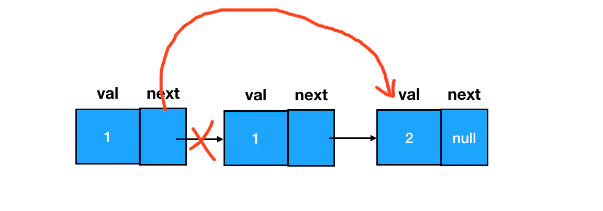

```js
/**
 * @param {ListNode} head
 * @return {ListNode}
 */

let l1 = {
  val: 1,
  next: {
    val: 1,
    next: {
      val: 2,
      next: null
    }
  }
}

let l2 = {
  val: 1,
  next: {
    val: 1,
    next: {
      val: 2,
      next: {
        val: 3,
        next: {
          val: 3,
          next: null
        }
      }
    }
  }
}

l1 = deleteDuplicates(l1);
l2 = deleteDuplicates(l2);

while (l1) {
  console.log(l1.val);
  l1 = l1.next;
}

console.log("------");

while (l2) {
  console.log(l2.val);
  l2 = l2.next;
}

function deleteDuplicates(list) {
  // 指针
  // 初始化指针为链表第一个结点
  let cur = list;

  // 指针遍历结点
  while (cur && cur.next) {
    // 若当前结点和它后面一个结点值相等（重复）
    if (cur.val === cur.next.val) {
      // 删除靠后的那个结点（去重）
      cur.next = cur.next.next;
    } else {
      // 若不重复，继续遍历
      cur = cur.next
    }
  }

  // 返回去重后的链表（第一个结点，链表进入点0
  return list
}
```

## dummy 结点
> 真题描述：给定一个排序链表，**删除所有含有重复数字的结点**，只保留原始链表中 没有重复出现的数字。
>
> 示例 1：输入：`1->2->3->3->4->4->5` 输出：`1->2->5`
> 示例 2：输入：`1->1->1->2->3` 输出：`2->3`

该问题是删除问题的延伸，一般将前驱结点的 `next` 指针往后挪一位「跳跃」跨过一个结点即可实现结点的删除，但是如果要将出现的重复的结点都删除，至少要删除两个结点才行，而且必须保证前驱结点有结点指向才可以，经常会遇到这样的问题：**链表的第一个结点，因为没有前驱结点**，导致我们面对它无从下手。这时我们就可以用一个 `dummy` 结点来解决这个问题。

**`dummy` 结点**：就是人为制造出来的链表的第一个结点的前驱结点，这样链表中所有的结点都能确保有一个前驱结点，也就所有结点都能够用同样的逻辑来处理了。

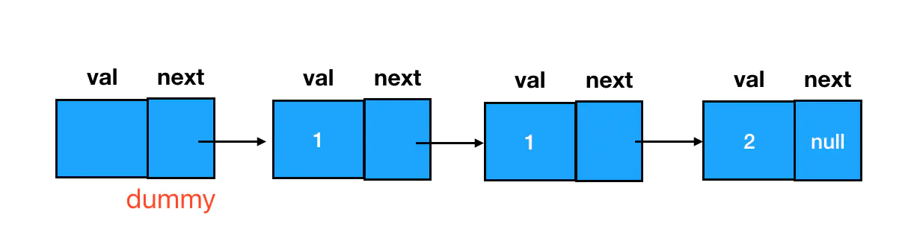

```js
let l1 = {
  val: 1,
  next: {
    val: 2,
    next: {
      val: 3,
      next: {
        val: 3,
        next: {
          val: 4,
          next: {
            val: 4,
            next: {
              val: 5,
              next: null
            }
          }
        }
      }
    }
  }
};

let l2 = {
  val: 1,
  next: {
    val: 1,
    next: {
      val: 1,
      next: {
        val: 2,
        next: {
          val: 3,
          next: null
        }
      }
    }
  }
};


l1 = deleteDuplicates(l1);
l2 = deleteDuplicates(l2);

while (l1) {
  console.log(l1.val);
  l1 = l1.next;
}

console.log("------");

while (l2) {
  console.log(l2.val);
  l2 = l2.next;
}

function deleteDuplicates(head) {
  // 极端情况：0个或1个结点，则不会重复，直接返回
  if (!head || !head.next) {
    return head
  }
  // 创建 dummy 结点
  let dummy = new ListNode();
  // 将 dummy 连接到原始链表的首个节点上
  dummy.next = head;

  // 创建指针
  // 初始化指向为首个结点
  let cur = dummy;

  // 遍历结点,从虚拟结点 dummy 开始，其值 dummy.val 为 undefined
  // 当前结点后还有两个结点时
  while (cur.next && cur.next.next) {
    // 判断后面两个结点的值是否相同
    if (cur.next.val === cur.next.next.val) {
      // 如果两个结点的值相同，记下该重复值
      let value = cur.next.val;
      // 反复地排查后面的元素是否存在多次重复该值的情况
      while (cur.next && cur.next.val === value) {
        // 若有，则删除
        cur.next = cur.next.next;
      }
    } else {
      // 若不重复，遍历下一个结点
      cur = cur.next;
    }
  }

  // 返回处理后的链表的首个结点（非 dummy 结点）
  return dummy.next;
}

function ListNode(val) {
  this.val = val;
  this.next = null;
}
```

:bulb: `dummy` 结点可以帮我们处理**头结点为空的边界问题**，帮助我们简化解题过程。因此涉及链表操作、尤其是涉及结点删除的题目（对前驱结点的存在性要求比较高），建议直接把 `dummy` 给用起来，建立好的编程习惯：

```js
const dummy = new ListNode()
// 这里的 head 是链表原有的第一个结点
dummy.next = head
```

## 快慢指针
> 真题描述：给定一个链表，删除链表的倒数第 `n` 个结点，并且返回链表的头结点。
>
> 示例： 给定一个链表: `1->2->3->4->5`，和 `n = 2`。当删除了倒数第二个结点后，链表变为 `1->2->3->5`，:bulb: 给定的 `n` 保证是有效的。

由于链表不能像数组一样通过属性 `length` 和索引来直接定位到结点，只能通过遍历来访问结点和了解结点数量。而遍历不可能从后往前走，因此倒数第 N 个结点可以转换为（正数）第 `M = len - n + 1` 个结点，这里 `len` 代表链表的总长度。

可以直接遍历两趟：第一趟设置一个变量 `count = 0`，每遍历到一个不为空的结点 `count + 1` ，一直遍历到链表结束为止，得出链表的总长度 `len`；根据这个总长度，通过公式 `M = len - n + 1` 算出倒数第 `n` 个结点到底对应正数第几个结点。然后第二趟遍历到第 `M - 1`（也就是 `len - n`，因为遍历计数变量一般从 `0` 开始） 个结点的时候就可以停下来，执行删除操作，将前驱结点指向后驱结点，这样就可以删除中间结点。

但是两次遍历时间复杂度较大，可以使用双指针的快慢指针来优化。原来的解法需要使用两次遍历实现**求长度，做减法** 和 **找定位**，而使用快慢指针就可以**将做减法和找定位这个过程给融合**。

快慢指针指的是两个一前一后的指针，由于它们「起步」位置不同造成的，但是「步速」一样，两个指针可以在一次遍历中往同一个方向走，前一个快指针控制遍历的终点（停止时机），后一个慢指针用来执行删除操作。通过快指针先行一步、接着快慢指针一起前进这个操作，巧妙地把两个指针之间的差值保持在了 `n` 上，:bulb: 用空间换时间，本质上其实就是对关键信息进行提前记忆，相当于用两个指针对差值实现了记忆。

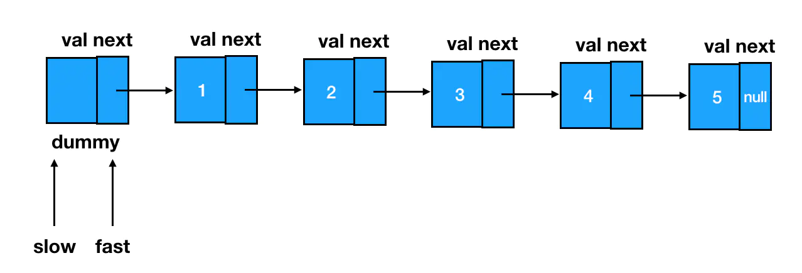

根据需要删除的位置为倒数第 `n` 个结点来设定快慢指针的间距

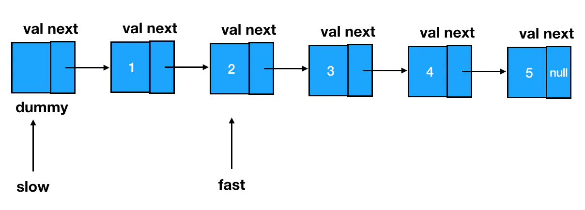

当快指针走到链表末尾（第 `len` 个）时，慢指针刚好就在 `len - n` 这个位置上。

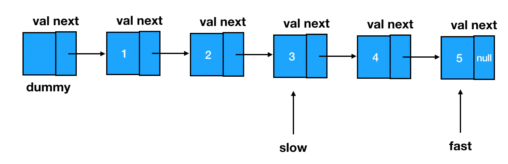

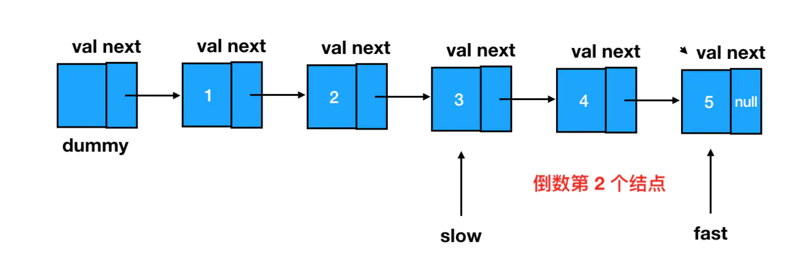

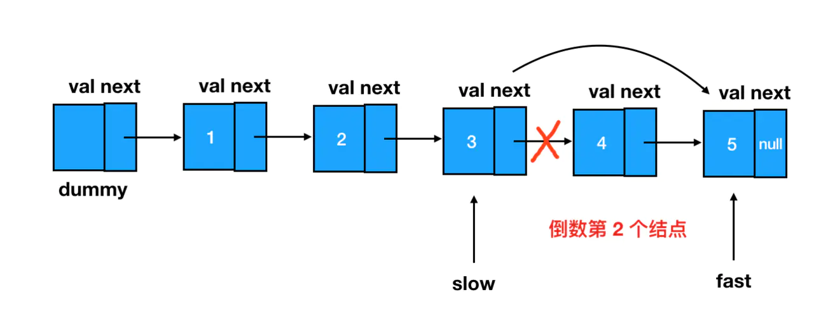

```js
function removeNthFromEnd(head, n) {
  // 创建 dummy 结点
  const dummy = new ListNode();
  // 指向原始链表的开始结点
  dummy.next = head;

  // 初始化快慢指针，均指向 dummy 结点
  let fast = dummy;
  let slow = dummy;
  // 基于删除结点的位置设置快慢指针的间距
  // 快指针先走 n 步
  while (n !== 0) {
    fast = fast.next;
    n--
  }

  // 遍历链表
  while (fast.next) {
    fast = fast.next;
    slow = slow.next;
  }

  // 快指针到达了最后结点，删除慢指针此时指代结点的后继结点
  slow.next = slow.next.next;

  // 返回处理后链表的头节点
  return dummy.next;
}

function ListNode(val) {
  this.val = val;
  this.next = null;
}
```

## 链表翻转
> 真题描述：定义一个函数，输入一个链表的头结点，反转该链表并输出反转后链表的头结点。
>
> 示例：输入: `1->2->3->4->5->NULL` 输出：`5->4->3->2->1->NULL`

处理链表的本质，是处理链表结点之间的**指针关系**，只要想办法把每个结点 `next` 指针的指向给反过来就行。

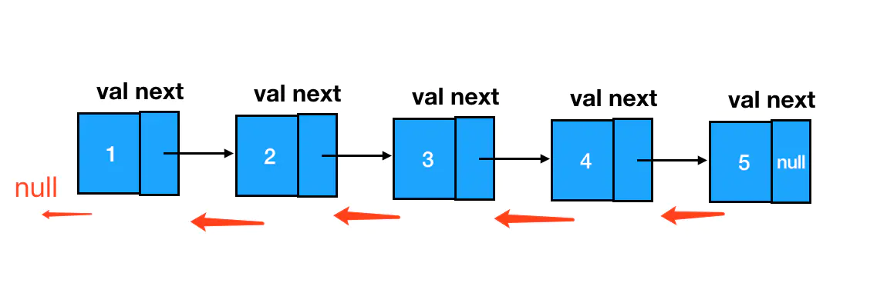

这里我们需要用到三个指针，它们分别指向目标结点 `cur`、目标结点的前驱结点 `pre`、目标结点的后继结点 `next`。这里我只需要一个简单的 `cur.next = pre`，就做到了目标结点的 `next` 指针的反转，指向前驱结点，而 `next` 保留着目标结点原来的后继结点，以便访问和遍历。

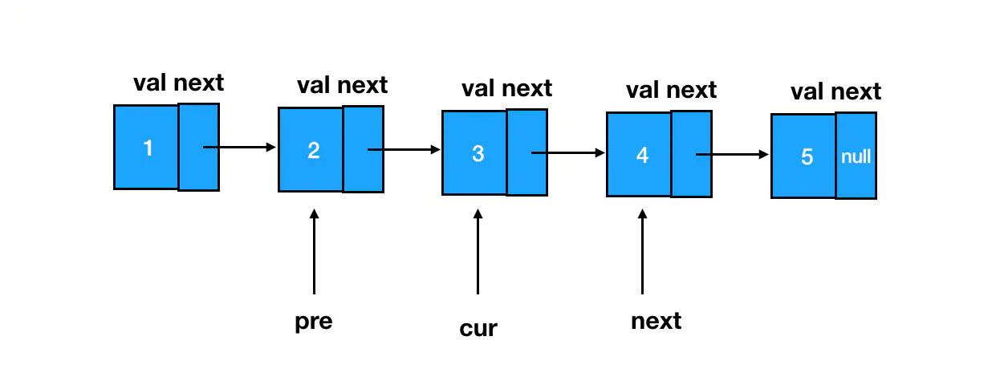

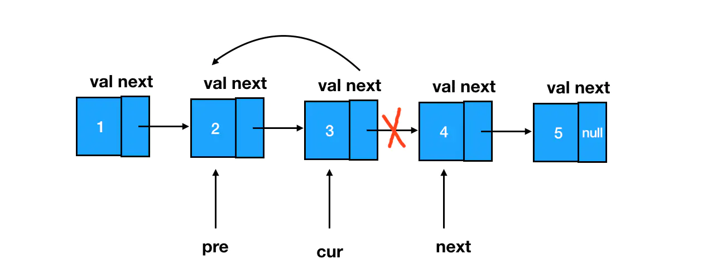

```js
/**
 * @param {ListNode} head
 * @return {ListNode}
 */

function reverseList(head) {
  // 初始化前驱结点和目标结点
  let pre = null;
  let cur = head;

  while (cur !== null) {
    // 记录当前结点原来的后继结点
    let next = cur.next;

    // 反转指针
    cur.next = pre;
    // 遍历链表
    // 指针向前走一步，直至 cur 为 null
    pre = cur;
    cur = next;
  }

  // 返回反转后的链表，指针 pre 是新链表的头结点
  return pre;
}
```

## 局部翻转
> 真题描述：反转从位置 `m` 到 `n` 的链表。请使用**一趟扫描**完成反转。:bulb: `1 ≤ m ≤ n ≤ 链表长度`。
>
> 示例：输入：`1->2->3->4->5->NULL`，`m = 2`，`n = 4` 输出：`1->4->3->2->5->NULL`

局部链表翻转除了要处理指定部分结点的 `next` 指针指向问题，还需要处理被逆序的区间前后的两个结点的 `next` 指针问题。

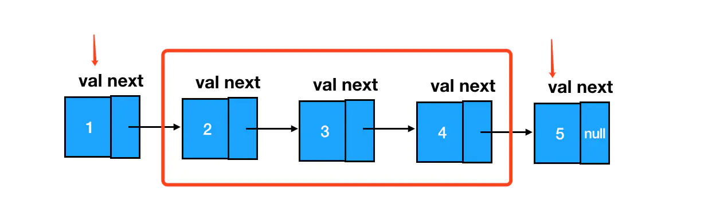

由于我们遍历链表的顺序是从前往后遍历，那么为了避免前面结点（区间头部结点和区间前的结点）随着遍历向后推进被遗失，我们需要提前**把区间前的这两个结点缓存下来**。而区间后的结点就没有这么麻烦，随着遍历的进行，当我们完成了区间内的指针反转后，此时 `cur` 指针就恰好指在区间后的结点上。

最后只需要将区间前的结点的 `next` 指针指向翻转后区间内的头结点，同时翻转前区间内的头结点的 `next` 指针指向区间后的结点即可将区间和外部结点「串」起来。

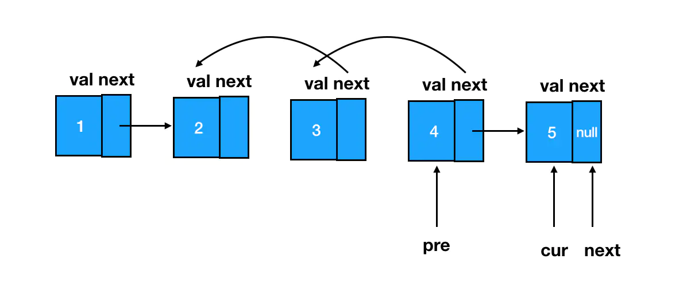

```js
/**
 * @param {ListNode} head
 * @param {number} m
 * @param {number} n
 * @return {ListNode}
 */

function reverseBetween(head, m, n) {
  // 定义 pre、cur、leftHead 指针
  // 其中 pre、cur 是翻转区间结点时使用的指针
  // 用 leftHead 来承接整个区间的前驱结点
  let pre, cur, leftHead
  // 考虑区间包含头结点的情况，需要使用 dummy 结点
  const dummy = new ListNode();
  dummy.next = head;

  // 创建一个游标 p，用于遍历，初始化指向 dummy
  let p = dummy;
  // 往前走 m-1 步，到达区间的前驱结点
  for(let i=0; i<m-1; i++) {
    p = p.next;
  }

  // 指针 leftHead 记录下这个结点
  leftHead = p;
  // 定义 start 指针记录原来区间的第一个结点
  let start = leftHead.next;
  pre = start;
  cur = pre.next;
  // 遍历翻转区间内的结点
  // 直至 pre 指向区间内最后的结点，cur 指向区间的后继结点
  for(let i=m; i<n; i++) {
    // 记录当前结点的后继结点
    let next = cur.next;
    cur.next = pre;
    // 向前走一步
    pre = cur;
    cur = next;
  }
  // 将区间的前驱结点指向翻转后的区间第一个结点
  leftHead.next = pre;
  // 将翻转后的区间的最后一个结点指向区间的后继结点
  start.next = cur;

  // 返回修改后链表的头结点
  return dummy.next;
}

function ListNode(val) {
  this.val = val;
  this.next = null;
}
```

## 判断链表成环
> 真题描述：给定一个链表，判断链表中是否有环。
>
> 示例 1：输入：`[3,2,0,4]`（链表结构如下图） 输出：`true` 即链表中存在一个环
> 

一个环形链表是能够让遍历它的游标回到原点，为走过的结点都「打上」标签 flag，即从 flag 出发只要能够再回到 flag 处，那么就意味着正在遍历一个环形链表。

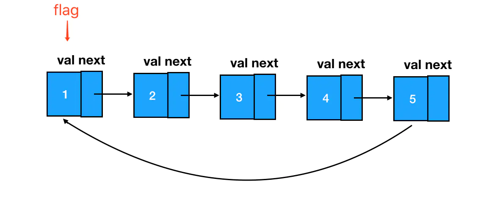

```js
/**
 * @param {ListNode} head
 * @return {boolean}
 */

function hasCycle(head) {
  // 如果存在结点就继续遍历
  while (head) {
    // 判断当前结点是否已打 flag
    if (head.flag) {
      // 如果已打 flag 证明链表成环
      return true;
    } else {
      // 如果不存在 flag 就打上标签
      head.flag = true;
      // 往前走一步
      head = head.next;
    }
  }
  // 默认返回 false
  return false;
}
```

:bulb: 这道题还有一个公认的比较经典的思路，就是用快慢指针来做：定义慢指针 `slow`，快指针 `fast`。两者齐头并进，`slow` 一次走一步、`fast` 一次走两步。这样如果它们是在一个有环的链表里移动，一定有相遇的时刻，

当移动的次数为 `t` 时，`slow` 移动的路程就是`t`，`fast` 移动的路程为`2t`，假如环的长度为 `s`，那么当下面这个条件满足时：

```js
// 如果刚好指针距离覆盖链表环的长度
2t - t = s

// 此时
t = s
```

`slow` 和 `fast` 就一定会相遇。反之，如果两者没有相遇，同时 `fast` 遍历到了链表的末尾，发现 `next` 指针指向 `null`，则链表中不存在环。

## 定位环形链表的环起点
> 真题描述：给定一个链表，返回链表开始入环的第一个结点。 如果链表无环，则返回 null。
>
> 示例 1：输入：`head = [3,2,0,-4]`（如下图） 输出：`tail connects to node index 1`  即链表中有一个环，其尾部连接到第二个结点。
> 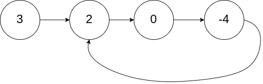
>
> 示例 2：输入：`head = [1,2]`（如下图）输出：`tail connects to node index 0` 即链表中有一个环，其尾部连接到第一个结点。
> 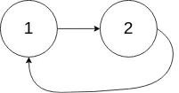
>
> 示例 3：输入：`head = [1]`（如下图）输出：`no cycle` 即链表中没有环。
> 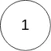

如果一个结点是环形链表成环的起点，那么**它一定是第一个被发现 flag 标志已存在的结点**，将对应的结点返回即可。

```js
/**
 * @param {ListNode} head
 * @return {ListNode}
 */

function detectCycle(head) {
  // 如果有节点就继续遍历
  while(head) {
    if(head.flag) {
      // 存在 flag 证明就是成环
      // 返回第一次碰到的 flag 对应的结点
      return head;
    } else {
      head.flag = true;
      head = head.next;
    }
  }
  return null;
}
```