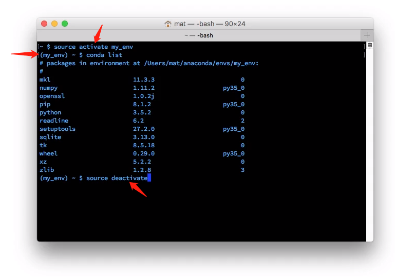

# 管理环境
`conda`可创建**虚拟环境**以分隔不同项目的工作空间，类似于[virtualenv](https://virtualenv.pypa.io/en/stable/)或[pyenv](https://github.com/yyuu/pyenv)流行的环境管理器。

## 创建环境
```python
conda create -n env_name list_of_packages_names
```
解释
* `-n`是借用名称`name`缩写，表示后面添加的参数是**虚拟环境的名称**
* `-n env_name`设置环境的名称
* `list_of_packages`列出需要安装在**虚拟环境中包的列表**

```python
# 在虚拟环境 my_env 中安装 numpy 包
conda create -n my_env numpy
```

### 创建指定版本环境
```python
# 创建一个名为 py3 的且默认使用的python版本为python3的虚拟环境
conda create -n py3 python=3

# 创建一个名为 py2 的且默认使用的python版本为python2的虚拟环境
conda create -n py2 python=2
```

* 在个人计算机上创建了这两个环境，用作与任何特定项目均无关的**通用环境**，以处理普通的工作（可轻松使用每个 Python 版本）
* 可以使用`python=3.3`来安装特定的版本
### 列出创建的所有环境
```python
conda env list
```
列出所创建的**所有环境**，当前所在的环境旁边会有一个星号`*`（默认环境为`root`，即当不选定环境时所使用的环境）

## 进入环境
 在Windows键入
```python
activate my_env
```

在OSX/Linux键入
```python
source activate my_env
```
你会在**终端提示符**前看到**环境名称**



## 离开环境
Windows键入
```python
deactive
```

OSX/Linux键入
```python
source deactivate
```

## 保存环境
**共享环境**让其他用户可以便捷地安装你代码中使用的**所有包**，并确保这些包的**版本正确**

```python
conda env export > environment.yaml
```
解释：
* `conda env export` 命令**输出环境中所有的包**
* `> environment.yaml`将导出的文本**写入到 `YAML` 文件**

导出环境中的**包列表**导出为文件，并将**其与代码打包**再一起共享给其他协作者，让其可以创建与你项目**相同的环境**

## 加载环境
通过**环境文件创建环境**，以加载相应的包

```python
# 环境文件为 environment.yaml
conda env create -f environment.yaml
```


## 删除环境
```python
conda env remove -n env_name
```

# 建议
## 使用环境
为从事的每个项目创建一个独立专属的环境很有用。这对于与数据不相关的项目也很有用。

## 共享环境
在 GitHub 上共享代码时，最好同样**创建环境文件并将其包括在代码库中**。这能让其他人更轻松地安装代码的所有**依赖项**。对于不使用`conda`的用户，我通常还会使用`pip freeze`将依赖项导出。
```python
pip freeze > requirements.txt
```


