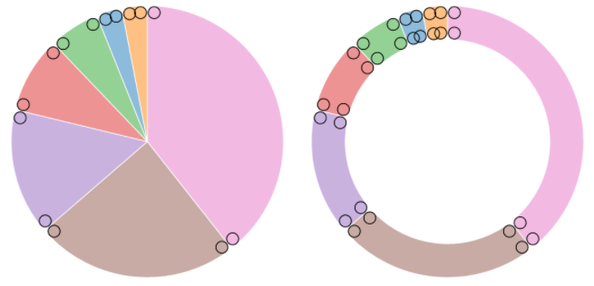
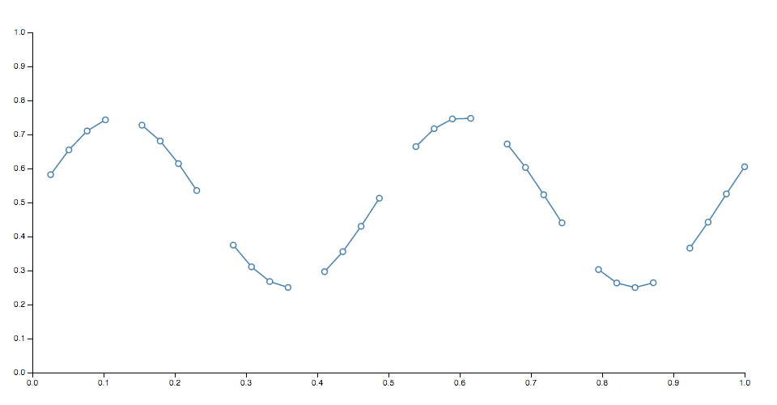

# 基本图元模块
可视化通常由离散图形标记组成，如 symbols、arcs、lines 和 areas，虽然条形的矩形、圆形等规则图形可以很容易的使用 SVG 或者 Canvas 来生成，但是其他的形状，如扇形以及向心曲线就很复杂，因此 D3 提供了基本图元模块 Shape，其中内置了许多图形生成器以便使用。

基于数据驱动的原则，D3 的每个图形生成器都暴露了一个如何将数据映射到可视化表现的访问器 accessors

```js
// 创建一个线条（路径）生成器，基于时间序列生成折线图
// 折线的拐点的 x 坐标表示时间，y 坐标表示其他值
var line = d3.line()
    .x(function(d) { return x(d.date); })
    .y(function(d) { return y(d.value); });

// 件线条生成器作为 svg 路径元素 path 的 d 属性
path.datum(data)
    .attr('d', line);
```

:bulb: 也可以将其渲染到 Canvas 2D 中

```js
line.context(context)(data);
```

## Arcs
弧线生成器用来在饼图或圆环图中生成圆形 circular 或环形 annular 扇形。

:bulb: 弧的中心总是在 `(0,0)` 可以使用 `transform`  属性的 `translate` 来将其移动到指定的位置
:bulb: 与 pie generator 对比，`pie` 生成器用来计算一组数据作为饼图或圆环图时所需要的角度信息；这些角度信息会被传递给 `arc` 生成器生成图形。

* `d3.arc()` 使用默认的设置创建一个新的 arc 生成器
* `arc(arguments…)` 根据指定的 `arguments` 生成 `arc`

```js
var arc = d3.arc();

// 基于半径和角度信息创建 arc
// 返回一个 path data 字符串
arc({
  innerRadius: 0,
  outerRadius: 100,
  startAngle: 0,
  endAngle: Math.PI / 2
}); // "M0,-100 A100,100,0,0,1,100,0 L0,0 Z"
```

* `arc.centroid(arguments…)` 计算弧线的中间点 `[x, y]`，中间点被定义为 `(startAngle + endAngle) / 2` 和 `(innerRadius + outerRadius) / 2`。
:bulb: 中间点并**不是**几何中心，因为几何中心点可能位于弧之外，这个方法可以用来方便的对 `labels` 进行定位。

* `arc.innerRadius([radius])` 将内半径设置为指定的函数或数值并返回当前 arc 生成器。
:bulb: 在生成堆叠的极坐标条形图时将内半径设置为函数非常有用，通常与 [sqrt scale](https://github.com/xswei/d3-scale#sqrt) 组合使用。更常见将内半径设置为常量用来生成 `donut` 或者 `pie` 图。
:warning: 如果外半径小于内半径则内外半径将会被互换，负值被看做 `0`。

* `arc.outerRadius([radius])` 指定了 radius 则将外半径设置为指定的函数或数值并返回当前 arc 生成器。
:bub: 将内半径设置为函数在生成南丁格尔玫瑰图/鸡冠花图/coxcomb 图或极坐标条形图时非常有用，通常与 [sqrt scale](https://github.com/xswei/d3-scale#sqrt) 组合。

* `arc.cornerRadius([radius])` 将拐角半径设置为指定的函数或数值并返回当前 arc 生成器。如果拐角半径大于 0 则弧度的拐角将会适用指定半径大小的圆进行圆滑，对于扇形会有两个拐角被圆滑处理；对于环形所有的四个拐角都会被圆滑处理。

    

    :bulb: 拐角半径不应该大于 `(outerRadius - innerRadius) / 2`

* `arc.startAngle([angle])` 将起始角度设置为指定的函数或数值并返回当前 arc 生成器。
:bulb: angle 以弧度的形式指定，0 表示 12 点钟方向并且顺时针方向为正。
* `arc.endAngle([angle])` 将终止角度设置为指定的函数或数值并返回当前 arc 生成器。
* `arc.padAngle([angle])` 将间隙角度设置为指定的函数或数值，并返回当前 arc 生成器。
:bulb: 使用角度间隔时，推荐的角度间隔为 `outerRadius \* padAngle / sin(θ)`，其中 `θ` 是所有扇（环）形中角度跨度最小的角度值，如外半径为 `200` 像素，间隔角度为 `0.02` 弧度，则合理的 `θ` 为 `0.04`，合理的内半径为 `100` 像素。参考[arc padding animation](http://bl.ocks.org/mbostock/053fcc2295a445afab07)
:bulb: 通常情况下间隔角度不会在 `arc` 生成器中直接设置，而是通过 [pie generator](https://d3js.org.cn/document/d3-shape/#pies) 来计算出一个与具体数据相比合理的间隔角度，因为如果使用了一个常量表示间隔角度，则它会倾向于从较小的弧跨度中减去不成比例的，可能会失真。

* `arc.padRadius([radius])`将间隔半径设置为指定的函数或数值并返回 arc 生成器

## Pies
饼图生成器不会直接生成图形，但是会计算生成饼图或环形图所需要的角度信息，这些角度信息可以被传递给 arc generator。

* `d3.pie()` 构建一个新的使用默认配置的 pie 生成器。
* `pie(data[, arguments…])` 根据指定的 `data` 数组返回对象数组，其中每个对象包含的属性是基于相应数据计算出来的弧度相关信息，以兼容 arc 生成器：

    - `data` 输入数据，对应输入数组中的数据元素
    - `value` 弧度值
    - `index` 排序后的索引
    - `startAngle` 弧的 start angle
    - `endAngle` 弧的 end angle
    - `padAngle`  每条弧之间的 padding angle

    ```js
    // pie() 构造一个默认的 pie 生成器
    // pie()(data) 为指定的数据集调用饼图生成器，返回一组对象数组
    var data = [1, 1, 2, 3, 5, 8, 13, 21];
    var arcs = d3.pie()(data);

    // [
    //   {"data":  1, "value":  1, "index": 6, "startAngle": 6.050474740247008, "endAngle": 6.166830023713296, "padAngle": 0},
    //   {"data":  1, "value":  1, "index": 7, "startAngle": 6.166830023713296, "endAngle": 6.283185307179584, "padAngle": 0},
    //   {"data":  2, "value":  2, "index": 5, "startAngle": 5.817764173314431, "endAngle": 6.050474740247008, "padAngle": 0},
    //   {"data":  3, "value":  3, "index": 4, "startAngle": 5.468698322915565, "endAngle": 5.817764173314431, "padAngle": 0},
    //   {"data":  5, "value":  5, "index": 3, "startAngle": 4.886921905584122, "endAngle": 5.468698322915565, "padAngle": 0},
    //   {"data":  8, "value":  8, "index": 2, "startAngle": 3.956079637853813, "endAngle": 4.886921905584122, "padAngle": 0},
    //   {"data": 13, "value": 13, "index": 1, "startAngle": 2.443460952792061, "endAngle": 3.956079637853813, "padAngle": 0},
    //   {"data": 21, "value": 21, "index": 0, "startAngle": 0.000000000000000, "endAngle": 2.443460952792061, "padAngle": 0}
    // ]
    ```
    :bulb: 返回的对象数组与传入的数据集的次序是一致的。

* `pie.value([value])` 显式设置饼图生成器的值访问器为指定的函数或数值，并返回当前饼图生成器。

    ```js
    var data = [
      {"number":  4, "name": "Locke"},
      {"number":  8, "name": "Reyes"},
      {"number": 15, "name": "Ford"},
      {"number": 16, "name": "Jarrah"},
      {"number": 23, "name": "Shephard"},
      {"number": 42, "name": "Kwon"}
    ];

    // 以数据中的 d.number 作为值传递给饼图生成器
    var arcs = d3.pie()
        .value(function(d) { return d.number; })
        (data);
    // 也可以在调用饼图生成器之前使用 map 方法对数组进行预处理
    // var arcs = d3.pie()(data.map(function(d) { return d.number; }));
    ```

    :warnign: 默认的值访问器假设传入的数据每个元素为数值类型，或者可以使用 `valueOf` 转为数值类型的值。

    :bulb: 使用访问器（而不是直接对数组进行转换再传入）的好处是**输入的原始数据，如示例中的对象数组 `data`，仍然与返回的对象相关联**，从而使之后访问数据的其他字段变得更容易，如基于数据的 `name` 字段为饼图的每个部分添加文本标签。

* `pie.sort([compare])` 设置数据比较函数并返回饼图生成器，:bulb: 排序操作不会影响生成的弧度数组次序 generated arc array，生成的数据次序与传入的数组次序保持一致。排序操作是通过修改每个生成的元素的起始角度值来实现排序的。
* `pie.sortValues([compare])` 设置 `value` 比较函数并返回当前的饼图生成器。

* `pie.startAngle([angle])` 将饼图的布局起始角度设置为指定的函数或数值并返回饼图生成器。
* `pie.endAngle([angle])` 将整个饼图的终止角度设置为指定的函数或数值并返回当前饼图生成器。
* `pie.padAngle([angle])` 将饼图扇形之间的间隔设置为指定的函数或数值，并返回当前饼图生成器。

## Lines
线段生成器可以用来生成折线图所需要的 spline 或 polyline。

* `d3.line([x][, y])` 使用默认的设置构造一个 line 生成器。
* `line(data)` 根据指定的 `data` 数组生成折线。输入数据 data 可能需要根据 x 值进行排序。如果线条生成器有 context，则线条会通过 path method 被渲染到指定的上下文中，否则返回一个路径 `path` 字符串。

* `line.x([x])` 将 x 访问器设置为指定的函数或数值并返回当前 line 生成器。
* `line.y([y])` 将 y 访问器设置为指定的函数或数值并返回当前 line 生成器。

    ```js
    var data = [
      {date: new Date(2007, 3, 24), value: 93.24},
      {date: new Date(2007, 3, 25), value: 95.35},
      {date: new Date(2007, 3, 26), value: 98.84},
      {date: new Date(2007, 3, 27), value: 99.92},
      {date: new Date(2007, 3, 30), value: 99.80},
      {date: new Date(2007, 4,  1), value: 99.47},
      …
    ];

    var line = d3.line()
        .x(function(d) { return x(d.date); })
        .y(function(d) { return y(d.value); });
    ```

* `line.defined([defined])` 将 defined 访问器设置为指定的函数或布尔值并返回当前 line 生成器。

默认的访问器假设输入数据总是被定义的。当线条被生成时，定义的访问器会为输入数据的每个元素定义，并传递当前数据元素 `d`, 索引 `i` 以及数组 `data` 作为三个元素。如果给定的元素有定义的（defined 访问器为当前元素返回真值）, 则 `x` 和 `y` 访问器会对其进行评估并将当前点添加到线段中生成一个新的线段；否则[会跳过当前数据元素，并结束当前线段](https://observablehq.com/@d3/line-with-missing-data)，在下一个点重新开始一个新的线段。



:bulb: 如果一个线段仅由一个点组成，那么它可能看起来是不可见的，除非用圆形或方形的线帽 line caps 呈现。

* `line.curve([curve])` 设置曲线插值方法 [curve factory](https://d3js.org.cn/document/d3-shape/#curves) 并返回 line 生成器。如果没有指定 `curve` 则返回当前的线条插值方式，默认为 [`curveLinear`](https://d3js.org.cn/document/d3-shape/#curveLinear)

* `line.context([context])` 设置上下文并返回当前 line 生成器。如果 `context` 不为空，则 line 生成器会调用 path method 被渲染到当前 `context` 中（接着 context 线条部分绘制）；如果没有指定 `context`（默认为 `null`），会返回一个 path data 字符串用来表示生成的线条。

* `d3.lineRadial()` 使用默认的设置构造一个新的径向线条 radial line 生成器。径向线条生成器类似于笛卡尔坐标系下的 line 生成器，只不过 `x` 和 `y` 访问器被替换成了 [`angle` 访问器](https://d3js.org.cn/document/d3-shape/#lineRadial_angle) 和 [`radius` 访问器](https://d3js.org.cn/document/d3-shape/#lineRadial_radius)。径向线条的生成总是相对于 `(0, 0)` 作为中心点，可以使用坐标变换 `transform` 的属性 `translate` 调整其位置。参考 [SVG](http://www.w3.org/TR/SVG/coords.html#TransformAttribute)，[Canvas](http://www.w3.org/TR/2dcontext/#transformations) 的坐标变换。

* `lineRadial(data)` 等价于 `line`

* `lineRadial.angle([angle])` 等价于 `line.x`，只不过此访问器返回的是弧度，0 度在 - y（12 点钟方向）

* `lineRadial.radius([radius])` 等价于 `line.y`，只不过此访问器返回一个半径值，也就是距离 `(0, 0)` 的距离

* `lineRadial.defined([defined])` 等价于 `line.defined`

* `lineRadial.curve([curve])` 等价于 `line.curve`
:warning: `curveMonotoneX` 或 `curveMonotoneY` 插值方式不被推荐用在径向线条布局中，因为这两种插值方式假设 `x` 或 `y` 是单调的。

* `lineRadial.context([context])` 等价于 `line.context`

## Areas
区域生成器 area 用来在面积图中生成区域。一个区域图由两条边界 lines 定义，使用曲线 splines 或折线 polylines。通常情况下两条边界线共享一系列 x-values（两条线的横坐标范围相同 `x0 = x1`)，仅仅是 y-value 不一样。大多数情况下 `y0` 会被定义为一个常量，一般设为 `y0=0`。第一条线（也就是上侧线）由 `x1` 和 `y1` 定义渲染；而第二条线（也就是基线）由 `x0` 和 `y0` 定义渲染。有了 [curveLinear](https://d3js.org.cn/document/d3-shape/#curveLinear) [curve](https://d3js.org.cn/document/d3-shape/#area_curve)，就可以生成一个顺时针方向的多边形。

* `d3.area([x][, y0][, y1])`  使用默认的设置，或使用相应的访问器构建一个 area 生成器。

* `area(data)` 根据指定的一组数据 `data` 生成面积路径字符串。:bulb: 输入数据可能需要在传递给 area 生成器之前按 x 值进行排序。如果 area 生成器被指定了 [`context`](https://d3js.org.cn/document/d3-shape/#line_context) 则区域图会调用 [path method](http://www.w3.org/TR/2dcontext/#canvaspathmethods) 被渲染到指定的上下文上，并且这个方法返回 `void`。否则会返回一个表示 [path data](http://www.w3.org/TR/SVG/paths.html#PathData) 的字符串。

* `area.x([x])` 设置 `x0` 为 `x` 并且设置 `x1` 为 `null`，返回当前 area 生成器。
* `area.x0([x])` 将 `x0` 访问器设置为指定的函数或数值并返回当前 area 生成器。
* `area.x1([x])` 设置 `x1` 访问器为指定的函数或数值并返回 area 生成器。如果 `x` 没有指定则返回当前的 `x1` 访问器，默认为 `null`，即表示先前计算的 `x0` 值应该为 `x1` 值重用（共享同一组 x-values）。

当一个区域图被生成时，`x1` 访问器将会为每个定义的元素调用。并传递当前元素 `d`，索引 `i` 以及数据数组 `data` 三个参数。

* `area.y([y])` 设置 `y0` 为 `y` 并设置 `y1` 为 `null`，返回 area 生成器。
* `area.y0([y])` 设置 `y0` 访问器为指定的函数或数值并返回当前区域生成器。
* `area.y1([y])` 将 `y1` 访问器设置为指定的函数或数值并返回当前区域生成器。类似地，可以使用空的访问器以表明 `y0` 会被 `y1` 复用。

```js
var data = [
  {date: new Date(2007, 3, 24), value: 93.24},
  {date: new Date(2007, 3, 25), value: 95.35},
  {date: new Date(2007, 3, 26), value: 98.84},
  {date: new Date(2007, 3, 27), value: 99.92},
  {date: new Date(2007, 3, 30), value: 99.80},
  {date: new Date(2007, 4,  1), value: 99.47},
  …
];

var area = d3.area()
    .x(d => x(d.date))
    .y1(d => y(d.value))
    .y0(y(0));   // 将基准边界 y0 设置为 0
```

* `area.defined([defined])` 将 defined 访问器设置为指定的函数或布尔值并返回区域生成器。

类似于 Lines 生成器的 `line.defined()`，默认的访问器假设输入数据都是定义的。当区域图被生成时，已经定义的访问器会为每个数据元素调用，并传递当前数据元素 `d`, 索引 `i` 以及数组 `data` 三个参数。如果给定的元素是定义的（defined 访问器返回真值），`x0`、`x1`、`y0` 和 `y1` 访问器会为当前元素评估然后将坐标加入到区域分段中；否则会跳过当前元素并结束当前区域分段，并为下一个定义的数据新开一个分段，此时的结果会表现为[分段的区域图](https://observablehq.com/@d3/area-with-missing-data)。

## Curves
lines 被定义为一系列二维点 `[x, y]` 构成的图元，areas 是由顶线和基线定义的图元，但是还有一种图元是有离散的点构成的**连续的曲线**，curve 插值曲线通常不会直接使用，而是结合 `line.curve()` 和 `area.curve()` 作使用。

```js
var line = d3.line(d => d.date, d => d.value)
    .curve(d3.curveCatmullRom.alpha(0.5));
```

关键是如何在这些点之间进行插值，插值的方式有很多种：

* `d3.curveBasis(context)` 使用指定的控制点生成一个三次 [样条曲线 basis spline](https://en.wikipedia.org/wiki/B-spline)。
第一个和最后一个点会被分成三个重复的点，这样就能保证线条经过第一个和最后一个点。并且曲线与第一个和第二个点之间的连线相切，同时与最后一个与倒数第二个点连线相切。

* `d3.curveBasisClosed(context)` 使用指定的控制点生成一个闭合的三次样条曲线 basis spline。
* `d3.curveBasisOpen(context)` 使用指定的控制点生成一个三次 basis spline。与 basis 插值方法不同，第一个和最后一个控制点不会被重复，这条曲线通常不会与这些点相交。
* `d3.curveBundle(context)` 使用指定的控制点产生一个可以校正调整的三次 basis spline，校正系数根据曲线的 beta 系数确定，默认为 0.85。这种曲线通常用在 hierarchical edge bundling 中来消除视觉混淆。它的设计是用来和 `d3.line` 结合的，而不是 `d3.area`。

* `d3.curveLinear(context)`通过指定的点产生折线。
* `d3.curveLinearClosed(context)` 产生闭合折线。
* `d3.curveStep(context)` 产生一个分段常数函数 (阶梯函数)，由水平和垂直的交替线组成。y 值在每一对相邻 x 值的中点处发生变化。
* `d3.curveStepAfter(context)` 产生一个分段常数函数 (阶梯函数)，由水平和垂直的交替线组成。y 值在 x 值之后发生变化。
* `d3.curveStepBefore(context)` 产生一个分段常数函数 (阶梯函数)，由水平和垂直的交替线组成。y 值在 x 值之前发生变化。

## Custom Curves
Curves 通常不会直接使用，而是传递给 line.curve 和 area.curve. 但是，如果对内置的曲线不满意可以使用以下接口，定义自己的曲线实现来替代内置的曲线：

* `curve.areaStart()` 指明新区域段的开始。

* `curve.areaEnd()` 指明当前区域段的结束。

* `curve.lineStart()` 指明新线段的开始。后面可以跟着零个或多个 points。

* `curve.lineEnd()` 指明当前线段的结束。

* `curve.point(x, y)`指明当前线段中具有给定 x 和 y 值的新点。

## Links
连线生成器用来生成从一个源点到目标点的光滑的贝塞尔曲线 cubic Bézier curve。曲线在起点和终点的切线要么是 垂直 vertical、水平 horizontal 或 径向 radial。

* `d3.linkVertical()` 返回一个新的 link 生成器，生成的曲线在曲线的终点和起点处的切线是垂直方向的。
```js
var link = d3.linkVertical()
    .x(function(d) { return d.x; })
    .y(function(d) { return d.y; });
```

* `d3.linkHorizontal()` 返回一个新的 link 生成器，生成的曲线在曲线的终点和起点处的切线是水平方向的。
```js
var link = d3.linkHorizontal()
    .x(function(d) { return d.y; })
    .y(function(d) { return d.x; });
```

* `link(arguments…)` 根据指定的 arguments 生成 links。
```js
link({
  source: [100, 100],
  target: [300, 300]
});
```

* `link.source([source])` 将 source 访问器设置为指定的函数并返回当前 link 生成器。
* `link.target([target])` 将 target 访问器设置为指定的函数并返回当前 link 生成器。

* `d3.linkRadial()` 返回一个新的径向 link 生成器。
```js
var link = d3.linkRadial()
    .angle(function(d) { return d.x; })
    .radius(function(d) { return d.y; });
```