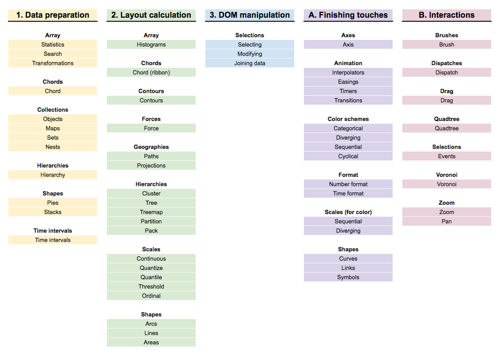

# 模块
D3 是由相互协同工作的 [模块/API 集合](https://github.com/d3) 构成的，**可以单独使用其中某些模块（只导入指定模块）**，也可以使用默认构建的全部功能，每个模块都提供相应的 API 接口以便调用，具体源码和使用方法参考[官方文档](https://github.com/d3/d3/blob/master/API.md)。

常用模块及分类：

详细模块列表如下：

- [Arrays](https://github.com/d3/d3/blob/master/API.md#arrays-d3-array) ([Statistics](https://github.com/d3/d3/blob/master/API.md#statistics), [Search](https://github.com/d3/d3/blob/master/API.md#search), [Iterables](https://github.com/d3/d3/blob/master/API.md#iterables), [Sets](https://github.com/d3/d3/blob/master/API.md#sets), [Transformations](https://github.com/d3/d3/blob/master/API.md#transformations), [Histograms](https://github.com/d3/d3/blob/master/API.md#histograms))
- [Axes](https://github.com/d3/d3/blob/master/API.md#axes-d3-axis)
- [Brushes](https://github.com/d3/d3/blob/master/API.md#brushes-d3-brush)
- [Chords](https://github.com/d3/d3/blob/master/API.md#chords-d3-chord)
- [Colors](https://github.com/d3/d3/blob/master/API.md#colors-d3-color)
- [Color Schemes](https://github.com/d3/d3/blob/master/API.md#color-schemes-d3-scale-chromatic)
- [Contours](https://github.com/d3/d3/blob/master/API.md#contours-d3-contour)
- [Voronoi Diagrams](https://github.com/d3/d3/blob/master/API.md#voronoi-diagrams-d3-delaunay)
- [Dispatches](https://github.com/d3/d3/blob/master/API.md#dispatches-d3-dispatch)
- [Dragging](https://github.com/d3/d3/blob/master/API.md#dragging-d3-drag)
- [Delimiter-Separated Values](https://github.com/d3/d3/blob/master/API.md#delimiter-separated-values-d3-dsv)
- [Easings](https://github.com/d3/d3/blob/master/API.md#easings-d3-ease)
- [Fetches](https://github.com/d3/d3/blob/master/API.md#fetches-d3-fetch)
- [Forces](https://github.com/d3/d3/blob/master/API.md#forces-d3-force)
- [Number Formats](https://github.com/d3/d3/blob/master/API.md#number-formats-d3-format)
- [Geographies](https://github.com/d3/d3/blob/master/API.md#geographies-d3-geo) ([Paths](https://github.com/d3/d3/blob/master/API.md#paths), [Projections](https://github.com/d3/d3/blob/master/API.md#projections), [Spherical Math](https://github.com/d3/d3/blob/master/API.md#spherical-math), [Spherical Shapes](https://github.com/d3/d3/blob/master/API.md#spherical-shapes), [Streams](https://github.com/d3/d3/blob/master/API.md#streams), [Transforms](https://github.com/d3/d3/blob/master/API.md#transforms))
- [Hierarchies](https://github.com/d3/d3/blob/master/API.md#hierarchies-d3-hierarchy)
- [Interpolators](https://github.com/d3/d3/blob/master/API.md#interpolators-d3-interpolate)
- [Paths](https://github.com/d3/d3/blob/master/API.md#paths-d3-path)
- [Polygons](https://github.com/d3/d3/blob/master/API.md#polygons-d3-polygon)
- [Quadtrees](https://github.com/d3/d3/blob/master/API.md#quadtrees-d3-quadtree)
- [Random Numbers](https://github.com/d3/d3/blob/master/API.md#random-numbers-d3-random)
- [Scales](https://github.com/d3/d3/blob/master/API.md#scales-d3-scale) ([Continuous](https://github.com/d3/d3/blob/master/API.md#continuous-scales), [Sequential](https://github.com/d3/d3/blob/master/API.md#sequential-scales), [Diverging](https://github.com/d3/d3/blob/master/API.md#diverging-scales), [Quantize](https://github.com/d3/d3/blob/master/API.md#quantize-scales), [Ordinal](https://github.com/d3/d3/blob/master/API.md#ordinal-scales))
- [Selections](https://github.com/d3/d3/blob/master/API.md#selections-d3-selection) ([Selecting](https://github.com/d3/d3/blob/master/API.md#selecting-elements), [Modifying](https://github.com/d3/d3/blob/master/API.md#modifying-elements), [Data](https://github.com/d3/d3/blob/master/API.md#joining-data), [Events](https://github.com/d3/d3/blob/master/API.md#handling-events), [Control](https://github.com/d3/d3/blob/master/API.md#control-flow), [Local Variables](https://github.com/d3/d3/blob/master/API.md#local-variables), [Namespaces](https://github.com/d3/d3/blob/master/API.md#namespaces))
- [Shapes](https://github.com/d3/d3/blob/master/API.md#shapes-d3-shape) ([Arcs](https://github.com/d3/d3/blob/master/API.md#arcs), [Pies](https://github.com/d3/d3/blob/master/API.md#pies), [Lines](https://github.com/d3/d3/blob/master/API.md#lines), [Areas](https://github.com/d3/d3/blob/master/API.md#areas), [Curves](https://github.com/d3/d3/blob/master/API.md#curves), [Links](https://github.com/d3/d3/blob/master/API.md#links), [Symbols](https://github.com/d3/d3/blob/master/API.md#symbols), [Stacks](https://github.com/d3/d3/blob/master/API.md#stacks))
- [Time Formats](https://github.com/d3/d3/blob/master/API.md#time-formats-d3-time-format)
- [Time Intervals](https://github.com/d3/d3/blob/master/API.md#time-intervals-d3-time)
- [Timers](https://github.com/d3/d3/blob/master/API.md#timers-d3-timer)
- [Transitions](https://github.com/d3/d3/blob/master/API.md#transitions-d3-transition)
- [Zooming](https://github.com/d3/d3/blob/master/API.md#zooming-d3-zoom)

