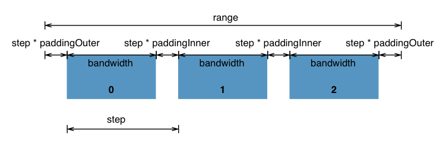

# 比例尺模块
尺度 Scale 是一个将抽象的数据映射为可视化表示的工具，具体而言它是将输入域 `domain` 映射为输出范围 `range` 的函数，如将测量数据（单位是米）映射为页面上的点（单位是像素），即是使用位置编码定量数据。可以使用不同的比例尺，对任意类型的数据进行映射，如分类数据或离散的数据；也可以使用任何视觉元素编码数据，比如颜色，描边的宽度或者符号的大小等。

构建比例尺进行数据映射到视觉元素的步骤：

1. `let continuous = d3.continuous-scale` 指定合适的比例尺类型
2. `continuous.domain([domain])` 指定一个数值数组作为输入域，其中数组包含两个或者两个以上元素，如果给定的数组中的元素不是数值类型，则会被强制转为数值类型。:bulb: 尽管对于连续比例尺来说，`domain` 通常包含两个值就可以，但是指定多个值的话会生成一个分段的比例尺。
3. `continuous.range([range])` 指定一个数值数组作为输出的范围，类似于 `domain`，但元素不必是数值类型（如果需要使用 `continuous.invert(value)` 实现反向映射除外）

:bulb: 在映射关系中，使用 **`domain`** 限定**输入**域范围，使用 **`range`** 限定**输出**的范围，然后再根据选择的比例尺类别，D3 就可以自动计算出常见的映射规则。

**连续比例尺 [Continuous Scales](https://d3js.org.cn/document/d3-scale/#continuous-scales)**：对于连续的定量数据进行映射，如将测量单位米使用像素映射，即使用位置编码定量数据

**序数比例尺 [Ordinal Scales](https://github.com/d3/d3-scale/tree/v3.2.2#ordinal-scales)**：对于离散的顺序（有序）或者分类（无序）数据进行映射，指定从一组数据值到一组相应视觉属性的显式映射，如使用颜色视觉元素编码离散数据。

:bulb: 其他比例尺：
* [Quantize scale](https://d3js.org.cn/document/d3-scale/#quantize-scales) 量化比例尺，与线性比例尺 linear scales 类似，但是其输出区间是离散的而不是连续的。将连续数据四舍五入到一组固定的离散值中，可以用来生成离散数据。
* [Quantile scale](https://d3js.org.cn/document/d3-scale/#quantile-scales) 分位数比例尺，从样本总体计算分位数
* [Threshold scale](https://d3js.org.cn/document/d3-scale/#threshold-scales) 阈值比例尺，与量化比例尺 Quantize scale 类似，可以为一组连续数据指定分割阈值，只不过它们允许将输入域的任意子集映射到输入域的离散值。

:bulb: 该模块不会提供颜色比例尺映射方案，可以参考 [d3-scale-chromatic](https://github.com/xswei/d3-scale-chromatic) 来获取需要的数据-颜色映射方案。

## 连续比例尺
连续比例尺 Continuous Scales 可以将连续的定量的输入域 [`domain`](https://d3js.org.cn/document/d3-scale/#continuous_domain) 映射到连续的输出范围 [`range`](https://d3js.org.cn/document/d3-scale/#continuous_range)，映射规则基于所选的连续比例尺类型。

常见的连续比例尺 continuous 类型：

* [`d3.scaleLinear()`](https://d3js.org.cn/document/d3-scale/#linear-scales) 线性比例尺
* [`d3.scaleTime()`](https://d3js.org.cn/document/d3-scale/#time-scales) 时间比例尺，映射时间序列
* [`scalePow()`](https://d3js.org.cn/document/d3-scale/#power-scales) 幂比例尺
* [`d3.scaleLog()`](https://d3js.org.cn/document/d3-scale/#log-scales) 对数比例尺

```js
// 数值间的映射
let continuous = d3.scaleLinear()   // 使用线性比例尺
    .domain([10, 130])   // 设定输入域
    .range([0, 960]);   // 设定输出范围

continuous(20); // 80
continuous(50); // 320

// 将数值映射为颜色
let color = d3.scaleLinear()
    .domain([10, 100])
    .range(["brown", "steelblue"]);

color(20); // "#9a3439"
color(50); // "#7b5167"

// 创建一个 diverging color scale 分段的颜色比例尺
// 当值为负时在白色和红色之间插值，当值为正时在白色和绿色之间插值
var color = d3.scaleLinear()
    .domain([-1, 0, 1])
    .range(["red", "white", "green"]);

color(-0.5); // "rgb(255, 128, 128)"
color(+0.5); // "rgb(128, 192, 128)"
```

:warning: 如果给定的 `value` 不在 `domain` 中，并且 **[`clamping`](https://d3js.org.cn/document/d3-scale/#continuous_clamp) 钳位功能**没有启用，则返回的对应的值也会位于 `range` 之外，这种映射值推算出来的；如果启用了钳位功能，则能保证返回的值总是处于 `range`。钳位功能对于 `continuous.invert` 也是同样的效果。

```js
let x = d3.scaleLinear()
    .domain([10, 130])
    .range([0, 960]);

x(-10); // -160, outside range
x.invert(-160); // -10, outside domain

x.clamp(true);   // 开启钳位功能
x(-10); // 0, clamped to range
x.invert(-160); // 10, clamped to domain
```

:bulb: 如果输出范围也是连续的数值型，则可以使用 `continuous.invert(value)` 实现反向映射，即根据相同的比例尺，基于给定的位于输出范围 `range` 中的 `value` 返回对应的位于输入域 `domain` 的值。

```js
var x = d3.scaleLinear()
    .domain([10, 130])
    .range([0, 960]);

x.invert(80); // 20
x.invert(320); // 50
```

### 线性比例尺
`d3.scaleLinear()` 使用线性比例尺作为映射规则。

默认使用单位 `domain` `[0, 1]`, 单位 `range` `[0, 1]`, 以及 [default](https://github.com/xswei/d3-interpolate#interpolate) [`interpolator`](https://d3js.org.cn/document/d3-scale/#continuous_interpolate) 和关闭的 [`clamping`](https://d3js.org.cn/document/d3-scale/#continuous_clamp) 构造一个新的连续比例尺。

线性插值器是一个很好的适用于连续定量数据的比例尺，因为它很好的保留了比例差异，每一个 `range` 中的值 `y` 都可以被表示为一个函数：`y = mx + b`，其中 `x` 为对应的 `domain` 中的值。

## 序数比例尺
与连续比例尺 Continuous Scales 不同，序数比例尺 Ordinal Scales 的输入域和输出范围都是**离散**的，如将一组命名类别映射到一组颜色，或者确定一组条形图在水平方向的位置等。

* `d3.scaleOrdinal([[domain, ]range])` 使用给定的输入域 `domain` 与输出值 `range` 构造一个序数比例尺。
* `ordinal(value)` 根据输入域中的值 `value` 返回对应的输入域中的值。输入域中的元素次序与输出值范围中的元素次序一一对应。
* `ordinal.domain([domain])` 将数组指定为输入域 `domain`，输入域在内部以字符串到索引的映射 Map 形式存储，索引值用来进行进行输出检索，因此序数比例尺的输入域的值必须为字符串或者能被强制转为字符串的类型，并且元素的值必须唯一。
* `ordinal.range([range])` 指定了 range 则将序数比例尺的输出域设置为指定的数组。输入域中的元素与输出域中的元素一一对应。

### 分段比例尺
分段比例尺 [Band Scales](https://github.com/d3/d3-scale/tree/v3.2.2#band-scales) 与序数比例尺 Ordinal Scales 类似，只不过其输出域可以是连续的数值类型，通过将连续的范围划分为**均匀的分段**映射为离散的输出值。该比例尺一般用于包含序数或类别维度的条形图，



* `d3.scaleBand([[domain, ]range])` 使用给定的输入域 `domain` 与输出值 `range` 构造一个分段比例尺，默认不设置 `padding` 和 `rounding`，并居中对齐。:bulb: 如果没有指定 `range` 则默认使用单位 `range` `[0. 1]`
* `band(value)` 根据输入域中的值 `value` 返回对应的**分段的起点值**，如果给定的 `value` 不在输入域中则返回 `undefined`。
* `band.domain([domain])` 将数组指定为输入域 `domain`，第一个元素对应第一个分段，第二个元素对应第二个分段，以此类推。在内部分段比例尺的输入会存储字符串与索引的映射关系，因此输入域中的值必须是字符串或者能被强制转为字符串的值，并且**元素值必须唯一**。
* `band.range([range])` 将二元数值数组指定为输出范围 `range`，如果数组中元素不是数值类型则会被强制转为数值类型。如果没有指定 `range` 则返回比例尺当前的输出范围，默认为 `[0, 1]`。
* `band.bandwidth()` 返回每一个分段的宽度。
* `band.paddingInner([padding])` 指定分段的内部间隔的比例为 `padding`，范围必须在 `[0, 1]` 之间。如果没有指定 `padding` 则返回当前的内部间隔，默认为 `0`（`1` 表示 `bandwidth` 条带宽度为 0）。
* `band.paddingOuter([padding])` 指定第一个分段之前与最后一个分段之后的间隔比例。
### 标点比例尺
标点比例尺 [Point Scales](https://github.com/d3/d3-scale/tree/v3.2.2#point-scales)：是 Band Scales 的分段宽度为 `0` 时的变体，通常用于对具有序数或分类维度的散点图。