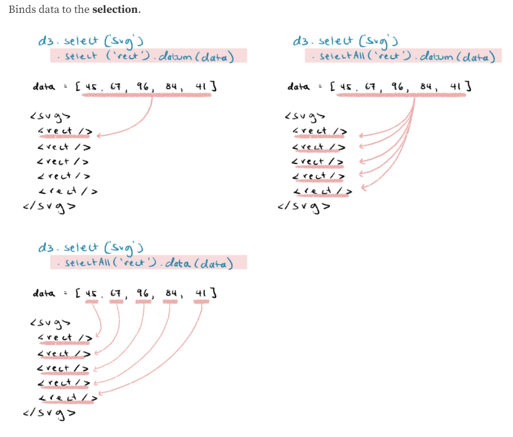
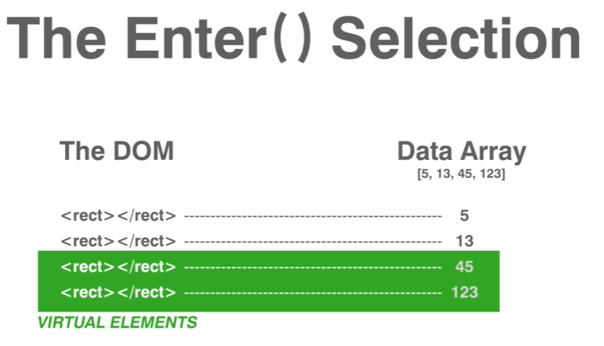

# 选择模块
Selection 通过选择元素（集合）并连接到数据来实现强大的数据驱动文档对象模型 DOM 的操作，除了提供选择元素（集合）的 API，还有修改 DOM 属性和样式的 API等。

## 选择元素
* `d3.select(selector)` 选中符合条件的第一个元素（如果有多个元素都符合条件则返回包含第一个 (文档顺序) 匹配的元素），选择条件为 `selector` 字符串，如果没有元素被选中则返回空选择集。

:bulb: `selector` 除是字符串（CSS 选择器）之外还可以是指定的结点，在已经对结点有引用的时候是很有用

```js
// 将点击的段落字体变成红色
d3.selectAll("p").on("click", function() {
  d3.select(this).style("color", "red");
});
```

* `d3.selectAll(selector)` 选择所有与指定的 `selector` 匹配的元素。被选中的元素顺序会按其在文档中的顺序排列（从上到下）组成集合，如果没有元素被选中，或者当 `selector` 为 `null` 或 `undefined`，则返回空选择集。

:bulb: `selector` 除字符串之外还可以是结点数组，如果已经对节点有引用时会很有用，如在事件回调内将 `this.childNodes` 传递给选择器，可以选中一组结点，:bulb: 结点可以是一个伪数组，如 `NodeList` 或 `arguments`

```js
// 将页面所有链接字体颜色改为红色
d3.selectAll(document.links).style("color", "red");
```

## 修改元素
* `selection.attr(name[, value])` 设置元素的属性 `name` 的值为 `value`。:bulb: 值 `value` 需要用引号包括（虽然数字可以不用引号也起效，但推荐所有属性值都以字符串形式传递给函数）。

如果指定了 `value` 则将选择集中的元素的属性 `name` 的值设置为 `value`，并返回当前选择集。如果 `value` 为常量则会将选择集中的每个元素的属性设置为该值；如果 `value` 为函数，则一般会传递参数，如数据 `d`，索引 `i` 或当前组 `nodes`（函数内部通过 `this` 指向当前 DOM 元素 `nodes[i]`），其中第一个参数一般是元素绑定的数据 `d`，函数的返回值将会被设置为对应属性的值，这样选择集中的每个元素的属性都不一样；如果传递 `null` 作为 `value` 则相当于移除这个属性。

如果没有指定 `value` 则返回当前选择集中第一个非空元素的对应的属性值，一般是已知选择集中只包含一个元素时，使用这个方法是很有用的。

* `selection.style(name[, value[, priority]])` 类似与 `attr` 方法，设置选择集中元素的样式值，可以传递常量或函数作为 `value`，还可以设置样式值的优先级 `priority`（可选），可以设置为 `null` 或 `important`（**没有感叹号**）。

如果没有指定  `value` 则返回当前选择集中第一个非空元素对应的样式。当前样式值为元素的内联样式值，否则会返回其 [computed value 计算值](https://developer.mozilla.org/en-US/docs/Web/CSS/computed_value)。当已知选择集中只包含一个元素时很有用。

:warning: 与大多数 SVG 属性不同，CSS 样式**通常具有关联的单位**，如 `3px` 才是有效的 stroke-width 边框宽度属性值，而 `3` 则不是。一些浏览器会隐式添加 `px` 单位，但是不是全部浏览器都会这样，比如 IE 会抛出 `"invalid arguments"`（无效参数）错误。

* `selection.append(type)` 如果指定的 `type` 为字符串则创建一个以此字符串为标签名的元素，并将其作为子元素追加到选择集的每个元素中；如果选择集为 [enter selection](https://d3js.org.cn/document/d3-selection/#selection_enter) 则将其作为同胞节点添加到选择集列表中，因此该方法常常通过链式的方式在 `enter()` 方法后调用，将新绑定的数据所创建的 DOM 元素添加到 enter 选择集中。可以传递常量或函数作为 `value`，函数应该返回一个元素用来被添加到 DOM 中（通常在函数内部创建一个新元素节点返回，但是也可能会返回一个已有的元素）。

:warning: 当绑定的数据发生顺序变化时仍然需要使用 `selection*.order`来同步更新元素的次序，如新元素与之前绑定的数据元素之间的次序发生变化。

## 绑定数据
将数据绑定到选择集里的元素，DOM 元素会添加一个名为 `__data__` 的属性，属性值就是绑定的数据。



* `selection.datum([value])` 获取或设置每个选中元素上绑定的数据，它与 `selection.data(data)` 不同，该方法不会将数组进行「拆解」，即这个方法不会进行数据链接计算并且不影响索引，不影响（不产生） `enter` 和 `exit` 选择集，而是将数据 `value` 作为一个**整体**绑定到选择的各个元素上，因此使用该方法选择的**所有 DOM 元素绑定的数据都一样**。

    这个方法在访问 HTML5 的 [custom data attributes](http://www.w3.org/TR/html5/dom.html#custom-data-attribute) 时很有用，可以通过将每个元素绑定的数据设置为其 dataset 属性

    ```html
    <ul id="list">
      <li data-username="shawnbot">Shawn Allen</li>
      <li data-username="mbostock">Mike Bostock</li>
    </ul>

    ```

    ```js
    selection.datum(function() { return this.dataset; })
    ```

* `selection.data([data[, key]])` 将指定数组的数据 `data` 的元素与已经选中的元素集一一对应，分别进行绑定，并返回一个 update 选择集，以及定义了 `.enter()` 和 `.exit()` 方法用来返回需要加入元素和移除元素的选择集。

    传递的参数 `data` 可以是任意数据类型的数组，也可以是一个返回数组的函数。

    :bulb: 当数据分配给元素时，会被存储在元素的 `__data__` 属性上，即数据就「粘」在元素上（与元素绑定），这样可以在重新选中元素时直接继续读取使用与元素对应的数据。

    ```js
    let dataArray = [4, 15, 34];

    rect.data(dataArray)
        .attr('width', 24)
        .attr('height', 100)
        .attr('x', function (d, i) {   // 回调函数中的参数 d 和 i 分别表示数据元素和索引值
            return I * 25
        })
        .attr('y', function (d, i) {
            return d * 10;
        })
    ```

    绑定时默认按照 join-by-index 索引顺序进行配对，但如果 `selection.data(data, key function)` 提供了 key 函数，则按照其返回值进行配对，key 函数返回值一般是字符串，如地名、id 等，作为数据点的唯一标识，与 DOM 集合中的元素进行（自动寻找 DOM 元素的属性值，相应的关键字）匹配，:bulb: 如果多个 DOM 元素都有相同的 key，则多出来未绑定数据的结点会进入 exit 选择集；如果多个数据有相同的 key，则对应多出来的占位结点会进入 enter 选择集。

    ```html
    <div id="Ford"></div>
    <div id="Jarrah"></div>
    <div id="Kwon"></div>
    <div id="Locke"></div>
    <div id="Reyes"></div>
    <div id="Shephard"></div>
    ```
    ```js
    var data = [
      {name: "Locke", number: 4},
      {name: "Reyes", number: 8},
      {name: "Ford", number: 15},
      {name: "Jarrah", number: 16},
      {name: "Shephard", number: 31},
      {name: "Kwon", number: 34}
    ];

    // key 函数返回 d.name 作为数据的标识，如果元素没有被绑定数据就返回元素的 id 属性
    d3.selectAll("div")
      .data(data, function(d) { return d ? d.name : this.id; })
      .text(function(d) { return d.number; });
    ```

    :bulb: 使用 key 函数/恒等函数为数据添加标识，不仅可以改变 DOM 结点和数据数组元素之间的配匹对应关系（使数据绑定更灵活），而且[在动画过渡和数据过滤、筛选等应用中](https://bost.ocks.org/mike/constancy/)，只更新 enter 和 exit 选择集的 DOM 元素，而 update 选择集所对应的页面上原有的 DOM 元素不会被重新渲染，可以极大提升性能。


* `selection.enter()` 返回 enter 选择集，包含的是与当前页面没有对应 `DOM` 节点的数据占位节点，链式调用 `append("nodeName")` 方法可以将占位结点添加到页面上。

    

    ```js
    // 假设 body 内没有 div，则会创建 6 个新的 div 元素并作为子元素依次添加到 body 元素内
    const div = d3.select("body")
      .selectAll("div")
      .data([4, 8, 15, 16, 23, 42])
      .enter().append("div")
        .text(d => d);   // 将 div 的内容设置为数据元素的值
    ```

    :bulb: 从概念上来讲 `enter` 选择集的占位符是一个指向父元素的指针（如上述例子中为 `body`）。`enter` 选择集通常仅仅用来添加元素，并且在添加完元素之后与 `update` 选择集**进行 [merged](https://d3js.org.cn/document/d3-selection/#selection_merge)**，这样的话数据的修改可以同时应用于 `enter` 的元素和 `update` 的元素（这是旧方法，请参照下面段落介绍的更简洁的新方法）。

* `selection.exit()` 返回 exit 选择集，包含的是没有对应数据的但页面中仍存在的 DOM 节点。

    exit 选择集用以记录与旧数据相关的「多余」DOM 元素，便于移除它们。

```js
// 基于以上 enter 示例，对 div 元素集进行新数据的绑定
// 由于使用了 key 函数，并以 d 作为 key
// 因此数据 [4, 8, 16] 与原有结点相匹配，作为 update 选择集不需要被重新渲染
div = div.data([1, 2, 4, 8, 16, 32], d => d);
// 通过 enter 选择集为 [1, 2, 32] 添加新的元素
div.enter().append("div").text(d => d);
// 移除与 [15, 23, 42] 绑定的元素
div.exit().remove();
```

:bulb: `enter` 选择集长度与数据长度一致，由于使用了 key 函数，中间会有 `empty` 表示不需要插入元素，可以减少 DOM 结点的渲染**同时能保证次序**。如果新元素的次序发生了改变则可以使用 [`selection.order`](https://d3js.org.cn/document/d3-selection/#selection_order) 来重新排列 `DOM` 元素的次序。参考 [General Update Pattern](http://bl.ocks.org/mbostock/3808218) 来查看数据绑定的例子。

:bulb: enter-update-exit pattern
参考：[6. Add filter by options](https://observablehq.com/@sxywu/6-add-filter-by-options)
当绑定的数据更新时，相应的 update、enter、exit 选择集发生变化，**更新 DOM 并返回新数据对应的 DOM 选择集**有两种方式：

* 旧方式
    * 移除 exit 选择集中对应的 DOM 元素 `rect.exit().remove()`
    * 添加 enter 选择集中对应的 DOM 元素 `const enter = rect.enter().append('tagName')`
    * 合并 enter 和 update 选择集（update 选择集就在原来的 `rect` 中），这样返回的 selection（DOM 元素）与新数据一一对应 `enter.merge(rect)`，可以方便地对新数据对应的 DOM 进行统一的样式设置

* 新方式

```js
d3.select(svg).selectAll('rect')
    .data(newData, d => d)   // 设置 key function，直接以 datum 值作为标识
    .join('rect')   // 将 enter 和 exit 进行添加和删除，然后返回 enter + update 选择集
    // 然后可以对新数据绑定的 DOM 元素进行整体样式设置
    .attr('width', rectWidth)
    ...
```

如果希望对 enter、update、exit 选择集的元素进行处理，可以在 `join` 回调函数中设置

```js
d3.select(svg).selectAll('rect')
  .data(newData, d => d)
  .join(
    enter => {
      // return so it can be joined with update selection
      return enter.append('rect')
        // set attributes etc. on only enter selection
    },
    update => update,
    exit => {
      // do something with exit selection
    }
  )
  // .join() returns enter+update selection
  // so can also chain attributes here
  ...
```

:bulb: 推荐更新绑定数据时使用 **key function**，这样可以减少不必要的 DOM 元素更新。
:bulb: enter-update-exit 模式可以**追踪**数据驱动的 DOM 变更过程，将其与 transition animation 结合就可以生成很棒的动效。

## 处理事件
为了实现交互功能，D3 选择集允许监听 listen 和分派 dispatch 事件。

* ` selection.on(typenames[, listener[, options]])` 为选择集的元素添加或移除事件监听器。

参数 `typenames` 是需要监听的事件类型，如 `click`、`mouseover`、`submit` 等，类型后面可以跟一个由  `.` 分割的可选的 `name`，可选的名称允许在同一个事件类型上注册多个回调，如 `click.foo` and `click.bar`，同时指定多个 `typenames` 可以使用空格隔开，如 `input change` 或 `click.foo click.bar`。

当指定的事件被分配到选择集中的某个元素时，则该 DOM 结点对应的 listener 会被调用，并可以依次传递 event 事件 `e`、datum 数据 `d` 到监听器的回调函数 listen 中，回调中的 `this` 指向当前 DOM 元素 `event.currentTarget`

:bulb: 虽然可以使用 `event.pageX` 和 `event.pageY` 来获取鼠标相关事件中鼠标的定位，但是一般使用 [d3.pointer](https://github.com/d3/d3-selection/blob/v2.0.0/README.md#pointer) 将事件位置转换为接收事件的元素的局部坐标系。

:bulb: 如果在一个已选中的元素上已经注册了相同 `typename` 的监听器, 则旧的会被移除而新的监听器会被添加。如果要移除一个事件监听器，可以将 `listener` 设置为 `null`；移除所有没有名称的监听器，则将 `typename` 设置为 `.`。