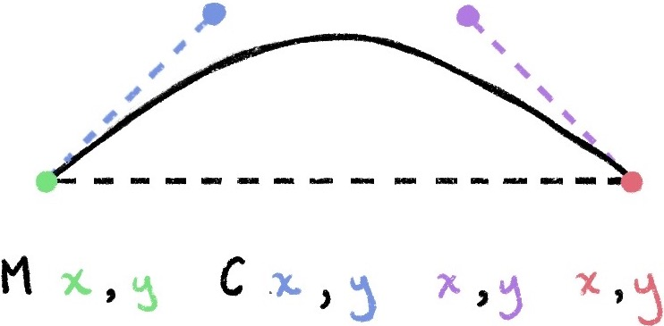

# SVG
参考：

* [SVG](https://developer.mozilla.org/zh-CN/docs/Web/SVG) | MDN
* [SVG元素参考](https://developer.mozilla.org/zh-CN/docs/Web/SVG/Element) | MDN
* [SVG 接口](https://developer.mozilla.org/zh-CN/docs/Web/API/Document_Object_Model#SVG_接口) | MDN
* [SVG Animations with GreenSock](https://designcode.io/svg-intro)
* [Draw a flower petal on the screen](https://observablehq.com/@sxywu/1-draw-a-flower-petal-on-the-screen)


**可缩放矢量图形 Scalable Vector Graphics，SVG** 是一个由万维网联盟 W3C 自 1999 年开始开发的基于文本的开放标准，是一种基于 XML 的标记语言，用于描述二维的矢量图形，它能够优雅而简洁地渲染不同大小的图形，并和 CSS、DOM、JavaScript 等其他网络标准无缝衔接。

所有的现代浏览器都支持SVG，在某些情况下甚至几个版本都支持SVG。[Can I use](https://caniuse.com/#feat=svg) 上有一份比较详细的支持SVG的浏览器列表

很多图形处理软件提供可视化交互界面操作 `.svg` 格式的文件，如 [Inkscape](http://www.inkscape.org/) 和 [Adobe Illustrator](https://www.adobe.com/cn/products/illustrator.html)。一个简单的 SVG 文档由 `<svg>` 根元素和**基本的形状元素**构成，在前端开发中一些简单的图形也可以手动编写 `<svg>` 标记来实现。

```html
<svg width="300" height="200" xmlns="http://www.w3.org/2000/svg">
  <!-- more tags here -->
</svg>
```

:bulb: SVG 基于 XML 的标记语言，因此区分大小写，而且 SVG 里的属性值必须用引号引起来，就算是数值也必须这样做

:bulb: 每一个 SVG 元素都应该声明[命名空间 `xmlns`](https://developer.mozilla.org/zh-CN/docs/Web/SVG/Namespaces_Crash_Course)，以解决不同 XML 方言（SVG 是 XML 一种「方言」）混合使用产生的问题。以上示例 `xmlns` 属性意味着这个 `<svg>` 标签和它的子节点都属于 `http://www.w3.org/2000/svg` 这个 SVG 命名空间。命名空间仅仅只是一些字符串，因为 URIs 的唯一性从而被广泛使用，但它的本意并不是要「链接」到某个地址。

## 坐标定位

SVG 绘制图形时需要使用坐标系统/网格系统，以页面的**左上角为 `(0,0)` 坐标点**，坐标以像素为单位，**x 轴正方向是向右**，**y 轴正方向是向下**。


## viewport 和 viewBox
* viewport 视口是一个表示当前可见的计算机图形区域的概念。在 Web 浏览器术语中通常与**浏览器窗口相同**，但不包括浏览器的 UI（如菜单栏等），视口外的内容在被滚动进来前都是不可见的。

* viewBox 是 `<svg>` 标签的一个属性，包含**四个参数（以空格或逗号分隔） `<svg viewBox="min-x min-y width height">` 指定一个容器（宽和高）以显示图形元素**

  * 其中 `min-x` 和 `min-y` 指定了容器的左上角的坐标，即定义了父元素的坐标系统
  * `width` 和 `height` 指定容器的宽和高

  在 `<svg>` 标签内的元素的坐标和宽度如果使用数值（而不带单位）时，就会以 `viewBox` 属性设定的值作为相对定位和相对单位。

  设定不同的`viewBox` 属性值可以实现类似于缩放或平移的效果。修改容器的 `min-x` 和 `min-y` 可以实现整体「移动」容器内元素的效果；修改容器 `width` 和 `height` 可以实现整体「缩放」容器内元素的效果。

```html
<svg viewBox="0 0 30 30" xmlns="http://www.w3.org/2000/svg">
  <!-- 较大的 viewBox，这样半径长度 4 是以 30 为基准进行解析，图像就显得小 -->
  <circle cx="50%" cy="50%" r="4" fill="orange"/>
</svg>

<svg viewBox="0 0 10 10" xmlns="http://www.w3.org/2000/svg">
    <!-- 较小的 viewBox，这样半径长度 4 是以 10 为基准进行解析，图像就显得大 -->
  <circle cx="50%" cy="50%" r="4" fill="orange"/>
</svg>
```

## 基本形状

SVG 与 HTML 类似，一个简单的 SVG 文档由 `<svg>` 根元素和**基本的形状元素**构成，如用于定义圆形的 `<circle>` 元素、用于定义矩形的 `<rect>` 元素、用于定义简单或复杂曲线的 `<path>` 元素。

常用的 SVG 元素：

|       tag       |       attributes       | optional attributes                 |
| :--------------: | :------------------------: | :------------------------------------------: |
|  `<rect>`   | `width`, `height` | `x`, `y`                                |
| `<circle>` |           `r`            | `cx`, `cy`                             |
|  `<path>`   |           `d`            |                                             |
|  `<text>`   |                            | 	`x`, `y`, `text-anchor`, `dy` |

:bulb: SVG 文件全局有效的规则是「后来居上」，越后面的元素越可见。

:bulb: SVG 元素中的 `<g>` 标签用以组合多个元素，类似于 `<div>` 功能。

### 矩形和圆角矩形

```html
<svg width="200" height="250" version="1.1" xmlns="http://www.w3.org/2000/svg">
  <!-- 矩形 -->
  <rect x="10" y="10" width="30" height="30" stroke="black" fill="transparent" stroke-width="5"/>
  <!-- 圆角矩形 -->
  <rect x="60" y="10" rx="10" ry="10" width="30" height="30" stroke="black" fill="transparent" stroke-width="5"/>
</svg>
```

使用元素 `<rect/>` 绘制一个矩形，可以通过 6 个基本属性控制其位置和形状：

* `x` 矩形左上角在画布中的 x 位置
* `y` 矩形左上角在画布中的 y 位置
* `width` 矩形的宽度
* `height` 矩形的高度
* `rx` 矩形的圆角 x 方向的半径，默认为 `0`
* `ry` 矩形的圆角 y 方向的半径，默认为 `0`

### 圆形和椭圆

```html
<svg width="200" height="250" version="1.1" xmlns="http://www.w3.org/2000/svg">
  <!-- 圆形 -->
  <circle cx="25" cy="25" r="20" stroke="red" fill="transparent" stroke-width="5"/>
  <!-- 椭圆形 -->
  <ellipse cx="75" cy="25" rx="20" ry="5" stroke="red" fill="transparent" stroke-width="5"/>
</svg>
```

使用元素 `<circle/>` 绘制一个圆形。通过 3 个属性来设置圆形：

* `r` 圆形的半径
* `cx` 圆心在画布中的 x 位置
* `cy` 圆心在画布中的 y 位置

使用元素 `<ellipse/>` 绘制一个椭圆，它是圆形更通用的形式，与圆形元素相比增加了 `rx` 和 `ry` 属性，以设置椭圆的 x 半径 和 y 半径（即长轴半径和短轴半径）：

* `cx` 椭圆心在画布中的 x 位置
* `cy` 椭圆心在画布中的 y 位置
* `rx` 椭圆的 x 半径
* `ry` 椭圆的 y 半径

### 线条和折线

```html
<svg width="200" height="250" version="1.1" xmlns="http://www.w3.org/2000/svg">
  <!-- 直线 -->
  <line x1="10" x2="90" y1="10" y2="45" stroke="orange" fill="transparent" stroke-width="5"/>
  <!-- 折线 -->
  <polyline points="10,25 20,25 30,55 50,45 60, 65 70,75 80,65 90,80"
      stroke="orange" fill="transparent" stroke-width="5"/>
</svg>
```

使用元素 `<line/>` 绘制一条直线。通过指定起点和终点的位置即可：

* `x1` 起点的 x 位置
* `y1` 起点的 y 位置
* `x2` 终点的 x 位置
* `y2` 终点的 y 位置

使用元素 `<polyline/>` 绘制折线。由于折线是通过许多点构成的，因此需要设置多对点及数列：

* `points` 设置点集数列。每对点必须包含 2 个数字，分别表示 x 坐标和 y 坐标，数字间用空格分隔；每对点用逗号隔开。

### 多边形

```html
<svg width="200" height="250" version="1.1" xmlns="http://www.w3.org/2000/svg">
  <!-- 多边形 -->
  <polygon points="50,10 55,30 70,30 60,40 65,55 50,45 35,55 40,40 30,30 45,30"
      stroke="green" fill="transparent" stroke-width="5"/>
  <!-- 路径 -->
  <path d="M80,50 Q90,70 50,80 T90,30" fill="none" stroke="blue" stroke-width="5"/>
</svg>
```

使用元素 `<polygon/>` 绘制多边形。多边形可以当作由多条折线构成的闭合图形，也是由点集数列组成：

* `points`：设置点集数列。其中路径在最后一个点会自动绘制一条直线回到第一个点。

## 路径

[元素 `<path>` 绘制线条、曲线、弧形等图形](https://developer.mozilla.org/zh-CN/docs/Web/SVG/Tutorial/Paths)，是SVG基本形状中最强大的一个，可以通过脚本生成 path 而绘制出复杂的图形。

其关键参数是 `d`：设置一个「命令+参数」的集合描述/定义 *define* 如何绘制路径。其中每一个命令都用一个关键字母表示，如 `M` 命令取自 Move to 表示将点移动到相应的坐标，字母后面是一对点数据 `x, y`，表示 x 和 y 轴坐标参数。

* `M x,y`  M stand for **Move To**, pick the pen off the paper, put it back down at (x,y)
* `L x,y` L stand for **Line To**, draw a line from the previous point to the target point (x, y)


* `C x,y x,y x,y` C stand for Curve To  (using Cubic Bézier Curve)



:bulb: 每一个命令都有两种表示方式，一种是用**大写字母**，表示采用绝对定位；另一种是用**小写字母**，表示采用相对定位，如从上一个点开始，向上移动 `10px`，向左移动 `7px`。

### 直线
* `M` 命令 `M x,y` 取自 Move to 表示移动画笔，它需要两个参数指定移动的目标坐标，但并不会在当前点与目标点之间画线。类似地 `m dx dy` 表示在相对坐标下的移动。
* `L` 命令 `L x,y` 取自 Line to 表示在当前位置和目标位置之间画一条线段，它需要两个参数指定目标坐标。类似地 `l dx dy` 表示在相对坐标下的移动。
* `H` 命令 `H x` 取自 Horizontal 表示绘制一条水平线至水平位置 x。类似地 `h dx` 表示在相对坐标下的移动
* `V` 命令 `V y` 取自 Vertical 表示绘制一条垂直线至垂直位置 y。类似地 `v dy` 表示在相对坐标下的移动

```html
<svg width="100px" height="100px" version="1.1" xmlns="http://www.w3.org/2000/svg">
  <!-- 画笔起点在 (10, 10) 处，然后绘制一个矩形 -->
  <path d="M10,10 H 90 V 90 H 10 L10,10"/>
</svg>
```

:bulb: 我们可以通过命令 `Z` 或 `z`（该命令不区分大小写） 来简化 `<path>` 命令，**该命令会从当前点画一条直线到路径的起点**，实现闭合路径的作用。尽管我们不总是需要闭合路径，但是它还是经常被放到路径的最后。

```html
<svg width="100px" height="100px" version="1.1" xmlns="http://www.w3.org/2000/svg">
  <!-- 最后使用 Z 闭合命令简化 path 元素 -->
   <path d="M10,10 H 90 V 90 H 10 Z" fill="transparent" stroke="black"/>
</svg>
```

:bulb: 也可以使用相对坐标的形式，其中参数不是明确的的坐标而是相对于前一个点需要移动的距离。

```html
<svg width="100px" height="100px" version="1.1" xmlns="http://www.w3.org/2000/svg">
  <!-- 使用相对坐标绘制一个 80 * 80 的正方形 -->
  <!-- 画笔移动到(10,10)点，由此开始，向右移动80像素构成一条水平线，然后向下移动80像素，然后向左移动80像素，然后再回到起点。 -->
    <path d="M10,10 h 80 v 80 h -80 Z" fill="transparent" stroke="black"/>
</svg>
```

### 曲线
绘制平滑曲线的命令有三个，其中两个用来绘制贝塞尔曲线，另外一个用来绘制弧形或者说是圆的一部分。

#### 贝塞尔曲线
贝塞尔曲线 Bézier curve 有三种，线性贝塞尔曲线 Linear Bézier curves、二次贝塞尔曲线 Quadratic Bézier curve、三次贝塞尔曲线 Cubic Bézier curve，第一种只是生成直线，第二、第三种才能生成曲线。

* 三次贝塞尔曲线 Cubic Bézier curve：使用 `C` 命令 ` C x1,y1 x2,y2 x,y` 绘制，其中三组坐标参数中前两者表示控制点（`(x1,y1)` 是起点的控制点，`(x2,y2)` 是终点的控制点），最后一个坐标 `(x,y)` 表示的是曲线的终点。类似地可以使用 `c dx1,dy1 dx2,dy2 dx,dy` 在相对坐标下的移动。

```html
<svg width="60px" height="30px" version="1.1" xmlns="http://www.w3.org/2000/svg">
  <path d="M10,10 C20,20 40,20 50,10" stroke="black" fill="transparent"/>
</svg>
```

:bulb: 可以使用简写 `S` 命令创建与前面相同的贝塞尔曲线 ` S x2,y2 x,y`

```html
<svg width="190px" height="160px" version="1.1" xmlns="http://www.w3.org/2000/svg">
  <path d="M10,80 C40,10 65,10 95,80 S150,150 180,80" stroke="black" fill="transparent"/>
</svg>
```

* 二次贝塞尔曲线 Quadratic Bézier curve：使用 `Q` 命令 `Q x1,y1 x,y` 绘制。它只有两组参数点，因为只需要一个控制点，用来确定起点和终点的曲线斜率。

```html
<svg width="190px" height="160px" version="1.1" xmlns="http://www.w3.org/2000/svg">
  <path d="M10,80 Q95,10 180,80" stroke="black" fill="transparent"/>
</svg>
```

:bulb: 类似地，简写 `T` 命令会通过前一个控制点，推断出一个新的控制点 `T x, y`。

```html
<svg width="190px" height="160px" version="1.1" xmlns="http://www.w3.org/2000/svg">
  <path d="M10,80 Q52.5,10 95,80 T180,80" stroke="black" fill="transparent"/>
</svg>
```

#### 弧形
弧形 Arc curve：使用 `A` 命令绘制弧形。基本上，弧形可以视为圆形或椭圆形的一部分。

## 文本

```html
<svg xmlns="http://www.w3.org/2000/svg"
     width="500px" height="100px" viewBox="0 0 200 150">
  <text x="50" y="50" font-size="55">Hello, out there</text>
</svg>
```


使用元素 `<text>` 定义了一个由文字组成的矢量图形，可以将渐变、图案、剪切路径、遮罩或者滤镜应用到文字图形上，可以通过不同属性设置文本的定位、大小、对其方式等。

* `x` 文字在画布中的 x 位置
* `y` 文字在画布中的 y 位置

* `text-anchor` 文本与所给点的对齐方式:
  * 开头 `start`：文本字符串的开始位置对齐给定的点
  * 中间 `middle`：文本字符串的中间位置对齐给定的点
  * 末尾对齐 `end`：文本字符串的末尾对齐给定的点

## 工具

* SVG 文件编辑器： [Inkscape](http://www.inkscape.org/)、[Adobe Illustrator](https://www.adobe.com/cn/products/illustrator.html)、[Affinity Designer](https://affinity.serif.com/en-gb/designer/)、[Figma](https://www.figma.com/)
  * 一般使用钢笔工具绘制矢量图
  * 应该将图层进行合理的**分组和命名**，这样不过导出的 `.svg` 文件中会带有 `<g>` 标签和相应的 `id` 属性（导出文件时如果提供了保留信息，需要勾选保留 `id` 信息） ，便于后续进行动画制作。

* SVG 优化工具：
  * [SVGOMG](https://jakearchibald.github.io/svgomg/) 一个优化 SVG 文件的在线 GUI，可以选择保留 `<svg>` 标签中哪些信息。推荐设置：
    * Prittify markup 使得代码更便于阅读
    * Remove xmlns 取消勾选，以保留 `<svg>` 元素的命名空间
    * Clean IDs 取消勾选，以保留元素的预设 `id`
    * Remove viewBox 取消勾选，以保留 viewBox 在设定区域中制作动画
  * [SVGO](https://github.com/svg/svgo) 一个 node.js 包，提供 CLI 命令行优化 SVG 文件。

:bulb: 使用软件和工具处理 SVG 文档时，应该对不同的路径/图层进行分组并设置适当的名称，导出生成的 `<svg>` 元素内才会有对应的分组和 `id` 属性，便于使用 GreenSock 处理生成动画。

## 资源

有许多网站提供矢量插画，可以下载 SVG 文档

* [Dribbble](https://dribbble.com/) 大量的插画作品可供参考
* [Undraw](https://undraw.co/) 免费
* [Shape](https://shape.so/) 收费