# 关系网络数据可视化
关系型数据可以分为两种结构：

* 层次结构：树形数据的层次关系。
* 网络结构：更加自由和复杂的关系。

关系型数据可视化基本元素：**点** `node` 和**连线** `edge`。点表示元素个体，连线表示关系。点的「中心性」可以用「度」来衡量；一般表示连线的数量多少连线可以是**有向**或是**无向**；连线可以添加权重表示关系强弱。

## 工具
* Gephi

## Gephi
[Gephi](https://gephi.org/) 是一款开源跨平台的（基于 JVM）复杂网络数据分析软件，可用于各种网络数据分析，实现动态和分层图的交互可视化和探索。

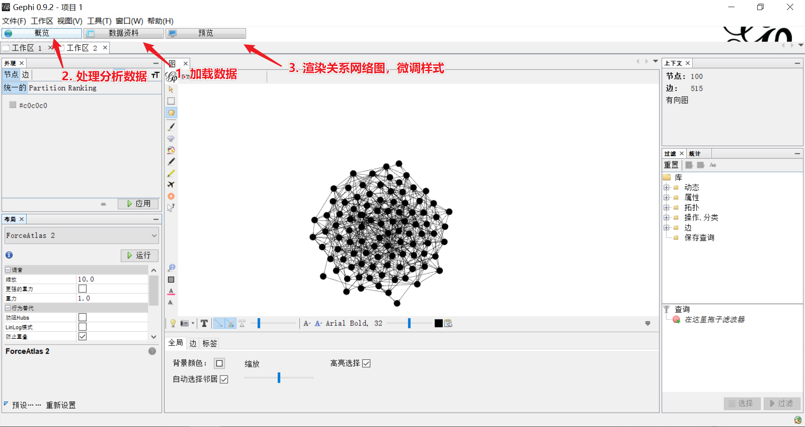

### 加载数据
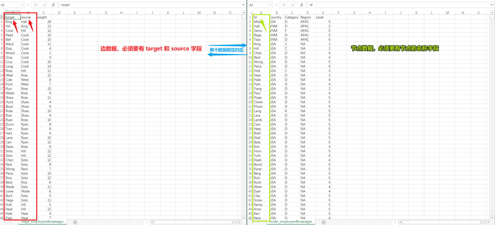

:warning: 节点数据必须有一列作为节点的名称（:bulb: 也可以只加载边数据，软件自动根据边数据生成节点）。边数据必须有 `target` 和  `source` 字段名表示连线关系，否则 Gephi 无法识别。

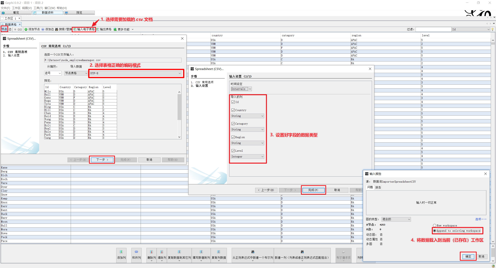

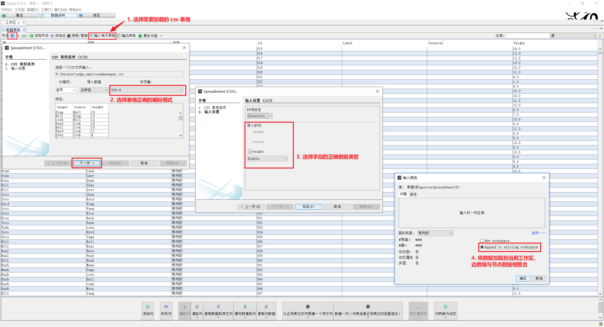
### 布局
多种方法实现网络数据点布局：

* 力导向布局
    * 模拟引力和弹力的算法应用，可用于模拟分级、分团
    * （数据相同都可以产生类似的结构关系）但是**每次的布局结果可能不一致**，与设置和点的分布有关
    * 如果有了合适的布局得记录下来

* 空间导向布局
    * 基于空间（经纬度）进行数据布局
    * 通常是有向的联系

* 规则导向布局，如弦图、树图
    * 一般分为水平、垂直、放射状排布
    * 有明显的层级关系

在 Gephi 中力导向布局主要使用 `ForceAstlas 2` 模拟数据点在物理世界中的引力和斥力

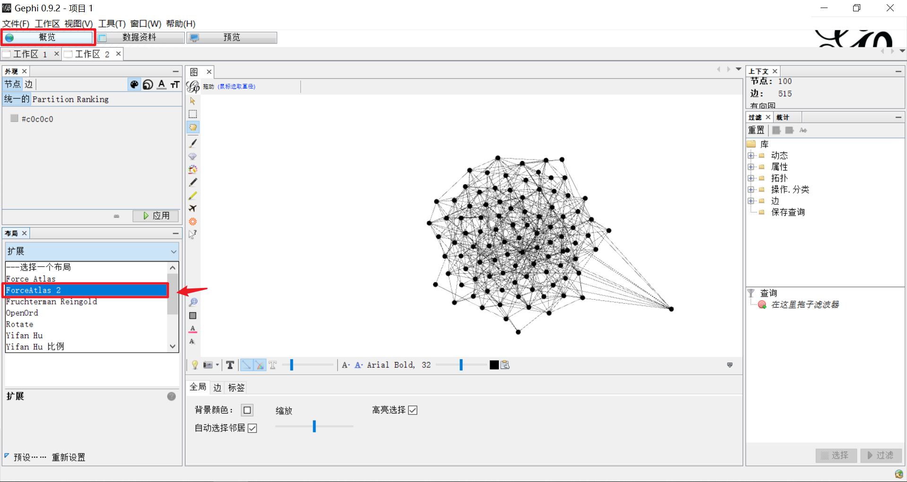

:bulb: 而 Gephi 中的**辅助性布局**一般有交叠、rotate、扩展、收缩、标签调整、随机布局

### 数据清洗
使用 Gephi 的过滤工具和统计方法对数据进行过滤。

#### 使用拓扑结构
基于网络的拓扑结构对书进行筛选，使用 Gephi 的**巨人组件**和 **K 核心**对数据进行过滤。

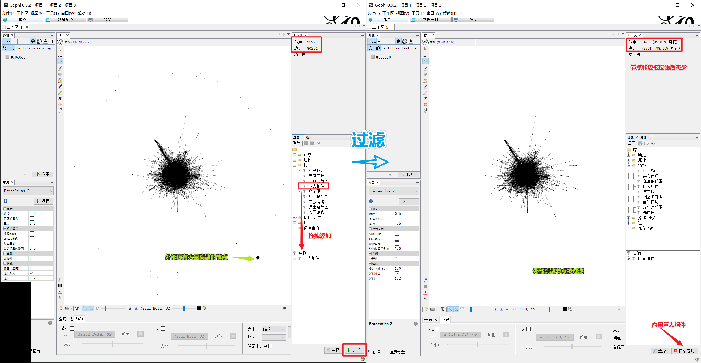

:bulb: 巨人组件：巨人组件会保留有最多节点的连通组团。如果有两个数量一样的组团，则会优先保留内部 id。巨人组件反映的是**去除边缘连接的结果**。

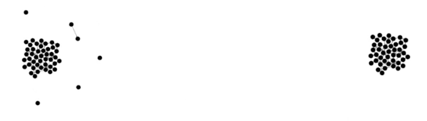

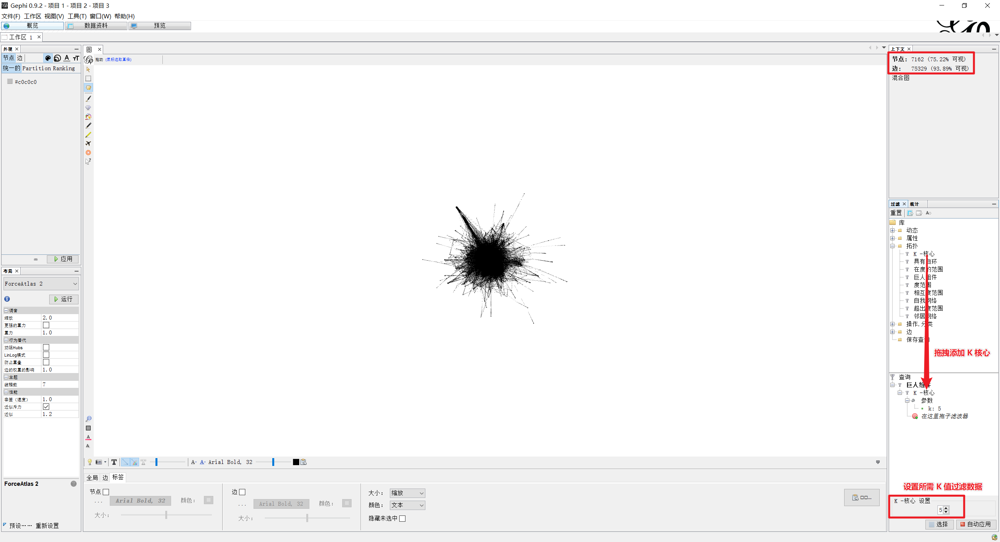

:bulb: K 核心：由多个节点组成的一组（或多组）节点群。其中相互之间的连接度一致的度数称为核心度，其中 K 值就是指这个节点群中**每个节点的度都不小于 K 值**。K 核心表现的是**相互之间的核心联系度**，体现的是一群数据点中联系最强的核心群体。

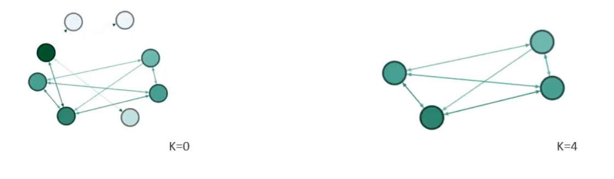

#### 度范围
基于度（节点连入和连出的和）范围对节点数据进行过滤。

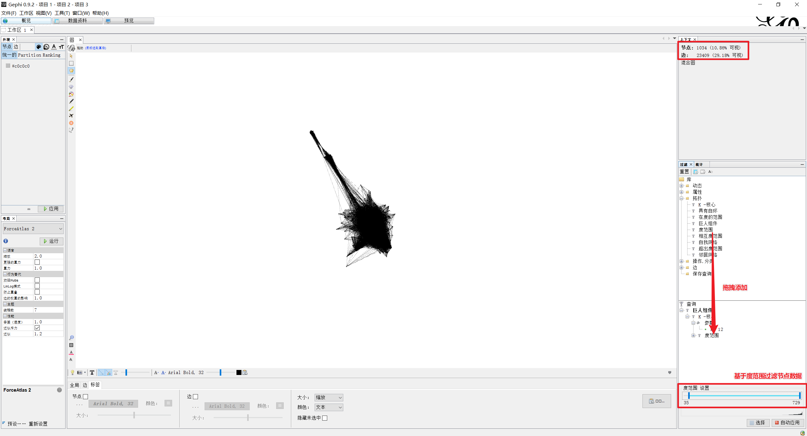

### 聚类
#### 模块化
设置解析度调整聚类结果，解析度越小，社区乐队，一般需要 4-10 个社区。

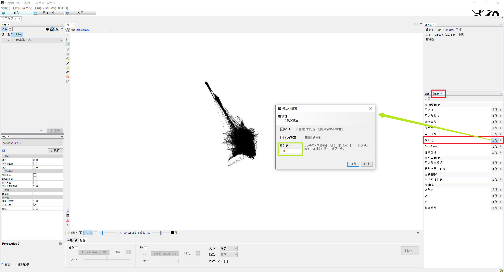

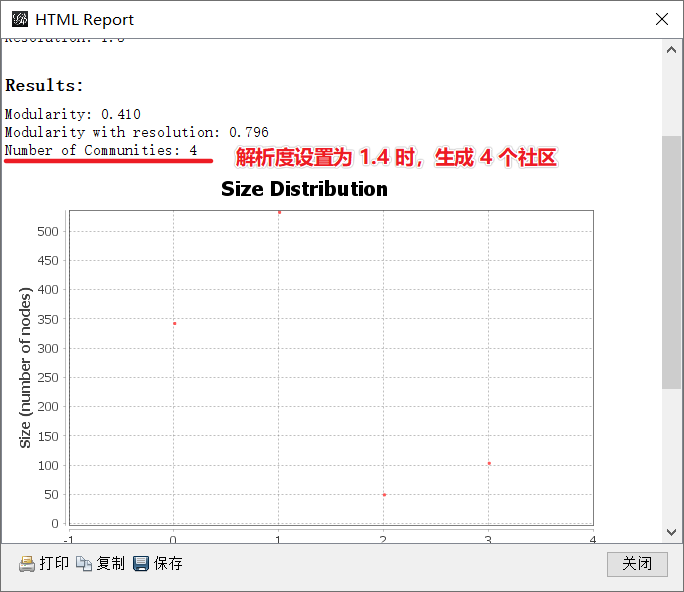

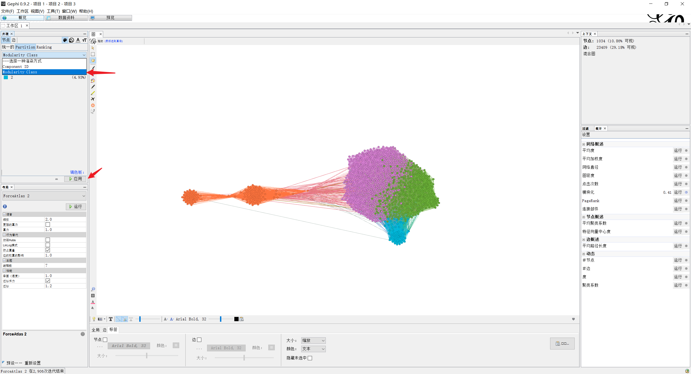

:bulb: 模块化：一种间网络关系分成多个社区的聚类算法，来自康奈尔大学的[研究](http://wiki.swarma.net/index.php/网络社区划分算法)。

### 常用样式设置
* 开启防止重叠
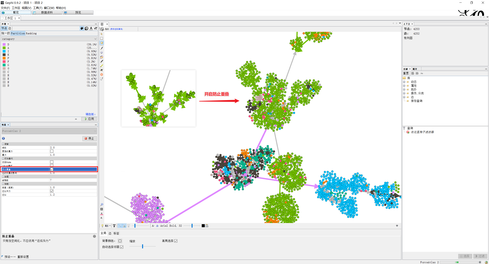

* 节点样式设置
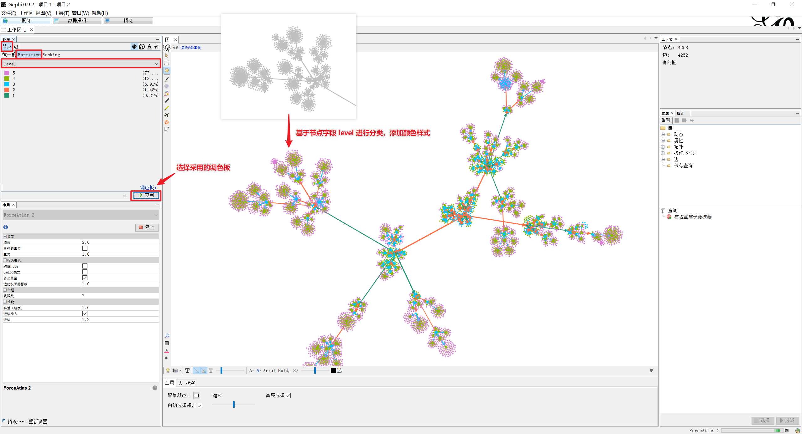

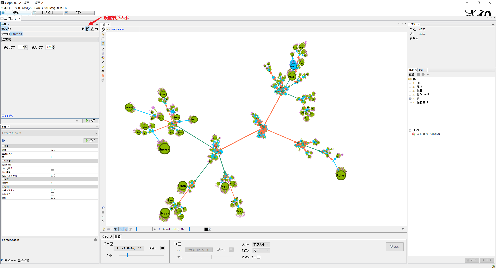

* 标签设置
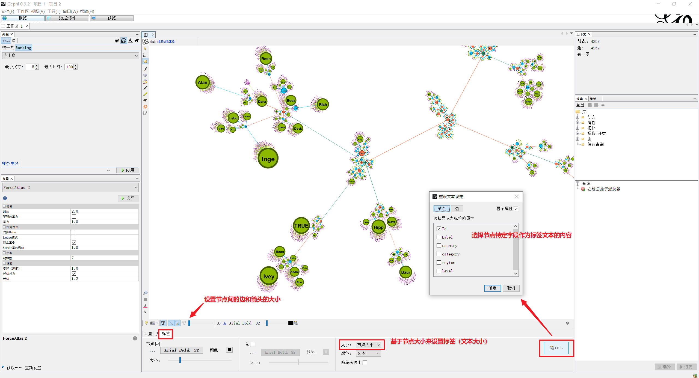

