# 空间数据可视化
空间数据是指用来表示空间实体的**位置、几何特征、属性特征**的数据。

* 位置：经纬度、地址、相对位置
* 几何特征：点、线、面
* 属性特征：面积、周长、人口、经济等属性

## 坐标系
地理空间数据所在的坐标系分为地理坐标系、投影坐标系：

* 地理坐标系：球面坐标。参考平面地是椭球面，坐标单位是经纬度。**WGS1984 基准面**采用 WGS84 椭球体，它是一地心坐标系，即以地心作为椭球体中心，目前 GPS 测量数据多以 WGS1984 为基准。
    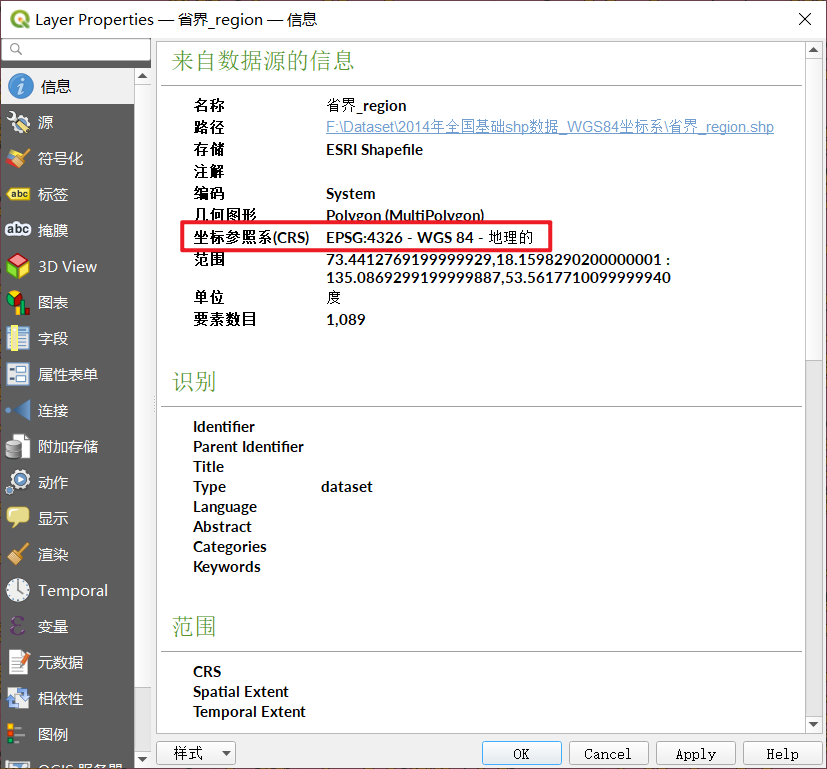

:warning: 地理坐标纠偏：把火星坐标系、百度坐标系转换为 WGS1984 坐标系的过程，这些坐标都是基于国家安全等因素的考虑，相关部门对 WGS1984 进行偏移、加密产生的，在使用时需要区分具体坐标系下的数据。

* 投影坐标系：平面坐标。参考平面地是水平面，坐标单位是米、千米等。我国除了 1：100万 地图以外均采用高斯-克吕格 Gauss-Kruger 投影为地理基础。WGS84 坐标一般采用 UTM 投影，以 6° 分带，我国横跨 11 个 UTM 投影带，处于 43~53 带号。

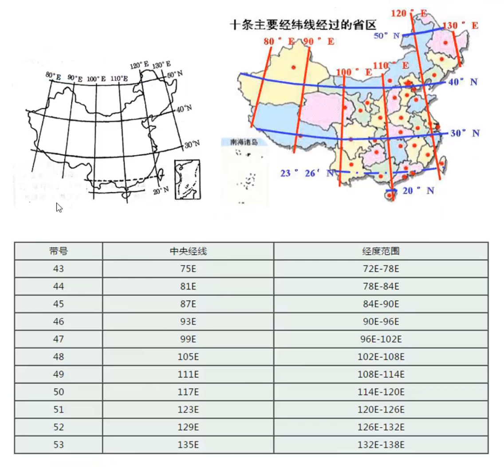

## 数据
矢量数据 VectorData 是在直角坐标轴中，用 X、Y 坐标表示地图图形或地理实体的位置的数据，矢量数据一般通过记录坐标方式来尽可能地将地理实体的空间位置表现得准确无误。在空间中不同的对象可以用不同的矢量数据（集合）来表示：

* 点实体：在二维空间中，用一对坐标 `(x,y)` 来确定位置
* 线实体：用（折点）坐标串的集合 `(x1, y1)`、`(x2, y2)`......`(xn, yn)` 以及 长度 等信息来记录
* 面实体：通常记录面状物的边界来表示，也称为多边形数据，也是通过坐标串来表示，还有 面积 和 周长 的数据

矢量数据类型有多种，如 AutoCAD、ESRI shape（即 Shapefile）、KML 等。

:bulb: Shapefile 数据是一种用于存储地理要素的几何位置和属性信息的非拓扑简单格式，其中地理要素可以通过点、线或面（区域）来表示。它在本地存储时不会显示为单个 `.shp` 文件的形式，而是有多个（一般由 5 种）子数据类型组成，如 `.dbf` 后缀文件是 dBASE 属性表，用于存储可连接到 shapefile 的要素的附加属性，

当我们使用 gis 类工具加载这些数据时，软件会自动识别并整合生成只显示为单个 `.shp` 文件；而通用型数据处理软件，如 Excel power map、Tableau、Python（某些地理类库）也可以对这类文件进行读取。Shpfile 数据中的 `.dbf` 数据可拖入 Excel（这是整个地理数据中的属性表）可看到属性标数据。

### 点数据
POI，Point of Information 信息点是点数据，在 QGIS 中每个 POI 主要包含四方面信息：名称、类别、**经度**、**维度**。

### 面数据
类似于点数据，通过 Shapefile 形式直接加载到 QGIS 软件中，但是无法通过分隔文本文件存储和加载数据。

## 常用软件
* ArcGIS
* QGIS
* MapGIS
* Python
* R

## QGIS
QGIS，Quantum GIS 是开源的跨平台桌面地理信息系统软件，支持多种数据格式，可通过插件扩展功能，支持从 OSM 地图、谷歌地图等途径下载数据，支持 Python 语言。

### 加载数据
可以使用多种方式加载点数据：

* 方法一：直接加载 Shapefile 数据（矢量文件）。

    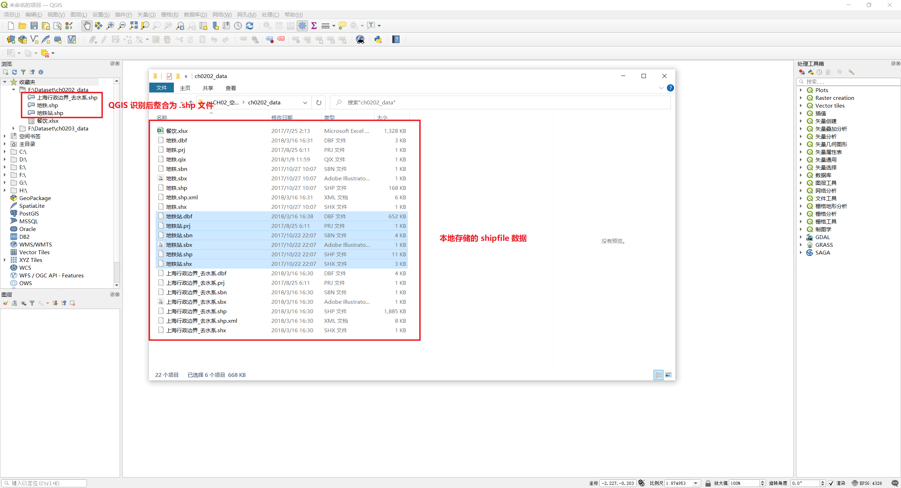

* 方法二：点数据还可以存储在分隔文本文件（如 `.csv`）中，在 QGIS（菜单栏）`图层` -> `添加图层` -> `添加文本数据图层`

    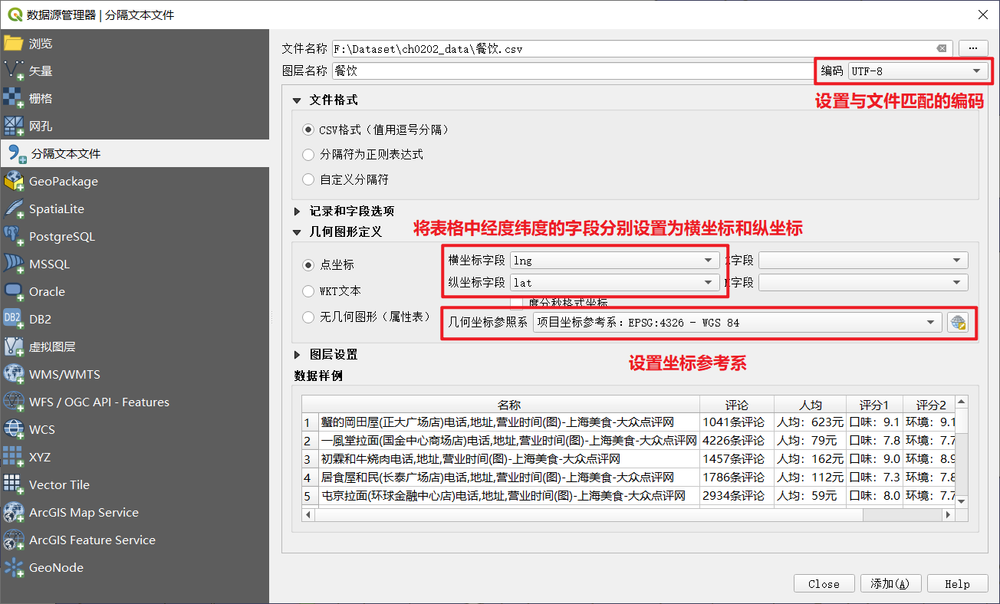

:bulb: 对于导入到 QGIS 的数据，可以在图层面板中选中数据源 -> 鼠标右键单击后选择 `打开属性表`  -> 以表格形式查看数据源

### 投影
由于地理坐标为球面坐标，不方便进行距离、方位、面积等参数的测量计算，需要将地理坐标转换为投影坐标，该转换过程称为**投影**，即将不规则的地球曲面上的点通过建立点与点之间的函数关系映射到平面上的方法。

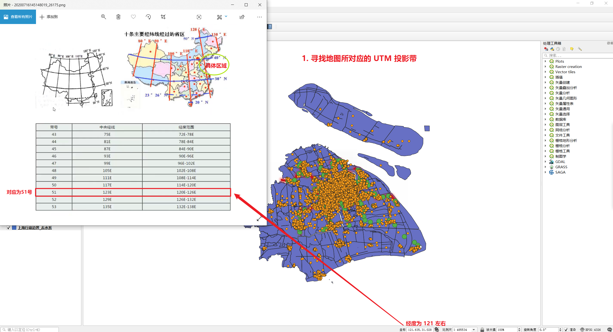

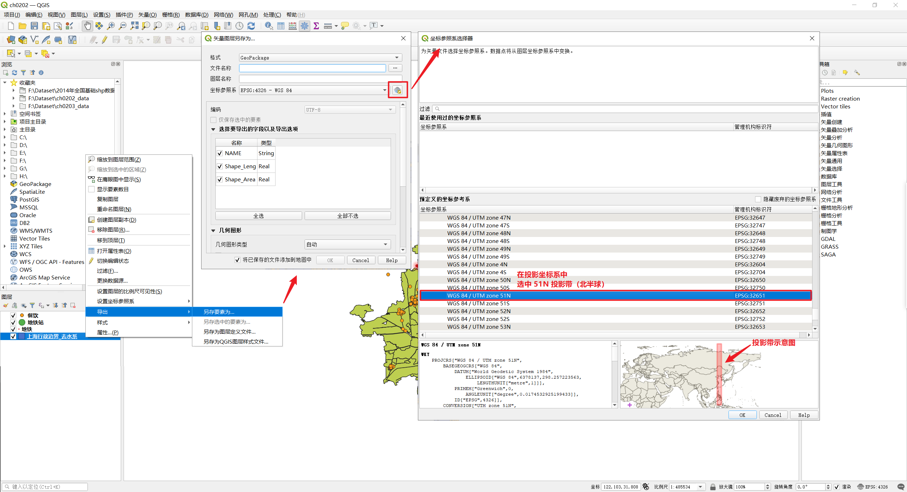

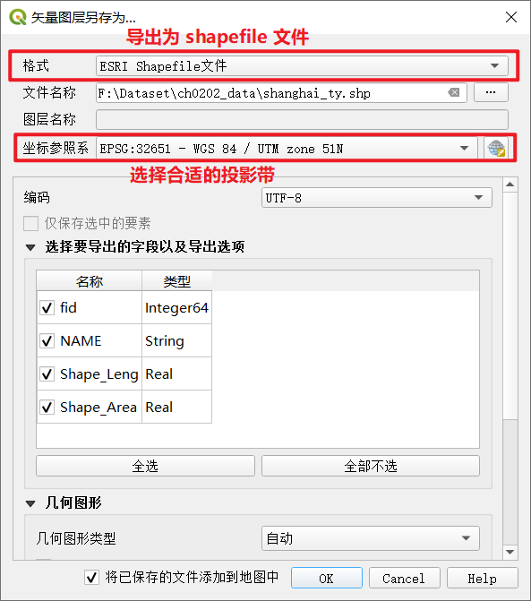

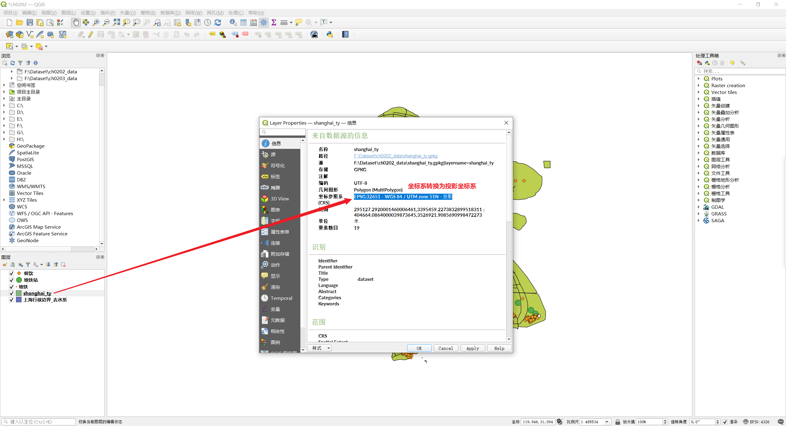

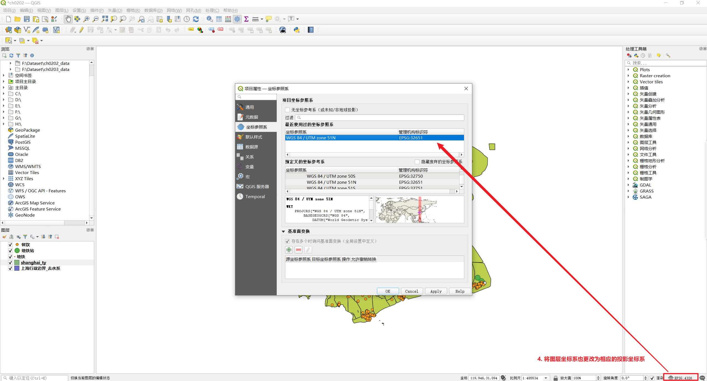

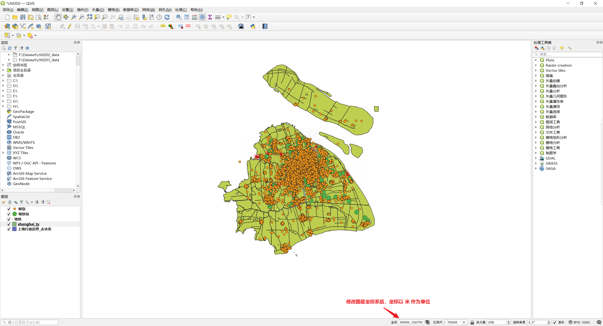

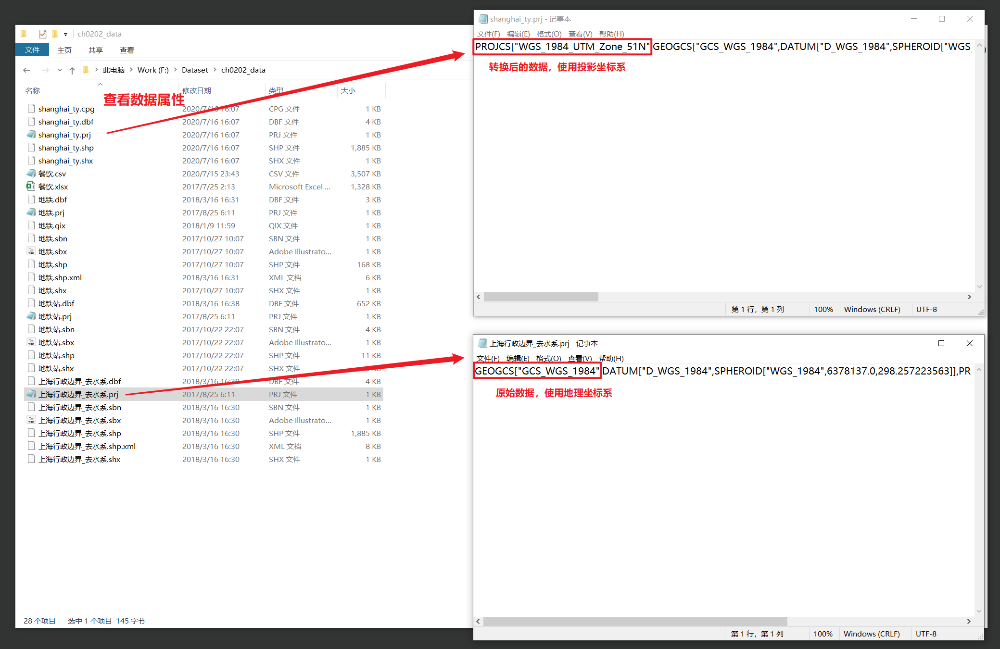

### 选择数据
使用选择工具来选择数据点，可以直接在数据源图层选择，也可以基于其他图层对数据源进行选择。

:bulb: 开启选择工具（菜单栏）`视图` -> `工具栏` -> `Selection Toolbar`

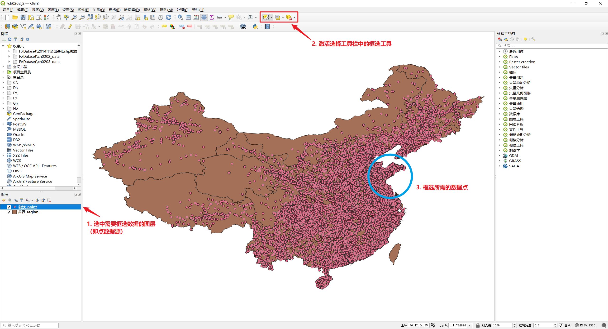

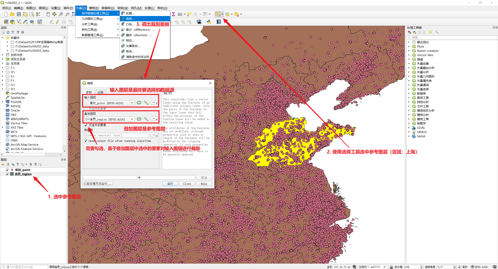

### 创建点数据
通过（菜单栏）`图层` -> `创建图层` -> `新建临时草稿图层` 来创建图层以容纳我们新建的点数据

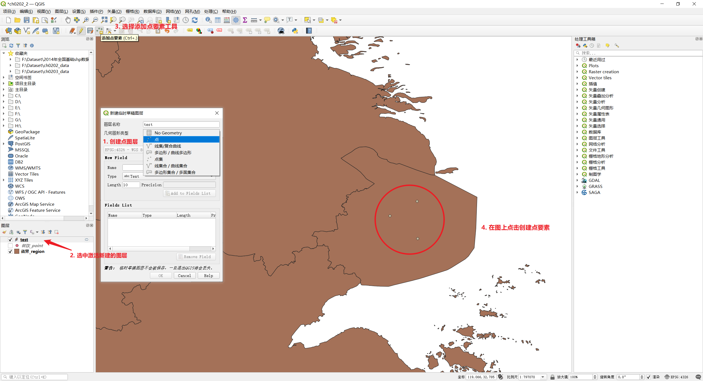

### 添加字段
在 GIS 系统中最主要的信息是经纬度，如果希望将这些数据导出可以为图层添加相应的字段

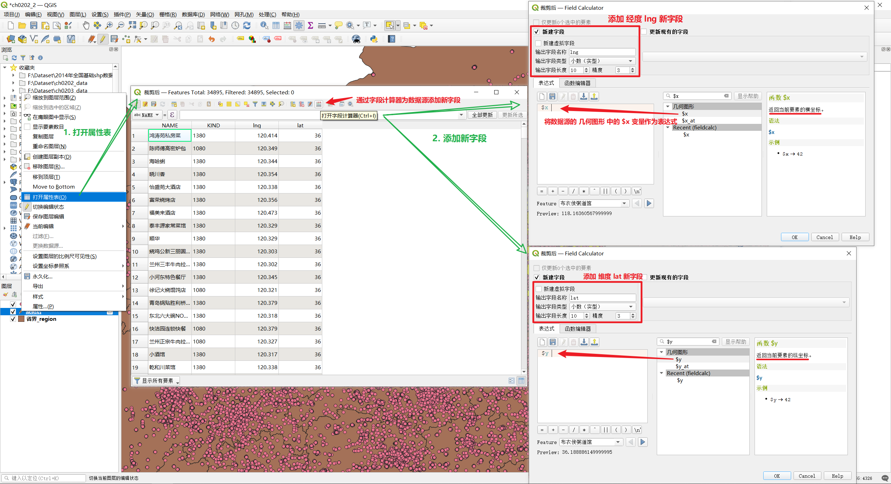

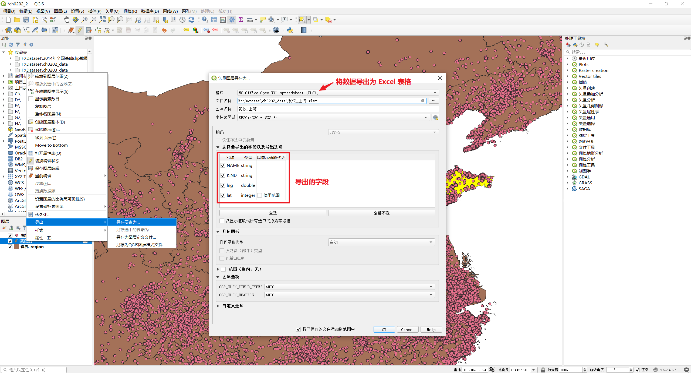