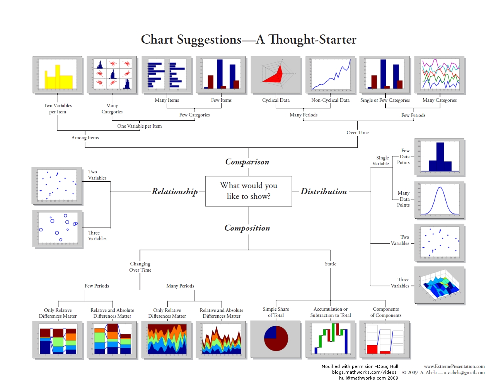

# 基本图标类型
参考：

* [Choosing a good chart](https://extremepresentation.typepad.com/blog/2006/09/choosing_a_good.html)
* [Andrew Abela’s Chart Chooser](https://datavizblog.com/2013/04/29/andrew-abelas-chart-chooser/) | Michael Sandberg's Data Visualization Blog
* Juice Labs - [Chart Chooser](http://labs.juiceanalytics.com/chartchooser/index.html) 在线交互式选择图表类型工具，提供 Excel、Powerpoint 模板下载。

可以将基本图表分为 4 种（功能）类型：

* comparison 进行数据间的对比
* relationship 展示数据间的关系
* distibution 揭示数据的分布
* composition 展示数据组成

|     主类     |       次类        |                            用途                             |
| ------------- | ------------------ | ------------------------------------------------------------ |
| **折线图** | 折线图           | 用于反映和时间相关的数据变化（趋势）                |
|               | 面积图           | 用于反映主次之间的基于时间的对比                     |
| **柱状图** | 柱状图           | 分类项目的数量比较，也可能反映趋势                   |
|               | 条形图           | 分类项目的数量比较                                       |
|               | 环状条形图       | 分类项目的数量比较，更反映分类项目之间的数量关系 |
|               | 南丁格尔玫瑰图 | 以夸张的形式来表示分类项目的数量比较                |
| **饼状图** | 饼状图           | 反映分类数据所占比例                                    |
|               | 旭日图           | 表示比例对比的同时，也表示层级关系                   |
|               | 树状图           | 表示比例，可以多层级                                    |
| **散点图** | 散点图           | 反映相关性和分布关系，两个变量                        |
|               | 气泡图           | 反映相关性和分布关系，三个变量                        |
|               | 带线散点          | 趋势线                                                      |
| **地图**    | 地图              | 反映空间信息                                              |
| **其他图** | 股价图/箱线图   | 反映数据分散情况                                         |
|               | 直方图           | 反映数据分布                                              |
|               | 瀑布图           | 数量变化的过程                                            |

## 比较类型
比较类型的图表用于进行数据之间的比较，可以**基于类别**，也可以**基于时间**展示数据以便于比较

* 基于类别
    * 不等宽的柱形图，使用图形的高度和宽度这两个视觉变量表示数据。
    * 矩阵图表、条形图、柱状图，使用图形高度这一个视觉变量表示数据
* 基于时间
    * 雷达图、折线图、柱状图展示多周期的数据

## 分布类型
分布类型的图表用于查看数据的分布，基于展现数据的维度，图表可以分为**单个变量**和**多个变量**

* 单个变量：直方图、密度图、箱线图
* 多个变量：散点图、多维密度图

## 构成类型
构成类型的图表用于展示数据的组成成分，基于展示数据的时间特性可以分为 **静态** 和 **基于时间** 的图表

* 静态：饼图、瀑布图、堆积图
* 基于时间：堆叠图、面积图（相对差异/绝对差异）

## 关系类型
关系类型的图表用于展示数据之间的关系，基于展示数据的维度可以分为 **2个变量** 或 **多个变量** 的图表

* 2 个变量：散点图
* 多个变量：气泡图（可以通过横轴、纵轴、气泡大小、颜色等可视化元素展现多维数据）