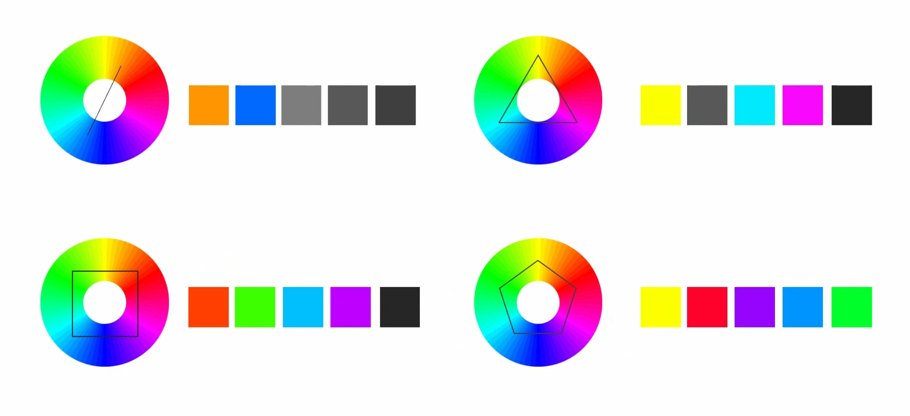
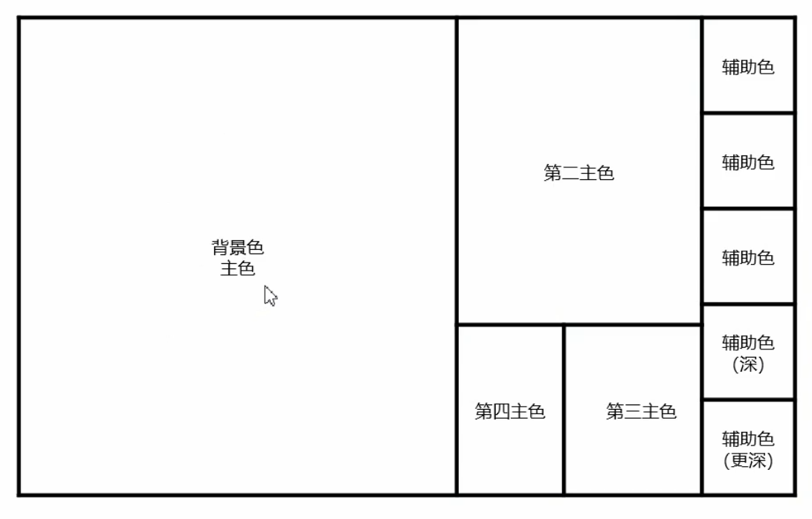

# 数据可视化设计
## 配色
有多种方式进行多色配色，如类似色、邻近色、对比色、互补色，基于数据可视化的目的和需求不同可以采用不同的配色方案。

:bulb: 可以在日常提取其他创作者的配色方案，模仿他们的配色方案以提高配色品味。

### 在线配色工具
* [colorbrewer2](https://colorbrewer2.org/) 专业的数据可视化配色工具，可以作为诊断工具用于评估各个配色方案的适用性

* [Adobe Color](https://color.adobe.com/zh/create/color-wheel)
    * 支持单色、类比色、三元群、补色等多种配色模式
    * 色彩模式支持 RGB、CMYK、HSV、LAB
    * 而且在「协助工具」标签栏中提供色盲友好功能，检测配色中是否存在颜色冲突
    * 支持从影像（支持多种图片格式）中提取主题色，而且提供多种色彩情绪筛选模式

* [colourco](https://colourco.de/)
    * 支持生成无限色卡
    * 支持多种配色模式

* [colordrop](https://colordrop.io/) 四色配色网站

* [hailpixel](https://color.hailpixel.com/) 四色配色网站

* [Klar](https://klart.io/colors/)
    * 五色配色网站
    * Klart 是一款用于收藏网页的工具，它会自动提取网页中的主要配色
    * 它提供多种预设色卡，而且每个色卡都会配以网页实例，可以作为网页设计的参考配色

* [Khroma](http://khroma.co/)
    * 先浏览大量色卡，用户从中选择喜欢的 50 种配色
    * 然后该网站就会通过人工智能学习生成无数符合你口味的配色方案

* [uiGrandients](https://uigradients.com/#Magic)
    * 提供多种渐变色配色方案
    * 支持导出 jpg 和 CSS 样式