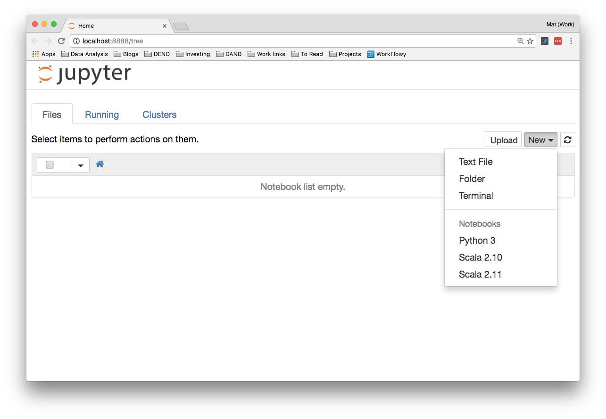
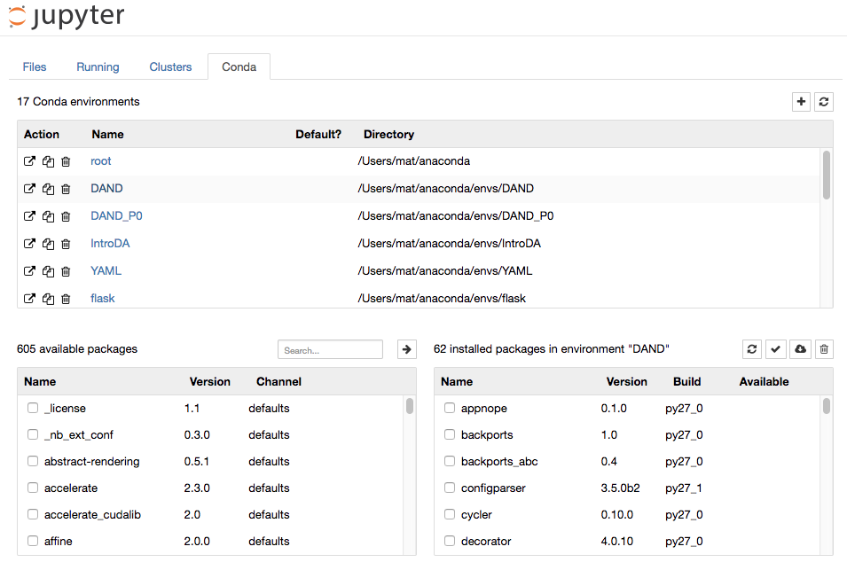
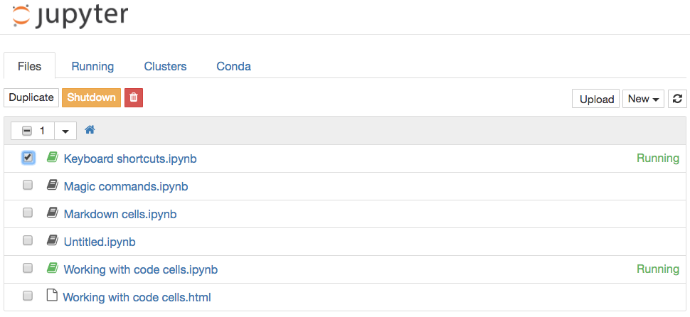
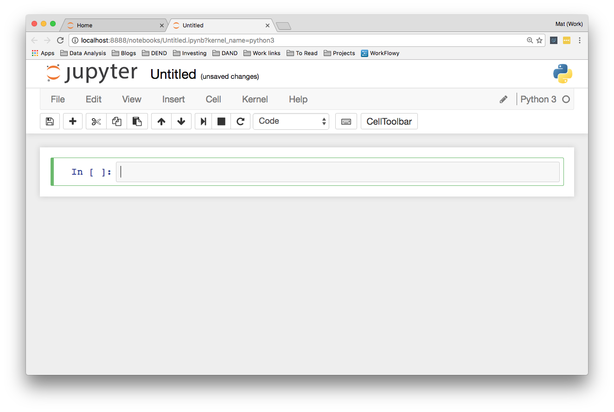

# 基本操作
## 启动服务器
（转到**包含此 notebook 文件的目录**）在 Anaconda 终端或控制台中键入
```python
jupyter notebook
```
会在浏览器打开**服务器主页**，服务器在运行**此命令的目录中**启动（意味着任何 notebook 文件都会**保存在该目录下**）

* 默认情况下， notebook 服务器**运行地址**为`http://localhost:8888`
    * 其中`localhost`指计算机
    * `8888`是服务器的**通信端口**
* 在浏览器输入`http://localhost:8888`即可访问服务器主页（当 notebook 服务器仍运行着）

:warning: 如果同时启动了**另一个 notebook 服务器**，由于端口 `8888` 已被占用，因此**新服务器会在端口 `8889` 上运行**（通过`http://localhost:8889`连接到新服务器），并以此类推，每个新建的 notebook 服务器都会像这样**增大端口号**。



如上图所示，可以通过点击主页右上方 `New` 按钮在下来菜单中，选择需要新建的文档类型，如新的 `notebook`（`Notebooks` 下显示已安装的可选的内核）、`Text File`（文本文件）、`Folder` 文件夹或 `Terminal` 终端 。

## 服务器界面
### 选项卡
顶部常用选项卡包括 `Files`（文件）、`Running`（运行）、`CLuster`（集群）
####  Files
Files（文件）显示当前目录中的所有文件和文件夹。

#### Running
Running（运行）选项卡会列出所有**正在运行**的 notebook。在该选项卡中管理这些 notebook。

#### Clusters
Clusters（集群）中创建多个用于**并行计算的内核**。这项工作已经由 [ipyparallel](https://ipyparallel.readthedocs.io/en/latest/intro.html) 接管，因此该选项卡如今用处不多。

#### Conda
如果是在 `conda` 环境中运行 notebook 服务器，则可访问 Conda 选项卡以管理 Jupyter 中的**环境**，执行多种操作如：

* 创建新的环境
* 安装包
* 更新包
* 导出环境

需要在 terminal 中安装 Conda 选项卡，键入

```bash
conda install jupyter notebook nb_conda
```



## 关闭Jupyter
### 服务器页面关闭
在服务器主页（默认为 `http://localhost:8888`）勾选需要关闭的 notebook 然后点击 `shutdown` 按钮即可关闭



### 终端关闭
通过在终端中**按两次 `Ctrl + C`**，可以关闭整个服务器。


:warning: 在关闭 notebook 之前需要**保存**工作进度。

## notebook 界面


### 单元格
单元格是**编写代码**和**运行代码**的地方，可以随时**改变单元格的类型**

* Code 代码单元格
* Markdown 单元格
* Raw NBConvert 原始文本单元格
* Heading 标题单元格

#### 单元格模式
颜色表示**单元格的模式**（左边粗框线的颜色）：

* **命令模式**为蓝色，表示可**执行代码**
* **编辑模式**为绿色，可输入删改单元格内容，单元格内有**一个光标**
* 选中单元格后**按 `Enter` 键或 `Return` 键**从命令模式进入**编辑模式**
* 退出编辑模式**返回命令模式**可按** `Esc` 键**

#### 运行
* 按 `Shift + Enter` 或 `Ctrl + Enter` 可运行单元格，如果使用 `Shift + Enter` 则运行当前单元格后自动**选中下一个单元格**（或根据需要创建新的单元格）；如果使用 `Ctrl + Enter` 则运行当前单元格后**依然选中当前单元格**
* 工具栏的小型**播放按钮**用于运行单元格
* 运行代码Code 代码单元格时，**单元格下方会显示输出（但只输出最后一个结果）**。
* 运行过的单元格还会被**编号**，如左侧显示 `In [1]`（表示已被运行的第一个单元格）
* 在一个单元格中**执行过的代码**在所有其他单元格中**均可用**

#### Magic 关键字
参考：[Built-in magic commands](https://ipython.readthedocs.io/en/stable/interactive/magics.html)

Magic 关键字是可以**在单元格中运行的特殊命令**，能让你**控制 notebook 本身或执行系统调用**。不同内核可使用的 Magic 关键字不同。

有两种类型 Magic 命令：

* 行 Magic 命令
在 Magic 命令前加一个百分号 `%`，行 Magic 命令**仅应用于**编写 Magic 命令时所在的**行**

* 单元格 Magic 命令
在 Magic 命令前加**两个**百分号 `%%`，单元格 Magic 命令应用于**整个单元格**。

##### 代码计时
使用 Magic 命令 `timeit` 测算代码的运行时间

* 测算行代码的运行时间

```python
%timeit script
```

* 测算整个单元格的运行时间

```python
%%timeit
code blokck
```

##### 嵌入可视化
默认情况下，图形呈现在各自的窗口中。通过命令 `%matplotlib inline` 以内联特定的「后端」（呈现图像的软件），直接在 notebook 中呈现图形。

:bulb: 在高分屏上，notebook 中的默认图像可能会显得模糊，可以在键入 `%matplotlib inline` 之后使用 `%config InlineBackend.figure_format = 'retina'` 来呈现分辨率较高的图像

##### 调试
对于 python 内核

* 使用 Magic 命令 `%pdb` 开启[交互式调试器](https://docs.python.org/3/library/pdb.html)
* 要退出调试器，在提示符中输入 `q` 即可

#### 创建幻灯片
1. **调出**指定作为幻灯片的单元格和幻灯片类型的**下拉菜单**：点击菜单栏 `View`（视图）-> `Cell Toolbar`（单元格工具栏）-> `Slideshow`（幻灯片），在每个单元格上就会弹出 `幻灯片单元格菜单`

2. 在每个单元格上显示一个下拉菜单，选择 `幻灯片显示方式`

* `Slides`（幻灯片）是完整幻灯片
* `Sub-slides`（子幻灯片）会出现在幻灯片中
* `Fragments`（片段）最初是隐藏的，在你按下按钮时会出现
* `Skip`（忽略）会在幻灯片中忽略该单元格
* `Notes`（备注）会将为演讲者保留备注

3. 创建及运行幻灯片
使用程式 `nbconvert` 创建幻灯片

```python
jupyter nbconvert notebook.ipynb --to slides
```

:warning: 将 notebook 转换为幻灯片必需的文件，还需要向其提供 **HTTP 服务器**才能真正看到演示文稿。若转换它并**立即看到它**，请使用

```python
jupyter nbconvert notebook.ipynb --to slides --post serve
```

在浏览器中打开幻灯片并可演示它。

### 保存
#### 自动保存
notebook 会定期**自动保存**，标题右侧会注明最近一次的保存

#### 手动保存
* 使用**软盘符号**保存按钮手动进行保存
* 按键盘上的 `Esc`，然后按 `s`（按 `Esc` 键退出编辑模式进入命令模式，**`s` 为保存快捷键**）

### 下载/转换
* notebook 文件拓展名为 `.ipynb `
* notebook 是一个大型的 `JSON` 文件
* 通过 Jupyter 附带的[程序 `nbconvert`](https://nbconvert.readthedocs.io/en/latest/usage.html) 转换为 `HTML`、`Markdown`、幻灯片等格式

#### notebook界面下载/转换
在界面工具栏的 `File`（文件）中可选择**多种格式**下载 notebook

#### 终端下载/转换

```python
# 将 notebook 转换为 HTML 格式
jupyter nbconvert --to html notebook.ipynb
```

### 工具栏
从左侧开始，工具栏上的其他控件依次为

* 软盘符号表示**保存**。请记得保存 notebook！
* `+` 按钮用于**创建新的单元格**
* 用于**剪切**、**复制**和**粘贴**单元格的按钮
* **向上移动**、**向下移动**单元格的按钮
* **运行**、**停止**、**重新启动**内核
* 选择**单元格类型**的下拉按钮
* **命令面板**弹出一个**带有搜索栏的面板**，供你搜索不同的命令。键入要执行的操作加快操作，同时有介绍操作的**快捷键**
* **单元格工具栏**，提供不同的单元格选项（例如将单元格用作幻灯片）

### 标题栏
点击页面最上方的标题可对其进行**修改**

### 代码运行「指示灯」
界面右上角在内核类型后是一个小圆形。**在运行单元格（代码）时，会填充这个小圆形**。它是一个小型指示器，在代码会运行较久时指示内核正在运行中的。

### 快捷键
:gear: [keyboard-shortcuts-cn.ipynb](./attachments/keyboard-shortcuts-cn.ipynb)

#### 帮助命令
**命令模式**（单元格左边粗线框为蓝色）中键入 `H`

#### 创建新单元格
* **命令模式**（单元格左边粗线框为蓝色）中键入 `A` 在当前单元格**上方**建一个单元格
* **命令模式**（单元格左边粗线框为蓝色）中键入 `B` 在当前单元格**下方**建一个单元格

#### 切换单元格类型
* 从 Markdown 切换到代码单元格，按 `Y`
* 从代码切换到 Markdown 单元格，按 `M`

#### 行号
显示 Code 代码单元格的行号十分有用，在**命令行模式**键入 `L` 显示行号

#### 删除单元格
连续按**两次** `D` 删除选中的单元格

#### 保存笔记本
在**命令行模式**按 `S` 保存笔记本

#### 命令面板
按 `Shift + Ctrl` 或 `Command + P` 打开命令面板，在弹出的命令面板中搜索不能用键盘快捷键实现的命令。