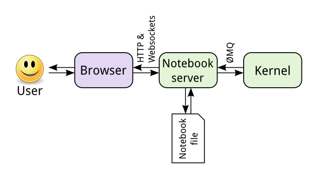

# 简介
Jupyter notebook 是一种 **Web 应用**，能让让用户将**说明文本、数学方程、代码和可视化内容**全部组合到一个易于共享的文档中。已经成为**数据分析的标准环境**。

其用途包括
* 数据清理
* 数据探索
* 数据可视化
* 机器学习
* 大数据分析

Jupyter notebook 是 Donald Knuth 在 1984 年提出的 **[文字表达化编程](http://www.literateprogramming.com/)** 的一种形式，它支持直接在代码旁写出**叙述性文档**，而不是另外编写单独的文档，不仅对阅读 notebook 的很有用，而且对回头分析代码也很有用。

## 历史
Jupyter notebook 源自 2011 年 Fernando Perez 发起的[`IPython`项目](https://ipython.org/)。`IPython`是一种**交互式 shell**（与普通的 Python shell 相似，但具有一些**很好的功能如语法高亮显示和代码补全**）。

## 架构

notebook 的工作方式：
1. 将来自 Web 应用消息发送给 IPython 内核（在后台运行的 IPython 应用程序）
2. 内核执行代码
3. 执行结果返回 notebook
4. 保存 notebook 时，它将作为 `JSON` 文件（文件扩展名为`.ipynb`）写入到该服务器中。

架构组成：

* **notebook 的服务器**是核心，编写的代码通过该服务器发送给内核，并保存用以保存和读取 notebook 文件
* **浏览器**连接到该服务器，用于**交互**和**呈现**结果的 Web 应用，通过浏览器可以通过远程控制来访问服务器。
* **内核**运行代码，并将结果发送回该服务器。由于 notebook 和内核分开，将内核替换为其他语言，就可以不改变架构下运行多种语言，使 notebook 变得与编程语言无关。新的名称 Jupyter 由 `Julia`、`Python`和`R`组合而成，查看 Jupyter notebook 支持的[内核的列表](https://github.com/jupyter/jupyter/wiki/Jupyter-kernels)。

