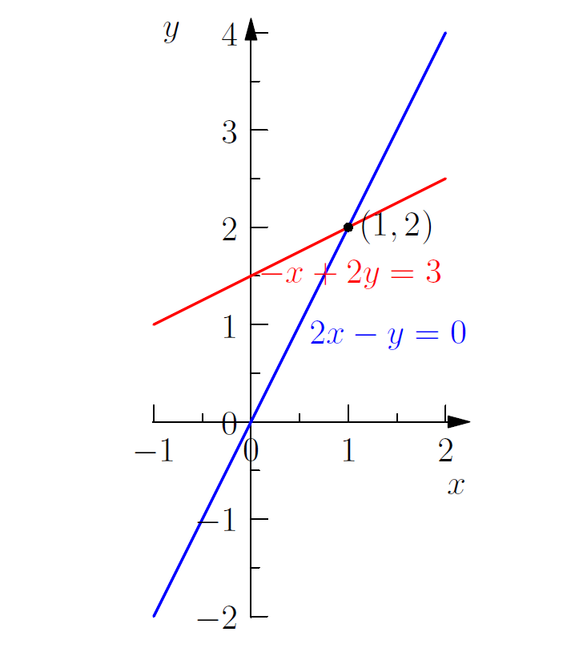
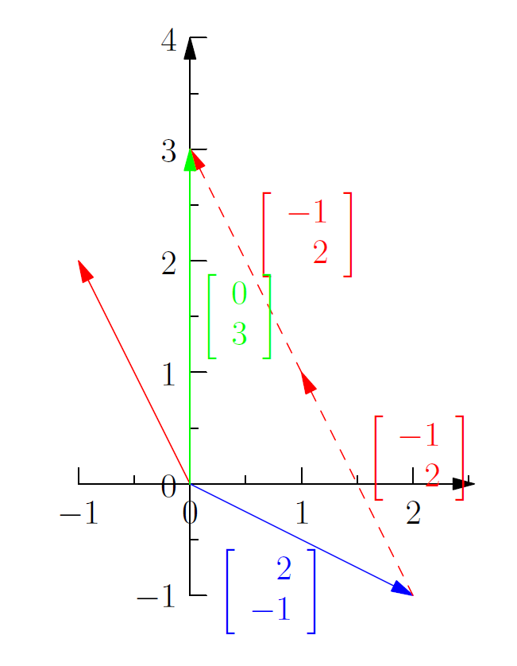

# 线性方程组的几何表示
参考：
* Unit I: Ax = b and the Four Subspaces - [The Geometry of Linear Equations](https://ocw.mit.edu/courses/mathematics/18-06sc-linear-algebra-fall-2011/ax-b-and-the-four-subspaces/the-geometry-of-linear-equations/) |   [pdf](./attachments/MIT18_06SCF11_Ses1.1sum.pdf)
* 课本章节：Section *1.1*, *1.2*, and *2.1* in the 4^th^ or 5^th^ edition

---

线性代数的基本应用是解方程组，对于 `n` 维方程组（有 `n` 个未知数和 `n` 个方程）可以通过三种观点/角度来求解：

对于一个二元方程组
<!-- #region-->
$$
\begin{aligned}
\begin{cases}
    2x-y=0\\
    -x+2y=3\\
\end{cases}
\end{aligned}
$$
<!-- #endregion -->

## 行图像
行图像 row picture：将每个（每一行）方程的图像画出来就得到行图像，对于二元方程组，行图像中两条直线的**交点的坐标**就是方程组的解。

:warning: 该可视化的解法对于高维度的方程组不太适用，由于高纬度的图像无法在坐标系中直接绘出。

## 列图像
列图像 column picture：将未知数的**系数作为向量**（列向量），方程组等号右侧是目标向量

<!-- #region-->
$$
\begin{aligned}
x\begin{bmatrix}2\\-1\end{bmatrix} + y\begin{bmatrix}-1\\2\end{bmatrix} = \begin{bmatrix}0\\3\end{bmatrix}
\end{aligned}
$$
<!-- #endregion -->

那么方程组的解就是能够使这些列向量的**线性组合**等于目标向量的向量的倍数。

由向量图可以看出当 $\begin{cases} x=1\\ y=2\end{cases}$ 向量的线性组合等式成立

:bulb: 列图像实际是将方程组看作向量的线性组合 $n \cdot col1 + m \cdot col2 = col3$ 其中 `col1`、`col2`、`col3` 是列向量。因此可以将列图像抽象为列向量的线性组合，这样就可以推广适用于高维的方程组。

:bulb: 可逆矩阵（非奇异矩阵 non-singular matrix）：系数组成的列向量每个都是方向不同（不重合的），称为线性独立/不相关 linear independence，因此可以通过这些列向量的任意线性组合实现**所在维度的空间全覆盖**。

## 矩阵图像
将方程组写成矩阵形式 $Ax=b$

其中：
* $A$ 为系数矩阵 coefficient matrix
* $x$ 为未知数列向量
* $b$ 为方程组右侧的目标列向量

<!-- #region-->
$$
\begin{aligned}
\begin{aligned}
\begin{bmatrix}
  2&-1 \\
  -1&2
\end{bmatrix}
\begin{bmatrix}
 x\\
 y
\end{bmatrix} & = \begin{bmatrix}
 0\\3
\end{bmatrix}
\end{aligned}
\end{aligned}
$$
<!-- #endregion -->

对于解 $\begin{bmatrix}1\\2\end{bmatrix}$ 相应地可以有两种方式理解，分别对应于 **矩阵 x 向量** 两种运算规则：

### 列形式
方法一将系数矩阵看作以列形式组合，将向量看作为矩阵各列的线性组合系数，因此将向量各数分别**与矩阵相应列相乘**，再相加

<!-- #region-->
$$
\begin{aligned}
\begin{aligned}
\begin{bmatrix}
  2&-1 \\
  -1&2
\end{bmatrix}
\begin{bmatrix}
 1\\
 2
\end{bmatrix} & = 1\begin{bmatrix}
 2\\1
\end{bmatrix}
+
2\begin{bmatrix}
 5\\3
\end{bmatrix} & = \begin{bmatrix}
 0\\3
\end{bmatrix}
\end{aligned}
\end{aligned}
$$
<!-- #endregion -->

### 行形式
方法二将系数矩阵看作以行形式组合，将向量分别**与矩阵相应行相乘（点乘）**，再相加

<!-- #region-->
$$
\begin{aligned}
\begin{aligned}
\begin{bmatrix}
  2&-1 \\
  -1&2
\end{bmatrix}
\begin{bmatrix}
 1\\
 2
\end{bmatrix} & = \begin{bmatrix}
  2 \times 1+5\times 2\\
  1\times 1+3\times 2
\end{bmatrix} & = \begin{bmatrix}
 0\\3
\end{bmatrix}
\end{aligned}
\end{aligned}
$$
<!-- #endregion -->

:bulb: 向量点乘规则

<!-- #region-->
$$
\begin{aligned}
\begin{aligned}
\begin{bmatrix}
  2&5
\end{bmatrix}\cdot
\begin{bmatrix}
 1\\2
\end{bmatrix} & = 2 \times 1+5\times 2
\end{aligned}
\end{aligned}
$$
<!-- #endregion -->
