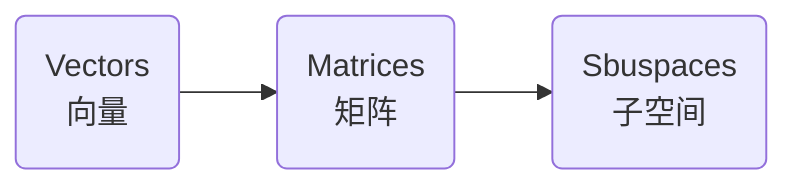

# 线性代数的核心思想
参考：
* Unit I: Ax = b and the Four Subspaces - [An Overview of Key Ideas](https://ocw.mit.edu/courses/mathematics/18-06sc-linear-algebra-fall-2011/ax-b-and-the-four-subspaces/an-overview-of-key-ideas/) | [pdf](./attachments/MIT18_06SCF11_Ses1.13sum.pdf)
* [An Overview of Key Ideas](https://www.youtube.com/watch?v=OZxzHcW663g&list=PL221E2BBF13BECF6C&index=6)
* 课本章节：Section *1.3* in the 4^th^ or 5^th^ edition

---

这一节 Prof. Gilbert Strang 推荐另一门他主讲的课程 :cinema: [MIT 18.085 Computational Science and Engineering I, Fall 2008](https://www.youtube.com/playlist?list=PLF706B428FB7BD52C)，并在本课以其中一节 :cinema: [Recitation 1: Key Ideas of Linear Algebra](https://www.youtube.com/watch?v=0oBJN8F616U&list=PL221E2BBF13BECF6C&index=5) 为主要内容。

线性代数的发展

## Vector
* 线性组合 Linear Combination：$x_{1} \overrightarrow{\mu }+x_{2} \overrightarrow{\nu }+x_{3} \overrightarrow{\omega } = b$，其中：$x_{1}$，$x_{2}$，$x_{3}$ 称为标量 scaler。
    可以用线性组合的观点来理解**矩阵与向量相乘**，由原来的向量（$\overrightarrow{\mu }$、$\overrightarrow{\nu }$、$\overrightarrow{\nu }$）构成列数为 3 的矩阵 A，原来的系数（$x_{1}$、$x_{2}$、$x_{3}$）构成了向量 $x$，因此矩阵与向量相乘 $Ax$ 是矩阵的各列基于向量的相应元素进行**线性组合**。

    **Subspace 子空间**

    * $x_{1}\overrightarrow{\mu }$，$x_{2} \overrightarrow{\nu }$，$x_{3} \overrightarrow{\omega }$ 当 $x_{1}$，$x_{2}$，$x_{3}$ 取遍所有的 $R$ 上的值，分别会构成一条直线，称为一维子空间
    * 类似地，$x_{1}\overrightarrow{\mu }$ 与 $x_{2} \overrightarrow{\nu }$ 构成一个平面
    * 而三者 $x_{1}\overrightarrow{\mu }$，$x_{2} \overrightarrow{\nu }$，$x_{3} \overrightarrow{\omega }$ 共同构成一个三维空间

* 差异转换 different transform：使用[差异矩阵或求和将矩阵](./Cheatsheet.md#差异矩阵与求和矩阵)与向量相乘，得到的结果向量的元素是由原向量的元素相减或相加构成的。
    因此矩阵与向量 $Ax=b$ 相乘，可以**将矩阵 $A$ 看作是向量 $x$ 到 $b$ 的转换**；当矩阵为可逆矩阵 inverse 时，有 $x=A^{-1}b$，相应地可以**将矩阵 $A^{-1 }$ 看作是向量 $B$ 到 $x$ 的转换**

## Matrix
当矩阵 A 为 $\begin{bmatrix}  1&0  &0 \\  -1&1  &0 \\  0&-1  &1\end{bmatrix}$ 则有 $Ax=b$ 为

* 基于列形式，可以将矩阵看作是由列向量组成的，因此矩阵与向量相乘可以看作是矩阵的各列进行了**线性组合**。

<!-- #region-->

$$
\begin{aligned}
Ax &=
\begin{bmatrix}
  1&0  &0 \\
  -1&1  &0 \\
  0&-1  &1
\end{bmatrix}
\begin{bmatrix}
 x_{1} \\
 x_{2}\\
 x_{3}
\end{bmatrix}\\
&=
x_{1}\begin{bmatrix}
 1\\
 -1\\
 0
\end{bmatrix}
+
x_{2}\begin{bmatrix}
 0\\
 1\\
 -1
\end{bmatrix}
+
x_{3}\begin{bmatrix}
 0\\
 0\\
 1
\end{bmatrix}\\
&=
\begin{bmatrix}
 x_{1}\\
 x_{2} - x_{1}\\
 x_{3} - x_{2}
\end{bmatrix}\\
&=
b
\end{aligned}
$$

<!-- #endregion -->

* 基于行形式，矩阵与向量相乘，看作是矩阵的每一行与向量相乘（点乘）

<!-- region -->

$$
\begin{aligned}
Ax & = \begin{bmatrix}
  1& 0 &0
\end{bmatrix}
\begin{bmatrix}
 x_{1}\\
 x_{2}\\
 x_{3}
\end{bmatrix}
+
\begin{bmatrix}
  -1& 1 &0
\end{bmatrix}
\begin{bmatrix}
 x_{1}\\
 x_{2}\\
 x_{3}
\end{bmatrix}
+
\begin{bmatrix}
  0& -1 &1
\end{bmatrix}
\begin{bmatrix}
 x_{1}\\
 x_{2}\\
 x_{3}
\end{bmatrix}\\ & = \begin{bmatrix}
 1\times x_{1} + 0\times x_{2} + 0\times x_{3}\\
 (-1)\times x_{1} + 1\times x_{2} + 0\times x_{3}\\
 0\times x_{1} + (-1)\times x_{2} + 1\times x_{3}
\end{bmatrix}\\ & = \begin{bmatrix}
 x_{1}\\
 x_{2} - x_{1}\\
 x_{3} -x_{1}
\end{bmatrix}\\
&=
b
\end{aligned}
$$

<!-- endregion -->

## Sbuspace
向量空间是在线性组合下闭合的向量的集合，即由向量的所有可能的线性组合构成的。

## Subspace
子空间是指矩阵的列构成的向量，它们的所有可能的线性组成所覆盖的空间维度，低于向量原来可以表示的最大维度空间。

对于矩阵 $C=\begin{aligned} \begin{bmatrix} 1&  0& -1\\-1&  1& 0\\0&  -1& 1\end{bmatrix}\end{aligned}$ 每一列作为向量，分别是：

$$
\begin{aligned}
col1=\begin{bmatrix}
 1\\
 -1\\
 0
\end{bmatrix},
col2=
\begin{bmatrix}
 0\\
 1\\
 -1
\end{bmatrix},
col3=
\begin{bmatrix}
 -1\\
 0\\
 1
\end{bmatrix}
\end{aligned}
$$

由于 $col3 = -(col1 + col1)$，因此矩阵 C 的列组成的向量所有可能的线性组合覆盖的空间维度低于 $\mathbb{R}^{3}$，它是 $\mathbb{R}^{3}$ 的二维子空间。因此对于 $Cx=b$ 中某些向量 $b$（不在矩阵 $C$ 构成的子空间/平面上的向量），无法求出 $x$ 使得等式成立。即唯有向量 $b$ 各元素满足 $b_{1} + b_{2} + b_{3} = 0$ 时才可以求出对应的解 $x$（向量）。

一个向量空间最小的子空间是零向量，在几何形式就是原点。

## Basis
空间 $\mathbb{R}^{n}$ 的基 basis 是由 n 个 $\mathbb{R}^{n}$ 维的「独立」向量组成。从矩阵的角度考虑就是，由可逆矩阵的列组成的向量集合作为基。
