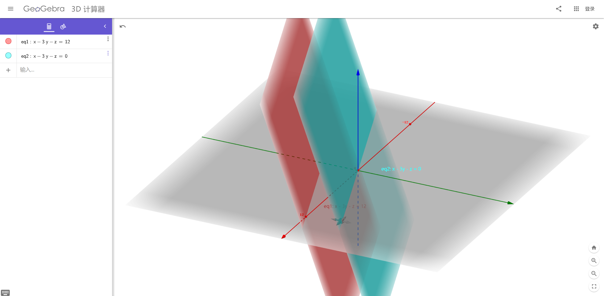

# L6-列空间和零空间-习题集
参考：

* Unit I: Ax = b and the Four Subspaces - Column Space and Nullspace - [Check Yourself](https://ocw.mit.edu/courses/mathematics/18-06sc-linear-algebra-fall-2011/ax-b-and-the-four-subspaces/column-space-and-nullspace/)
* 题源：[Problem: Exercises on transposes, permutations, spaces](https://ocw.mit.edu/courses/mathematics/18-06sc-linear-algebra-fall-2011/ax-b-and-the-four-subspaces/column-space-and-nullspace/MIT18_06SCF11_Ses1.6prob.pdf) | [pdf](./attachments/MIT18_06SCF11_Ses1.6prob.pdf)
* 参考答案：[Solutions: Exercises on transposes, permutations, spaces](https://ocw.mit.edu/courses/mathematics/18-06sc-linear-algebra-fall-2011/ax-b-and-the-four-subspaces/column-space-and-nullspace/MIT18_06SCF11_Ses1.6sol.pdf) | [pdf](./attachments/MIT18_06SCF11_Ses1.6sol.pdf)
    :bulb: [Problem 6.2 solution: 18.06 Recitation 3 - Isabel Vogt](http://faculty.washington.edu/ivogt/Rec3_solns.pdf) | [pdf](./attachments/Rec3_solns.pdf)

## 问题6.1
假设 $S$ 和 $T$ 都是向量空间 $V$ 的子空间

1. 定义：$S+T$ 是包含所有 $\vec{s}+\vec{t}$ 组合的向量集合，其中 $\vec{s}$ 在子空间 $S$ 中，$\vec{t}$ 在子空间 $T$ 中。求证：$S+T$ 是一个向量空间（满足对于线性组合封闭）

2. 如果 $S$ 和 $T$ 都是 $\mathbb{R}^{m}$ 向量空间中的一条直线，那么 $S+T$ 和 $S \cup T$ 的区别是什么。（即解释 $S+T$ 是由 $S \cup T$ 张成得到的）

---

1. 解释

假设 $\vec{s^{'}}$ 是子空间 $S$ 的向量，$\vec{t^{'}}$ 是子空间 $T$ 的向量，则有

<!-- #region-->
$$
\begin{aligned}
\vec{s}+\vec{t}+\vec{s^{'}}+\vec{t^{'}}=(\vec{s}+\vec{s^{'}})+(\vec{t}+\vec{t^{'}})
\end{aligned}
$$
<!-- #endregion -->

根据向量空间对于向量的加法的封闭性，可得 $\vec{s}+\vec{s^{'}} \in S$ 和 $\vec{t}+\vec{t^{'}} \in T$

所以 $(\vec{s}+\vec{s^{'}})+(\vec{t}+\vec{t^{'}}) \in S+T$ 即 $S+T$ 对向量的加法封闭。

类似地，根据向量空间对于向量的数乘的封闭性，可得 $c\vec{s} \in S$ 和 $c\vec{t} \in T$，其中 $c$ 是常量，所以 $c(\vec{s}+\vec{t})=c\vec{s} + c\vec{t} \in S+T$

所以 $S+T$ 对于线性组合封闭。

2. 解释
当 $S$ 和 $T$ 是两条不同的直线时，则根据 $S+T$ 的定义，该向量集合的几何形式是一个平面；而根据 $S \cup T$ 的定义，该向量集合的几何形式仅是两条直线。而 $S \cup T$ 张成的空间是两个向量 $\vec{s}$ 和 $\vec{t}$ 的所有可能的线性组合，即 $\vec{s}+\vec{t}$，其中 $\vec{s}$ 是在直线 $S$ 上，$\vec{t}$ 是在 $T$ 上。

所以 $S+T$ 是由 $S \cup T$ 张成得到的。

## 问题6.2

已知目标平面 $x-3y-z=12$ 与平面 $x-3y-z=0$ 平行，其中向量 $(12, 0, 0)$ 在目标平面上。

则在目标平面上的点具有以下模式，请填充完整：

<!-- #region-->
$$
\begin{aligned}
\begin{bmatrix}
 x\\
 y\\
 z
\end{bmatrix}=
\begin{bmatrix}
 ?\\
 0\\
 0
\end{bmatrix}+
y\begin{bmatrix}
 ?\\
 1\\
 0
\end{bmatrix}+
z\begin{bmatrix}
 ?\\
 0\\
 1
\end{bmatrix}
\end{aligned}
$$
<!-- #endregion -->

---

解法一：

两平面平行，且平面 $x-3y-z=0$ 过原点 $(0, 0, 0)$，而点 $(12, 0, 0)$ 在目标平面，因此从几何角度考虑，目标平面上的点可以将平面 $x-3y-z=0$ 上的点沿 $x$ 轴移动 12 个单位得到相应的点。

以矩阵的角度考虑，其中 $\begin{bmatrix}x\\y\\z\end{bmatrix}$ 是目标平面上的点，$\begin{bmatrix}x^{'}\\ y^{'}\\z^{'}\end{bmatrix}$ 是平面 $x-3y-z=0$ 上的点:

<!-- #region-->
$$
\begin{aligned}
\begin{bmatrix}
 x\\
 y\\
 z
\end{bmatrix}=
\begin{bmatrix}
 12\\
 0\\
 0
\end{bmatrix}+
\begin{bmatrix}
 x^{'}\\
 y^{'}\\
 z^{'}
\end{bmatrix}
\end{aligned}
$$
<!-- #endregion -->

将平面（方程组） $x-3y-z=0$ 写成矩阵形式 $Ax=b$

<!-- #region-->
$$
\begin{aligned}
\begin{bmatrix}
 1 &-3 & -1
\end{bmatrix}
\begin{bmatrix}
 x\\
 y\\
 z
\end{bmatrix}=0
\end{aligned}
$$
<!-- #endregion -->

这些向量都可以使方程组 $Ax=0$ 成立，则平面上的点构成零空间 $N(A)$，根据题目的提示可以写出其中两个向量 $\begin{bmatrix}3\\1\\0\end{bmatrix}$ 和 $\begin{bmatrix}1\\0\\1\end{bmatrix}$

可以将这两个向量作为基向量 basis 写出零空间向量的一般形式

<!-- #region-->
$$
\begin{aligned}
\begin{bmatrix}
 x^{'}\\
 y^{'}\\
 z^{'}
\end{bmatrix}=
m\begin{bmatrix}
 3\\
 1\\
 0
\end{bmatrix}+
n\begin{bmatrix}
 1\\
 0\\
 1
\end{bmatrix}
\end{aligned}
$$
<!-- #endregion -->

而题目要求的形式则是将解进行「分解」，消去 $x$

即
<!-- #region-->
$$
\begin{aligned}
\begin{bmatrix}
 x^{'}\\
 y^{'}\\
 z^{'}
\end{bmatrix}=
y^{'}\begin{bmatrix}
 3\\
 1\\
 0
\end{bmatrix}+
z^{'}\begin{bmatrix}
 1\\
 0\\
 1
\end{bmatrix}
\end{aligned}
$$
<!-- #endregion -->

因此可得

<!-- #region-->
$$
\begin{aligned}
\begin{bmatrix}
 x\\
 y\\
 z
\end{bmatrix}=
\begin{bmatrix}
 12\\
 0\\
 0
\end{bmatrix}+
y\begin{bmatrix}
 3\\
 1\\
 0
\end{bmatrix}+
z\begin{bmatrix}
 1\\
 0\\
 1
\end{bmatrix}
\end{aligned}
$$
<!-- #endregion -->

解法二：
直接使用换元，并将写成矩阵形式

<!-- #region-->
$$
\begin{aligned}
\begin{bmatrix}
 x\\
 y\\
 z
\end{bmatrix}=(
\begin{bmatrix}
 12+3y+z\\
 y\\
 z
\end{bmatrix}
)=
\begin{bmatrix}
 12+0+0\\
 0+y+0\\
 0+0+z
\end{bmatrix}=
\begin{bmatrix}
 12\\
 0\\
 0
\end{bmatrix}+
y\begin{bmatrix}
 0\\
 1\\
 0
\end{bmatrix}+
z\begin{bmatrix}
 0\\
 0\\
 1
\end{bmatrix}
\end{aligned}
$$
<!-- #endregion -->

## 问题6.3
若向量空间 $C$ 由向量空间 $A$ 和 $B$ 构成，且满足 $C=\begin{bmatrix}A \\ B\end{bmatrix}$，求它们的零空间 $N(C)$ 和 $N(A)$ 与 $N(B)$ 的关系。

---

已知 $C=\begin{bmatrix}A \\ B\end{bmatrix}$ 则对于方程组 $Cx=0$ 的所有解构成的零空间 $N(C)$，需要满足 $Cx=\begin{bmatrix}Ax \\ Bx\end{bmatrix}=0$，即这些解 $x$ 需要同时满足 $Ax=0$ 和 $Bx=0$，所以 $N(C)=N(A) \cap N(B)$