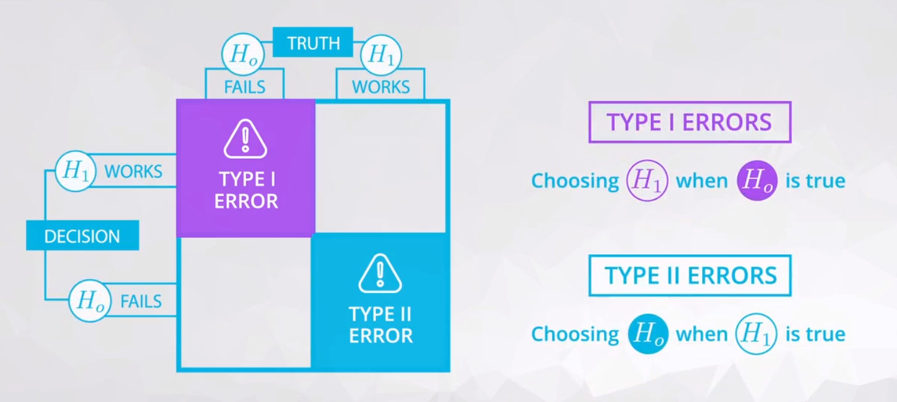

---
tags:
  - statistics
---

# 假设检验
假设检验是通常针对总体**参数**进行，而不是针对统计量的（因统计量是已经从数据（样本）中得到的，属于精确值，不需要假设测试验证这些数值）


## 步骤
主要由**假设**和**检验**构成，首先默认**零假设**为真，然后通过模拟计算**试图证明为真的是备择假设**

1. 将问题转变为**假设**（零假设`Null`$H_0$，建立存在一定的主观性）
2. 收集数据，**基于零假设**，模拟针对一个统计量的抽样分布，构建置信区间
3. **验证/检验**（样本）数据中的特定统计量与模拟获得的（在特定**置信度**下）统计量是否一致，选择支持的假设（零假设$H_0$或备择假设$H_1$）。


验证假设的方法有两种：
    * 利用置信区间选择（通过模拟统计量的抽样分布，观察事先作出的假设，挑选与抽样分布中观察到一致的假设）
    * 传统方式是基于**零假设**（取等号时的情况）**模拟会出现的情况**，观察是否与（样本）数据一致


**注意**：
* 设置零假设和备择假设的规则

    * 在收集数据前，预先设定$H_0$为**​真**，通常零假设会表示**某因素没有影响（效应为零）**或**对两组影响相同（两组同等）**（包含等号）。

    * $H_0$和$H_1$是**竞争性（与零假设对立）**、**非重叠**的假设。 $H_1$可以证明为真（但需要$H_0$为假）。
    * $H_0$包含一个等号，如$=$ 、$\leq$或$\geq$
    * $H_1$包含非空值$\neq$、$>$或$<$

* 无论是在零假设还是在备择假设中，陈述时要**避免出现接受**这个词。**我们并不是陈述某个假设为真**，相反**对于 I 类错误的阈值，你根据零假设中数据的相似性做出决定**。所以，可以出现在假设检验中的措辞包括：
    * 我们（有证据/$n\%$的可信度）**拒绝零假设**。
    * 我们（没有足够的证据）**不拒绝零假设**。

这样的描述有助于明确你**最初零假设默认为真**，并且如果没有收集数据，在测试最后「选择」零假设，是正确选择。

## 常见的假设检验

### 单样本 t 检验/测试总体平均数
`T-Test`[(单样本 t 检验)](https://www.cliffsnotes.com/study-guides/statistics/univariate-inferential-tests/one-sample-t-test)

### 双样本 t 检验/测试均数差
`Two Sample T-Test`[(双样本 t 检验)](http://www.itl.nist.gov/div898/handbook/eda/section3/eda353.htm)

```python
import numpy as np, statsmodels.stats.api as sms

X1, X2 = np.arange(10,21), np.arange(20,26.5,.5)

cm = sms.CompareMeans(sms.DescrStatsW(X1), sms.DescrStatsW(X2))
cm.tconfint_diff(usevar='unequal')
```

参考：[Confidence Interval for t-test (difference between means) in Python](https://stackoverflow.com/questions/31768464/confidence-interval-for-t-test-difference-between-means-in-python)

### 配对 t 检验/测试个体治疗前后的差异
`Paired T-Test`[(配对 t 检验)](http://www.statstutor.ac.uk/resources/uploaded/paired-t-test.pdf)（常用于将个体与自己比较）

### 单样本 z 检验/测试总体比例
`Z-Test`[(单样本 z 检验)](https://stattrek.com/statistics/dictionary.aspx?definition=one-sample%20z-test)

### 双样本 z 检验/测试总体比例的差异
[(双样本 z 检验)](https://onlinecourses.science.psu.edu/stat414/node/268)

有几百个不同的假设检验，只需要找到**最佳估算参数的统计量**，然后**使用自助法模拟抽样分布**，帮助**选择合适的假设检验**。


## 假设检验的错误
当我们基于样本作出假设选择，与实际现实不相符，则就发生了假设检验错误，存在两种假设检验错误。

### I 类错误 type 1 errors
一类错误或$\alpha$错误是**选择了备择假设，但是零假设为真**（$H_0$为真时，认为备择假设$H_1$为真）

即假阳性`false positive`，I 类错误是较为严重的类型
### II 类错误 type 2 errors
二类错误或$\beta$错误是**选择了零假设，但是备择假设为真**（$H_1$为真时，认为零假设$H_0$为真）

即假阴性`false negative`，II 类错误通常称为漏报




注意：
* 在一些极端情况下，我们通常选择一个假设 (如一直选择零假设)，**确保某个错误不再出现** (假设我们一直选择零假设，不再出现 I 类错误)。不过，一些单一的数据会**降低某个错误类型的可能性，增加另一种错误类型的出现几率**，两者是存在联系的。
* 实际设置中选择 **I 类错误阈值**，并且保证 I 类错误率符合要求后，可以最小化 II 类错误。
* 医学领域中常见的 I 类错误率$\alpha = 0.01$，商业或学术研究中常见的 I 类错误率则为$\alpha = 0.05$
* 如果完成多个假设检验，你的 I 类错误更加严重。为了纠正这点，通常采用 **邦弗朗尼** 校正法。这种校正法 **非常保守**，但是**假如 I 类最新错误率应为实际想得到的错误率除以完成检验的数量**。（如在 20 个（同样的）假设检验中把 I 类错误率维持在 1%，**邦弗朗尼** 校正率应为 0.01/20 = 0.0005。你应该使用这个新比率，对比每 20 个检验的 p 值，做出决定。）避免出现复合 I 类错误的其他技巧包括：
    * [图基校正](http://www.itl.nist.gov/div898/handbook/prc/section4/prc471.htm)
    *  [Q 值](http://www.nonlinear.com/support/progenesis/comet/faq/v2.0/pq-values.aspx)