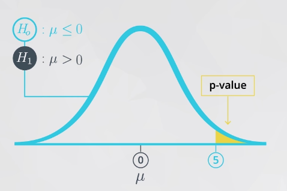
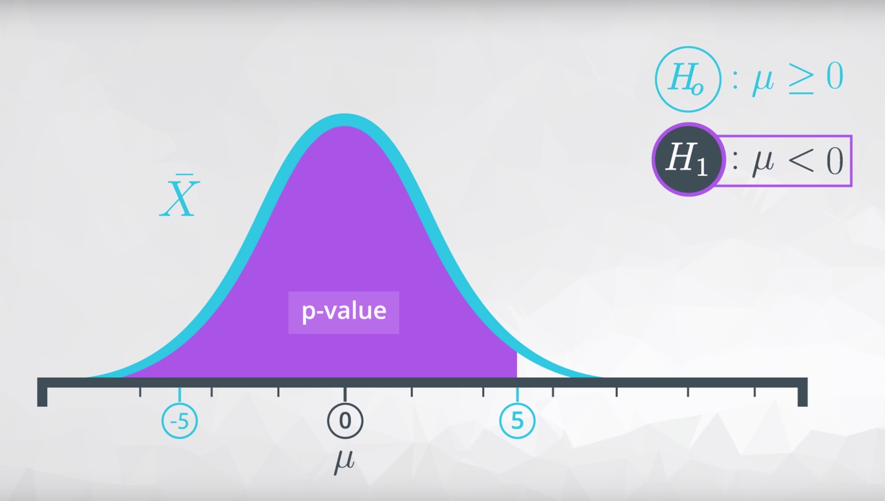
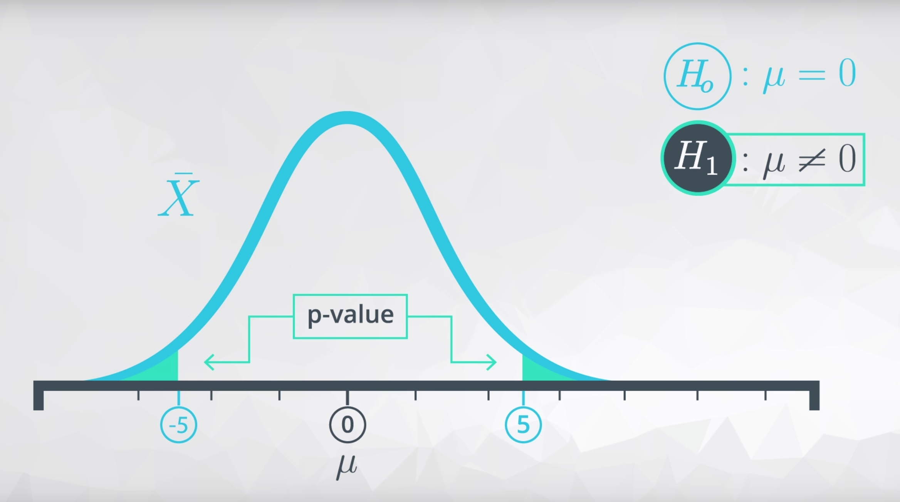

---
tags:
  - statistics
---

# 显著性

## 统计显著性 statistical significance
使用置信区间和假设检验，你能够在做决策时提供统计显著性。

## 实际显著性 practical significance
实际显著性考虑到所处情况（现实环境）的其他因素（更现实），假设检验或置信空间的结果可能不会直接考虑到这种情况。空间、时间或金钱 等约束条件对商业决定很重要。但是可能不会在统计测试中直接考虑这些因素。

## p 值

根据预设的零假设，模拟获得的（正态）分布中，p 值的定义是：**如果零假设为真，观察到统计量（或支持备择假设的更多极端）的概率**，即舍弃预设的零假设，接受备着假设的概率。

根据大数定理和中心极限定理，由零假设模拟产生的正态分布，其均值为中心对称点，而观测到的统计量结合图像上来看p 值，即**图形的相关的阴影**分为三种情况：

* 如果**参数大于**备择假设中的某个数值，为了得到 p 值，你的阴影可能是这样的：


* 如果**参数小于**备择假设中的某个数值，为了得到 p 值，你的阴影可能是这样的：


* 如果**参数不等于**备择假设中的某个数值，为了得到 p 值，你的阴影可能是这样的：


三种情况的阴影面积大小都是**表征了**模拟的量和观测到的统计量关系

### 计算$p$值
1. 根据备择假设的预设值使用函数 `np.random.normal(loc=0.0, scale=1.0, size=None)` **模拟出**统计量（的均值）抽样分布
    * 参数 `loc` 是**零假设中预设**的均值（取等号时的值）
    * 参数 `scale` 根据实际样本数据计算的**抽样分布标准差**
    * 参数 `size` 一般设定为 `10000`（输出尽量多的模拟采样数据以模拟正态分布）

    ```python
    null_sims= np.random.normal(null_hypo_mean, np.std(means), 1000)
    ```

    绘出基于零假设的模拟抽样分布 `null_sims` 和观测值 `sample_mean`

    ```python
    plt.hist(null_sims);
    plt.axvline(x=sample_mean, color='red');
    ```

2. 利用模拟的统计量 `null_sims` 与样本观察得到的统计量 `sample_mean`，基于备择假设的类型作差，求得$p$值（阴影面积）

    `sample_mean` 是指实际样本数据的平均值（观测值）`sample_mean = sample.mean()`

    ```python
    # 左侧阴影，即备择假设为 μ < sample_mean，null_vals`是模拟获得的**样本平均值抽样分布的变量**
    (null_sims < sample_mean).mean()

    # 右侧阴影,即备择假设为 μ > sample_mean
    (null_sims > sample_mean).mean()

    # 双侧阴影，即备择假设 μ ≠ sample_mean，null_mean是模拟获得的**样本平均值抽样分布的均值**（即正态分布的对称点横坐标）
    low_ext = (null_mean - (sample_mean - null_mean))   # 下界
    high_ext = sample1.height.mean()   # 上界

    (null_sims < low_ext).mean() + (null_sims > high_ext).mean()
    ```

### 选择假设
#### 较小$p$值，选择备择假设$H_1$
当 `p` 值**较小**（$< 0.05$或$< 0.01$）时，表征零假设预设得到的模拟值与观测值**相差较远**，应该舍弃零假设，接受备择假设

#### 较大$p$值，选择零假设$H_0$
当 `p` 值**较大**（$> 0.05$）时，表征零假设预设得到的模拟值与观测值**距离较近**，即零假设下模拟的分布可以较高可能性获得观测值，舍弃备择假设

**讨论**：选择哪一个假设是基于$p$值的，设定$p$值大小会与 **I 类错误阈值$\alpha$** 密切相关

* $pval \leq \alpha \Rightarrow$ 拒绝 $H_0$
* $pval > \alpha \Rightarrow$ 不拒绝 $H_0$

