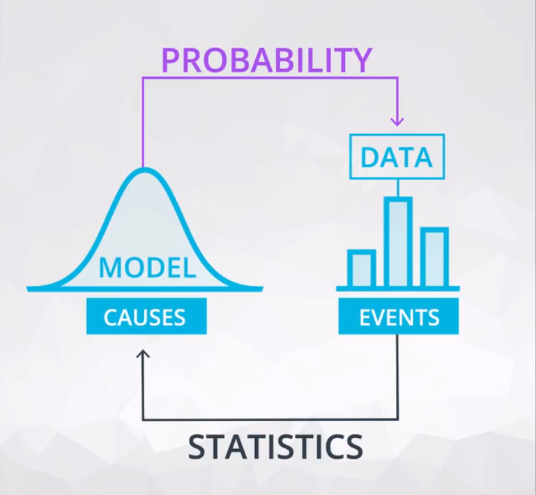

---
tags:
  - statistics
---

# 概率

## 通用法则
* 任何事件的概率在`0`和`1`之间，其中包括`0`和`1`
* **互补事件**的概率为`1`减去某个事件的概率
    ```
    1−P(H)=P(not H)
    ```
    其中`not H`可记为$\neg H$
* 所有可能事件概率的**总和等于`1`**
* 如果**事件是独立的**，一系列可能事件的（同时成立）概率是这些事件发生概率的**乘积**（而**非独立事件**的概率的计算可查阅**条件概率**）

## 概率质量函数 Probability mass function

参考链接：[Probability mass function](https://en.wikipedia.org/wiki/Probability_mass_function)

## 概率和统计的异同
* 概率根据**假定的模型或原因**对未来事件做出**预测**（即预测数据）
* 统计中对**发生的事件中的数据进行分析**从而**推断出**这些模型或原因（利用数据进行预测）



## 条件概率
实际上，某个事件的**结果依赖于之前的事件**，该事件发生的概率为条件概率

任意两个事件的条件概率为：

$$P(A|B)=\frac{P(A\text{ }\cap\text{ }B)}{P(B)}$$

其中$|$代表「鉴于/基于」，$\cap$代表「和」

如**阳性检验测试结果**的**概率依赖于**你是否具有某种特殊条件/前提（如是否患病）而不同

$$P(positive|disease)=\frac{P(positive\text{ }\cap\text{ }disease)}{P(disease)}$$
​
### 贝叶斯法则
贝叶斯定理（贝叶斯公式）能够告知我们如何**利用新证据修改已有的看法**。这个名称来自于[托马斯·贝叶斯](https://zh.wikipedia.org/wiki/%E6%89%98%E9%A9%AC%E6%96%AF%C2%B7%E8%B4%9D%E5%8F%B6%E6%96%AF)。

贝叶斯定理是关于随机事件A和B的条件概率的一则定理，一般事件A在事件B（发生）的条件下的概率$P(A|B)$，与事件B在事件A（发生）的条件下的概率$P(B|A)$是不一样的。

$$P(A|B)=\frac{P(B|A)P(A)}{P(B)}$$

**解释**：
* $P(A|B)$是已知**事件`B`发生后**事件`A`的条件概率，也由于得自`B`的取值而被称作**`A`的后验概率**。
* $P(A)$是事件`A`的**先验概率（或边缘概率）**（之所以称为「先验」是因为**它不考虑任何B方面的因素**）
* $P(B|A)$是已知**事件`A`发生后**事件`B`的条件概率，也由于得自`A`的取值而被称作**`B`的后验概率**。
* $P(B)$是事件`B`的先验概率（或边缘概率）
