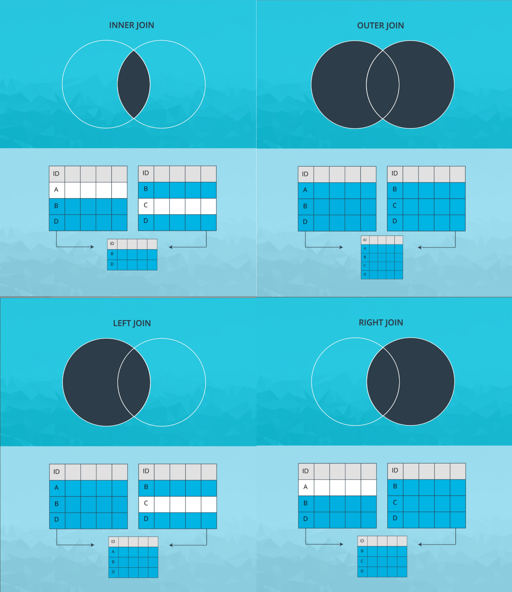

---
tags:
  - pandas
---

# Pandas
* [Pandas](https://pandas.pydata.org/) 是 Python 中的数据操纵和分析软件包
* Pandas 名称取自于**计量经济学*Panel Data*（面板数据）**一词
* Pandas 为 Python 带来了两个新的数据结构，能够轻松直观地处理**带标签数据**和**关系数据**
    * Pandas Series
    * Pandas DataFrame

机器学习需要大量数据，但首先需要检查数据，Pandas 可对数据进行快速分析和操纵，主要的几个功能：

* 允许为行和列**设定标签**，可为**索引指定任何名称**
* 可以针对**时间序列数据**计算滚动**统计学指标**
* 轻松地**处理 `NaN` 值**
* 能够将**不同格式的数据**加载到 DataFrame 中
* 可以将**不同的数据集合**并到一起
* **与 NumPy 和 Matplotlib 集成**

参考：Pandas 文档[https://pandas.pydata.org/pandas-docs/stable/](https://pandas.pydata.org/pandas-docs/stable/)

## 下载
Anaconda 中包含 Pandas

### 安装特定版本
在 Anaconda 提示符处输入 `conda install pandas=0.22` 安装指定 Pandas 版本

### 版本
检查你的 Pandas 版本
* 在 Jupyter notebook 中输入 `!conda list pandas`
* 在 Anaconda 提示符处输入 `conda list pandas`

### 导入
在 Jupyter Notebook 中键入以导入 Pandas，一般命名为 `pd`

```python
import pandas as pd
```

# Pandas Series
Pandas Series（Pandas 序列）是 像*数组*一样的**一维对象**，可以存储很**多类型**的数据（相应地** Numpy **数组中所有元素**类型需要一样**）

## 创建Series
先导入 `pandas` 库，再使用函数 `pd.Series(data, index)` 创建序列，其中 `index` 是一个**索引标签列表**

```python
import pandas as pd

# 创建一个购物清单，清单的元素类型不同，索引改为标签
groceries = pd.Series(data = [30, 6, 'Yes', 'No'], index = ['eggs', 'apples', 'milk', 'bread'])

# We display the Groceries Pandas Series
groceries
```

:hammer:

```shell
eggs           30
apples         6
milk         Yes
bread       No
dtype: object
```

## Series属性

### Series维度
使用属性 `.ndim` 返回序列的维度，一般为 `1`

### Series形状
* 序列的形状是指每个维度的大小，因为序列是一维，因此的返回的是元素的**数量**
* 使用属性 `.shape` 返回序列的维度大小

### Series大小
使用方法 `.size` 返回序列的元素总数

```python
# We print some information about Groceries
print('Groceries has shape:', groceries.shape)
print('Groceries has dimension:', groceries.ndim)
print('Groceries has a total of', groceries.size, 'elements')
```

:hammer:

```shell
Groceries has shape: (4,)
Groceries has dimension: 1
Groceries has a total of 4 elements
```

### 输出索引标签
使用方法 `.index` 单独输出 Series 索引标签

### 输出数据
使用方法 `.values` 输出 Series 元素的值

## 查询索引标签
使用关键字 `in` 查询是否存在某个索引标签，返回布尔值

```python
import pandas as pd

groceries = pd.Series(data = [30, 6, 'Yes', 'No'], index = ['eggs', 'apples', 'milk', 'bread'])

x = 'bananas' in groceries
y = 'bread' in groceries

print('Is bananas an index label in Groceries:', x)
print('Is bread an index label in Groceries:', y)
```

:hammer:

```shell
Is bananas an index label in Groceries: False
Is bread an index label in Groceries: True
```

## 编辑Series
### 访问元素
#### 方括号添加数字索引
* 方括号 `[]` 内添加**数字索引**访问元素，正整数从开头访问数据，使用负整数从末尾访问
* 为了区别使用索引类型，使用属性 `.iloc`（即 integer location）用于**明确表明使用的是数字索引**
* 可输入**数字列表**以访问多个相应的元素

#### 方括号添加索引标签
* 方括号 `[ ]` 内添加**索引标签**访问元素
* 为了区别使用索引类型，使用属性 `.loc`（即 location）用于**明确表明使用的是标签索引**
* 可输入**索引标签列表**以访问多个相应的元素

```python
import pandas as pd
groceries = pd.Series(data = [30, 6, 'Yes', 'No'], index = ['eggs', 'apples', 'milk', 'bread'])

# 使用索引标签访问元素
print('How many eggs do we need to buy:', groceries['eggs'])
# 输入索引标签列表访问多个元素
print('Do we need milk and bread:\n', groceries[['milk', 'bread']])

#使用数字索引访问元素
print('How many eggs and apples do we need to buy:\n',  groceries[[0, 1]])
```

:hammer:

```shell
How many eggs do we need to buy: 30

Do we need milk and bread:
milk       Yes
bread     No
dtype: object

How many eggs and apples do we need to buy:
eggs       30
apples     6
dtype: object
```

### 修改元素
创建好 Pandas Series 后可更改其元素，使用**赋值符号 `=`** 可以将新的值赋给相应的元素

### 删除元素
* 使用方法 `.drop(label)` 删除 Pandas Series 中的条目（元素），但该方法**不会更改原始 Series**，而是返回一个**修改后的副本**
* 使用方法 `.drop(label, inplace=True)` 并将关键字 `inplace` 替代为 `True` 可以原地从 Pandas Series 中删除条目

```python
print('Original Grocery List:\n', groceries)

print('We remove apples (out of place):\n', groceries.drop('apples'))
print('Grocery List after removing apples out of place:\n', groceries)

groceries.drop('apples', inplace = True)
print('Grocery List after removing apples in place:\n', groceries)
```

:hammer:

```shell
Original Grocery List:
eggs           30
apples         6
milk         Yes
bread       No
dtype: object

We remove apples (out of place):
eggs           30
milk         Yes
bread       No
dtype: object

Grocery List after removing apples out of place:
eggs           30
apples         6
milk         Yes
bread       No
dtype: object

Grocery List after removing apples in place:
eggs           30
milk         Yes
bread       No
dtype: object
```

## 运算
### 算术运算
可以对 Series 执行**所有**或**特定**元素级算术运算，还可以导入 NumPy 使用数学函数

:warning: 由于 Pandas 元素的数据类型可并不统一，因此进行运算是需要确保算术运算对于所操作的**元素数据类型有效**

```python
fruits= pd.Series(data = [10, 6, 3,], index = ['apples', 'oranges', 'bananas'])

print('Original grocery list of fruits:\n ', fruits)

# 对序列 fruits 所有元素进行算术运算
print('fruits + 2:\n', fruits + 2) # We add 2 to each item in fruits

# 对序列 fruit 中具体的条目（元素）进行运算
print('Amount of bananas + 2 = ', fruits['bananas'] + 2)

# 导入 NumPy 模块，使用内建函数
import numpy as np
print('SQRT(X) =\n', np.sqrt(fruits))
```

:hammer:

```shell
Original grocery list of fruits:
apples         10
oranges        6
bananas       3
dtype: int64

fruits + 2:
apples         12
oranges        8
bananas       5
dtype: int64

SQRT(X) =
apples            3.162278
oranges         2.449490
bananas        1.732051
dtype: float64
```

# Pandas DataFrame
Pandas DataFrames 是可带**标签的行和列**的**二维数据结构**，可存储**多类型的数据**，类似于电子表格

## 创建DataFrame
使用字典创建 DataFrame
* 使用函数 `pd.DataFrame(dict)` 手动创建 DataFrame
* 传递给函数的是**字典**
    * 字典的元素的**键 `key`** 是 DataFrame 的**列标签**
    * 字典的元素**值 `value`** 是 DataFrame 的数据
* DataFrame 的**行标签**可使用**关键字 `index` 添加**，默认使用数字索引，从 `0` 开始标记行

### 使用列表（数组）字典
创建一个字典传递给 `pd.DataFrame()` 函数，字典中的**所有列表（数组）长度必须一样**。

```python
data = {'Integers' : [1,2,3],
        'Floats' : [4.5, 8.2, 9.6]}

df1 = pd.DataFrame(data)
print("df1 is:\n", df1)

# 创建 DataFrame 并添加标签
df2 = pd.DataFrame(data, index = ['label 1', 'label 2', 'label 3'])
print("df2 is:\n", df2)
```

:hammer:

```shell
df1 is:
        Floats	Integers
0	4.5	1
1	8.2	2
2	9.6	3

df2 is:
	Floats	Integers
label 1	4.5	1
label 2	8.2	2
label 3	9.6	3
```

### 使用 Pandas Series 字典
```python
import pandas as pd

# 创建一个字典，其中 value 是 Pandsa Series 结构，所包含的 index 作为行标签
items = {'Bob' : pd.Series(data = [245, 25, 55], index = ['bike', 'pants', 'watch']),
         'Alice' : pd.Series(data = [40, 110, 500, 45], index = ['book', 'glasses', 'bike', 'pants'])}

# 将字典传递给函数 pd.DataFrame() 其中 key 作为列标签
shopping_carts = pd.DataFrame(items)
shopping_carts
```

:hammer:

```shell
	Alice	Bob
bike	500.0	245.0
book	40.0	NaN
glasses	110.0	NaN
pants	45.0	25.0
watch	NaN	55.0
```

注意：

* DataFrame 以表格形式显示，行和列的标签以**粗体形式显示**
* DataFrame 的**行标签**根据构建字典所用的两个 **Pandas Series 的索引标签**创建而成
* DataFrame 的列标签来自字典的键
* 列**按字母顺序排序**，而不是字典中的顺序（但从数据文件中向 DataFrame 加载数据时，则按照数据原有顺序排列）
* `NaN` 是指非数字（Not a Number），Pandas 用 `NaN` 值填充行或列索引对应的位置中，没有值的元素

### 使用 Python 字典列表
使用由**字典构成元素**的列表，传递给函数 `pd.DataFrame()` 创建 DataFrame

```python
items2 = [{'bikes': 20, 'pants': 30, 'watches': 35},
          {'watches': 10, 'glasses': 50, 'bikes': 15, 'pants':5}]

store_items = pd.DataFrame(items2, index = ['store 1', 'store 2'])
store_items
```

:hammer:

```shell
	bikes	glasses	pants	watches
store 1	20	NaN	30	35
store 2	15	50.0	5	10
```

### 合并产生新DataFrame

#### 合并类型
Pandas 中有四种合并类型：


* 内联 `inner join` 使用两个 dataframe 中的键的**交集**
* 外联 `outer join` 使用两个 dataframe 的键的**并集**
* 左联 `left join` 仅使用来自**左 dataframe 的键**
* 右联 `right join` 仅使用来自**右 dataframe的键**

**键**指我们将进行连接的两个 dataframe 中的**共同列**

#### 函数merge
使用[函数](https://pandas.pydata.org/pandas-docs/stable/merging.html#database-style-dataframe-joining-merging)实现根据一个或多个**键** `key` 将数据帧的合并 `pd.merge(left, right, how='inner')`

* 默认采用 `how='inner'` 的合并形式，可通过修改该参数实现 `left`、`right`、`outer`、`inner` 四种形式
* 可使用参数 `left_on`、`right_on` 设置合并时以**何（几）列**作为相匹配的**键**（即以这些列的值是否匹配，（再根据合并的形式 `how`）来决定是否合并对应的行）

也可以作为方法使用 `df1.merge(df2)` 将 `df1` 与 `df2` 合并，**默认**将 `right=df2` 合并到 `left=df1` 右侧，使用方式是 `inner`


:warning: 区分**附加**方法 `append()` 竖向合并/添加数据

#### 方法join
连接其他数据帧的列，可选择基于标签 `index` 或关键列

```python
>>> caller
    A key
0  A0  K0
1  A1  K1
2  A2  K2
3  A3  K3
4  A4  K4
5  A5  K5

>>> other
    B key
0  B0  K0
1  B1  K1
2  B2  K2

>>> caller.join(other, lsuffix='_caller', rsuffix='_other')   # 添加后缀，为数据帧中名称重复的列添加后缀，以区别开来， lsuffix 左侧数据帧，rsuffix 右侧数据帧
>>>     A key_caller    B key_other
    0  A0         K0   B0        K0
    1  A1         K1   B1        K1
    2  A2         K2   B2        K2
    3  A3         K3  NaN       NaN
    4  A4         K4  NaN       NaN
    5  A5         K5  NaN       NaN

# 按照关键列 key 进行合并，并以 key 列作为行标签
>>> caller.join(other.set_index('key'), on='key')

>>>     A key    B
    0  A0  K0   B0
    1  A1  K1   B1
    2  A2  K2   B2
    3  A3  K3  NaN
    4  A4  K4  NaN
    5  A5  K5  NaN
```

### 加载数据到DataFrame
Pandas 使用不同的函数将不同格式的数据库加载到 DataFrame 中

加载**结构性**文件（使用特定分隔符分隔的数据），可以结合关键字 `sep` 使用，读取数据

#### 加载csv文件
* CSV 是指**使用逗号 `,` 分隔值的数据文件**，是一种简单的数据存储格式
* 使用 `pd.read_csv(file)` [函数](https://pandas.pydata.org/pandas-docs/stable/generated/pandas.read_csv.html)将 CSV 文件加载到 Pandas DataFrame 中，默认关键字 `sep = ','`，修改此参数可以使用该函数读取**使用其他分隔符**存储的数据文件。
* 使用关键字 `header = row_number` 指定文件的哪一行作为**标题**（即指定了**列标签**），通常数据文件第一行作为标题。
    * 如果**文件顶部有额外的元信息**，则需要指定另外的行作为标题行
    * 如果数据文件中**不包括列标签**，可以使用 `header=None` 取消将数据文件第一行作为列标签
    * 可以使用关键字 `names` **自定义标题（列标签）**，通过 `names=labels` 手动添加标签，其数量应该与数据集的 `columns` 数量相同
* 索引除了可使用默认索引（从 0 递增 1 的整数）之外，还可以将一个或多个**列指定为数据框的（行）索引**，使用关键字 `index_col='Name'` 指定列作为行索引


## 查看DataFrame
### 查看数据集部分数据
* 使用方法 `.head(N)` 查看数据集前 `N` 行的数据，默认查看前5行数据
* 使用方法 `.tail(N)` 查看数据集最后 `N` 行的数据，默认查看最后5行数据

### 查看数据集NaN情况
使用方法 `.isnull` 和 `.any()` 检查**任何列**（默认参数 `axis=0`）是否包含 `NaN` 值，可修改参数 `axis=1` 检查**任何行**是否包含 `NaN` 值

结合方法 `.sum()` 统计**列数（或行数）**


### 查看数据集统计信息
使用方法 `.describe()` 返回**每列**的描述性统计信息：
* `count` 统计每列的行数
* `mean` 计算每列的平均值
* `std`
* `min`
* `25%`
* `50%`
* `75%`
* `max`

可以给方法传递**列名**返回**特定列的描述性统计信息**

### 查看唯一值
* 使用方法 `.describe()` 查询**类型为 `object`（即字符串）列**的唯一值信息

* 使用函数 `np.unique(df[['column_name']])` 返回 dataframe 特定列 `column_name` 中的**非空唯一值**

    :warning: 访问 `column_name` 需要使用**双方括号 `[[]]`** 包括，返回一个** Series 类型**

* 使用函数 `pd.value_counts(df)` 返回一个对唯一值统计的 list

    使用 `len(pd.value_counts(df['column_name']).index)` 返回特定列的唯一值个数


### 相关性
使用 `.corr()` 方法获取不同列之间的关联性

### 分组数据
使用方法 `.groupby()` 能够以不同的方式**对数据分组**

对于没有明确分组的变量（如连续变量），可以使用[函数](https://pandas.pydata.org/pandas-docs/stable/generated/pandas.cut.html) `pd.cut(x, bins)`** 对数据进行自定义（按照 `bin` 作为标准）切分**，默认划分为**左开右闭区间**

* 输入的 `x` 是**一维**的 `array` 对象
* 参数 `bins` 设置分组方法
    * 当 `bins=n`（`n` 为正整数），则将数据 `x` 分成等大小的 `n` 份，返回一个区间 Serise（记录 `x` 中各元素所在的区间）
    * 若 `bins=list`（`list` 为列表，其中元素**从小到大依次排列**），则将数据按照列表元素划分区间，返回一个区间 Series（记录 `x` 中各元素所在的区间）
* 可使用 `index=list_name` 为划分的区间**命名**，注意 `list_name` 标签数量和划分区间数量相同

具体方法参阅：[pandas的cut&qcut 函數](https://medium.com/@morris_tai/pandas%E7%9A%84cut-qcut%E5%87%BD%E6%95%B8-93c244e34cfc)

```python
data = pd.read_csv('./fake_company.csv')
data

# 按照年份分组（行标签），分析薪资的总和（列标签）
data.groupby(['Year'])['Salary'].sum()

# 依次按照年份和部门分组（行标签），分析薪资的总和（列标签）
data.groupby(['Year', 'Department'])['Salary'].sum()
```

:hammer:

```shell
        Year	Name	Department	Age	Salary
0	1990	Alice	HR	25	50000
1	1990	Bob	RD	30	48000
2	1990	Charlie	Admin	45	55000
3	1991	Alice	HR	26	52000
4	1991	Bob	RD	31	50000
5	1991	Charlie	Admin	46	60000
6	1992	Alice	Admin	27	60000
7	1992	Bob	RD	32	52000
8	1992	Charlie	Admin	28	62000

Year
1990     153000
1991     162000
1992     174000
Name: Salary, dtype: int64

Year     Department
1990    Admin              55000
             HR                    50000
             RD                    48000
1991    Admin              60000
             HR                    52000
             RD                    50000
1992    Admin            122000
             RD                    52000
Name: Salary, dtype: int64
```

## DataFrame属性
使用属性从 DataFrame 中提取信息

### DataFrame元素数据类型
使用属性 `.dtypes` 查看**每列元素的类型**

Pandas 实际上将 dataframe 和序列中的**字符串存储为[指针](https://en.wikipedia.org/wiki/Pointer_(computer_programming))**，因此，数据类型是 `object` 而不是 `str`

### DataFrame维度
使用属性 `.ndim` 返回 DataFrame 维度，一般为 `2`

### DataFrame形状

* 数据框的形状是指每个维度的大小，因为序列是二维，因此的返回的分别是**行和列的数量**
* 使用属性 `.shape` 返回 DataFrame 各维度大小

### DataFrame大小
使用属性 `.size` 返回 DataFrame 大小，即元素个数

### 输出数据
使用属性 `.values` 返回 DataFrame 数据部分

### 输出行标签
使用属性 `.index` 返回 DataFrame 行标签

### 输出列标签
使用属性 `.columns` 返回 DataFrame 列标签

```python
data = {'Bob' : pd.Series([245, 25, 55]),
        'Alice' : pd.Series([40, 110, 500, 45])}

df = pd.DataFrame(data)

print('shopping_carts has shape:', shopping_carts.shape)
print('shopping_carts has dimension:', shopping_carts.ndim)
print('shopping_carts has a total of:', shopping_carts.size, 'elements')

print('The data in shopping_carts is:\n', shopping_carts.values)
print('The row index in shopping_carts is:', shopping_carts.index)
print('The column index in shopping_carts is:', shopping_carts.columns)
```

:hammer:

```shell
shopping_carts has shape: (5, 2)
shopping_carts has dimension: 2
shopping_carts has a total of: 10 elements

The data in shopping_carts is:
[[    500.    245.]
[       40.     nan]
[     110.     nan]
[       45.      25.]
[     nan       55.]]

The row index in shopping_carts is: Index(['bike', 'book', 'glasses', 'pants', 'watch'], dtype='object')
The column index in shopping_carts is: Index(['Alice', 'Bob'], dtype='object')
```

## 访问元素
### 访问部分数据
* 通过关键字 `pd.DataFrame(index, columns)` 访问部分数据
* 使用方法 `df.loc[:,'column_1':'column_2']` 通过**列标签**访问从 `column_1` 到 `column_2` 列的所有行
* 使用方法 `df.iloc[:,column_number1:column_number2]` 通过**列数字标签**访问从 `column_1` 到 `column_number2` 列的所有行

```python
import pandas as pd

items = {'Bob' : pd.Series(data = [245, 25, 55], index = ['bike', 'pants', 'watch']),
         'Alice' : pd.Series(data = [40, 110, 500, 45], index = ['book', 'glasses', 'bike', 'pants'])}

shopping_carts = pd.DataFrame(items)
shopping_carts

bob_shopping_cart = pd.DataFrame(items, columns=['Bob'])
bob_shopping_cart
```

:hammer:

```shell
	Alice	Bob
bike	500.0	245.0
book	40.0	NaN
glasses	110.0	NaN
pants	45.0	25.0
watch	NaN	55.0

	Bob
bike	245
pants	25
watch	55
```

:bulb: 使用关键字 `np.r_` 访问不连续的列

```python
import numpy as np
# 访问 dataframe 不连续的列，即第0列和第1列，第23列至第32列
df.iloc[:,np.r_[:2, 23:33]]
```

### 访问列
使用列标签组成的**列表**查询多个（单个）列数据 `df[['columns_name1', 'columns_name2']]`

同样可以使用点 `.` 访问相应的列，`df.volumn_name` 返回相应的列，类型为 Series，结果与前一种方法相同。

### 访问行
使用行标签组成的**列表**，并用属性 `.loc` 查询多（单）行数据 `df.loc[['index1', index2']]`

### 访问元素
使用行标签和列标签查询对应元素的值 `df[column][row]`

:warning: 标签顺序是先给出**列标签**，再给出**行标签**

```python
# We print the store_items DataFrame
print(store_items)

# We access rows, columns and elements using labels
print()
print('How many bikes are in each store:\n', store_items[['bikes']])
print()
print('How many bikes and pants are in each store:\n', store_items[['bikes', 'pants']])
print()
print('What items are in Store 1:\n', store_items.loc[['store 1']])
print()
print('How many bikes are in Store 2:', store_items['bikes']['store 2'])
```

:hammer:

```shell
	bikes	glasses	pants	watches
store 1	20	NaN	30	35
store 2	15	50.0	5	10

How many bikes are in each store:

	bikes
store 1	20
store 2	15

How many bikes and pants are in each store:

	bikes	pants
store 1	20	30
store 2	15	5

What items are in Store 1:

	bikes	glasses	pants	watches
store 1	20	NaN	30	35

How many bikes are in Store 2: 15
```

### 方法query
使用方法 `.query('condition_expr')` 返回满足表达式 `econdition_expr`（即布尔值为 `True`）的数据集，其中 `condition_expr` 是一个条件表达式，与**特定列**相关的条件运算，返回一个布尔值

```python
import pandas as pd

# 使用方法 query 筛选出 diagnosis 项的值等于 M 的数据项（行）
df_m = df.query('diagnosis == "M"')
#实现相同功能的方法
df_m = df[df['diagnosis'] == 'M']
```

:warning:
* 条件表达式需要使用**单引号 `''` 括起来**
* 条件语句中的字符串则用双引号 `""` 括起来，但**列标签**不需要，可（类似变量）直接使用
* 可使用关键词构建**复杂的条件表达式**：
    * `&` 和 `and` 表示条件**和**
    * `|` 和 `or` 表示条件**或**

## 添加元素
### 添加列
* 类似于字典添加新元素的方式，通过 `df[new_column_name] = [value1, value2, value3]`（假设 `df` 含有三行数据）
* 默认将新列添加到了 DataFrame 的**末尾**

### 添加列到特定的行
仅向 DataFrame 中**特定行**添加新的列，其他行使用 `NaN` 填充。

使用方法 `.insert(loc, label, data)` 将列插入到**指定的位置**，关键字 `loc` 指定新列插入到哪个**索引前**，并以 `label` 作为列标签

### 添加行
需要使用方法 `.append()` 将新的 **DataFrame** 添加到原始数据框的末尾，若添加的新 DataFrame 引入新的列后，所有**列会按照字母顺序排序**

```python
# 打印原始的数据框
print(store_items)

# 添加列
store_items['shirts'] = [15,2]
store_items

# 添加行
# 先创建新的 DataFrame
new_items = [{'bikes': 20, 'pants': 30, 'watches': 35, 'glasses': 4}]
new_store = pd.DataFrame(new_items, index = ['store 3'])
new_store
store_items = store_items.append(new_store)
store_items

# 使用运算（直接截取/指定） 部分数据产生新的列
# 只往特定行添加新的列
# 在商店 2 和 3 中上一批新手表，并且新手表的数量与这些商店原有手表的库存一样
store_items['new watches'] = store_items['watches'][1:]
store_items

# 特定位置插入新列，使用方法 .insert(loc, label, data) 指定插入的位置
# 将名称为 shoes 的新列插入 suits 列前面（因为 suits 的数字索引值为 4）
store_items.insert(4, 'shoes', [8,5,0])
store_items
```

:hammer:

```shell
	bikes	glasses	pants	watches
store 1	20	NaN	30	35
store 2	15	50.0	5	10

	bikes	glasses	pants	watches	shirts
store 1	20	NaN	30	35	15
store 2	15	50.0	5	10	2

	bikes	glasses	pants	watches
store 3	20	4	30	35

	bikes	glasses	pants	shirts	suits	watches
store 1	20	NaN	30	15.0	45.0	35
store 2	15	50.0	5	2.0	7.0	10
store 3	20	4.0	30	NaN	NaN	35

	bikes	glasses	pants	shirts	suits	watches	new watches
store 1	20	NaN	30	15.0	45.0	35	NaN
store 2	15	50.0	5	2.0	7.0	10	10.0
store 3	20	4.0	30	NaN	NaN	35	35.0

	bikes	glasses	pants	shirts	shoes	suits	watches	new watches
store 1	20	NaN	30	15.0	8	45.0	35	NaN
store 2	15	50.0	5	2.0	5	7.0	10	10.0
store 3	20	4.0	30	NaN	0	NaN	35	35.0
```

## 删除元素
### 方法pop
使用方法 `.pop()` 允许我们**删除列**，一般默认删除**最后一列**

### 方法drop
使用方法 `.drop()` 可以同时用于删除行和列，使用关键字 `axis` 指定要删除的维度，`axis = 0` 指行，`axis = 1` 指列

### 删除重复项（行）
* 使用方法 `.drop_duplicates(subset=None, keep='first', inplace=False)` 删除重复项
* 使用方法 `.drop_duplication(subset_column)` 根据指定的列 `subset_column` 重复情况删除相应的项
* 删除默认输出**副本**，可以将关键字设置为 `inplace = True` 在原数据上修改
* 关键字 `keep='first'` 默认保留第一次出现的项，删除其余的重复项，可更改为 `keep='last'` 将保留项选为最后出现的重复项

```python
store_items

# 删除最后一列 new watches
store_items.pop('new watches')
store_items

# 删除指定列，轴设置为 axis = 1，列标签为 watches 和 shoes
store_items = store_items.drop(['watches', 'shoes'], axis = 1, inplace = True)
store_items

# 删除指定行，轴设置为 axis = 0，行标签为 store 2 和 store 1
store_items = store_items.drop(['store 2', 'store 1'], axis = 0, inplace = True)
store_items

# 在原始的 df 删除重复项
df.drop_duplicates(inplace=True)

# 检查 df 中是否还有项
print('The duplicated entries is: ', sum(df.duplicated())
```

:hammer:

```shell
	bikes	glasses	pants	shirts	shoes	suits	watches	new watches
store 1	20	NaN	30	15.0	8	45.0	35	NaN
store 2	15	50.0	5	2.0	5	7.0	10	10.0
store 3	20	4.0	30	NaN	0	NaN	35	35.0

	bikes	glasses	pants	shirts	shoes	suits	watches
store 1	20	NaN	30	15.0	8	45.0	35
store 2	15	50.0	5	2.0	5	7.0	10
store 3	20	4.0	30	NaN	0	NaN	35

	bikes	glasses	pants	shirts	suits
store 1	20	NaN	30	15.0	45.0
store 2	15	50.0	5	2.0	7.0
store 3	20	4.0	30	NaN	NaN

	bikes	glasses	pants	shirts	suits
store 3	20	4.0	30	NaN	NaN

The duplicated entries is: 0
```

## 更改标签
使用方法 `.rename()` 更改行和列标签，列标签关键词为 `columns`，行标签关键词为 `index`

:warning: 该修改默认**不在原数据集**上修改，可设置参数 `inplace = True` 直接在原数据上修改

```python
store_items

# 将列标签 bikes 改为 hats
store_items = store_items.rename(columns = {'bikes': 'hats'}, inplace = True)

# 将行标签 store 3 改为 last store
store_items = store_items.rename(index = {'store 3': 'last store'}, inplace = True)

store_items
```

:hammer:

```shell
	bikes	glasses	pants	shirts	suits
store 3	20	4.0	30	NaN	NaN

	        hats	glasses	pants	shirts	suits
last store	20	4.0	30	NaN	NaN
```

### 将行索引改为单独列
使用方法 `.set_index(new_columns_name)` 为**行索引**设置**列标签**

```python
store_items

store_items = store_items.set_index('pants')
store_items
```

:hammer:

```shell
	        hats	glasses	pants	shirts	suits
last store	20	4.0	30	NaN	NaN

pants	hats	glasses	shirts	suits
30	20	4.0	NaN	NaN
```

## 处理元素/清理数据
* 离群值
* 不正确的值
* 缺少值

### 缺少值
Pandas 会为缺少的值的元素分配 `NaN` 值,使用大型数据集训练学习算法之前需要**检测和处理 `NaN` 值**

#### 计算 `NaN` 数量
##### 计算 `NaN` 总个数
* 使用方法 `.isnull()` 返回一个大小和 store_items 一样的**布尔型 DataFrame**
* 用 `True` 表示具有 `NaN` 值的元素，用 `False` 表示非 `NaN` 值的元素
* 在 Pandas 中，逻辑值 `True` 的数字值是 `1`，逻辑值 `False` 的数字值是 `0`，可以**通过数逻辑值 `True` 的数量数出 `NaN` 值的数量**
* 结合方法 `.sum()` 可以统计 `NaN` 的数量
    * 使用一次方法 `.sum()` 返回一个 Pandas Series，存储了**列上的逻辑值 `True` 的数量**（即 `NaN` 数量）
    * 再使用一次方法 `.sum()` 返回 DataFrame 总的 `NaN` 数量

```python
items2 = [{'bikes': 20, 'pants': 30, 'watches': 35, 'shirts': 15, 'shoes':8, 'suits':45},
{'watches': 10, 'glasses': 50, 'bikes': 15, 'pants':5, 'shirts': 2, 'shoes':5, 'suits':7},
{'bikes': 20, 'pants': 30, 'watches': 35, 'glasses': 4, 'shoes':10}]

store_items = pd.DataFrame(items2, index = ['store 1', 'store 2', 'store 3'])
store_items

store_items.isnull()

store_items.isnull().sum()

x =  store_items.isnull().sum().sum()
print('Number of NaN values in our DataFrame:', x)
```

:hammer:

```shell
	bikes	glasses	pants	shirts	shoes	suits	watches
store 1	20	NaN	30	15.0	8	45.0	35
store 2	15	50.0	5	2.0	5	7.0	10
store 3	20	4.0	30	NaN	10	NaN	35

	bikes	glasses	pants	shirts	shoes	suits	watches
store 1	False	True	False	False	False	False	False
store 2	False	False	False	False	False	False	False
store 3	False	False	False	True	False	True	False

bikes            0
glasses        1
pants           0
shirts           1
shoes          0
suits            1
watches      0
dtype: int64

Number of NaN values in our DataFrame: 3
```

##### 分维度统计 `NaN` 数量
使用函数 `df.count()` 返回**非缺失值**个数（默认按列），设置**参数 `axis` 如 `axis=1` 按照行来数非缺失值的个数**

```python
df

# 每列缺失值的个数
df.shape[0] - df.count()

# 每行缺失值的个数
df.shape[1] - df.count(axis=1)
```

:hammer:

```shell
       a           c          b
0      1          3          NaN
1      2          5          0
2      3         NaN      NaN
3      4         NaN      0

a    0
b    2
c    2

0      1
1      0
2      2
3      1
```

##### 方法 `count`
直接使用方法 `.count` 统计**非 `NaN` 值**得数量

```python
items2 = [{'bikes': 20, 'pants': 30, 'watches': 35, 'shirts': 15, 'shoes':8, 'suits':45},
{'watches': 10, 'glasses': 50, 'bikes': 15, 'pants':5, 'shirts': 2, 'shoes':5, 'suits':7},
{'bikes': 20, 'pants': 30, 'watches': 35, 'glasses': 4, 'shoes':10}]

store_items = pd.DataFrame(items2, index = ['store 1', 'store 2', 'store 3'])
store_items

print('Number of non-NaN values in the columns of our DataFrame:\n', store_items.count())
```

:hammer:

```shell
	bikes	glasses	pants	shirts	shoes	suits	watches
store 1	20	NaN	30	15.0	8	45.0	35
store 2	15	50.0	5	2.0	5	7.0	10
store 3	20	4.0	30	NaN	10	NaN	35

Number of non-NaN values in the columns of our DataFrame:
bikes            3
glasses        2
pants           3
shirts           2
shoes          3
suits            2
watches      3
dtype: int64
```

#### 处理 `NaN`

##### 删除 `NaN`
使用方法 `.dropna(axis)` 删除包含 `NaN` 值得任何行或列，其中 `axis = 0` 指行，`axis = 1` 指列。修改参数 `subset=['column1', 'column2']` 指定删除**特定列中含有 `NaN` 值**的行。

:warning: 方法 `.dropna()` 中要将**关键字设置为 `inplace=True`**，才可在原始 df 中删除目标行或列。

```python
items2 = [{'bikes': 20, 'pants': 30, 'watches': 35, 'shirts': 15, 'shoes':8, 'suits':45},
{'watches': 10, 'glasses': 50, 'bikes': 15, 'pants':5, 'shirts': 2, 'shoes':5, 'suits':7},
{'bikes': 20, 'pants': 30, 'watches': 35, 'glasses': 4, 'shoes':10}]

store_items = pd.DataFrame(items2, index = ['store 1', 'store 2', 'store 3'])
store_items

# We drop any rows with NaN values
store_items.dropna(axis = 0, inplace = True)

# We drop any columns with NaN values
store_items.dropna(axis = 1, inplace = True)
```

:hammer:

```shell
	bikes	glasses	pants	shirts	shoes	suits	watches
store 1	20	NaN	30	15.0	8	45.0	35
store 2	15	50.0	5	2.0	5	7.0	10
store 3	20	4.0	30	NaN	10	NaN	35

	bikes	glasses	pants	shirts	shoes	suits	watches
store 2	15	50.0	5	2.0	5	7.0	10

	bikes	pants	shoes	watches
store 1	20	30	8	35
store 2	15	5	5	10
store 3	20	30	10	35
```

##### 填充NaN

使用**方法 `.fillna()`** 填充 `NaN`，可选择多种填充方式；或使用**方法 `.interpolate()`** 填充 `NaN`，可选择不同的**插值方法**

* 方法 `.fillna()` 填充**特定值**

    ```python
    # 使用 0 填充 NaN
    store_items.fillna(0)
    store_items
    ```

    :hammer:

    ```shell
    	bikes	glasses	pants	shirts	shoes	suits	watches
    store 1	20	0.0	30	15.0	8	45.0	35
    store 2	15	50.0	5	2.0	5	7.0	10
    store 3	20	4.0	30	0.0	10	0.0	35
    ```

* 方法 `.fillna()` 前向填充
将方法关键字 `method` 设置为 `'ffill'`，会沿着给定 `axis` 使用上个已知值替换 `NaN`值，当 `axis = 0` 时**即以上一行**对应位置的值填充；当 `axis = 1` 时以**即以前一列**对应位置的值填充

* 方法 `.fillna()` 后向填充
将方法关键字 `method` 设置为 `'backfill'`，沿着给定 `axis` 使用下个已知值替换 `NaN` 值

* 常使用列的**平均值**填充相应列的 `NaN`
使用 `df.fillna(df.mean(), inplace=True)` 实现均值填充

* 方法 `.interpolate()` 的 `linear` 函数插值
使用 `.interpolate(method = 'linear', axis)` 方法，利用 `linear` 函数计算插值

```python
# 使用 linear 函数进行 interpolation using column values
store_items.interpolate(method = 'linear', axis = 0)
```

:hammer:

```shell
	bikes	glasses	pants	shirts	shoes	suits	watches
store 1	20	NaN	30	15.0	8	45.0	35
store 2	15	50.0	5	2.0	5	7.0	10
store 3	20	4.0	30	2.0	10	7.0	35
```

`store 3` 中的两个 `NaN` 值被替换成了线性插值。但是注意 `store 1` 中的 `NaN` 值没有被替换掉。因为该 `NaN` 值是该列中的第一个值（即**没有前一行**），因此**插值函数无法计算值**，可改用 `axis = 1` 根据前一列相应位置计算插值。

:warning: 同样地 `.interpolate()` 方法不在原地替换 `NaN` 值，将**关键字 `inplace` 设为 `True`**

### 重复行

#### 查看重复行
* 使用方法 `df.duplicated()` 返回一个 pandas Series 使用布尔值 `False` 或 `True` 来表示对应行是否味重复行。
* 使用函数 `sum(df.duplicated())` 统计 dataframe 中重复值

#### 删除重复行
* 使用方法 `.drop_duplicates(subset=None, keep='first', inplace=False)` 删除重复项
* 默认以**所有列的值相同**为重复行评判标准，可以修改**关键词 `subset=column_name`** 根据指定的列 `subset_column` 重复情况寻找特殊的重复行
* 删除默认输出**副本**，可以将关键字设置为 `inplace = True`，直接在原数据上修改
* 关键字 `keep='first'` 默认保留第一次出现的项，删除其余的重复项，可更改为`keep='last'` 将保留项选为最后出现的重复项

```python
# 在原始的 df 删除重复项
df.drop_duplicates(inplace=True)

# 检查 df 中是否还有项
print('The duplicated entries is: ', sum(df.duplicated())
```

### 数据提取

#### 从字符串中提取整型
使用方法 `.str.extract('(\d+)').astype(int)` 其中 `\d+` 是正则表达式，用以匹配**数字**

#### 分裂数据

##### 分裂为行
结合[函数](https://pandas.pydata.org/pandas-docs/stable/generated/pandas.DataFrame.apply.html) `.apply` 和 Lambda 表达式创建一个函数，沿着特定 `axis` 方向对每个元素进行操作并用运算**返回的值取代相应元素**

```python
# 对使用分隔符 / 包含多个值的单元格数据进行拆分为相应的多行，数据类型为 str

# 提取数据框中特定列 fuel 中包含分隔符 / 对应的行
df_multi = df[df['fuel'].str.contains('/')]
df_multi
```

:hammer:

```shell
                    model  displ        cyl      trans  drive           fuel    veh_class    air_pollution_score  city_mpg    hwy_mpg    cmb_mpg  greenhouse_gas_score  smartway
582    MERCEDES-BENZ C300    3.0    (6 cyl)    Auto-L7    2WD    ethanol/gas    small car                    6/4     13/18      19/25      15/21                   7/6        no
```

```python
# 查询获得只有一项数据的 fuel 列含有多个值
# 由于单个单元格包含的复合值数量是两个，需要创建相应的数据项两个副本
df1 = df_multi.copy()   # 每个混合动力车第一种燃料类型的数据
df2 = df_multi.copy()   # 每个混合动力车第二种燃料类型的数据

# 可以找到除了目标列 fuel 含有多个值以外，另外几个特征也使用分隔符 / 包含多个值，在分隔时需要统一处理，使用列表 split_columns 收集这些列标签
split_columns = ['fuel', 'air_pollution_score', 'city_mpg', 'hwy_mpg', 'cmb_mpg', 'greenhouse_gas_score']

# 对每个数据框副本的每个列应用分割功能
for c in split_columns:
    df1[c] = df1[c].apply(lambda x: x.split("/")[0])   # 提取分割获得的第一个值替换复合值
    df2[c] = df2[c].apply(lambda x: x.split("/")[1])   # 提取分割获得的第二个值替换复合值

# 合并两个数据框
new_rows = df1.append(df2)

# 丢弃原始数据行
df_08.drop(df_multi.index, inplace=True)

# 添加新分割的行，注意添加时需要忽略行标签（构建的数据框 new_rows 两行的标签都是 582），将新添加的行加到末尾
df = df.append(new_rows, ignore_index=True)
df_08.tail()
```

:hammer:

```shell
	model	displ	cyl	trans	drive	fuel	veh_class	air_pollution_score	city_mpg	hwy_mpg	cmb_mpg	greenhouse_gas_score	smartway
982	VOLVO XC 90	3.2	(6 cyl)	Auto-S6	2WD	Gasoline	SUV	7	14	20	16	4	no
983	VOLVO XC 90	3.2	(6 cyl)	Auto-S6	4WD	Gasoline	SUV	7	14	20	16	4	no
984	VOLVO XC 90	4.4	(8 cyl)	Auto-S6	4WD	Gasoline	SUV	7	13	19	15	3	no
985	MERCEDES-BENZ C300	3.0	(6 cyl)	Auto-L7	2WD	ethanol	small car	6	13	19	15	7	no
986	MERCEDES-BENZ C300	3.0	(6 cyl)	Auto-L7	2WD	gas	small car	4	18	25	21	6	no
```
##### 分裂为列


### 数据类型转换

#### 将浮点型转换为整数型
使用方法 `.astype(int)` 将浮点数据转换为**整数型**

## 数据可视化
:warning: 若使用 Jupyter notebook 进行可视化操作并显示，需要在代码框输入 `% matplotlib inline`

### 通用绘图
使用方法 `.plot（kind='plot_method')` 过关键字 `kind` 设置图形类型，如
* 直方图 `hist`
* 柱形图 `bar`
* 饼图 `pie`
* 箱线图 `box`

:bulb: 绘制基于**分类统计**的图形时（如柱状图，饼图等），可使用方法 `value_counts()` 来快速**统计每种值得数量**

### 直方图
使用方法 `.hist()` 绘制直方图，

### 散点图

#### 单个散点图
使用方法 `.plot.scatter(x='column_1', y='column_2')`

#### 散点图矩阵
使用函数 `pd.scatter_matrix(dataframe)` 绘制多变量间（各列属性）散点图阵列，快速了解变量间得**相关关系**

### 调整画布大小
使用关键字 `figsize=(x, y)` 将画布设置成 `x*y` 的大小

## 导出DataFrame
将数据框导出

### 写入CSV文件
使用方法 `.to_csv('file_name')` 将 dataframe 保存到 `csv` 文件中

:warning: 默认保存**索引**，若需要忽略（不保存索引**参数修改为 `index=False`**）