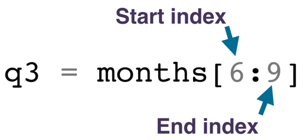
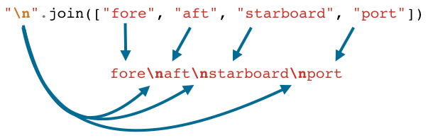

# 列表

## 列表定义
* 列表使用**方括号 `[]`** 定义，列表内的**元素**用逗号 `,` 分开。
* 列表是**可改变**的**有序**元素序列。
* 列表元素可以**多种数据类型**混合在一起。

## 查找元素
* 通过**索引**来查找列表中的各个元素。
* **第一个元素索引编号为 `0`**，而不是 `1`。（称为 **「零索引」**）
* 元素的索引编号代表**元素与列表开头的距离**。第一个元素距离开头有 0 个元素，第二个元素有一个元素，以此类推。
* 可从列表的**末尾进行索引**。 要从列表的末尾索引需要使用**负索引**。索引 `-1` 是指列表的最后一个元素，`-2` 是倒数第二个，以此类推。

## 索引错误
如果尝试索引列表中不存在的元素，将导致**列表索引异常（List Index Exception）**，即导致 `IndexError`。
一般引起错误都是因为**进行索引时编号差 1**，可以使用 `print` 函数打印索引的元素以纠错。

## 列表切片
使用切片操作 Slice 来访问列表的**子序列**。切片获得的元素遵循：**下限索引包含在内，上限索引排除在外**。



:warning: 切片**不包括右侧索引**（即索引编号为 `9` 所对应的元素），但包括**左侧索引**（即索引编号为 `6` 所对应的元素）。

**简化方式**

```python
mothon = ['January', 'February', 'March', 'April', 'May', 'June', 'July', 'August', 'September', 'October', 'November', 'December']

# 获得一个从原始列表开头开始的子列表简化代码
first_half = months[:6]
print(first_half)

# 获取以列表的末尾结束的子列表
second_half = months[6:]
print(second_half)
```

:warning:
* **切片操作永远不会导致 `IndexError`**，如果切片尝试提取字符串末尾之外的字符（即 `index` 超出了范围），**将返回至多能获取的字符**，即使什么也没有—。
* 使用全切片返回的是一个**副本**，如 `word[:]` 返回的将是一个 `word` 的副本

## 列表修改
结合 **`range()` 函数**和 **`len()` 函数**以及 **`for` 循环**语句，遍历列表元素作出相应的修改。

* 使用 `len()` 函数获取**列表长度（元素个数）**
* 使用 `range()` 函数为列表中的每个值生成**索引（列表）**

```python
indexes = range(len(List_name))
```

* `for` 循环遍历修改列表元素

```python
for index in indexes:
    code block
```

## 列表推导式/列表解释
python 特有的**快捷创建列表**方式

```python
capitalized_cities = []
for city in cities:
    capitalized_cities.append(city.title())
```

可简写为列表推导式

```python
# 对 cities 中的每个元素 city 调用 city.title()
capitalized_cities = [city.title() for city in cities]
```

* 使用方括号 `[]` 创建列表推导式
* 第一部分包含要**对可迭代对象中的每个元素**进行**评估的条件**（即缩进的操作代码部分）
* 第二部分使用 `for` 循环遍历所有的元素
* 若插入 `if` 条件语句，需放在 `for` 循环后面

```python
squares = [x**2 for x in range(9) if x % 2 == 0]
```

若同时还需要插入 `else` 语句，则将 `if-else` 组合语句放在第一部分和第二部分之间

```python
squares = [x**2 if x % 2 == 0 else x + 3 for x in range(9)]
```

## 列表组合
* 使用 `zip()` 函数可将 **多个列表（或可迭代对象）组合** 为由相应 **元组序列组成的一个迭代器（列表形式）**

其中每个元组都包含所有可迭代对象中在**该位置（对应索引位置）的元素。**

显示该迭代器的元素需要先将其**转换为列表**（类似于 `range()` 的[情况](./实用函数和方法.md)）

```python
items = ['bananas', 'mattresses', 'dog kennels', 'machine', 'chesses']
weights = [15, 34, 42, 120, 5]
#使用 list() 函数将迭代器转换为列表
print(list(zip(items, weights)))
```

```python
list(zip(['a','b','c'],[1,2,3]))
```

:hammer:

```shell
[('a',1),('b',2),('c',3)]
```
相当于将多个可迭代对象**压缩**到一个里面。

### 拆分列表/迭代器

选择 **`for` 循环拆分** 每个元组

```python
letters = ['a', 'b', 'c']
nums = [1, 2, 3]
for letter, num in zip(letters, nums):
    print("{}:{}".format(letter, num))
```

:hammer:

```shell
# 逐个取出元组
a:1
b:2
c:3
```

### 拆封列表/迭代器
使用**字符星号 `*`** 将组合为元组的**列表拆封**形成相应个数的「独立」**元组（tuple）**

```python
some_list = [('a', 1),('b', 2),('c',3)]
letters, nums = zip(*some_list)
```

:hammer:

```shell
('a', 'b', 'c')
(1, 2, 3)
```

## 列表与字符串关系

### 可变性 Mutability
表示对象可否**修改**的术语是可变性 mutability

#### 相同点
列表与字符串相似均支持
* 索引
* 切片
* `len` 函数
* `in` 运算符

```python
# 索引，均为零索引
>>> sample_string = "And Now For Something Completely Different"
>>> sample_list = ['Graham', 'John', 'Terry', 'Eric', 'Terry', 'Michael']
>>> sample_string[4]
'N'
>>> sample_list[4]
'Terry'

# 切片
>>> sample_string[12:21]
'Something'
>>> sample_list[2:4]
['Terry', 'Eric']

# len()函数
>>> len(sample_string)
42
>>> len(sample_list)
6

# in 运算符
>>> 'thing' in sample_string
True
>>> 'Rowan' in sample_list
False
```

#### 不同点
* 字符串为数据类型为 `str`，列表的元素可以是任何类型的数据组合
* **列表可以被修改**，但字符串不能，即：
    * 列表是可变对象
    * 字符串是不可变对象（元组、整数等也是不可变对象）

```python
>>> sample_list[3] = 'Eric'
>>> print(sample_list)
['Graham', 'John', 'Terry', 'Eric', 'Terry', 'Michael']
>>> sample_string[8] = 'f'
TypeError: 'str' object does not support item assignment
```

### 可变与不可变对象存储原理
**可变 mutable** 和**不可变 immutable** 对象的变量运行方式非常不同。

```python
# 通过引用赋值产生的不可变对象存储在内存中，变量名指向不同的对象，相互独立
name = 'Jim'
student = name
name = 'Tim'

print(name)
print(student)

# 通过引用赋值产生的可变对象，变量名指向同一个对象，互通
scores = ['excellent', 'good', 'not bad', 'should work hard']
grades = scores
score[2] = 'normal'

print("scores:" + scores)
print("grades:" + grades)
```

:hammer:

```shell
Jim
Tim

scores: ['excellent', 'good', 'normal', 'should work hard']
grades: ['excellent', 'good', 'normal', 'should work hard']
```

* 当创建一个具有**不可变对象**实例时，该变量的值即被**保存在内存**中，通过变量名**引用赋值**给新对象，会为新的变量绑定新的内存（即变量与内存地址是捆绑在一起的，赋值产生的变量值相同，但是绑定的内存地址不同）
* **字符串**作为**不可变对象**赋值，即使变量具有**相同的值**，但是也是**不一样的对象**，更新其中一个变量的值并不影响另一个变量（而对于指向**可变对象**的变量刚好相反）
* **列表**是**可变对象**，通过引用赋值的新变量其实指向**同一个「底层」列表**，可以使用**任一变量名来访问或更改该列表**。

## 使用列表
### len 函数
返回列表的元素**个数**

### max 函数
* 返回列表中的**最大元素**
* 「最大元素」的确定取决于列表种的**对象类型**
    * **数字列表**最大元素是**最大数字**
    * **字符串列表**按首字母顺序排序，最大元素是首字母在字母表中排在最后一个元素
* 当一个列表中包含不同类型的元素，并且这些类型无法进行比较时，`max` 函数也将无法使用

### min 函数
返回列表中的**最小元素**。 `min` 与 `max` 相反。

### sorted 函数
按**从小到大**的顺序返回 `list` 的**副本**，同时**保持原 list 不变**。使用 `reverse = True` 参数按**从大到小**的顺序排序。

### sort 方法
直接返回按**从小到大**排序后的列表

### join 函数
连接列表元素，返回一个 **由指定的连接字符（一般是字符串字面量）** 依此拼接列表元素，组成一个字符串。

使用方式 `"连接字符".join(list_name)`

* 使用连字符 `-` 作为连接字符
```python
>>> names = ["García", "O'Kelly", "Davis"]
>>> "-".join(names)
"García-O'Kelly-Davis"
```

* 使用换行符 `\n` 作为连接字符


:hammer:

```shell
fore
aft
starboard
port
```

### append 方法
追加元素（作为函数的**参数输入**）到列表**末尾**。

```python
>>> python_varieties.append('Blood Python')
>>> print(python_varieties)
['Burmese Python', 'African Rock Python', 'Ball Python', 'Reticulated Python', 'Angolan Python', 'Blood Python']
```

### extend 方法
扩展元素，接受一个列表输入，并将该列表的元素添加到目标列表的末尾。

```python
>>> words.extend(["kangaroo", "wallaby"])
>>> words
['echidna', 'dingo', 'crocodile', 'bunyip', 'platypus', 'a', 'b', 'c', 'kangaroo', 'wallaby']
```

:warning: 当输入的是一个字符串，则将该字符串的**每个字符**依次添加到目标列表末尾，扩展列表。

```python
>>> words.extend("abc")
>>> words
['echidna', 'dingo', 'crocodile', 'bunyip', 'platypus', 'a', 'b', 'c']
```

### in 运算符与 not in 运算符
查看某个元素是否**存在于**列表中， 返回一个布尔值（也适用于**字符串**）

```python
>>> 5 not in [1, 2, 3, 4, 6]
True
```
### enumerate 函数
`enumerate()` 函数是一个将**列表返回为元组迭代器**的内置函数，该元组包含**列表的索引**和**对应的元素的值**。

浏览该元组需要将这个迭代器利用函数 `list()` 转换为列表

```python
letters = ['a', 'b', 'c', 'd', 'e']
print(list(enumerate(letters)))
```

:hammer:

```shell
[(0, 'a'), (1, 'b'), (2, 'c'), (3, 'd')]
```

