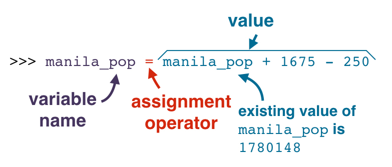

---
tags:
  - python
---

# 变量
变量 Variable 是用以引用/访问内存中的数据，有时也称为 **标识符 Identifier**，一般可以通过**赋值符号**改变其引用的内容；与之相对应的 **字面量 Literal**，是指实际或本身的含义，而非引用指代，其直接表示其本身，因此无法给字面量赋值绑定其他数据。

## 创建变量
` variable_name = value`
* 其中 `=` 是**赋值**运算符
* 表达式的**顺序**非常重要，即**变量名 `=` 值**。赋值运算符 `=` 的作用是**将右侧的值赋给左侧的变量名**

**注意**：
* 在赋值时若右侧是表达式，那么左侧变量被赋予的是右侧表达式的**值**，而不是表达式本身
* 如果你要使用变量名，首先**必须为其赋值**

### 多重赋值
可以在一行代码中**同时为两个变量赋值**
```python
#Using multiple assignment
savings, salary = 514.86, 320.51   # 使用逗号分隔
```
第一个变量被赋值为`=`之后的第一个值，第二个变量则接收第二个值。

对于两个紧密相关的变量，如某物体的 x 轴和 y 轴坐标，可以使用多重赋值。

## 增量赋值
所有算术运算符都有增量赋值运算符。

```python
# 等价于 x = x + 1
x += 1

# 等价于 toobig = toobig /2
toobig /= 2
```
## 变量命名规范
* **保留字**不可作变量名。保留字列表见此。见[保留字列表](https://docs.python.org/3/reference/lexical_analysis.html#keywords)
```
False      await      else       import     pass
None       break      except     in         raise
True       class      finally    is         return
and        continue   for        lambda     try
as         def        from       nonlocal   while
assert     del        global     not        with
async      elif       if         or         yield
```
* 变量名中只能使用**普通字母（小写）**、**数字**和**下划线**（且以数字不可作为变量开头）
* 命名变量的方式称为**snake case**
* 不建议使用**内置的标识符**作为变量名，虽然不会立即导致错误（例如为 int 赋值）

## 访问变量
访问变量仅需使用**变量名**

如果需要将变量的值显示在终端可使用内置函数`print()`
（如果没有 print，Python 中发生的事情只会停留在 Python 内部。)

**注意**：
在 Python 2 中打印时不需要使用括号，但是在 Python 3 中需要，所以请勿忘记**括号**！`print` 是 Python 的一个内置函数。Python 中的函数调用始终带有一对括号，如果有参数，那么参数放在括号内。所以 `print` 函数的语法需要一对括号，并将参数放在括号内。


## 更新变量
通过为**同一个变量名重新赋值**以更新变量存储的数据，在重新赋值时可以**使用含有该变量名**（在赋值号右侧该变量指向原始数据）的计算公式来更新数值

```python
>>> manila_pop = 1780148
>>> print(manila_pop)
1780148
>>> manila_pop = manila_pop + 1675 - 250
>>> print(manila_pop)
1781573
```



* 位于等号左侧的变量 `manila_pop`，被赋值为整个右侧表达式 `manila_pop + 1675 - 250` 的**值**
* 赋值顺序是将右侧的**值**赋给左侧的变量，所以在运行右侧的表达式时 `manila_pop` 值仍为 `1780148`
* 所以赋值号右侧 `manila_pop` 的当前值仍然为 `1780148`

### 简化表达式（其他赋值运算符）
赋值符号左右两边都涉及相同的变量时，表达式可能可使用简化表达式

```python
# increase the value of manila_pop by 1675
# equal to manila_pop = manila_pop + 1675
>>> manila_pop += 1675

# decrease the value of manila_pop by 250
# equal to manila_pop = manila_pop - 250
>>> manila_pop -= 250

# decimate manila_pop
# equal to manila_pop = manila_pop * 0.9
>>> manila_pop *= 0.9

# half the area of Manila
# equal to manila_pop = manila_pop / 2
>>> manila_area /=  2
```

## 变量作用域
变量作用域 scope 是指程序**在哪个部分可引用或使用某个变量**

函数使用时需要特别留意变量的作用域

* 如果变量是在函数**内**创建的，则该变量只能在函数**内部使用（修改或引用）**（无法从函数外部使用）
* 如果是在函数之**外**创建，依然可以在函数**内部访问**（但不能**更改或重新赋值**以修改在**函数外部**创建的变量）


:bulb: 将变量**定义在所需的最小作用域内**。虽然函数可以引用在更大的作用域内定义的变量，但是通常不建议这么做，因为程序有很多变量，可能不记得之前定义了什么全局变量而引起冲突。

```python
egg_count = 0

def buy_eggs():
    egg_count += 12 # purchase a dozen eggs

buy_eggs()
```

:hammer:

```shell
Traceback (most recent call last):
  File "C:/Users/10267/Desktop/test.py", line 6, in <module>
    buy_eggs()
  File "C:/Users/10267/Desktop/test.py", line 4, in buy_eggs
    egg_count += 12
UnboundLocalError: local variable 'egg_count' referenced before assignment
```

导致 `UnboundLocalError` 因为 Python 不允许函数**修改不在函数作用域内的变量**。（但可以引用）

* 此处先在函数外定义了变量 `egg_count` 的值
* 在函数内部变量 `egg_count` 虽然与函数外的变量有相同的名称，但是可以理解为是不同的变量（可以理解为函数内的变量是形参），此处直接没有定义内部的变量就对变量进行加法操作，所以会引起 `UnboundLocalError` 错误


* :warning: 上面的原则**仅适用于整数和字符串**
* :warning: **列表、字典、集合、类**中可以在子程序（子函数）中通过**修改局部变量达到修改全局变量**的目的。