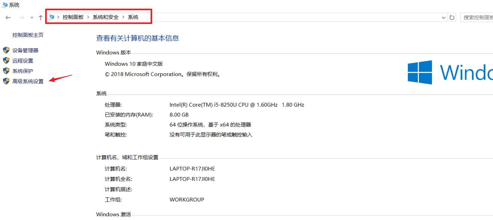
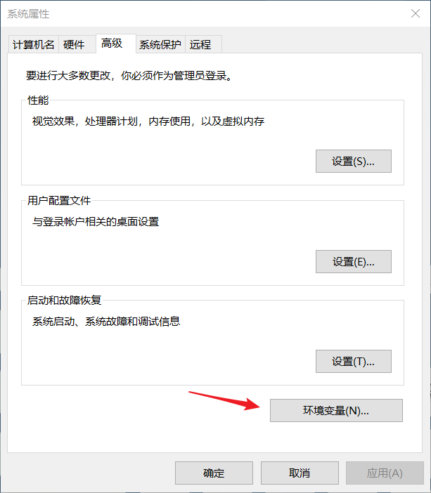
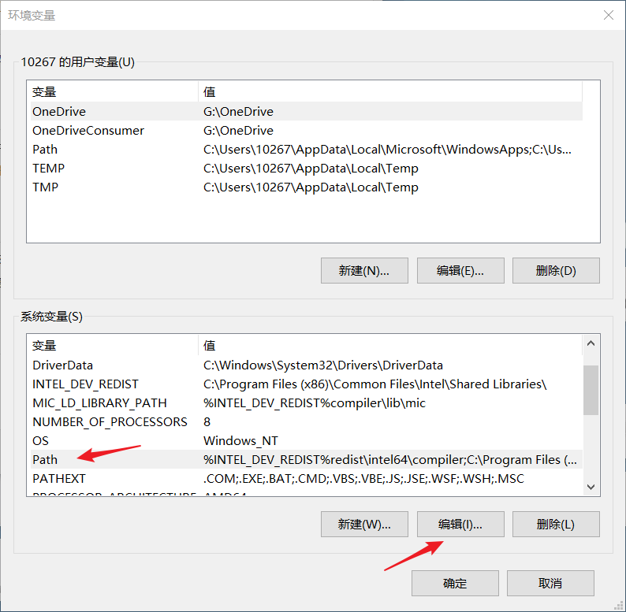

# 安装教程

## 直接安装
参考：[Python安装教程](https://github.com/udacity/turtles-cn) | [pdf](./attachments/Python-Install-Guide.pdf)

* 在 Python [下载页面](https://www.python.org/downloads/)选择与操作系统匹配的版本，并安装
* 注意在安装过程中选择添加 python 到路径，这样在命令行提示符窗口就可以**直接**访问 python
    * 安装时选择`Add Python x.x to PATH`或`Add Python to environment variables`选项
    * 手动将 python 添加到`PATH`，参照[官方文档](https://docs.python.org/3/using/windows.html#excursus-setting-environment-variables)
        * **临时**设置环境变量，请打开命令提示符并使用`set`命令
        ```python
        C:\>set PATH=C:\Program Files\Python 3.7;%PATH%
        C:\>set PYTHONPATH=%PYTHONPATH%;C:\My_python_lib
        C:\>python
        ```
    * **永久**修改默认环境变量
        * 单击`开始` - 搜索`控制面板` - 选择`系统安全` - `系统` - `高级系统设置`
        * 然后单击`环境变量`按钮
        * 在此对话框中添加或修改用户和系统变量（注意：需要对计算机进行**非限制访问（即管理员权限）**）
            
            
            
        * 点击`编辑`把Python的安装路径粘贴进去，例如`E:\Software\Python`若安装有多版本，可依次输入，以分号`;`分隔

## 利用Anaconda安装
若进行数据科学相关项目，强烈建议安装 [Anaconda](https://www.anaconda.com/download/)

Anaconda 是包含**大量专门针对数据科学的库的 python 分发版本**