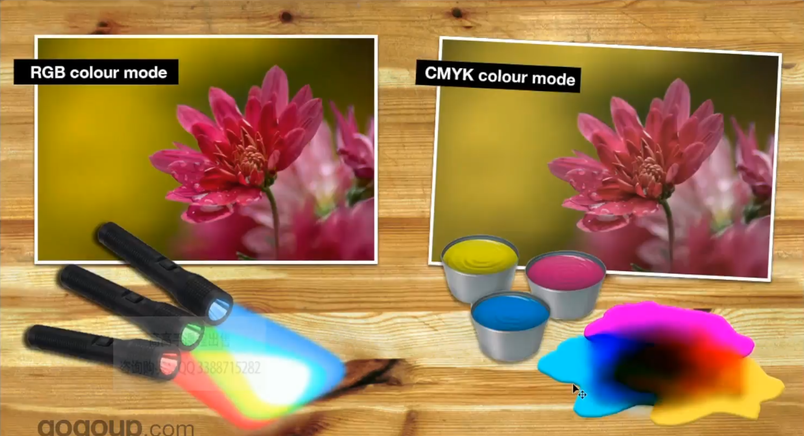

# 色彩模式

## RGB 色彩模式
显示器、照相机等采用的色彩模式。RGB 使用**光线**创造色彩。

RGB 色彩更生动、鲜艳。适用于数字设计。

* 三种色彩形成：`红 red`、`绿 green`、`蓝 blue` 三色光
* 三色高纯度等比例混合形成**白色**

## CMYK 色彩模式
打印使用的色彩模式。CMYK 使用油墨创造色彩（软件可以在显示器上模拟）。

* 三种色彩形成：`青 cyan`、`品红 magenta`、`黄 yellow` 三色油墨
* 三色高纯度等比例混合形成**黑色**