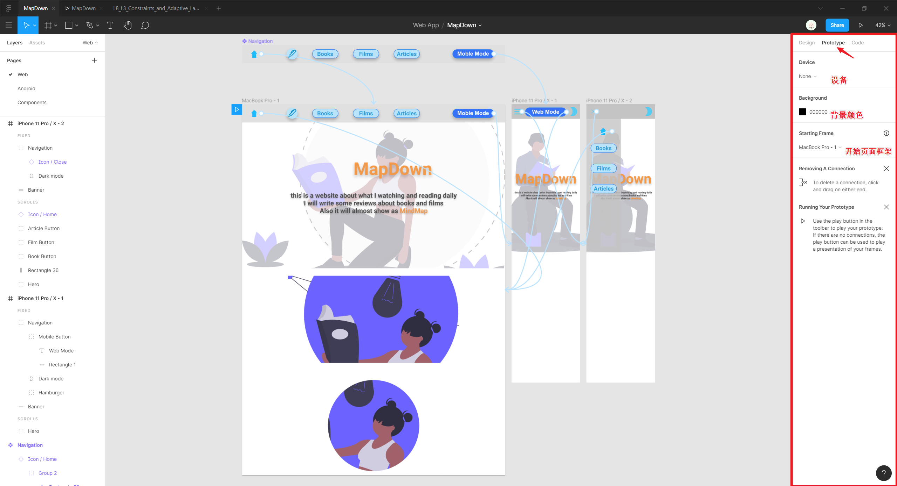
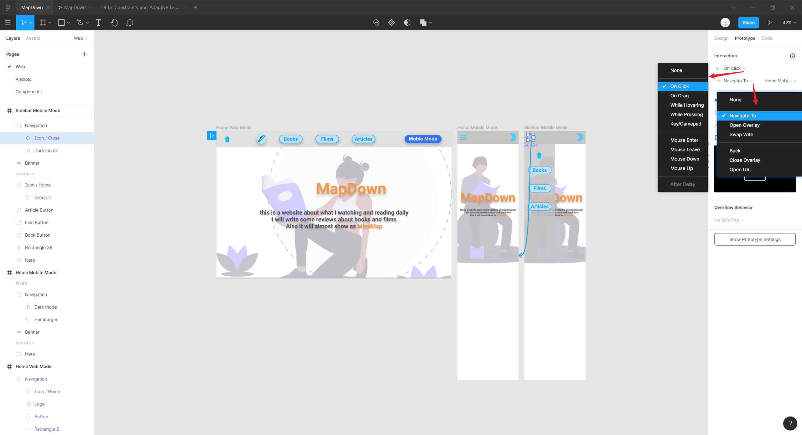
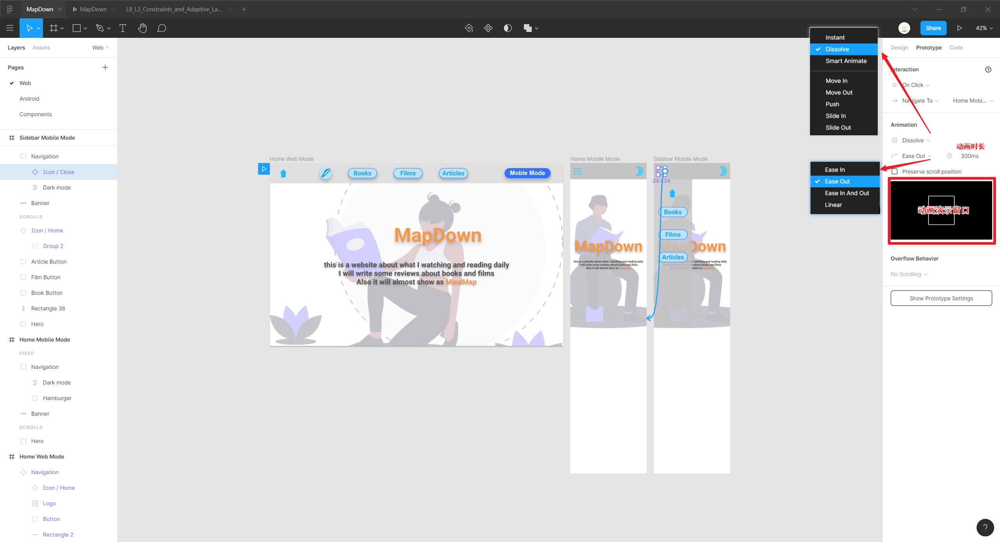

# 进阶操作

## 遮罩

将一个形状设置为遮罩 `Use as Mask`，则形状边界框外的区域都会被遮挡不显示，一般用于以确保图像不会超过特定的区域，类似于对图片进行了裁剪。

<iframe src="//player.bilibili.com/player.html?aid=94259627&bvid=BV1sE411p7br&cid=162270076&page=31&high_quality=1&danmaku=0" scrolling="no" border="0" frameborder="no" framespacing="0" allowfullscreen="true"></iframe>

:warning: 图层相对顺序影响遮罩作用，可将需要遮罩的图层分组，并将遮罩放置组内的底层。

:bulb: 用作遮罩的快捷键：`Ctrl + Alt + M`

## 切片

使用切片工具 `Slice` 创建一个区域（希望捕捉图像），类似于截图，可以在导出时选择特定的切片图层以导出该区域的内容。

<iframe src="//player.bilibili.com/player.html?aid=94259627&bvid=BV1sE411p7br&cid=162270099&page=32&high_quality=1&danmaku=0" scrolling="no" border="0" frameborder="no" framespacing="0" allowfullscreen="true"></iframe>

## 矢量网络

在 Figma 中进行**矢量绘图**不需要将路径一一连接起来（即路径是不需要封闭起来），而只需要创建网络状的单点连接。

### 钢笔工具

用以选择或添加锚点，连续创建的锚点相互连接形成路径（路径不必闭合）。

<iframe src="//player.bilibili.com/player.html?aid=94259627&bvid=BV1sE411p7br&cid=162187549&page=25&high_quality=1&danmaku=0" scrolling="no" border="0" frameborder="no" framespacing="0" allowfullscreen="true"></iframe>

:bulb: 钢笔工具的快捷键：`P`

:bulb: 按 `Shift` 可以基于上一个锚点的特定方向（90°或45°方向上）建立锚点

:bulb: 按住 `Shift` 并通过上下方向键可以调整当前锚点的位置（增量为 10 个网格）

### 铅笔工具

铅笔工具一般用以绘制弯曲的路径，软件会让路径会变平滑并成为矢量图。

<iframe src="//player.bilibili.com/player.html?aid=94259627&bvid=BV1sE411p7br&cid=162187608&page=26&high_quality=1&danmaku=0" scrolling="no" border="0" frameborder="no" framespacing="0" allowfullscreen="true"></iframe>

### 贝塞尔曲线

矢量图由点组成，除了直线还可以并通过贝塞尔曲线将点连接。

#### 创建曲线

使用钢笔工具 `Pen` 在绘制路径时，点击确定锚点位置后按住左键不放，并通过左右拖拽即可创建贝塞尔曲线。

<iframe src="//player.bilibili.com/player.html?aid=94259627&bvid=BV1sE411p7br&cid=162187633&page=27&high_quality=1&danmaku=0" scrolling="no" border="0" frameborder="no" framespacing="0" allowfullscreen="true"></iframe>

#### 调整曲线

通过双击元素或选择元素后按 `Enter` 进入编辑模式，曲线的锚点会出现句柄，可调整曲线的角度。

<iframe src="//player.bilibili.com/player.html?aid=94259627&bvid=BV1sE411p7br&cid=162187647&page=29&high_quality=1&danmaku=0" scrolling="no" border="0" frameborder="no" framespacing="0" allowfullscreen="true"></iframe>

:bulb: 句柄的编辑模式可以在（属性面板）编辑镜像 `Vector` 选项中进行设置

* **Mirror Angle and Length** 调整为镜像的，且包括角度与长度
* **No Mirroring** 调整为非镜像的
* **Mirror Angle** 调整为镜像的，且只能调整角度

:bulb: 在编辑模式下使用曲线工具 `Bend Tool` 可以将已有的锚点在直线锚点与曲线锚点之间切换。

<iframe src="//player.bilibili.com/player.html?aid=94259627&bvid=BV1sE411p7br&cid=162187640&page=28&high_quality=1&danmaku=0" scrolling="no" border="0" frameborder="no" framespacing="0" allowfullscreen="true"></iframe>

## 原型制作

切换到（属性面板）`Prototype` 标签页进行原型制作，Figma 支持链接跳转、过渡动画、滚动框架、鼠标交互等多种原型效果。

原型的预设配置包括：

* 演示开始的框架
* 演示的背景颜色
* 演示的设备大小

### 创建链接

任何图层或分组都可连接到另一个框架中。选中图层右侧会出现一个蓝色圆圈，拖拽这个圆圈创建连线，即可创建一个元素之间跳转的交互。

<iframe src="//player.bilibili.com/player.html?aid=94259627&bvid=BV1sE411p7br&cid=162480615&page=35&high_quality=1&danmaku=0" scrolling="no" border="0" frameborder="no" framespacing="0" allowfullscreen="true"></iframe>

:bulb: 框架中的元素不可以相互连接，可以将元素创建为一个组件 `Compoment` 并将主组件放置到框架外，创建指向框架内其他元素的链接，而框架内的元素使用对应的实例/副组件。

:bulb: 使用组件的交互设置也是可以继承的，一般将导航栏设置为组件，并在各框架中添加其实例以快速批量地构建页面直接的链接。

### 交互设置

交互 `Interaction` 的默认触发类型是点击 `On Click`，点击后的默认行为是将页面切换 `Navigate To` 到指定的框架，Figma 还支持其他交互类型，在（属性面板） `Prototype` 标签栏中选择其他的交互方式和行为。

常见的交互方式：

* `On Click` （桌面端）鼠标点击或（移动端）触控
* `On Drag` 拖拽
* `While Hovering` 鼠标悬停
* `While Pressing` （桌面端）单击鼠标或触控板或（移动端）直接按下对象时才会显示目标框架； 释放后将再次显示原始框架（非常适合模仿临时互动或状态变化，如长按查看预览，或导航下拉菜单）

常见的行为：

* `Navigate To` 切换到指定的框架
* `Open Overlay` 弹窗显示（适合实现 `Modal` 弹出式模态框效果）
* `Back` 返回上一个页面

### 动画

可以对切换页面时的动画进行设置，如切换方式，切换方向、动效时长等。

### 滚动时的固定元素

将元素进行约束 `Fix position when scrolling` 在演示页面滚动时，该元素可以固定不动，一般将导航栏设置为固定元素。

### 分享

Figma 支持将原型预览分享或实时内嵌到网页中以实现在线演示。

<iframe src="//player.bilibili.com/player.html?aid=94259627&bvid=BV1sE411p7br&cid=162480657&page=36&high_quality=1&danmaku=0" scrolling="no" border="0" frameborder="no" framespacing="0" allowfullscreen="true"></iframe>

:bulb: 在 prototype 演示页面点击右上角蓝色的 `Share Prototype` 按钮获取分享链接或在线内嵌代码。