# 基础操作

## 快捷键

快捷键可以提高创作的效率，以下是 Figma 快捷键一览表

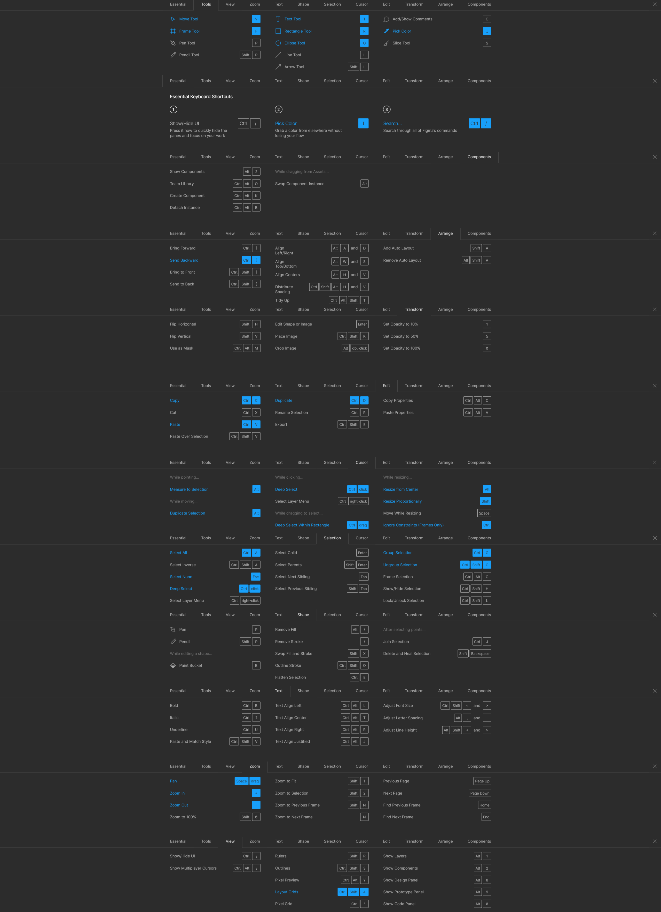

:bulb: keyboard shortcuts 查询快捷键：`Ctrl + Shift + ?`

:bulb: 常用快捷键

* 移动工具快捷键 `v`
* 框架创建工具快捷键 `F` 或 `A`
* 文字工具快捷键 `T`
* 矩形工具快捷键 `R`
* 椭圆工具快捷键 `o`
* 采色器快捷键 `I`
* 放大视图快捷键 `+`
* 缩小视图快捷键 `-`
* 分组快捷键：`Ctrl + G`
* 创建组件快捷键：`Ctrl + Alt + K`
* 分离实体快捷键：`Ctrl + Alt + B`
* 重复上一步快捷键：`Ctrl + D`
* 视图放大到所选元素：`Shift + 2`
* 视图缩小到所有元素：`Shift + 1`

## 页面

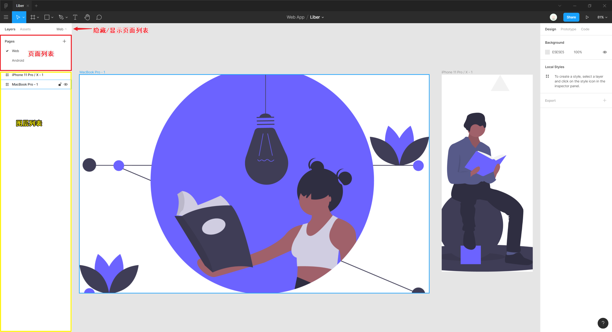

页面 `Pages` 相当于浏览器的标签页，可以在文件中进行切换。

页面非常适合：

- 将存储与文件相关的组件和样式
- 设计的迭代
- 区分设计稿版本
- 针对不同的桌面或移动平台进行设计
- 创建不同的设计原型

## 排版

### 框架与布局网格

框架 Frame 类似于设计软件常见的 Artboard 画板概念，可以使用模板或使用框架创建工具自定义框架大小来创建。一个页面/文件中可以创建无限个框架。一般将框架大小设置为常见设备的屏幕大小，方便基于不同的屏幕进行响应式设计。

框架相当于元素的容器。

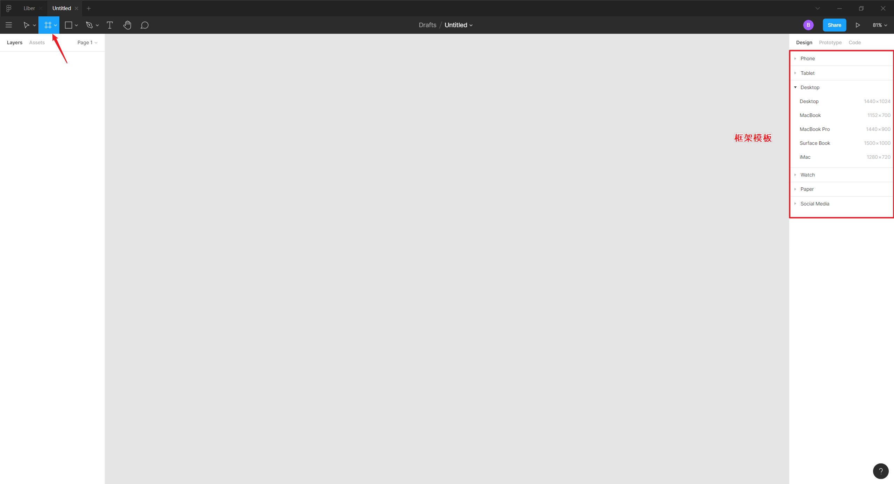

:bulb: 框架创建工具快捷键：`A` 或 `F`

:bulb: 为选中的元素添加一个框架（容器）的快捷键：`Ctrl + Alt + G`

为了方便排版（元素对齐），一般为框架添加布局网格 `Layout Grid`。

默认添加网格为 10 点网格，可以点击相应的属性按钮进行修改。对于移动端设备的设计常使用 [8 点网格](https://spec.fm/specifics/8-pt-grid)，对于需要间隔较小的设计则采用 960 点网格。

创建布局网格后，元素移动时一般都是附着在格点上。

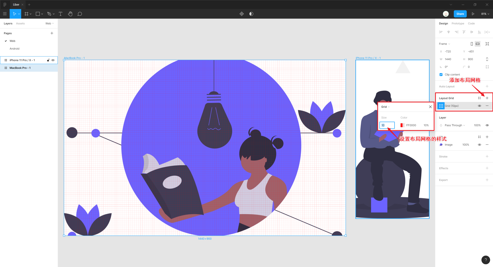

:bulb: 添加布局网格：选中框架后，点击（属性面板）`Layout Grid` 上的 `+` 为该框架添加布局网格

### 智能参考线

Figma 提供智能参考线（红色）辅助排版。

### 分布

元素之间或元素相对于框架之间的分布，可以通过属性面板的可视化图标进行快速设置。

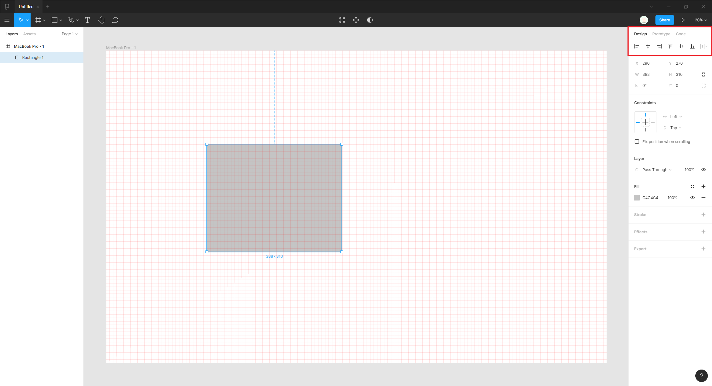

### 约束

调整网页原型的宽度时元素并不会响应式地进行缩放以适应页面，这是因为默认情况下元素被约束为 **顶部** 与 **左侧** 的距离固定。

<iframe src="//player.bilibili.com/player.html?aid=94259627&bvid=BV1sE411p7br&cid=161462436&page=14&high_quality=1&danmaku=0" scrolling="no" border="0" frameborder="no" framespacing="0" allowfullscreen="true"></iframe>

为了实现响应式设计，应该将元素的约束调整为合适方式。常见的约束条件：

* 元素到任何边界或中心的距离设为固定值，以确保元素尺寸不变同时布局跟随页面自适应地调整
* 元素到左侧与右侧 `left & right` 或 顶部与底部 `top & bottom` 的距离设为固定值，即元素将自我调整同时到边界的距离保持一致，以确保元素根据页面自动缩放

* 滚动时固定位置，一般将导航栏等元素设置为 `Fix position when scrolling` 固定位置避免随着文档流进行滚动。

  

### 参考距离

Figma 可以查看选中元素与邻近元素的距离。

<iframe src="//player.bilibili.com/player.html?aid=94259627&bvid=BV1sE411p7br&cid=160917832&page=3&high_quality=1&danmaku=0" scrolling="no" border="0" frameborder="no" framespacing="0" allowfullscreen="true"></iframe>

:bulb: 参考参考距离：按下 `Alt` 键，鼠标悬停在邻近参照元素上

## 分组与组织

将元素/图层进行合理的分组，方便管理元素并构建恰当的层叠结构。如约束依赖于父容器，因此需要合理的嵌套结构。

:bulb: 分组快捷键：`Ctrl + G`

## 选择与移动

使用移动工具选择并操作元素，可以移动选中的元素，还可以操作其锚点以调整元素的外观。

<iframe src="//player.bilibili.com/player.html?aid=94259627&bvid=BV1sE411p7br&cid=160917822&page=2&high_quality=1&danmaku=0" scrolling="no" border="0" frameborder="no" framespacing="0" allowfullscreen="true"></iframe>

:bulb: 当多个元素分组后，点击选择默认选中整个分组，可按住 `Ctrl` 以选中鼠标悬停所指的单个元素（无论该元素是否在编组内）。

:bulb: 移动工具快捷键：`V`

:bulb: 使用键盘的方向键按照固定的增量移动对象，按住 `Shift` 再点击方向键按照倍数的增量移动对象

:bulb: 复制移动：按住 `Alt` 键再移动元素

## 缩放

缩放工具不仅可以缩放宽度形状，而且还可缩放其属性，如圆角半径、阴影等，这对于适配多屏幕的响应式设计很重要。

<iframe src="//player.bilibili.com/player.html?aid=94259627&bvid=BV1sE411p7br&cid=160917841&page=4&high_quality=1&danmaku=0" scrolling="no" border="0" frameborder="no" framespacing="0" allowfullscreen="true"></iframe>

:bulb: 缩放工具的快捷键：`K`

:warning: 缩放调整通常会创建**半个像素**，如字体大小，因此缩放后进行检查调整。

## 基本形状

Figma 提供不同的形状工具可以创建不同的基本形状。

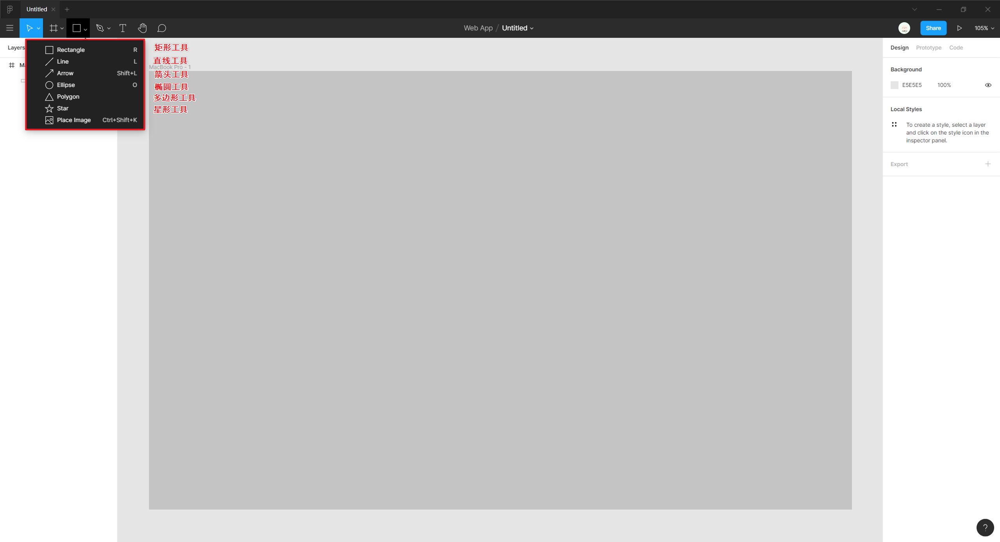

:bulb: 矩形工具的快捷键：`R`

:bulb: 椭圆形工具的快捷键：`O`

:bulb: 创建形状时按住 `Shift` 键可以创建一个正比例的形状，调整形状时按住 `Shift` 键可保持原有的纵横比缩放

:bulb: 调整形状时按住 `Alt` 键可基于中心处进行缩放

<iframe src="//player.bilibili.com/player.html?aid=94259627&bvid=BV1sE411p7br&cid=160917855&page=5&high_quality=1&danmaku=0" scrolling="no" border="0" frameborder="no" framespacing="0" allowfullscreen="true"></iframe>

形状的外观可以在画布中拖拽锚点进行调整，还可以在属性面板中设置相应的参数，而且支持数学运算（包括百分数值）和在属性值输入框处**拖动**以快速增加/减少数值。

### 形状属性

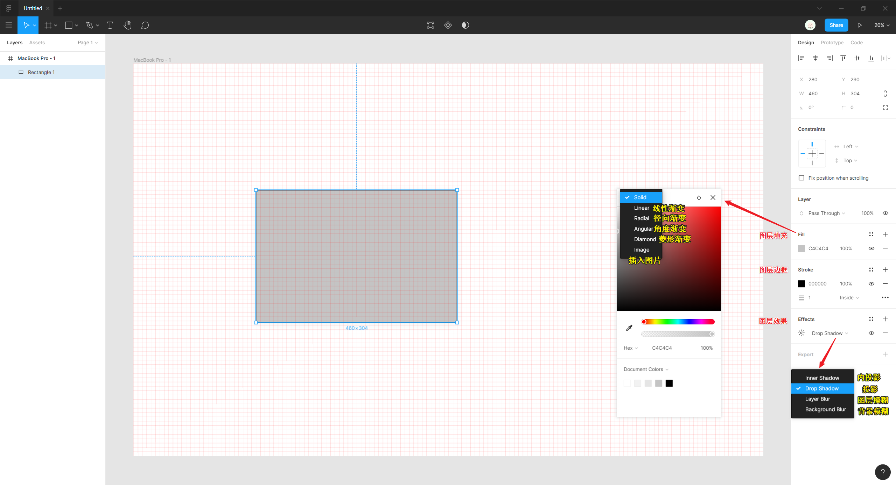

元素一般具有多种基本属性：

* 填充 `Fill`：形状填充可以使用纯色块，渐变色（有多种填充方式可选），以及图片（有多种填充方式可选，可动态编辑插入的图片，如曝光度、对比度、饱和度等）。

* 描边 `Stroke`：类似地，可以使用纯色块，渐变色（有多种填充方式可选），以及图片（有多种填充方式可选）来填充边框。还可以设置边框的粗细。

* 图层效果 `Effects`：设置阴影或模糊效果。Figma 可以渲染每种阴影类型最多 8 个，每个模糊类型 1 个。

  :warning: 模糊效果是最耗性能的，可能导致网站的用户体验不佳。

:bulb: 可以通过多种形式设置颜色属性，可以使用色环、拾色器工具或输入具体的十六进制颜色值，如果已在资源库构建了设计体系，还可以选择预设的个人颜色。

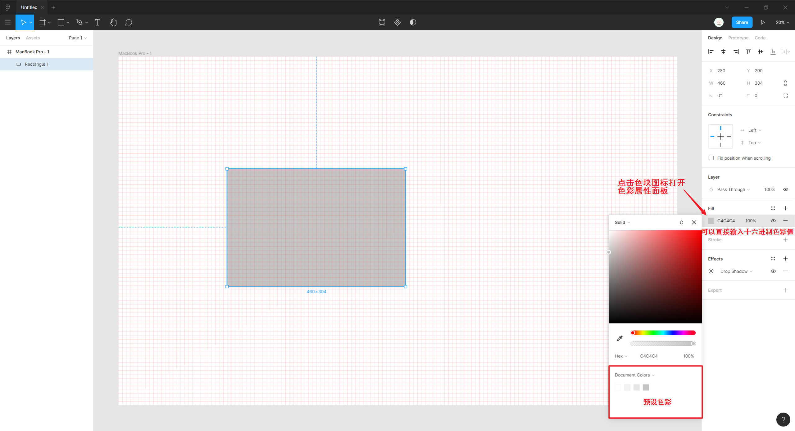

其中 `Document Colors` 档案色是根据当前 Figma 文件所使用的颜色提取而得出。

## 文字

文字工具用于输入文本，按 `Ctrl + Enter` 或 `Esc` 键结束文字输入。

<iframe src="//player.bilibili.com/player.html?aid=94259627&bvid=BV1sE411p7br&cid=160917807&page=1&high_quality=1&danmaku=0" scrolling="no" border="0" frameborder="no" framespacing="0" allowfullscreen="true"></iframe>

通过回车键 `Enter` 实现多行文本输入，此外还可以对于长文字的**文本框限制大小**以实现自动换行。

:bulb: 文本输入工具快捷键：`T`

### 字体属性

文本具有多种基本属性，如字体样式（字体族）、字体大小、字体颜色、文本对齐方式、行间距等。

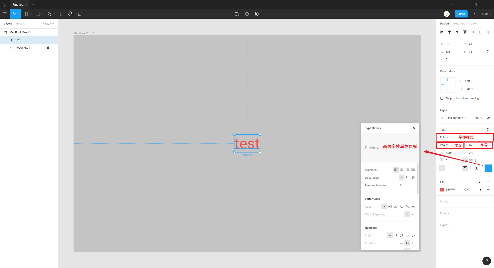

类似于基本形状，字体也可以设置填充、边框、投影及模糊效果。

:bulb: 由于 Figma 字体样式选择时不支持列表预览，而且搜索目前也不支持模糊匹配，推荐安装插件:gear: [Better Font Picker](https://www.figma.com/community/plugin/739922281164562258/Better-Font-Picker)

## 默认属性

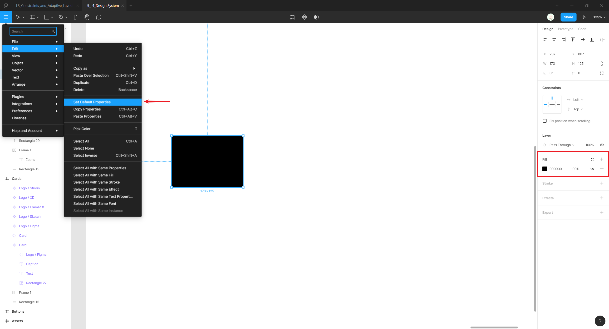

:bulb: （汉堡菜单）`Edit` -> `Set Default Properties` 将当前选中元素的样式属性设置为默认属性

## 查看代码

在（属性面板）`Code` 标签页可以查看选中元素的样式列表或所对应的代码。

<iframe src="//player.bilibili.com/player.html?aid=94259627&bvid=BV1sE411p7br&cid=162270064&page=30&high_quality=1&danmaku=0" scrolling="no" border="0" frameborder="no" framespacing="0" allowfullscreen="true"></iframe>

:bulb: 通过下拉菜单还可以查看该 UI 在 iOS 或 Android 系统所对应代码。

:warning: 通过分享链接查看设计文件时，只有注册的用户才可以打开属性面板查看元素属性与尺寸对应的代码。

## 复制

Figma 支持多种形式的复制，如选择 `Copy Properties` 复制选中元素的属性，在设计时可以很方便地将样式设置复用到其他元素中。还可以选择 `Copy CSS`、`Copy SVG` 直接复制选中元素样式对应的代码用于开发。

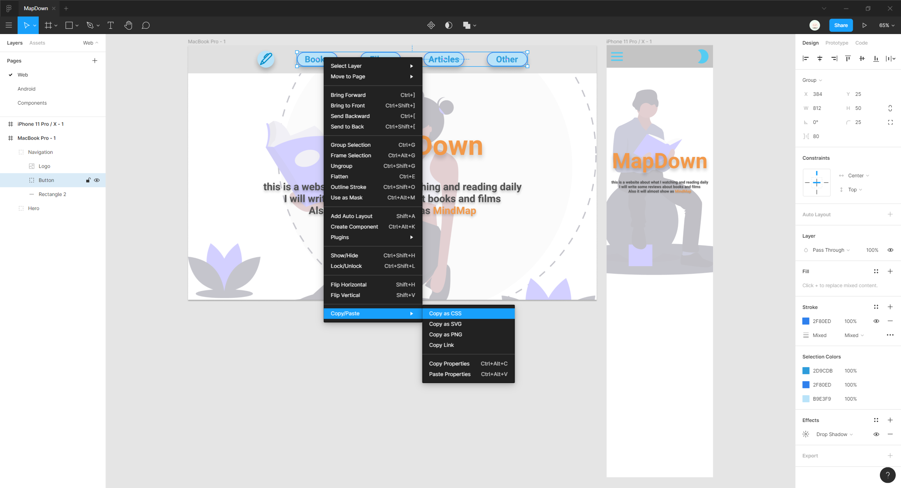

## 预览原型

点击工具栏右侧的播放 `Play` 播放按钮可预览原型。

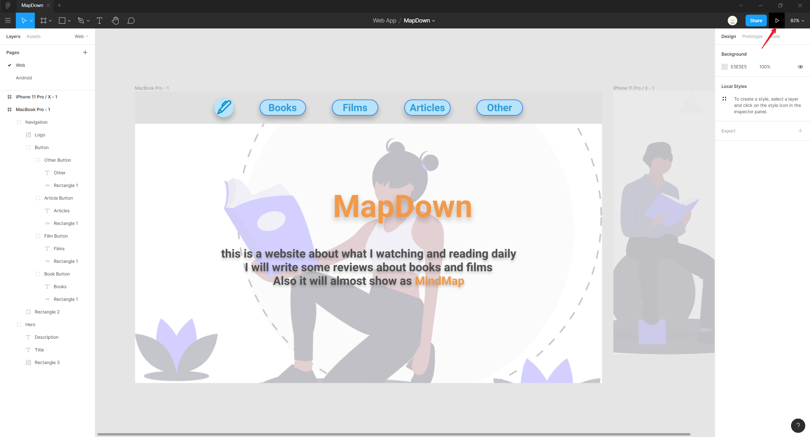

当文件中有多个框架，可以点击下方数字按钮进行切换，预览不同原型。

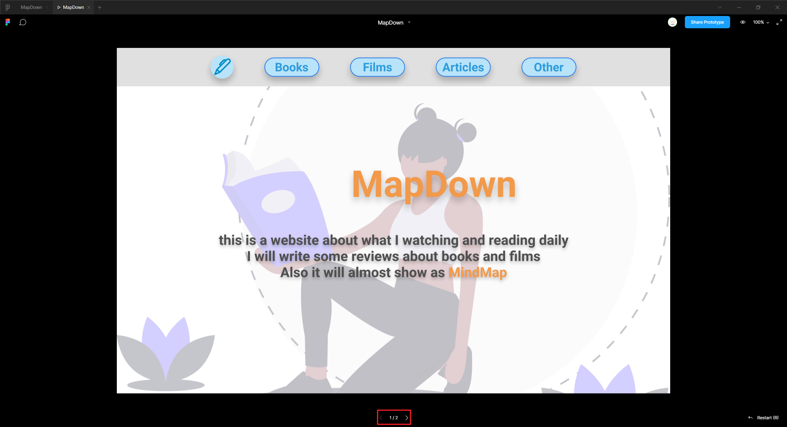

