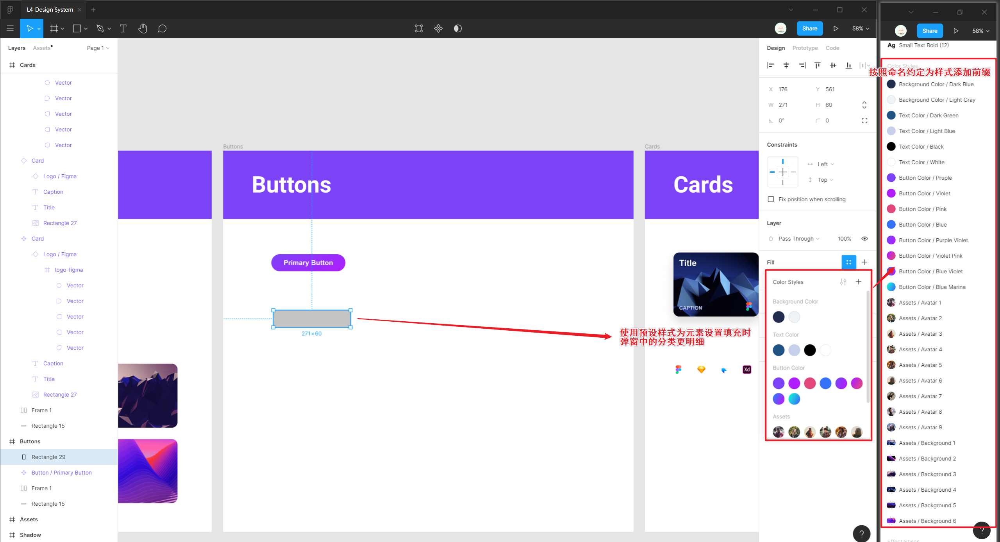
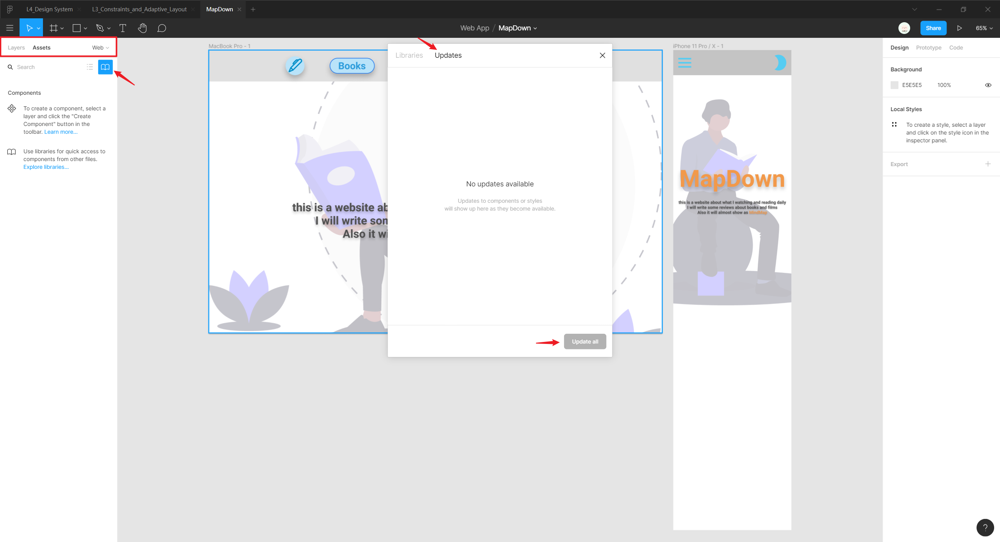

# 设计体系

设计体系 design system 是一套设计参考指南，如 [Zendesk Garden](https://garden.zendesk.com/) 和  [Design Code](https://designcode.io/design-system) 网站的设计体系。

设计体系由产品（应用 app 或网页）中的所有元素组成，一般以元素列表的形式展现，包括颜色卡片列表、字体规范列表、排版样式规范列表、图片资源列表等，这些元素可供设计师和开发者参考与复用。

设计体系应具有连续性、动态性（在设计与代码方面都是可维护）及**可复用性**，创建的预设样式和组件可以极大地提高设计开发效率（通过点击属性面板相应预设的图标，实现不同的样式一键切换），同时保持产品体系的设计语言统一。

由于 Figma 支持团队协作和版本控制，设计师、开发者、产品经理等可共同参与协作构建出一套设计体系，并通过其 [Live Embed](https://www.figma.com/developers/embed) 功能将设计体系共享到团队中。

## 样式

样式 style 是指元素主颜色、排版与网格、字体等，这些基础样式一般在 Figma 操作界面的右侧（属性面板）`Design` 中进行设置，如常用的样式属性设置：

* 颜色 `Selection Colors`
* 布局网格 `Layout Grid`
* 文字 `Text`
* 填充 `Fill`
* 描边 `Stroke`
* 图层效果 `Effects`

此外元素之间关系的样式也是重要组成部分，如元素的间距，网格为负空间（留白）等规则。

样式还可以包括资源，一般可为图标、背景、头像及其他用于填充元素内容的图像，可以在各种资源站获取这一类的素材：

* [Unsplash](https://unsplash.com/) 免费图库提供大量高清图片，可以作为背景图
* [UINames](https://uinames.com/), [UI Faces](https://uifaces.co/) 等网站随机生成头像图片

### 网格样式

<iframe src="//player.bilibili.com/player.html?aid=94259627&bvid=BV1sE411p7br&cid=161382864&page=6&high_quality=1&danmaku=0" scrolling="no" border="0" frameborder="no" framespacing="0" allowfullscreen="true"></iframe>

点击（属性面板）`Layout Grid` 的 4 点图标将当前框架 `Frame` 所使用的布局网格创建为网格样式。

:bulb: 管理已创建的本地网格样式：在相应的网格样式右键点击可以修改样式 `Edit Style` 或删除样式 `Delete Style`

### 颜色样式

<iframe src="//player.bilibili.com/player.html?aid=94259627&bvid=BV1sE411p7br&cid=161382888&page=7&high_quality=1&danmaku=0" scrolling="no" border="0" frameborder="no" framespacing="0" allowfullscreen="true"></iframe>

点击（属性面板）`Fill` 或 `Stroke` 的 4 点图标将当前元素所使用的填充颜色或边框颜色创建为颜色样式。

:bulb:大部分设计需要 4 种不同的颜色预设样式：

* **背景 Background**：一般包括暗夜模式和日间模式下的两种配色
* **文本 Text**：与背景色相应，一般也有两种配色，与背景形成明显的对比使文本清晰可辩析
* **按钮 Buttons**：一般选择鲜艳的配色以图像按钮
* **渐变 Gradients**：作为按钮的纯色样式的补充配色

渐变色也可以作为 Figma 预设的颜色样式

<iframe src="//player.bilibili.com/player.html?aid=94259627&bvid=BV1sE411p7br&cid=161382895&page=8&high_quality=1&danmaku=0" scrolling="no" border="0" frameborder="no" framespacing="0" allowfullscreen="true"></iframe>

### 字体样式

一般包含2类字体样式：页首与正文文本。每种类型中包含各种细分场景下的文字样式。

<iframe src="//player.bilibili.com/player.html?aid=94259627&bvid=BV1sE411p7br&cid=161382902&page=9&high_quality=1&danmaku=0" scrolling="no" border="0" frameborder="no" framespacing="0" allowfullscreen="true"></iframe>

点击（属性面板）`Text` 的 4 点图标将当前文本所使用的字体属性创建为字体样式。

:bulb: 设置字体样式时，命名应该含有字号，方便后续应用选择。

### 效果样式

Figma 可以将效果（例如阴影、描边、模糊及图像）储存为样式。这对创建按钮阴影、模糊设置甚至是默认的内容（如符号和背景）都非常有用。

<iframe src="//player.bilibili.com/player.html?aid=94259627&bvid=BV1sE411p7br&cid=161382931&page=10&high_quality=1&danmaku=0" scrolling="no" border="0" frameborder="no" framespacing="0" allowfullscreen="true"></iframe>

点击（属性面板）`Effects` 的 4 点图标将当前元素所使用的图层效果创建为效果样式。

### 资源样式

一般资源样式指的是预设的头像 Avatar 和背景图像 Background 资源。

<iframe src="//player.bilibili.com/player.html?aid=94259627&bvid=BV1sE411p7br&cid=161382939&page=11&high_quality=1&danmaku=0" scrolling="no" border="0" frameborder="no" framespacing="0" allowfullscreen="true"></iframe>

点击（属性面板）`Fill` 的 4 点图标将当前填充的图片创建为颜色样式。

由于图像是填充 `Fill` 方式之一，因此会被归类到（属性面板）`Local Styles` -> `Color Styles` 预设样式中。

:bulb: 由于多种填充样式多归于同一个（属性面板）`Local Styles` 预设样式中，可以在为预设样式命名时添加前缀并用斜杠 `/` 分隔，软件会自动识别并为样式创建次级分组

## 组件

组件 component 是通过基本元素组合而成的，如按钮、表格、导航、卡片、单元格等，它们是可以在设计中重复使用的 UI 元素。此外还可以将组件再进行组合，以构建更复杂的元素。

组件可以修改内容并设置不同的样式风格，使其适用不同的使用场景。

### 创建组件

组件 `Component` 至少需要 2 个图层，也可选择多个图层来创建组件，将多个图层分组 `Group` 后点击工具栏的钻石形图标将其转变为组件。

<iframe src="//player.bilibili.com/player.html?aid=94259627&bvid=BV1sE411p7br&cid=161915460&page=15&high_quality=1&danmaku=0" scrolling="no" border="0" frameborder="no" framespacing="0" allowfullscreen="true"></iframe>

第一次创建组件称为主组件 Master Component，由 4 颗钻石图标表示；通过复制创建的组件称为副组件 ，又称为组件实体 Component Instance，由一颗菱形表示。这两种有不同的行为模式。

:bulb: 创建组件的快捷键：`Ctrl + Alt + K`

:bulb: 为组件（主组件）采用一个合适的命名方便管理使用，可为组件添加**前缀并以斜杠 `/` 分隔**，软件即可自动识别为组件创建次级分组

主组件与副组件的行为区别：

* 主组件的修改会影响副组件（除非组件实体已对属性进行重写覆盖），即可以进行动态编辑实现了批量化操作。主组件允许修改元素的结构
* 副组件支持**属性重写**，即可以修改内容（文本）和样式
* 只有主组件可以修改结构，如图层的 **位置** 与 **组成元素**；而副本只能修改内容和样式属性。

<iframe src="//player.bilibili.com/player.html?aid=94259627&bvid=BV1sE411p7br&cid=161915626&page=16&high_quality=1&danmaku=0" scrolling="no" border="0" frameborder="no" framespacing="0" allowfullscreen="true"></iframe>

:warning: 通过分离实体 `Detach Instance` 可以将组件取消，即将图层还原为普通的元素。这样就可以对图层的结构或其他属性进行修改，然后再进行组件化，以快速地创建外形类似的多种不同主组件。

:bulb: 分离实体的快捷键：`Ctrl + Alt + B`

### 嵌套组件

组件可以通过嵌套 Nesting 以构建更复杂结构，以实现更细化的基于组件的设计操作。

:warning: 主组件无法嵌套进其他组件中，只能通过复制创建副组件再将其拖拽进其他组件中形成嵌套结构。

<iframe src="//player.bilibili.com/player.html?aid=94259627&bvid=BV1sE411p7br&cid=161915676&page=17&high_quality=1&danmaku=0" scrolling="no" border="0" frameborder="no" framespacing="0" allowfullscreen="true"></iframe>

### 发布并使用组件

免费版无法将组件发布到库 `Library`（只能共享预设样式）

<iframe src="//player.bilibili.com/player.html?aid=94259627&bvid=BV1sE411p7br&cid=161915703&page=18&high_quality=1&danmaku=0" scrolling="no" border="0" frameborder="no" framespacing="0" allowfullscreen="true"></iframe>

:bulb: 若为免费版用户可以手动将设计体系中的组件复制各个文件中，并在左侧（图层面板）`Assets` 标签页中使用 `Local components` 找到相应的组件进行复用；或将设计体系创建于一个页面 `Page` 中，而所有的设计工作分别在其他页面（同一个文件）中进行，但是可能造成文件过大。

<iframe src="//player.bilibili.com/player.html?aid=94259627&bvid=BV1sE411p7br&cid=161915763&page=19&high_quality=1&danmaku=0" scrolling="no" border="0" frameborder="no" framespacing="0" allowfullscreen="true"></iframe>

:warning: Figma 付费版本才支持发布组件

## 共享

在项目文件中创建的样式或组件默认为本地库，如样式存储在本地样式（属性面板）`Local Styles` 中，即只能在该项目中使用。

如果需要在其他项目或文件中使用设计体系，需要将其发布 `Publish` 以共享使用；而在其他项目文件或团队成员中需要**激活**相应库。

<iframe src="//player.bilibili.com/player.html?aid=94259627&bvid=BV1sE411p7br&cid=161382953&page=12&high_quality=1&danmaku=0" scrolling="no" border="0" frameborder="no" framespacing="0" allowfullscreen="true"></iframe>

当设计体系更新后，需要发布更新；团队其他成员（或在其他项目使用该库）则需要接受更新 `Updates` 以保持团队中设计体系的统一。

<iframe src="//player.bilibili.com/player.html?aid=94259627&bvid=BV1sE411p7br&cid=161382970&page=13&high_quality=1&danmaku=0" scrolling="no" border="0" frameborder="no" framespacing="0" allowfullscreen="true"></iframe>

