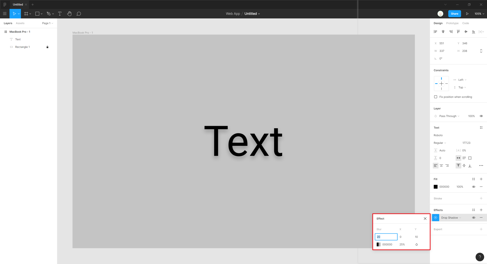
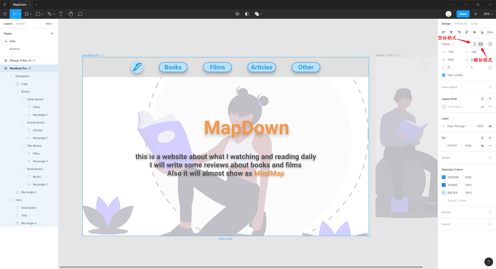

# 设计技巧

## 图层

对元素进行分组合并为单个图层，并对图层进行合适的命名，以更高效地进行管理。

调整图层的相对顺序以符合实际的层叠关系。

## 阴影

有些文本在一些背景下可能无法辨认，因此添加图层阴影效果帮助辨认。阴影也可以提供一种层次感。

:bulb: 添加阴影效果：（属性面板）`Effects` -> `Drop Shadow`

阴影一般为黑色，而且**不透明度不应超过 25%**（黑色背景除外），`Blur` 属性值一般为 `Y` 属性值的两倍，并保持 `X` 属性值不变（以实现垂直方向上的投影）。

## 模糊

模糊背景可以使目标更为突出。

:warning: 请注意模糊背景仅适用于 Safari 与 iOS。

## 布局网格

借助布局网格 `Layout Grid` 进行更高效地排版，默认添加网格为 10 点网格。

* 对于移动端设备的设计常使用 [8 点网格](https://spec.fm/specifics/8-pt-grid)，这也与苹果公司制定的[人机界面指南](https://developer.apple.com/design/human-interface-guidelines/ios/visual-design/adaptivity-and-layout/)一致（即在元素之间距离 8pt，边界距离 16pt，其中 `pt` 与 `px` 单位相同）
* 对于需要间隔较小的设计则采用 960 点网格

## 响应式设计

在设计原型时应该考虑不同的设备适配问题，可以针对不同的`Frame` 尺寸进行设计（设计版本应该包括宽度为 320px，因为该尺寸的设备仍占有一定的市场份额，如 iPhone SE），还可以将框架进行竖屏 `Portrait` 与横屏 `Landscape` 之间切换查看。

选中框架 `Frame` 后可以在横屏和竖屏模式间进行切换。

主要通过调整元素的约束条件和尺寸实现响应式设计，必要时还需要调整元素布局或作适当的取舍。