# 简介

Figma 是一个**基于浏览器**的协作式 UI 设计工具，因此可以跨平台使用。Figma 支持 UI/UX 设计、原型设计、平面设计等多种设计场景，实时协作和版本控制适合团队使用，且提供多种插件拓展功能。

此外其独创的 [**Vector  Network 矢量网络**](https://medium.com/figma-design/introducing-vector-networks-3b877d2b864f)（相对于路径概念）使设计创作更方便快捷。

## 注册账号

Figma 提供免费版本，只需要在[官网](https://www.figma.com/)创建一个账号就可以了。如果为了可以使用本地存储的字体库，可以[下载](https://www.figma.com/downloads/)客户端（但也得连接其在线服务器进行编辑）。

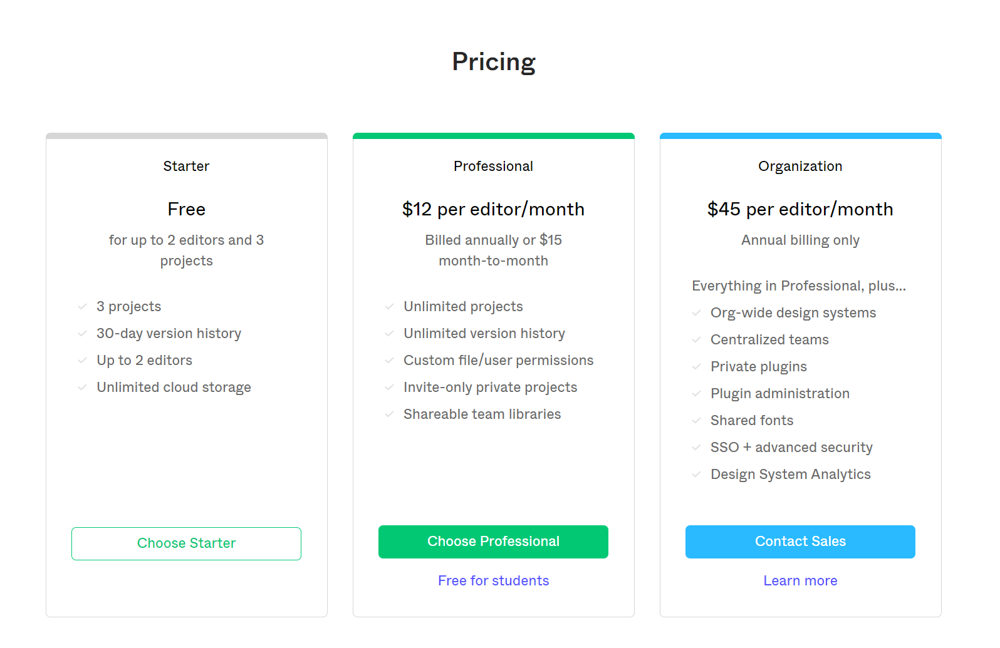

Figma 提供免费版本，支持最多 2 个协作者和 3 个项目，30天的版本控制历史记录，以及无限制的云存储空间（由于设计基于浏览器，所以设计文件需要托管在云端，也支持导出多种格式的文件离线存储于本地）。付费的专业版本、和组织版本提供更多的新增功能，具体细节可以在[官网查看](https://www.figma.com/pricing/#cid-57mfNh6t0Xo7z8Q95Ww9ZV)。

## 新建文件

在导航栏上或 `Drafts` 标签栏左侧点击加号 `+` 创建新的草稿文件（草稿文件可以拖拽到指定的项目文件夹中），也可以点击项目主页右上角的加号 `+` 为指定项目创建新文件。

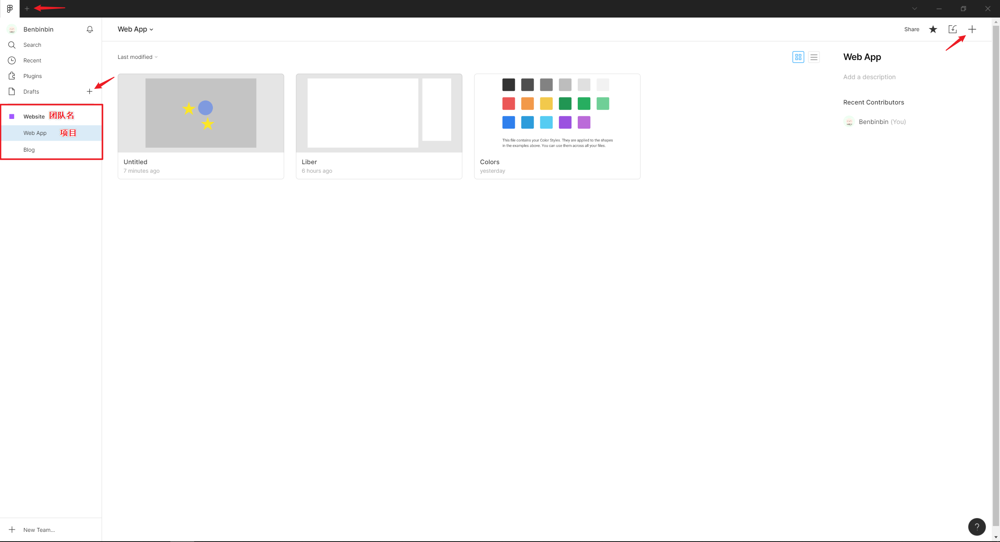

### 模板

除了使用默认模板创建空文件外，还可以在 [Figma 资源站](https://www.figma.com/resources/assets/)中选择使用其他开发者提供的模板（包含不同的预设组件和样式），点击所需的模板，它们就会被复制 `copy` 到草稿 Drafts 标签页中，并可以拖拽复制到所需的项目中。

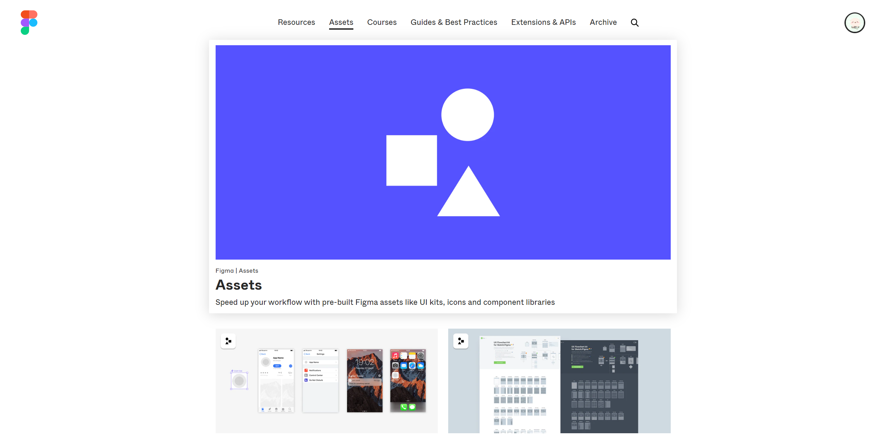

### 导入 Sketch 文件

Figma 支持导入 Sketch 等软件生成的文件以创建新的 Figma 文件。

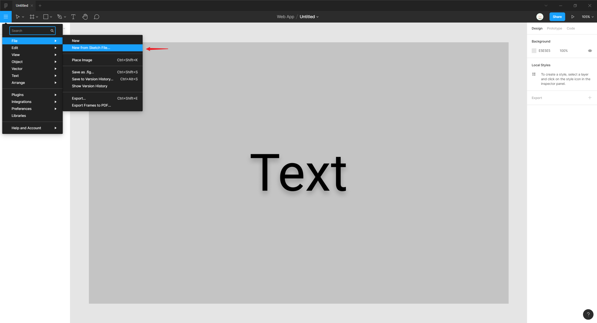

:bulb: 导入 Sketch 文件：（工具栏）汉堡菜单 -> `File` -> `New from Sketch Files...`

## 界面

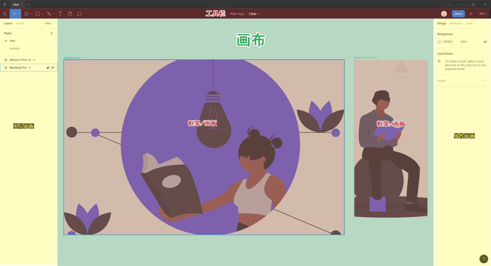

* 菜单栏：点击左侧汉堡菜单可以打开菜单栏，在 `Preference` 中可以进行一些属性设置。

  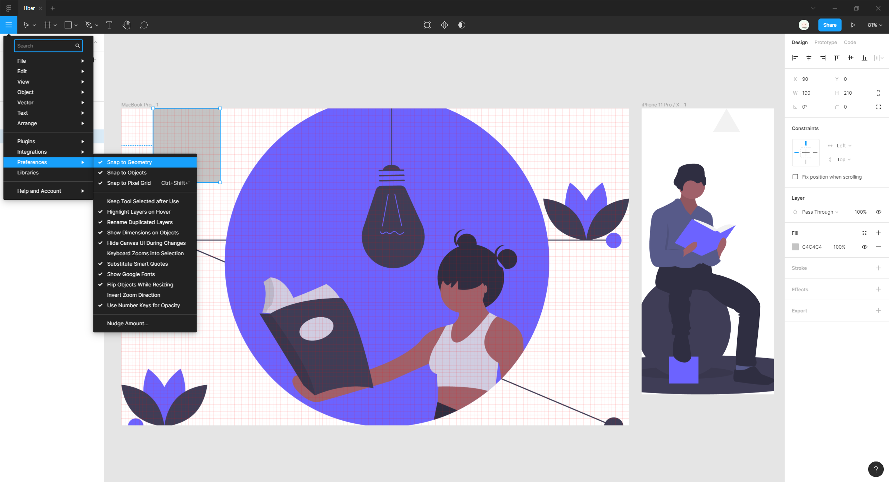

* 工具栏：包含在 Figma 中设计时可能使用的各种工具和功能。

* 图层面板：一般显示画布中的框架、组或其它对象元素。每一个元素或组合元素都会形成一个图层，通过调整其在图层面板中的相对顺序，可以调整其在画布的层叠顺序。

  :bulb: 通过图层面板顶部的标签栏，还可以在图层 `Layers` 面板 、组件 `Assets` 面板之间切换，右侧的 toggle 按键可以开启/关闭页面列表 `Pages List`

* 属性面板：查看和调整已选中对象的属性。

  :bulb: 通过属性面板顶部的标签栏，还可以在设计 `Desgin`、原型制作 `Prototype` 面板、代码查看面板 `Code` 之间切换

* 画布：工作区。

## 保存文件

Figma 会自动保存文件（对于免费用户会保存 30 天内在操作中自动存储的历史版本），但也可以另存为 `.fig` 后缀的文件导出到本地。

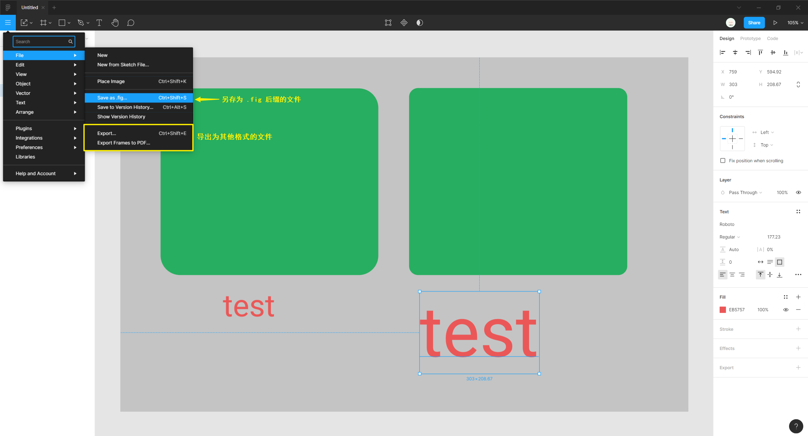

## 导出文件

可以将选定的**部分图层**或框架（包括其中所有元素）导出为其他格式的文件，如 `.png` 或 `.svg` 等图片格式，也可以选择导出为 `.pdf` 文本格式。

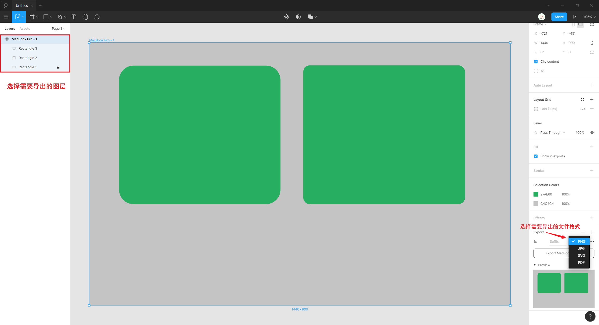

## 安装插件

可以在[官方社区](https://www.figma.com/community)网站或 Figma 主页左侧的 `Plugins` 标签页浏览可供下载的插件库。

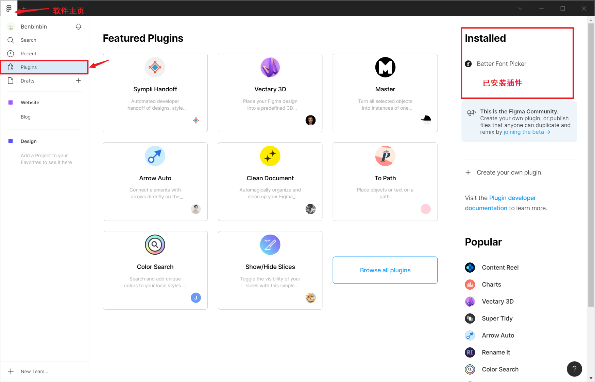

## 版本控制

Figma 会自动保存改动，以版本的形式保存下来。可以通过（属性面板）`Version History` 查看已保存的历史版本（免费版用户可保存30天的历史版本）。

### 查看编辑历史版本

点击（汉堡菜单）`File` -> `Show Version History`，或在工具栏中间的文件名称下拉菜单里选择 `Show Version History`，即可打开（属性面板）历史版本标签页。

选择需要查看的版本历史，并点击菜单栏左上角 `Edit Current Version` 可以对该版本进行再次编辑。

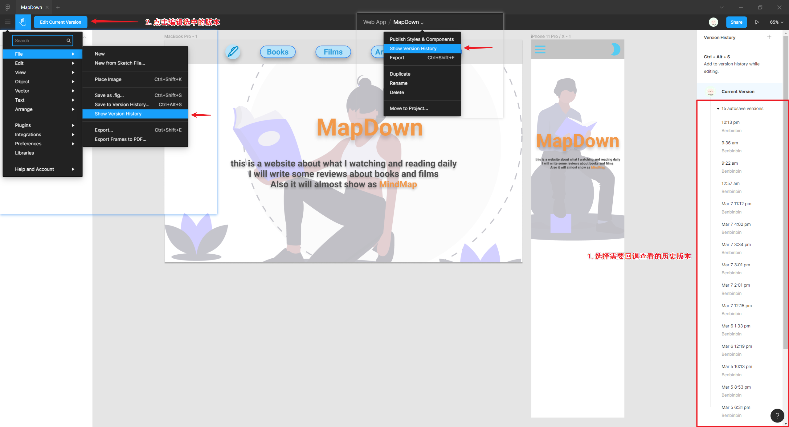

### 手动添加历史版本

可以手动提交历史版本将一些重要的修改作为一个版本 Version 标记起来，并提供版本名 `Title` 以在历史版本时间轴上明确标注。

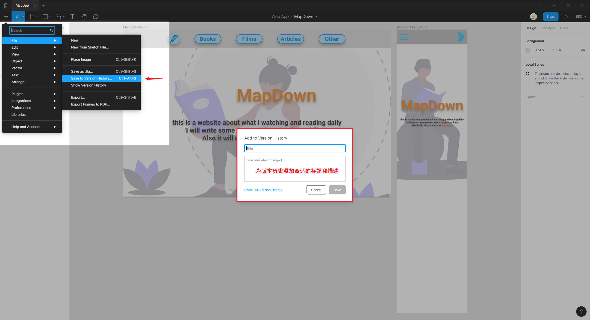

:bulb: 手动添加历史版本：点击（属性面板）`Version History` 右上角的 `+` 号添加历史版本

:bulb: 提交历史版本的快捷键：`Command + Option + S`

## 分享文件

Figma 支持以链接的方式将设计文件分享给他人，他人可以通过浏览器打开链接查看设计稿。

分享模式有两种：

* 可以限制为只有邀请的注册的用户可浏览设计文件（可设置编辑权限）
* 通过一个公开的链接分享给客户、同事或任何人，他们能看到一个概览。

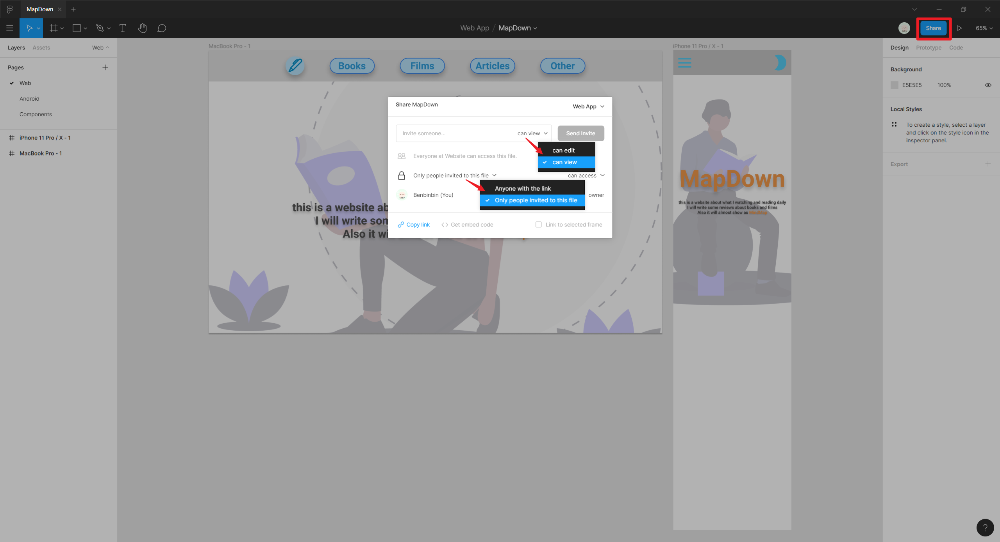

:warning: 通过邀请模式分享文件时，可以为浏览者开通设置编辑 `can edit` 权限

### 实时嵌入

Figma 还支持公共嵌入 Public embed，即将设计文件嵌入到网页中（需要选择 `Anyone with the link` 分享模式，即任何人都可以通过链接浏览文稿），网页就可以实时显示当前最新版本的设计文稿。

<iframe src="//player.bilibili.com/player.html?aid=94259627&bvid=BV1sE411p7br&cid=162480578&page=33&high_quality=1&danmaku=0" scrolling="no" border="0" frameborder="no" framespacing="0" allowfullscreen="true"></iframe>

:bulb: 点击 `Get Embed code` 获取嵌入代码，并添加到 HTML 文件中进行展示。

<iframe src="//player.bilibili.com/player.html?aid=94259627&bvid=BV1sE411p7br&cid=162480599&page=34&high_quality=1&danmaku=0" scrolling="no" border="0" frameborder="no" framespacing="0" allowfullscreen="true"></iframe>

除了可以分享整个设计文稿，还可以分享特定的框架 `Frame`：选中该框架后点击 `Share` 分享按钮，并在生成嵌入代码前勾选 :ballot_box_with_check: `Link to selected frame` 选项。

## 评论

使用 Figma 的评论功能可以在团队协作时实现实时的沟通，点击工具栏的 `Add/Show Comments` 可以添加或展示评论，并支持使用 `@username` 关键字来提醒特定的协作者。

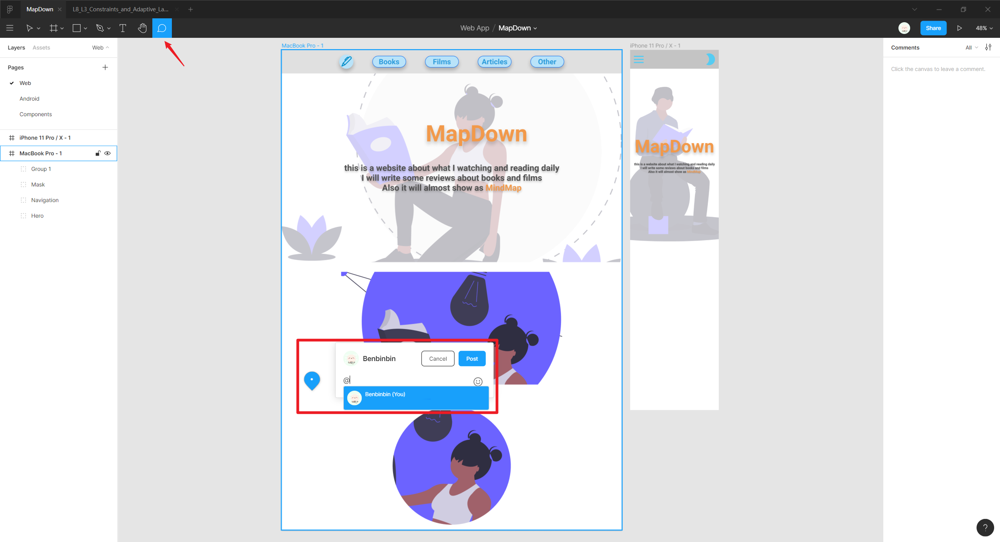

## 参考教程

* [Figma 野路子教学系列](https://www.youtube.com/watch?v=iKsbO-G9Q9Y&list=PLrgBkP7HMHlAWmh4kyW18cQ4xssiKR-JP)
* [Figma 中文用户手册](https://figmachina.com/guide/)
* [通过 Figma 构建设计体系](https://designcode.io/design-system-in-figma) | Design+Code
* [Create a Design System in Figma](https://www.youtube.com/playlist?list=PLDaHCLWmCcQL3ipBjcrJYc_DT6B2nxVf0)