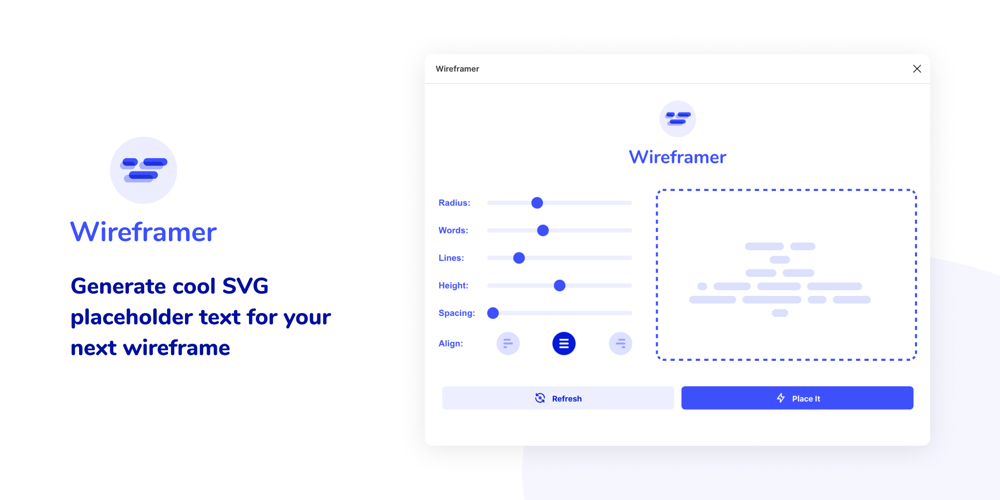
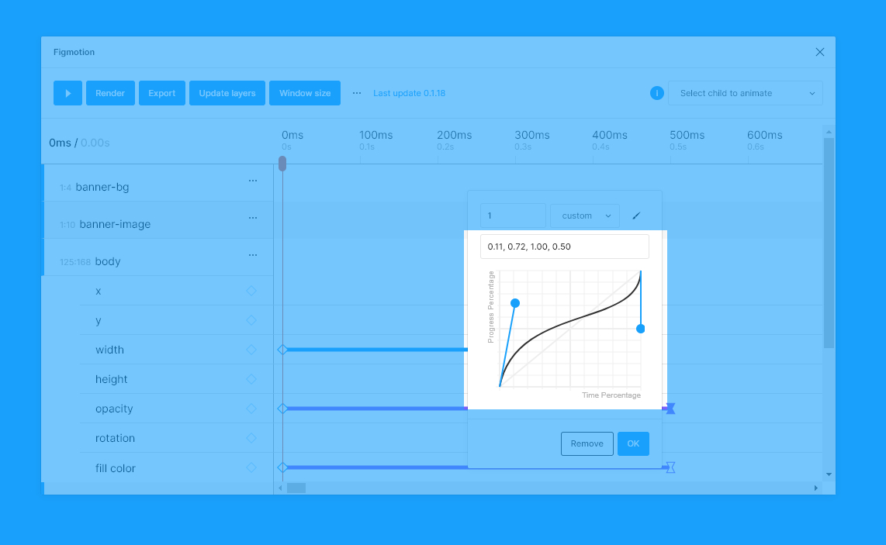
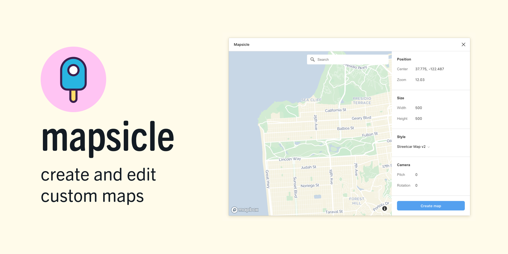

# 插件推荐

## 安装插件
参考：[安装及使用教程](https://www.bilibili.com/video/av68286883)。

可以在[官方社区](https://www.figma.com/community)网站或 Figma 主页左侧的 `Plugins` 标签页浏览可供下载的插件库。

## 字体插件

### Better Font Picker

一款提供更好的字体搜索及预览的[插件](https://www.figma.com/community/plugin/739922281164562258/Better-Font-Picker)。

<iframe src="//player.bilibili.com/player.html?aid=68286883&bvid=BV1JJ41137SP&cid=118358592&page=1&high_quality=1&danmaku=0" scrolling="no" border="0" frameborder="no" framespacing="0" allowfullscreen="true"></iframe>

### Chinese Font Picker

[中文字体选择器](https://www.figma.com/community/plugin/851126455550003999/Chinese-Font-Picker)，选择和预览系统中已安装的中文字体，该插件是基于开源的 Better Font Picker 创造的。

<iframe src="//player.bilibili.com/player.html?aid=94259627&bvid=BV1sE411p7br&cid=220855781&page=39&high_quality=1&danmaku=0" scrolling="no" border="0" frameborder="no" framespacing="0" allowfullscreen="true"></iframe>

## 颜色插件

### Color Kit

一款可基于指定颜色的快速生成指定梯度数量色阶的色卡的[插件](https://www.figma.com/community/plugin/797696673804519719/Color-Kit)。

<iframe src="//player.bilibili.com/player.html?aid=94259627&bvid=BV1sE411p7br&cid=220855879&page=42&high_quality=1&danmaku=0" scrolling="no" border="0" frameborder="no" framespacing="0" allowfullscreen="true"></iframe>

### Webgradients

 一款提供 180 中渐变配色的[插件](https://www.figma.com/community/plugin/802147585857776440/Webgradients)。

<iframe src="//player.bilibili.com/player.html?aid=94259627&bvid=BV1sE411p7br&cid=220855833&page=41&high_quality=1&danmaku=0" scrolling="no" border="0" frameborder="no" framespacing="0" allowfullscreen="true"></iframe>

## 设计

### Design Lint

一款检查设计中是否缺少文本、填充、笔触和效果样式的[插件](https://www.figma.com/community/plugin/801195587640428208/Design-Lint)，它还会捕获不正确的边界半径值。适合在交付设计稿前运行检查设计细节。

<iframe src="//player.bilibili.com/player.html?aid=94259627&bvid=BV1sE411p7br&cid=220855809&page=40&high_quality=1&danmaku=0" scrolling="no" border="0" frameborder="no" framespacing="0" allowfullscreen="true"></iframe>

### Wireframer

一款快速生成线框文本生占位符（SVG 图像）的[插件](https://www.figma.com/community/plugin/787660853629435276/Wireframer)，以构造高保真度的线框图 wireframe。

### Wireframe

一款提供大量线框图的[插件](https://www.figma.com/community/plugin/742764242781786818/Wireframe)。

<iframe src="//player.bilibili.com/player.html?aid=94259627&bvid=BV1sE411p7br&cid=220855752&page=38&high_quality=1&danmaku=0" scrolling="no" border="0" frameborder="no" framespacing="0" allowfullscreen="true"></iframe>

### Hand Wireframe

将基本图像和文字（英文）转换为[手绘风格](https://www.figma.com/community/plugin/846345227416352754/Hand-Wireframe)。

<iframe src="//player.bilibili.com/player.html?aid=94259627&bvid=BV1sE411p7br&cid=220855726&page=37&high_quality=1&danmaku=0" scrolling="no" border="0" frameborder="no" framespacing="0" allowfullscreen="true"></iframe>

## 交互

### Figmotion

一款制作原型交互的[插件](https://www.figma.com/community/plugin/733025261168520714/Figmotion)，操作详情可查看[文档](https://freighter.gitlab.io/figmotion/knowledgebase/)。

## 其他

### Mapsicle

一款交互式[地图插件](https://www.figma.com/community/plugin/736458162635847353/Mapsicle)，使用 Mapbox 地图为您提供各种自定义选项，如地图样式修改和地点设置等功能而非简单的截图，可让您在设计原型中放置「动态」地图。

