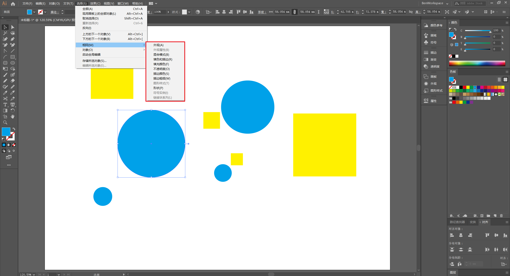
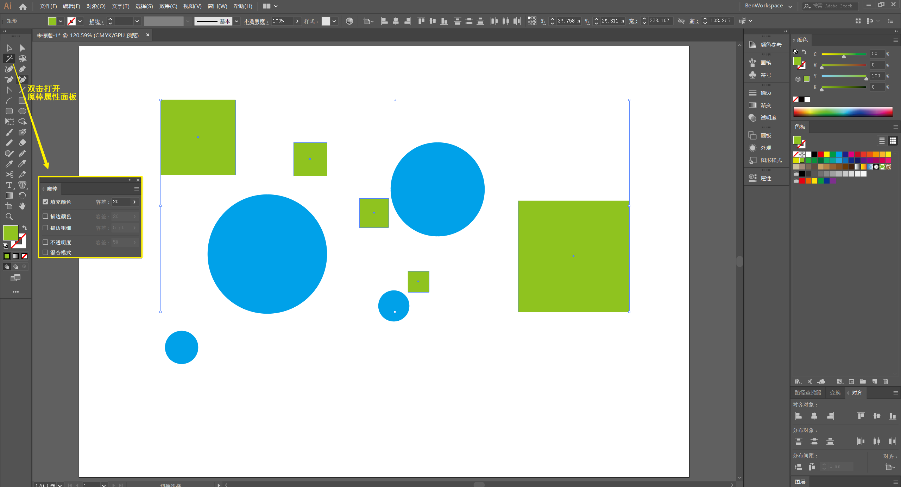
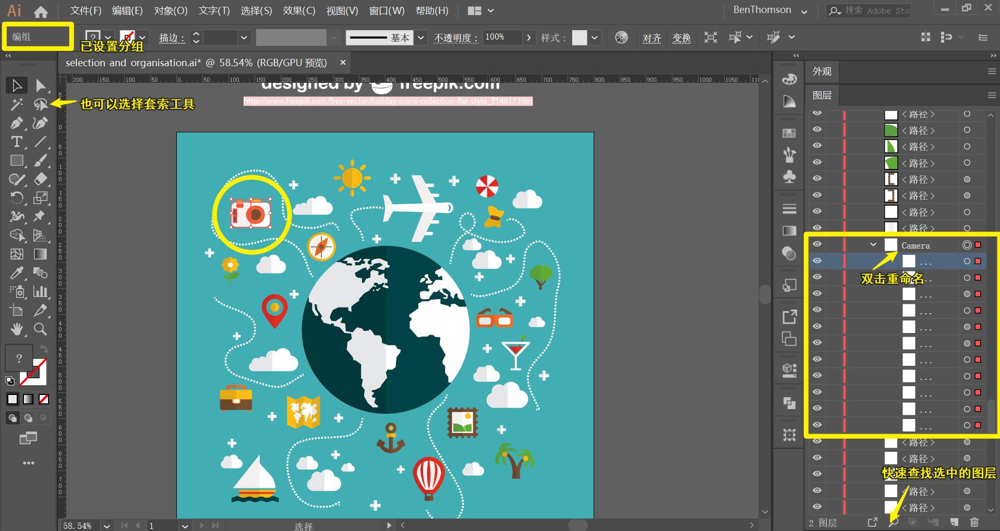
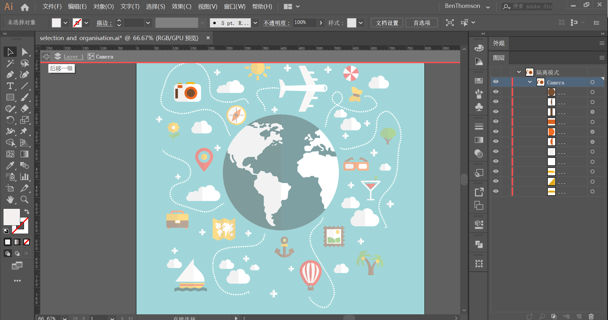
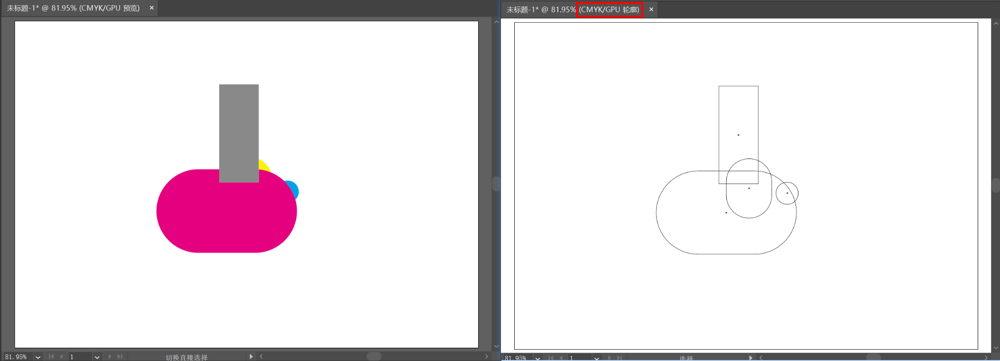
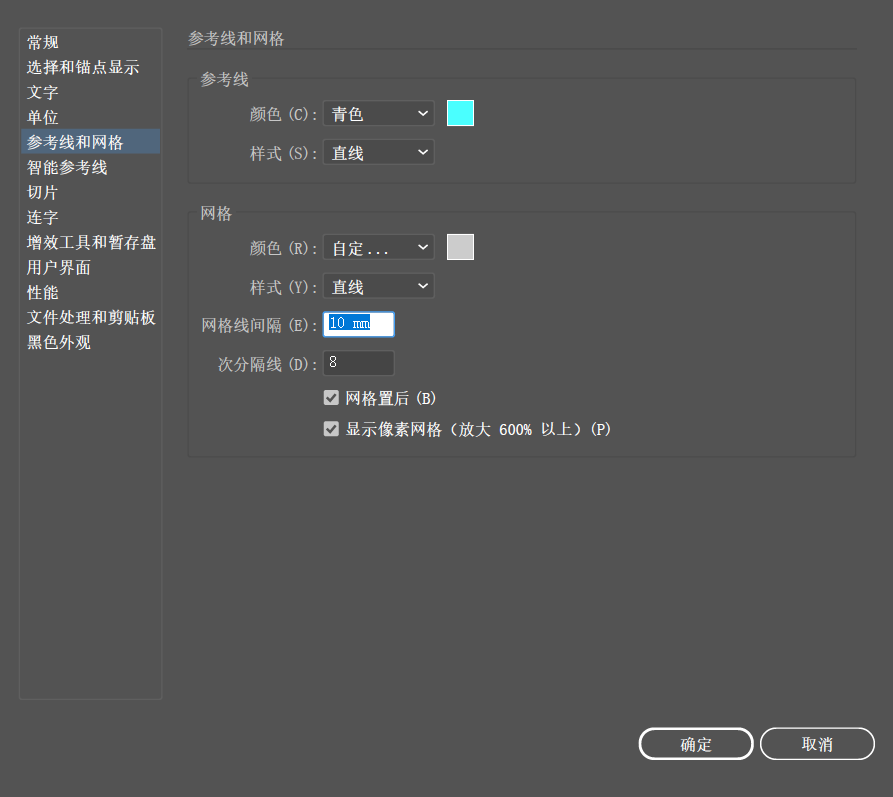
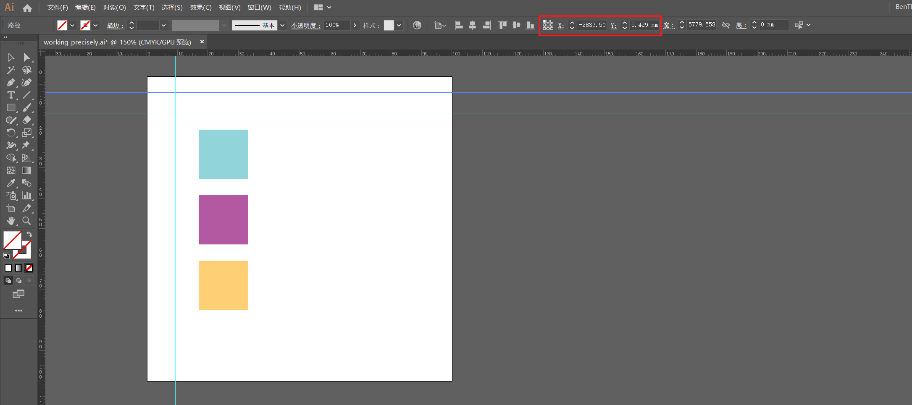
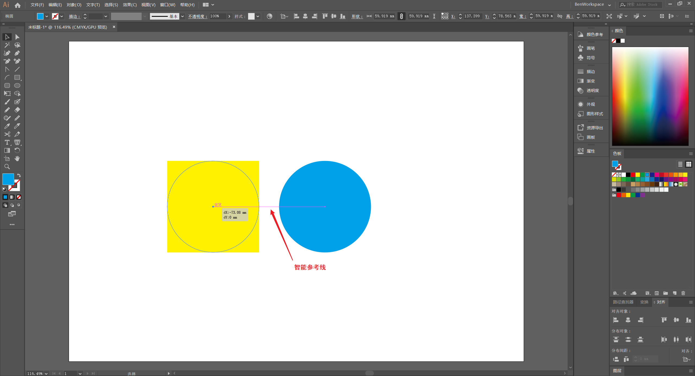
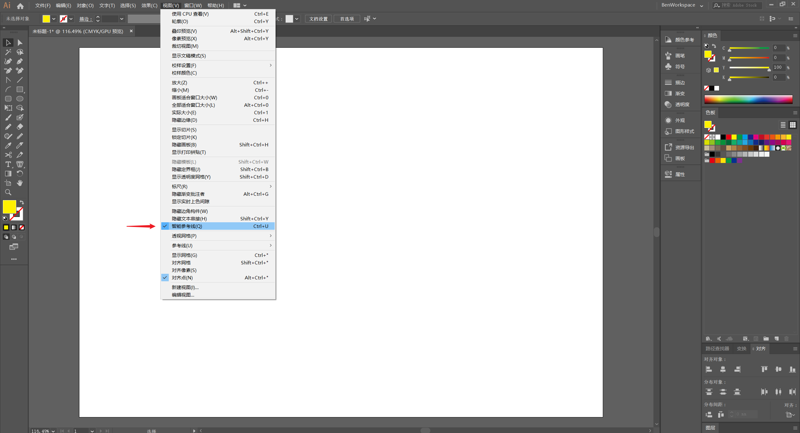

# 高效技巧

一些可以提高效率的设置和操作小技巧。

## 保存视图

可以保存当前的视图，以便可快速定位到特定的图稿区域。

:key: 保存当前视图：（菜单栏）`视图` -> `新建视图...`

<iframe src="//player.bilibili.com/player.html?aid=92256512&bvid=BV1S7411N7WV&cid=157515177&page=14&high_quality=1&danmaku=0" scrolling="no" border="0" frameborder="no" framespacing="0" allowfullscreen="true"></iframe>

## 保存选择对象

保存当前选择的对象，以便在以后快速选中这些对象。

* 保存选区：（菜单栏）`选择` -> `存储所选对象...`

* 加载已保存的选区：（菜单栏）`选择` -> 点击已保存的选区名称

<iframe src="//player.bilibili.com/player.html?aid=92256512&bvid=BV1S7411N7WV&cid=157515136&page=12&high_quality=1&danmaku=0" scrolling="no" border="0" frameborder="no" framespacing="0" allowfullscreen="true"></iframe>

## 选择相似

基于特定的参数选择相似的元素

:key: 方法一：（菜单栏）`选择` -> `相同` 根据当前选中元素的特定属性选择相似元素。

:key: 方法二：使用 `魔棒工具` 点选元素。双击 `魔棒工具` 打开参数设置框，可以设置选择基于何种参数进行选择，并通过调整 `容差` 来控制选择元素的相似度。

## 元素分组

将元素进行恰当的分组并取合适的名称，使它们成为一个「整体」，方便素材管理和操作。选中需要分组的元素，按快捷键 `Ctrl + G` 将它们归组，并在（属性面板）`图层` 修改该组名称。

:bulb: 分组的快捷键 `Ctrl + G`

:bulb: 取消所有分组的快捷键 `Shift + Ctrl + G`

## 隔离模式

将元素分组后无法直接操作单个形状，可以进入 `隔离模式` 对选中的组中格各素直接进行独立操作

* **双击该组的任意一个元素即可进入隔离模式**，该组的元素以高亮显示（其他元素显灰白，且不可操作）

* 双击任意灰白区域或点击文档窗口左上角的 `后移一级` 按钮退出隔离模式，返回标准模式

## 元素分图层

将形状分类放置不同图层上并取合适的名称，可批量处理该图层中的元素，如利用图层的 `隐藏`、`锁定` 功能对该图层的所有元素进行隐藏或锁定；调整图层的相对位置，可以快速调整该图层的所有元素在画板中的叠放次序。

:key: 方法一：选中元素并剪切（或使用快捷键 `Ctrl + X`） -> （属性面板）`图层` 点击下方 `创建新图层` -> （菜单栏）`编辑` -> `贴在前面` 将元素粘贴在新创建的图层上

:bulb: 贴在前面的快捷键：`Ctrl + F`

:bulb: 贴在后面的快捷键：`Ctrl + B`

:key: 方法二：选中元素，此时在（属性面板）`图层` 中被选中的元素所在的图层后方会有一个**彩色小点标记**，将图层最小化，即未展开显示其中的元素，拖拽该图层后的彩色小点（表示选中的元素）到新建图层上，即可将元素移到新图层上

<iframe src="//player.bilibili.com/player.html?aid=92256512&bvid=BV1S7411N7WV&cid=220844089&page=27&high_quality=1&danmaku=0" scrolling="no" border="0" frameborder="no" framespacing="0" allowfullscreen="true"></iframe>

:bell:  若图层过多，可在选定元素后，点击（属性面板）`图层` 下方的搜索按钮 :mag_right: 快速定位

## 轮廓视图

轮廓视图将去掉所有颜色和色块，展示简单的轮廓线。在复杂多元素重叠的画板中使用轮廓视图可以快速预览整体构图和元素组成。

:bulb: 开启轮廓视图：（菜单栏）`视图` -> `轮廓` （如果选择 `预览` 就会切换会默认视图）
:bulb: 开启轮廓视图快捷键：`Ctrl + Y`

## 精准设计

Illustrator 提供 网格系统 和 参考线 辅助进行精准设计。

### 网格

使用网格布局使得对齐和排版更简单准确，即将元素的定位和尺寸调整都限制在网格点上。

* 显示/隐藏网格：（菜单栏）`视图` -> `显示网格`

  :bulb: 显示/隐藏网格的快捷键 `Ctrl + "`

:warning:要将元素对齐到网格需要开启相应的选项：（菜单栏）`视图` -> `对齐网格`

:bulb: 开启对齐网格的快捷键：`Shift + Ctrl + "`

<iframe src="//player.bilibili.com/player.html?aid=92256512&bvid=BV1S7411N7WV&cid=220844053&page=25&high_quality=1&danmaku=0" scrolling="no" border="0" frameborder="no" framespacing="0" allowfullscreen="true"></iframe>

可以对网格布局的间隔、线条样式、颜色等进行设置：（菜单栏）`编辑` -> `首选项` -> `参考线和网格...`

### 参考线

参考线可以辅助对齐进行精准的设计，它们可以通过点击文档窗口的顶部或左侧标尺并向画板内拖拽产生，在拖拽时按住 `Alt` 键切换参考线的方向。

:key: 显示/隐藏标尺：（菜单栏）`视图` -> `标尺`

:bulb: 显示/隐藏标尺的快捷键 `Ctrl + R`

<iframe src="//player.bilibili.com/player.html?aid=92256512&bvid=BV1S7411N7WV&cid=220844066&page=26&high_quality=1&danmaku=0" scrolling="no" border="0" frameborder="no" framespacing="0" allowfullscreen="true"></iframe>

如果参考线是**锁定状态**（创建后无法更改参考线的位置），可以通过（菜单栏）`视图` -> `参考线` -> `解锁参考线` 修改参考线状态，参考线解锁后，选择需要设置的参考线，可以通过拖动其定位，或修改（选项栏） `x` 和 `Y` 值以更精准地设置参考线定位。

* 选中的对象设置为参考：（菜单栏）`视图` -> `参考线` -> `建立参考线`

  :bulb: 基于选中的对象创建参考线的快捷键：`Ctrl + 5`

* 显示/隐藏参考线：（菜单栏）`视图(V)` -> `参考线(U)` -> `隐藏参考线(U)`

  :bulb: 显示/隐藏参考线的快捷键：`Ctrl + ;`

* 清除参考线：（菜单栏）`视图(V)` -> `参考线(U)` -> `清除参考线(C)`

  :warning: 参考线在打印输出时并不会显示

标尺度量方式和零点位置都可以进行设置

<iframe src="//player.bilibili.com/player.html?aid=92256512&bvid=BV1S7411N7WV&cid=220844032&page=24&high_quality=1&danmaku=0" scrolling="no" border="0" frameborder="no" framespacing="0" allowfullscreen="true"></iframe>

* 在标尺处鼠标右键点击，在弹出菜单中可以切换 `更改为全局标尺` 或 `更改为画板标尺` 模式
  * **画板标尺**：每个画板都有一个独立的标尺（推荐）
  * **全局标尺**：画布的所有画板共用一套标尺
* 设置标尺 0 起点：在文档窗口标尺左上角区域点击或拖拽出正交线，设置标尺 0 点位置，可以双击该区域重置 0 起点（最左侧画板的左上角）

### 智能参考线

对象在移动时会出现 **紫色** 的线，称为是智能参考线，用以辅助对齐定位。

开启/关闭智能参考线： （菜单栏）`视图` -> `智能参考线`

:bulb: 开启/关闭智能参考线快捷键：`Ctrl + U`

