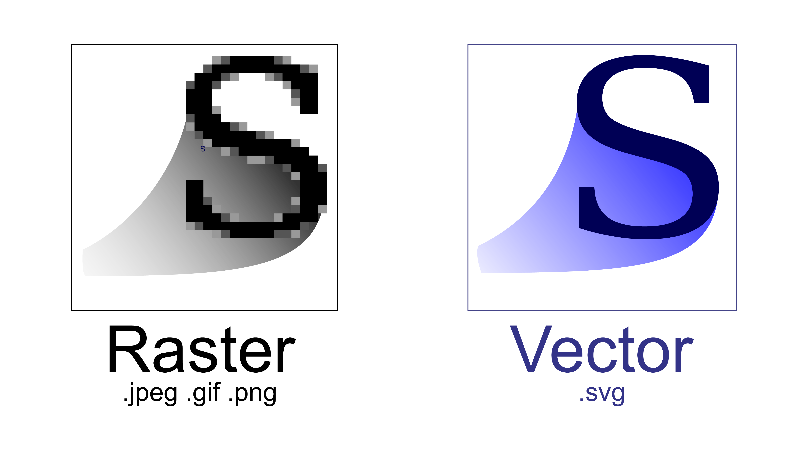
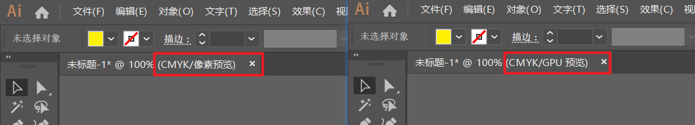
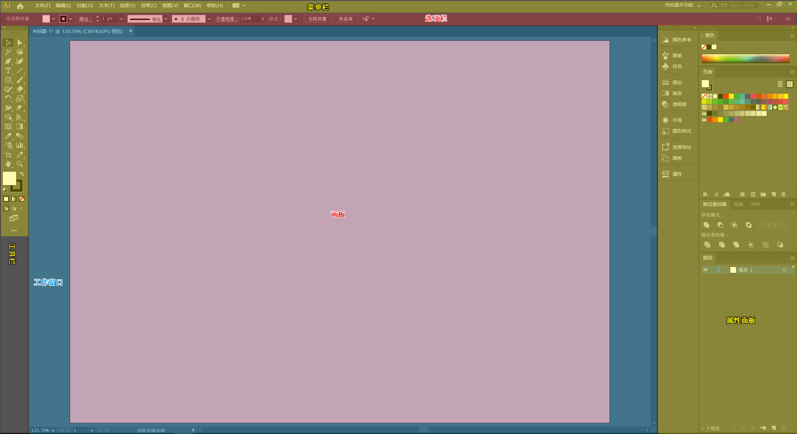
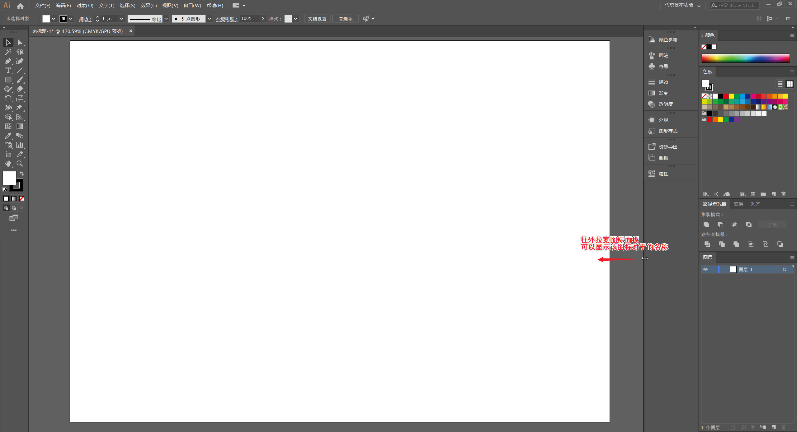
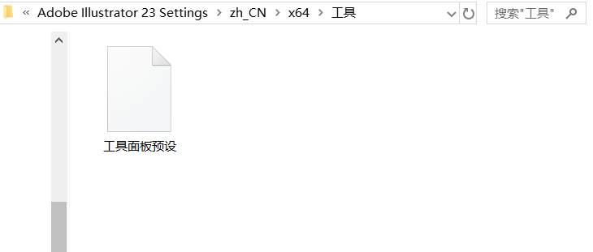
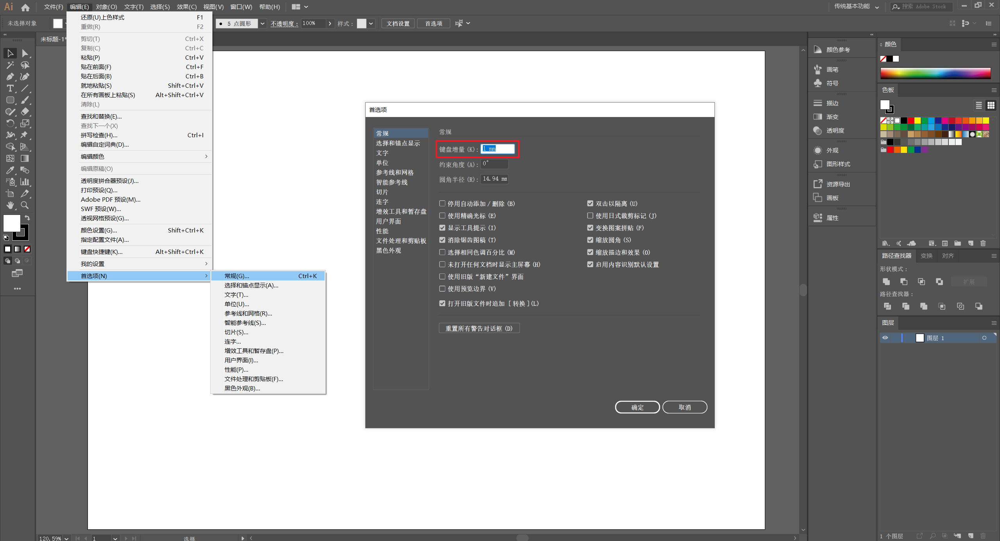
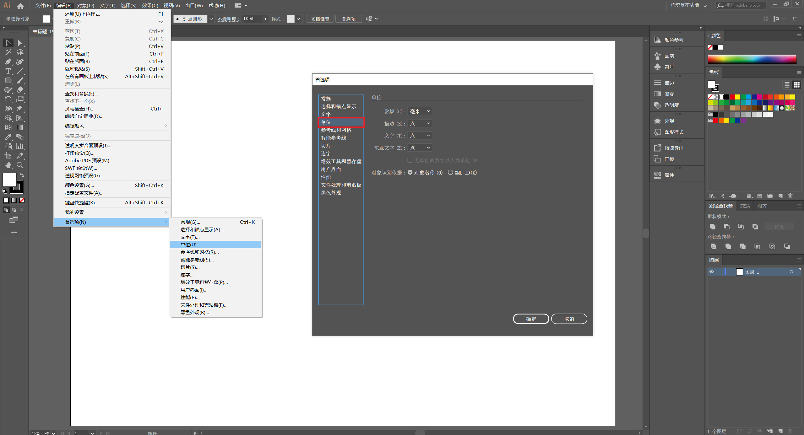
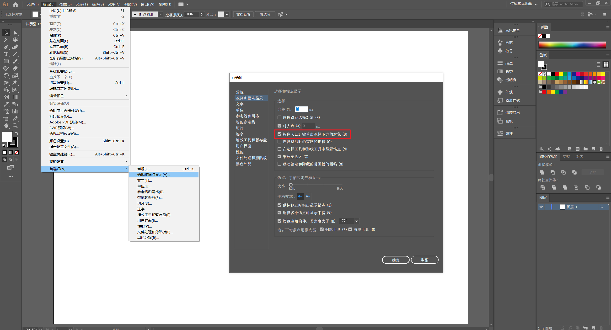
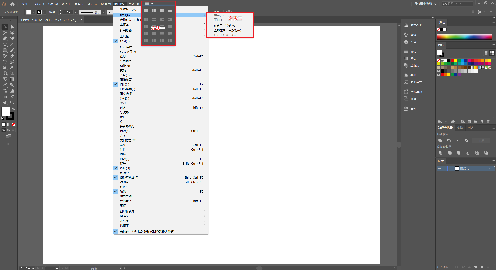

# 简介

## 大纲
Adobe Illustrator 是行业标准矢量图形应用程序，矢量图的主要特点是放大图片也不会损失图片细节，因此 AI 常用于创建 Logo、图标、草图和各种用途的图形（如打印、网页交互、移动设备等）。

|                   |                   位图                   |              矢量图              |
| :---------------: | :--------------------------------------: | :------------------------------: |
| 优点​ :thumbsup:  | 可以容纳教复杂的各种内容，适用于存储相片 | 可无限放大而不丢失细节，文件较小 |
| 缺点 :thumbsdown: |        缩放的大小受图片的像素限制        |        难以表现复杂的细节        |

在 AI 中可以进行两种格式切换

* 启动像素预览模式：（菜单栏）`视图` -> `像素预览`
  :bulb: 启动像素预览快捷键：`Ctrl + Alt + Y`

## 界面

## 设置优化

可以按照以下提示优化设置，以提供更高效的操作。

### 面板

拉宽图标面板可以显示相应的属性图标的名称，方便新手快速找寻工具。

### 定制工作区和工具栏

选择常用的面板定制化一个适合自己的工作区，可以提升工作效率。根据所需，如排版、插画、字体设计等不同场景，定制化不同工作区。通过新建工作区来保存当前定制的工作区布局。

<iframe src="//player.bilibili.com/player.html?aid=92256512&cid=157515002&page=3&high_quality=1&danmaku=0" scrolling="no" border="0" frameborder="no" framespacing="0" allowfullscreen="true"></iframe>

* 通过 （菜单栏）`编辑` -> `我的设置` -> `导出设置...` 将定制化工作区设置导出到电脑本地保存。

类似地，可以将定制工具栏。

<iframe src="//player.bilibili.com/player.html?aid=92256512&cid=157514929&page=2&high_quality=1&danmaku=0" scrolling="no" border="0" frameborder="no" framespacing="0" allowfullscreen="true"></iframe>

:warning: 工具栏预设存档文件[所在的（Window）目录](http://vektorgarten.de/illustrator-settings.html#5)<!-- {target="_blank"} -->为：`<OSDisk>\Users\<username>\AppData\Roaming\Adobe\Adobe Illustrator <version number> Settings\<locale> (e.g.  en_US)\x64\Tools Panel Presets`，可将该文件进行备份。

### 定制快捷键

创建专属快捷键以实现更高效的操作。

 

	<iframe src="//player.bilibili.com/player.html?aid=92256512&cid=157515079&page=7&high_quality=1&danmaku=0" scrolling="no" border="0" frameborder="no" framespacing="0" allowfullscreen="true"></iframe>

:bulb: 推荐将常用的操作快捷键设置为单键（而非组合键），如还原快捷键设置为 `F1`，重做快捷键设置为 `F2`。

### 键盘增量

键盘增量是指在需要精细移动物体时，按一次键盘的 `←` 或 `→` 按键物体移动的大小，即每移动「一步」的距离。

:bulb: 当按住 `Shift` 再按 `←` 或 `→` 键，为每次移动「十步」。

为键盘增量取一个合适的较小值。

键盘增量的单位可以在  `单位` 中设置。

### 选择容差

选择容差是指当鼠标靠近物体的锚点时，若距离在容差范围内即可选中物体。

设置合适的选择容差，可以避免操作时误选对象。

### 选择下方对象

常常在设计时遇到对象相互重叠却要选择下方的对象的情况，可以开启选择下方对象的选择。

:bulb: 按住 `Ctrl` 单击两次即可选中（两个重叠元素的）下方对象。

## 窗口排列

当打开多个文档时，可以选择合适的窗口排列方式以提高工作效率。

* （菜单栏）`窗口(W)` -> `排列(A)`
* 也可以使用菜单栏的可视化图标排布多文档窗口

