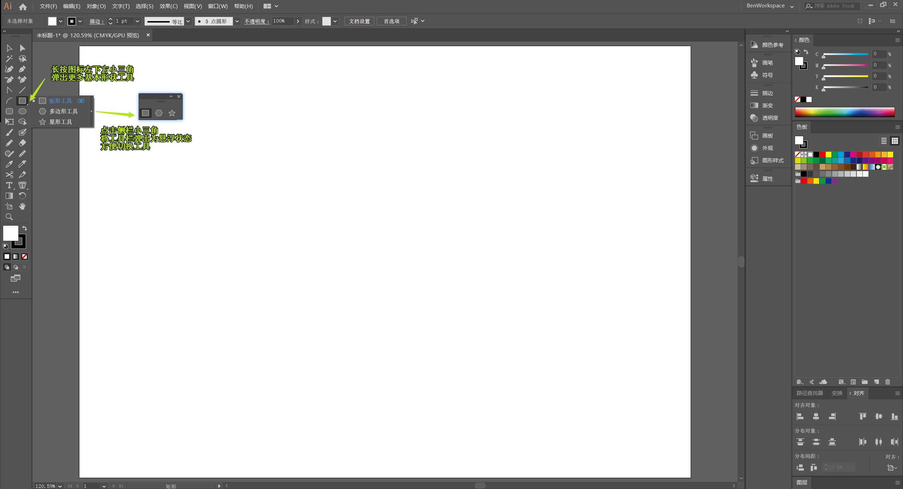
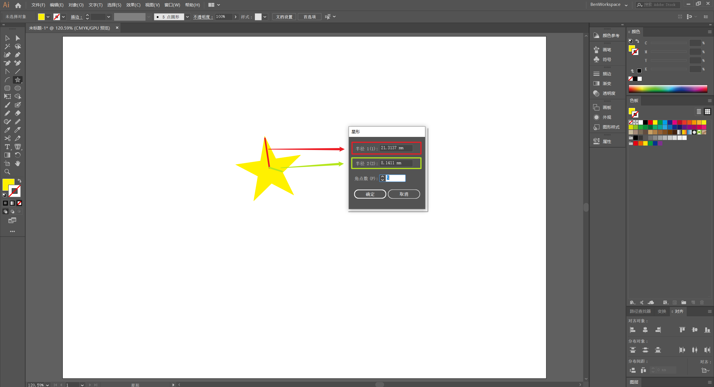
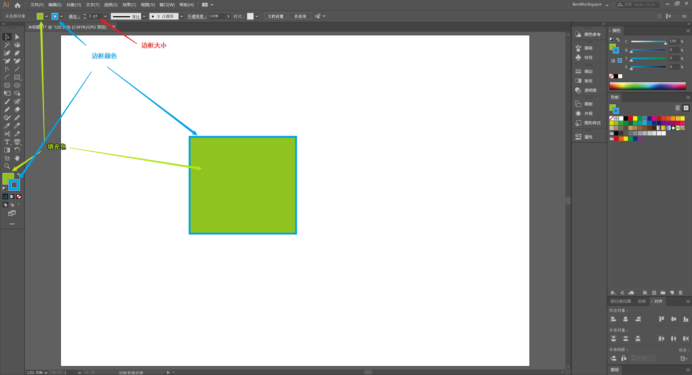
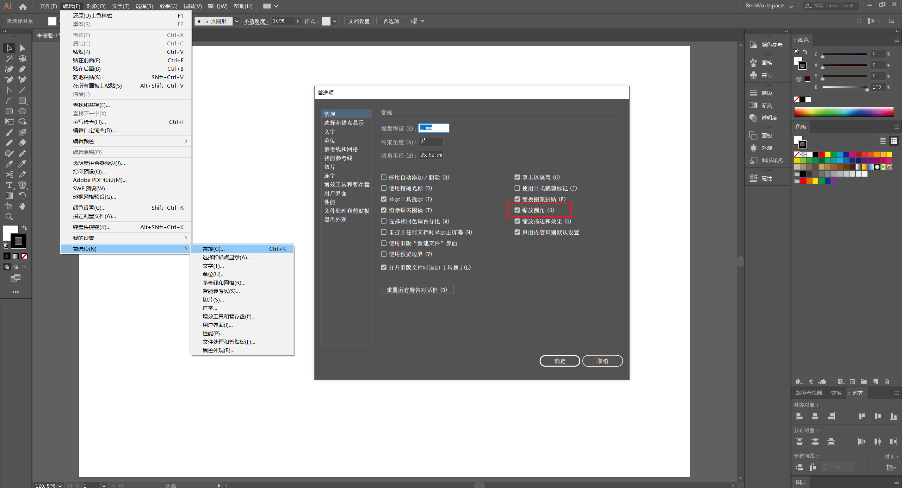
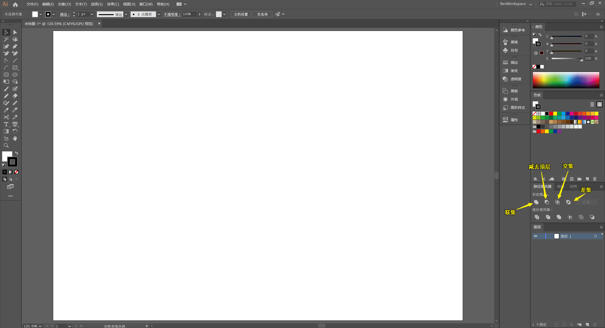

# 形状
矢量图由各种基本形状构成，Illustrator 提供了不同的形状工具，可以创建多种不同的基本形状对象。

## 基本形状

有多种方式创建基本形状对象

:key: 方法一：选择合适的形状工具**拖拽**绘画出所需大小的基本形状

:key: 方法二：选择合适的形状工具在文档窗口空白区域**点击**， 输入尺寸值或其他属性创建基本形状

:key: 方法三：使用 `Shaper 工具` 画出形状（程序自动识别）转换为最相近的规则基本形状

:bulb: 矩形工具快捷键：`M`

:bulb: 椭圆工具快捷键：`L`

:bulb: `shaper 工具` 快捷键：`Shift + N`

 

	<iframe src="//player.bilibili.com/player.html?aid=92256512&bvid=BV1S7411N7WV&cid=157515307&page=22&high_quality=1&danmaku=0" scrolling="no" border="0" frameborder="no" framespacing="0" allowfullscreen="true"></iframe>

操作小技巧

* 在使用 `矩形工具` 或 `椭圆工具` 按住 `Shift` 键创建出正方形或圆形
* 使用 `多边形工具` 或 `星形工具` 拖拽创建对象时，可以使用 `up` 或 `down` 键调整边的数量；使用 `圆角矩形工具` 拖拽创建对象时，使用 `up` 或 `down` 键调整四个角度的大小
* 在拖拽创建形状按住空格 `Space` 可移动图形，再松开空格 `Space` 可继续拖拽调整正在创建的形状尺寸

* `Shaper 工具` 还可用于快速删除或组合形状
  * 在单个形状上画曲线，可以删除该形状
  * 在多个形状的重叠区上画曲线，可以组合形状

 

	<iframe src="//player.bilibili.com/player.html?aid=92256512&bvid=BV1S7411N7WV&cid=157515238&page=17&high_quality=1&danmaku=0" scrolling="no" border="0" frameborder="no" framespacing="0" allowfullscreen="true"></iframe>

### 创建星形

其中星形的形状由属性 `半径 1` 和 `半径 2` 和 `点` 决定：

* `半径 1` 指定从星形中心到星形最外点（顶端）的距离
* `半径 2` 指定从星形中心到星形最内点（凹处）的距离
* `角点数` 指定星形具有的角数

使用 `星形工具` 拖拽创建星形时，默认使用上次的属性值创建图形，若需要修改图形（属性）可以使用快捷键：

* 按住 `Ctrl` 键以固定内部 `半径 2` （内距）保持不变， 拖拽改变星形的外部 `半径 1`（外距）
* 按住 `Alt` 键可以创建「正」多边星形

 

	<iframe src="//player.bilibili.com/player.html?aid=92256512&bvid=BV1S7411N7WV&cid=157515243&page=18&high_quality=1&danmaku=0" scrolling="no" border="0" frameborder="no" framespacing="0" allowfullscreen="true"></iframe>

## 形状属性

每个形状都有以下基本属性，可以在选项栏、工具栏、属性面板等地方进行调节

* 填色
* 描边颜色
* 描边大小

属性的默认属性是**白色填充，黑色描边，边框大小为 1 px**

 

	<iframe src="//player.bilibili.com/player.html?aid=92256512&bvid=BV1S7411N7WV&cid=157515195&page=15&high_quality=1&danmaku=0" scrolling="no" border="0" frameborder="no" framespacing="0" allowfullscreen="true"></iframe>

:bulb: 填色与描边样式相互交换快捷键：`Shift + X`

:bulb: 切换填色和边框前置的快捷键：`X`

:bulb: 设置为 `无` 样式的快捷键：`/`

:bulb: 将基本属性设定为默认值快捷键：`D`

### 描边

- [ ] 属性面板

- [ ] 宽度工具

- [ ] 吸管工具会吸取填充和描边的样式

## 形状调整

:key: 方法一：使用 `选择工具`  调整对象的定位、大小、旋转角度；使用 `直接选择工具` 调整对象的锚点。

:key: 方法二：在（属性面板）`变换` 中调节参数，以调整调整对象在画板的定位、对象尺寸大小、旋转或倾斜的角度、圆角角度等。

:key: 方法三：（工具栏）`旋转工具(R)` -> 在画板任意位置鼠标左键单击，选择「旋转中心点」 -> 拖拽图形围绕「中心点」旋转

 

	<iframe src="//player.bilibili.com/player.html?aid=92256512&bvid=BV1S7411N7WV&cid=157515103&page=9&high_quality=1&danmaku=0" scrolling="no" border="0" frameborder="no" framespacing="0" allowfullscreen="true"></iframe>

:bulb: 按住 `Shift` 键可以保持原有比例进行缩放，或保持 45° 旋转增量进行旋转

:warning: 对于圆角矩形对象，推荐开启（属性面板）` 变换` 中的 `缩放圆角` 和 `缩放描边和效果` 选项，以允许在缩放形状时**按比例改变**圆角和描边的大小；否则缩放前后描边大小比例会不协调，圆角无法随图像大小响应式改变，并且圆角矩形会缩小到一定的程度，由于固定大小的圆角而无法再缩小。可以在首选项中将 `缩放圆角` 设置为默认打开 :key: （菜单栏）`编辑` -> `首选项` -> `常规`。

## 组合形状

对选中的多个图像进行组合。

:key: 方法一：使用（属性面板）`路径查找器` 对选中的多个对象进行组合

* `联集`：将形状组合
* `减去顶层`：基于最底层的形状，减去其上层重叠的区域
* `交集`：保留所有选择形状均相交的区域
* `差集`：减去选择形状两两间相交的区域（超过两个形状重叠的部分不减去）

:key: 方法二：使用 `形状生成器工具` 基于选中的多个形状进行组合。

* 联集：在需要组合的区域画出线条 或 按住 `Shift` 框选需要组合的区域
* 减去顶层：按住 `Alt` 键点选需要减去的区域

 

	<iframe src="//player.bilibili.com/player.html?aid=92256512&bvid=BV1S7411N7WV&cid=157515213&page=16&high_quality=1&danmaku=0" scrolling="no" border="0" frameborder="no" framespacing="0" allowfullscreen="true"></iframe>

  :bulb: 形状生成器工具的快捷键：`Shift + M`

 

	<iframe src="//player.bilibili.com/player.html?aid=92256512&bvid=BV1S7411N7WV&cid=157515065&page=6&high_quality=1&danmaku=0" scrolling="no" border="0" frameborder="no" framespacing="0" allowfullscreen="true"></iframe>

当形状仅由描边或轮廓线形成时，减去其中一部分，软件会**自动补全**形成，形成一个另外的图形。:key: 为避免自动补全可以将对象进行**扩展**：（菜单栏）`对象(O)` -> `扩展(X)` -> 将其扩展为 `填充`，即将描边与填充样式互换

