# 基础操作

参考：
* :cinema: [《Martin·PS软件系统教程》](https://www.gogoup.com/course/GMzE1/)
* :cinema: [Photoshop CC 2019 MasterClass](https://courses.yesimadesigner.com/courses/photoshop-cc-masterclass)

## 新建文件
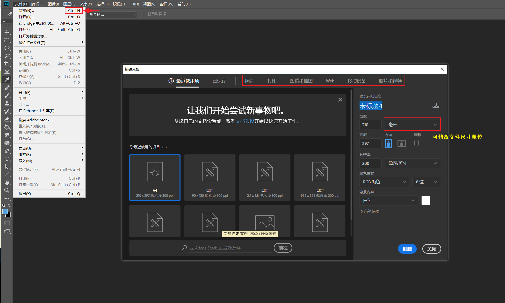

* **快捷键**： `Ctrl + N`
* Photoshop 已预设了常用的不同类型的文件尺寸

## 保存文件
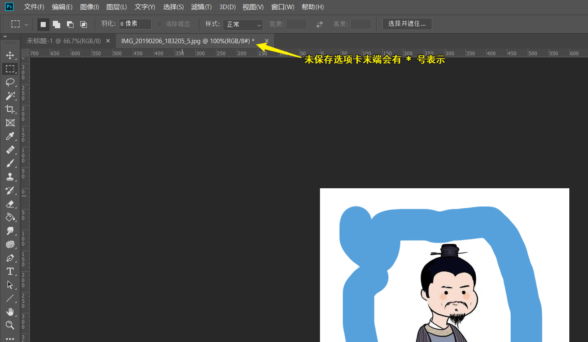

* **快捷键**： `Ctrl + S`
* 推荐保存为 Photoshop 工程文件（后缀名为 `.psd`）或 TIFF文件（后缀名为 `.tiff`），因为这两种文件可以记录图层信息
* 保存为压缩格式，如 JPEG（后缀名为 `jpg` ）或 `PNG`（后缀名为 `png`），适用于网络或邮件传播

## 导入图片
### 方法一
**操作**：`文件` -> `置入嵌入对象(L)...`

* 置入图片后会自动形成一个**图层**

### 方法二
**操作**：`打开(O)…` -> `选择图片文件`
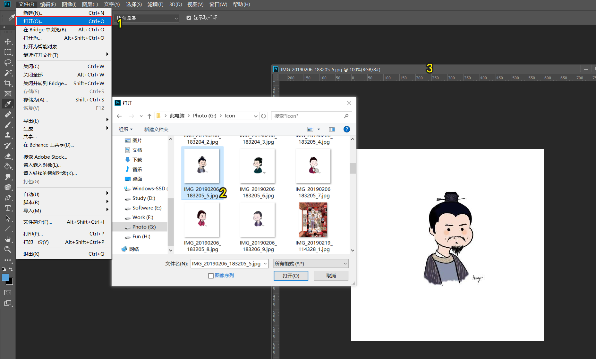

### 方法三
**推荐该方法**：使用工具 `Bridge`
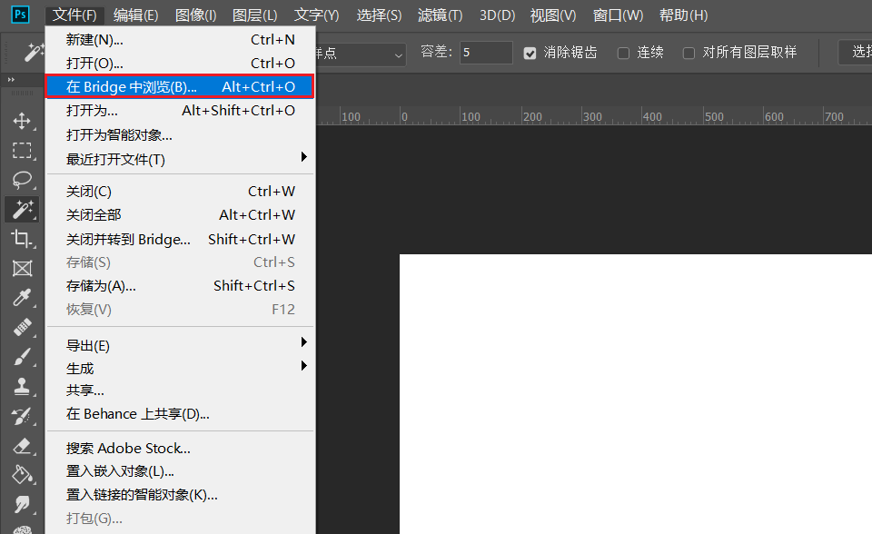

在 Bridge 软件中可更方便地进行查找、浏览文件，如图片的元信息，通过鼠标左键双击相应的图片即可在 Photoshop 里打开
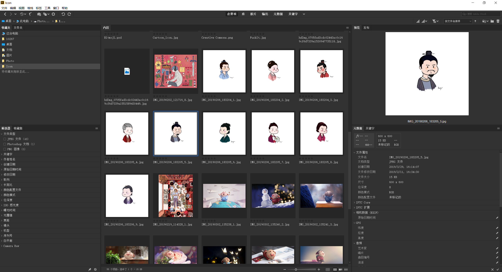

## 文档窗口排布
打开的多个文件默认以选项卡形式展示，可以点击相应的 Tab 切换不同文件，也可以更改文件排布方式

**操作**：（菜单栏）`窗口` -> `排列`

默认排列方式是 **`将所有内容合并到选项卡中`**

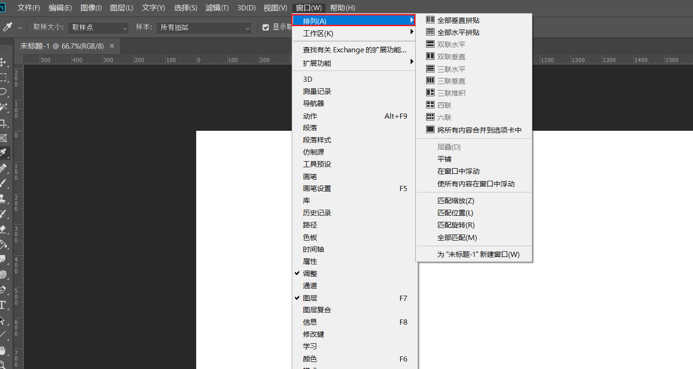

## 界面布局
可在工具栏中点击图标切换界面布局
* 隐藏状态栏
* 隐藏所有栏目
* 标准模式

**快捷键**：
* `Tab` 隐藏/显示工具栏、选项栏、文档标签和面板
* `Shift + Tab` 隐藏/显示面板
* `F` 在多种全屏显示模式间切换（隐藏状态栏/隐藏所有栏目/标准模式）

## 画布大小调整
**操作**：（菜单栏）`图像` -> `画布大小` -> 选择 `相对` -> 输入需要扩增的画布宽高尺寸

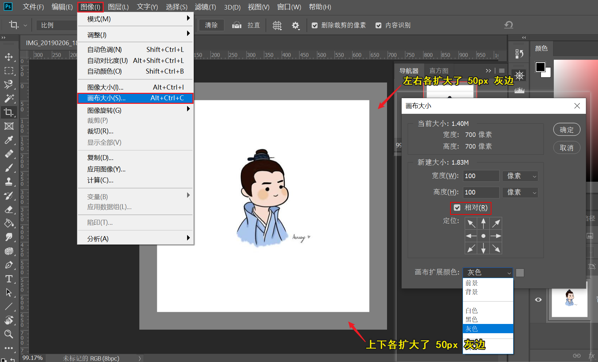
**补充**：

* 可以选择 `定位` 以修改画布扩增的方向和模式，如图示锚点设置在中间，表示图片会向各方向均匀扩展。
* 可以选择扩展的颜色

## 图片缩放拖拽
可使用多种操作方式对图片进行操作

**快捷键**：
* 放大 `Ctrl + +`
* 缩小 `Ctrl + -`
* 缩放到实际像素尺寸 `Ctrl + 1`
    * 即100%缩放比
    * **图片像素大小与屏幕像素大小对应**，该方法可以查看图片质量

### 点击缩放
**操作**：  （工具栏）`缩放工具` -> 点击鼠标左键放大（按住 `Alt` 键点击是缩小）

### 拖拽缩放
* 在选项栏勾选了 `细微缩放` 可实现拖拽缩放

    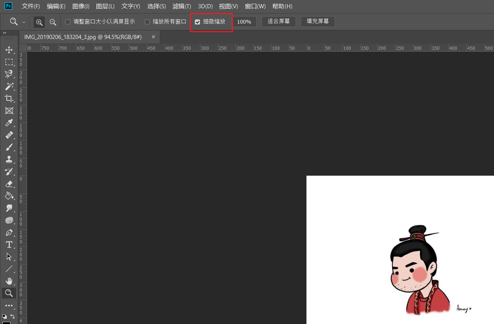

**操作**：（工具栏）`缩放工具` -> 按住鼠标左键`向右拖拽`放大（按住鼠标左键`向左拖拽`缩小）

* 若未勾选 `细微缩放` 则可按住鼠标左键`框选`需要缩放的区域放大

### 查看全图

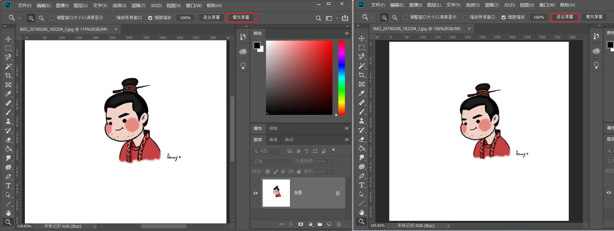

**操作**：点击（选项栏）`适合屏幕`或`填充屏幕`可以根据屏幕和图片高宽比快速缩小图片以查看全图

## 移镜头
### 方法一
放大后无法在屏幕上显示全图，需要移动画布以查看图片其他部分

**操作**：按住键盘 `Space` 键（屏幕出现手形鼠标）按住鼠标左键后`拖拽`可向任意方向移动画布

### 方法二
通过结合**鸟瞰图**快速切换到图像的指定部分

**操作**：按住键盘 `H` 键 -> 按住鼠标左键（鸟瞰图出现）同时移动到需要放大的图片区域 -> 释放键盘 `H` 键

也可以直接调出**导航面板**

**操作**：（菜单栏）`窗口` -> `导航器`

## 旋转视图
使用 `旋转视图工具`
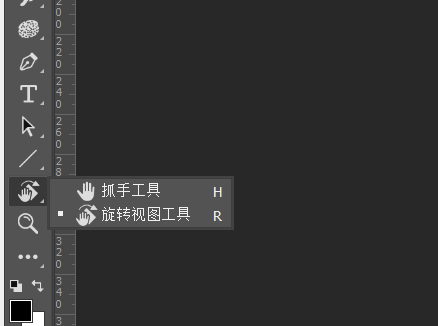

**快捷键**：`R`

旋转至（预设）固定角度
**操作**：使用旋转视图工具的同时按住 `Shift`

返回原始视图角度
**快捷键**：`Esc`
**操作**：（选项栏）`复位视图`按钮
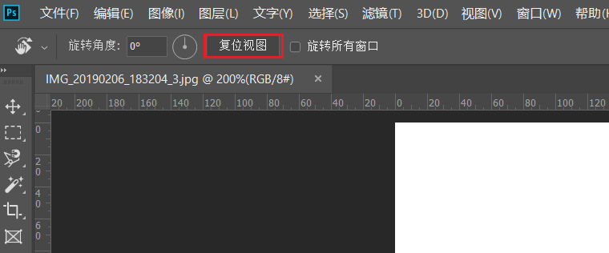

## 裁剪 Crop
选择工具栏的裁剪工具对图片进行裁剪
**快捷键**：`c`
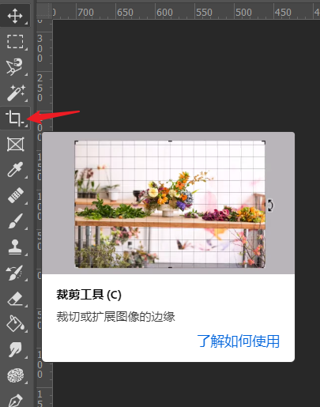

**操作**：（工具栏）`裁剪工具(c)` -> 选择拐点（图示红色标记）并按住鼠标左键拖动，以调整裁剪区域大小（也可以在裁剪框中任意位置按住鼠标左键后拖动裁剪框的位置） -> 双击裁剪框以确认裁剪
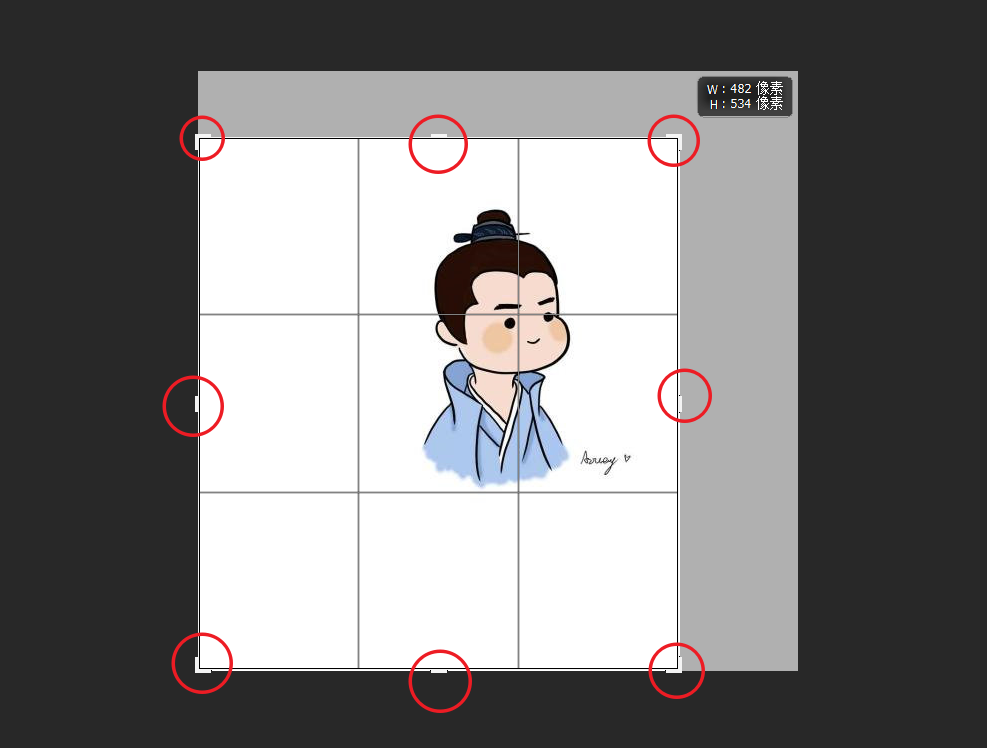

**注意**：应**取消 （选项栏）`删除裁剪的像素`** 以免裁剪后丢失裁剪框外的细节，这种裁剪方式是**非破坏性**的
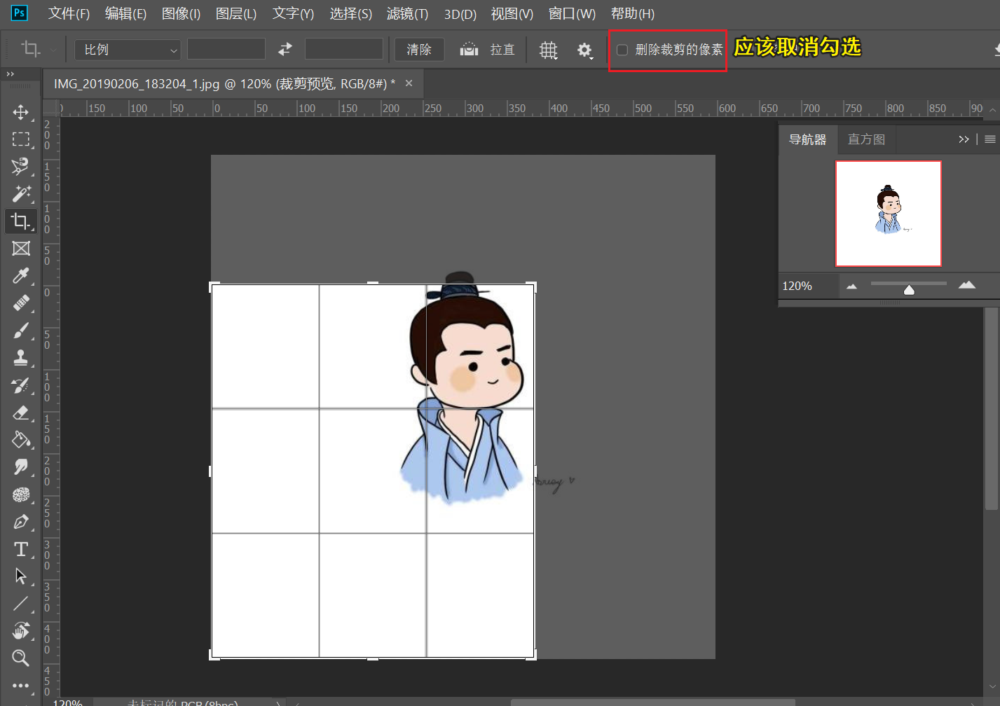

**补充**：
* 当裁剪框有**超出原图的区域**，确认裁剪后可实现**画布大小的扩增**。若想准确地调整画布大小，可参考 [画布大小调整](#画布大小调整)。
* 若勾选 （选项栏)`内容识别` 则 Photoshop 会根据图片边缘像素计算模拟出扩增的区域的像素

### 固定裁剪比例
选择（选项栏）常见的固定裁剪比例，如：
* `1:1` 正方形比例
* `5:7` 肖像比例
* `4:5` 图像标准比例
* `宽 x 高 x 分辨率` 自由调整裁剪比例

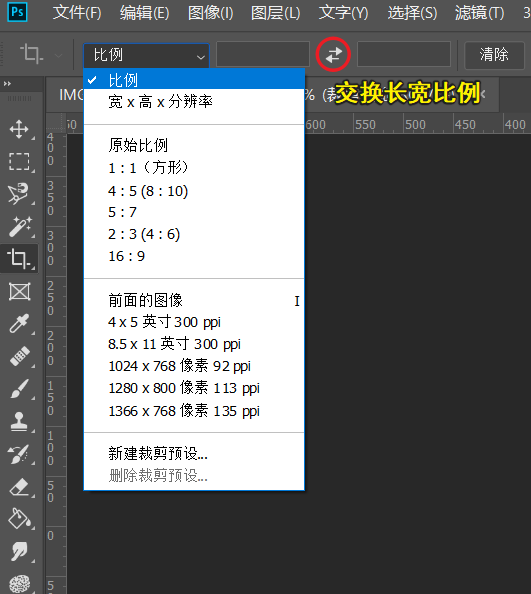

### 叠加选项
设置（选项栏）裁剪工具的叠加选项（参考线），可基于**特定布局**进行裁剪，如：
* 三等分
* 黄金比例
* 金色螺线

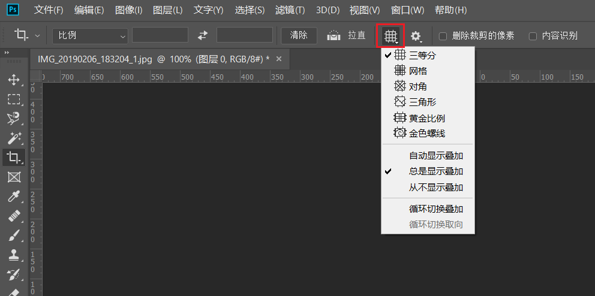

### 矫正图片
使用（选项栏）`拉直` 工具通过在图像上画一条线来作为「水平面」基线，Photoshop 自动旋转拉直图片并选择最大裁剪区域

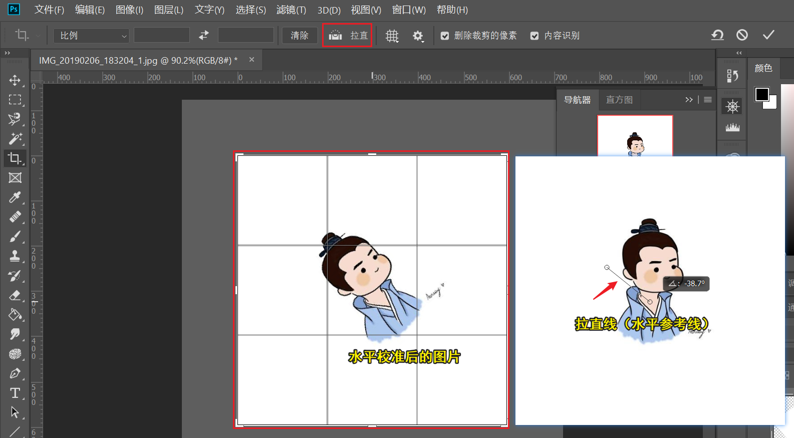

### 透视裁剪
使用透视裁剪工具可以将图片透视变形，常用于**提取图片不同部分的纹理**，或**还原透视变形**

**操作**：选择（工具栏）`透视裁剪工具` -> 鼠标左键依次点击需要裁剪区域的四角创建裁剪框 -> 双击裁剪框确认
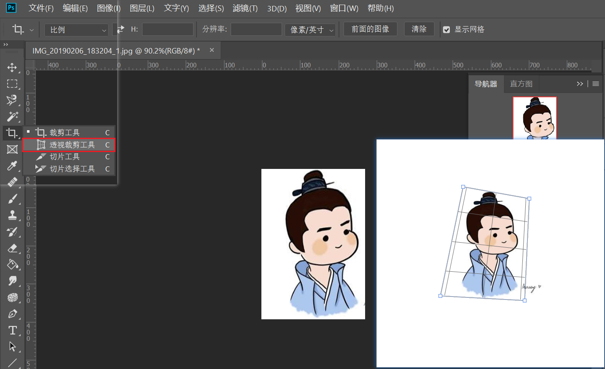