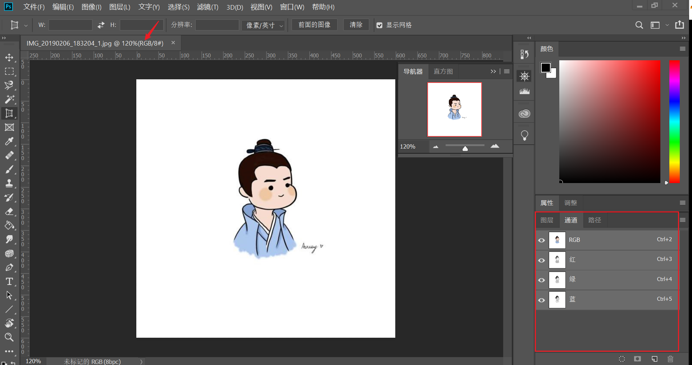
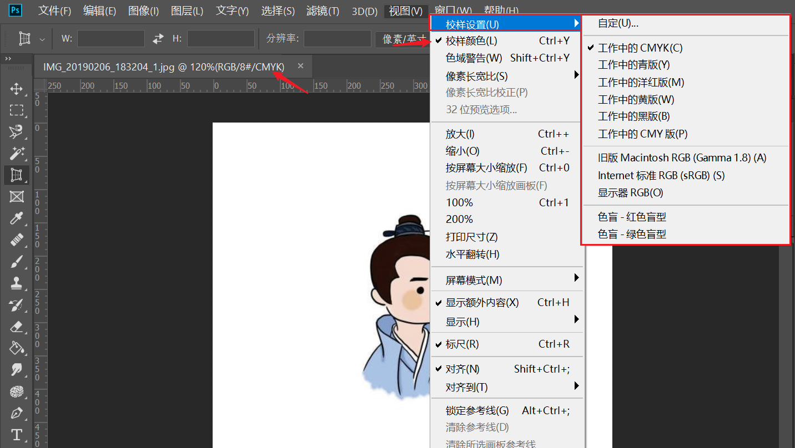

# 色彩模式
查询图片色彩模式

* 方法一：在**（画版）`通道`**查看
* 方法二：在 **文档标签** 栏查看

## 切换色彩模式
Photoshop 默认以 RGB 色彩模式显示图片，可通过校正采用其他色彩模式显示

**操作**：（菜单栏）`视图(V)` -> `校样颜色(L)`
**快捷键**：`Ctrl + Y`

可以在（菜单栏）`视图` -> `校样设置(U)` 中设置需要切换的色彩模式，Photoshop 已提供多种常用的色彩模式，也可以自定义专属的色彩模式

:warning: 使用多种 Adobe 软件应使用 [Bridge 设置](../Bridge/设置色彩模式.md)各软件采用相同的色彩模式，还推荐通过设备校准显示器