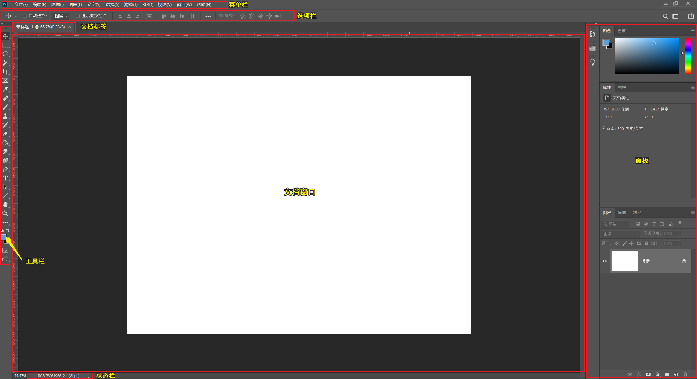
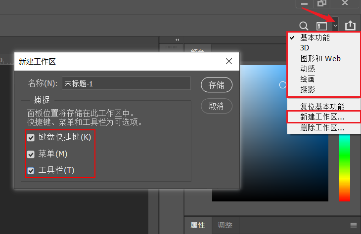
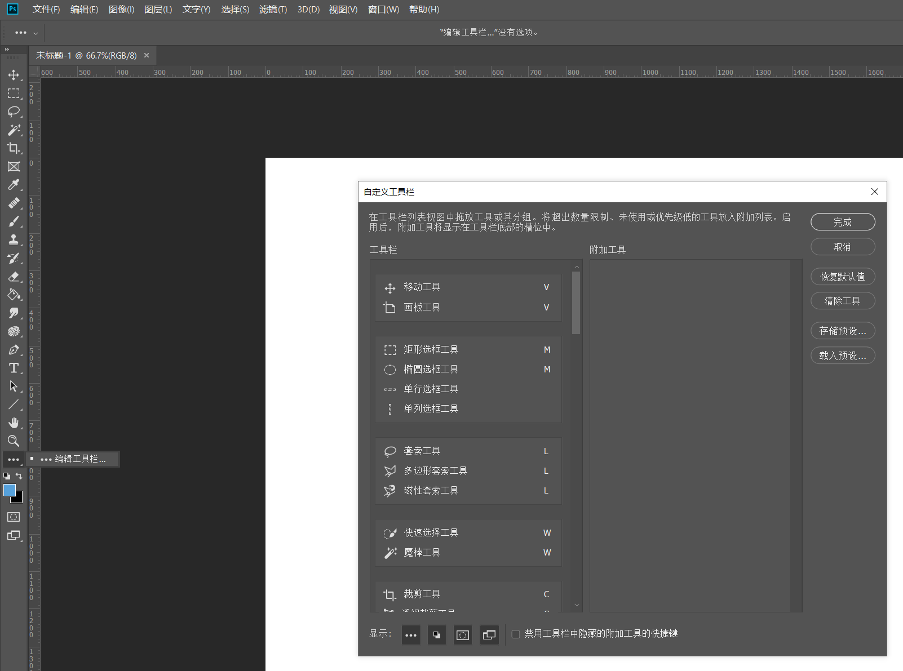
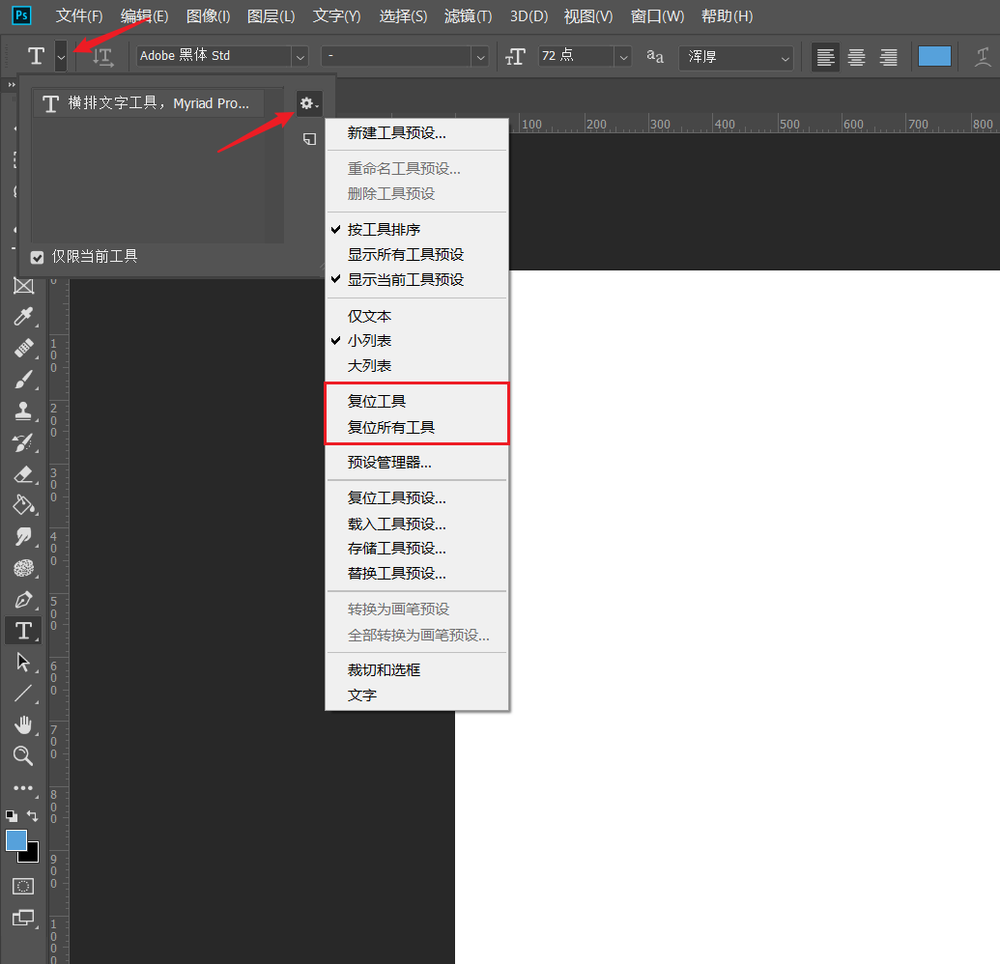
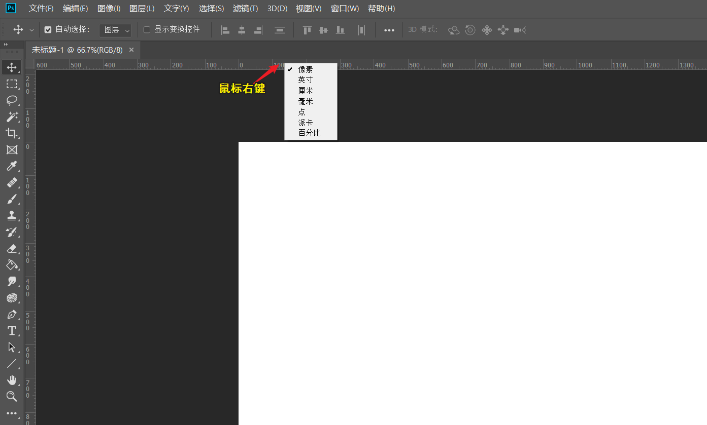
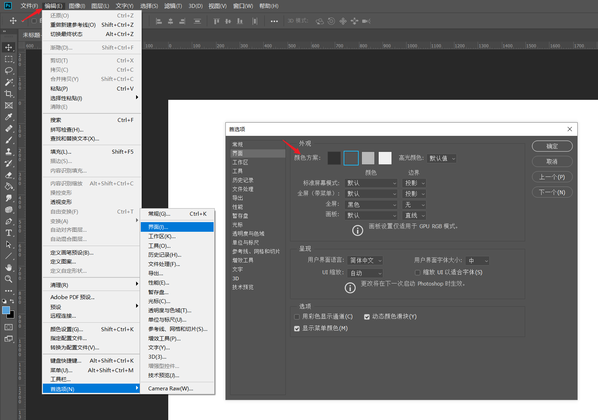
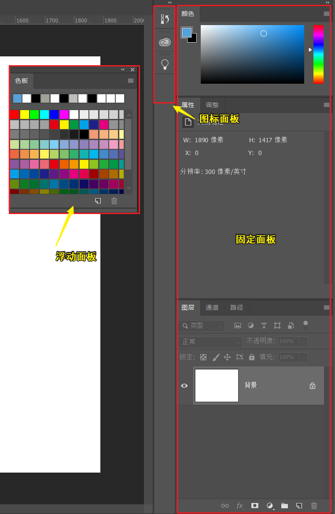
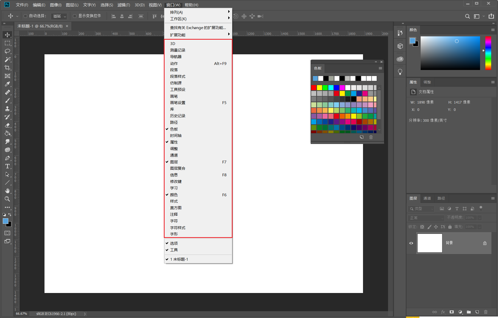
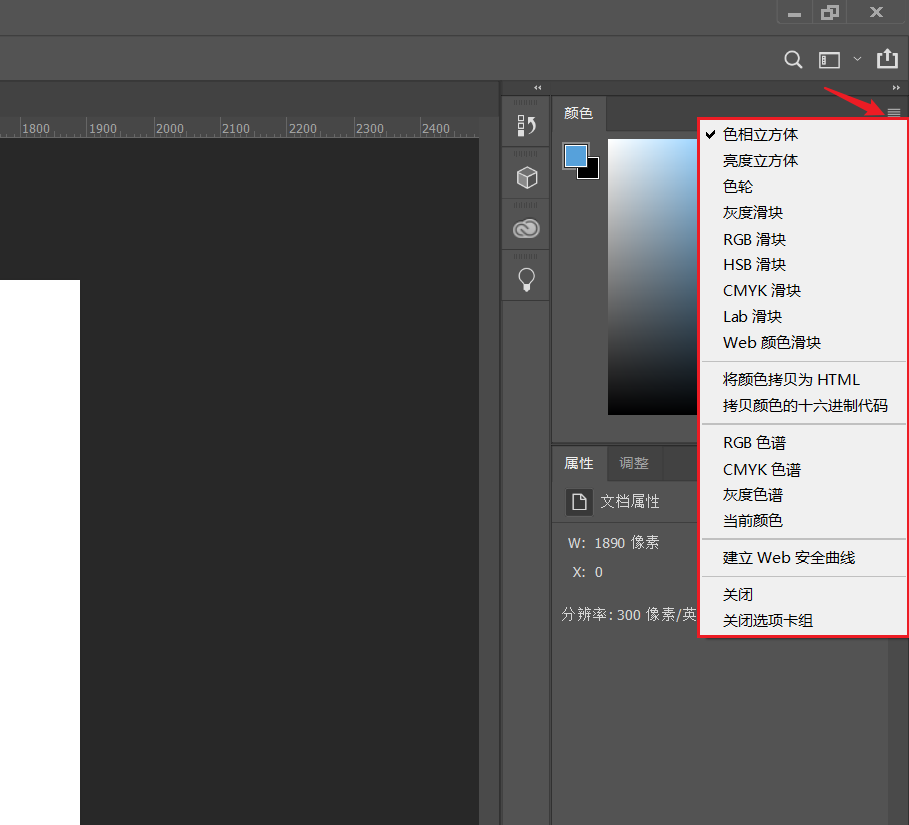
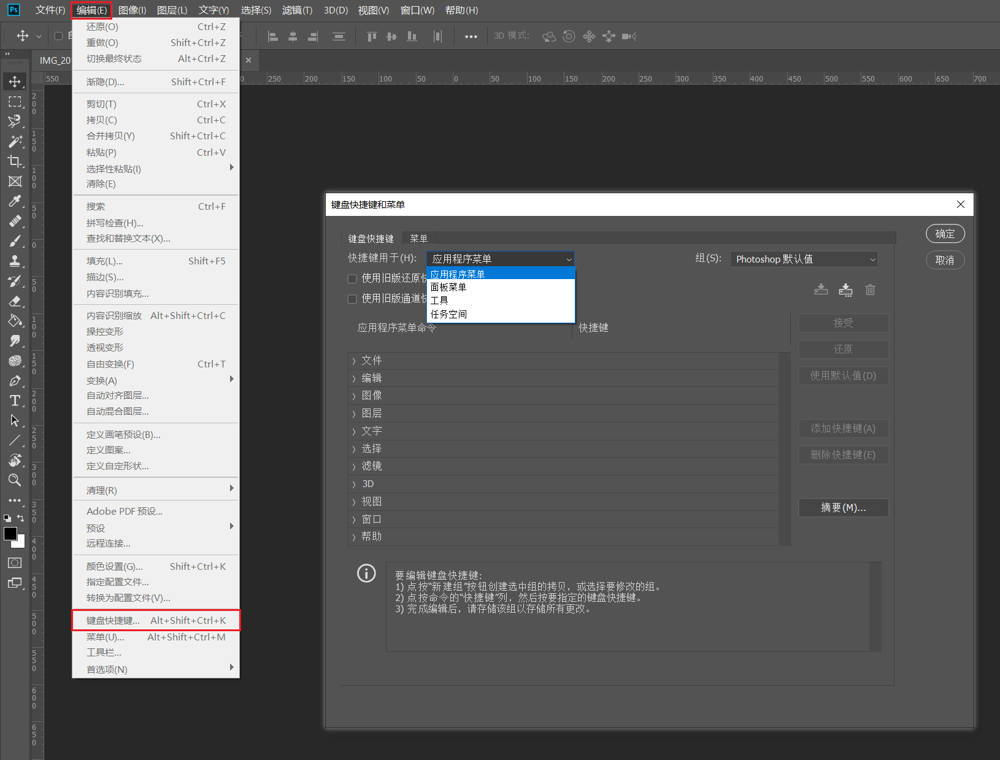

# 界面简介

* **菜单栏 Menu Bar**
* **选项栏 Options Bar**：该栏目的选项设置基于当前选择的工具而改变
* **文档标签 Document Tab**
* **文档窗口 Document Window**
* **工具栏 Tool Bar**
* **面板 Panels**：有打开、折叠、图标三种状态，还可以手动拖拽生成浮动面板
* **状态栏 Status Bar**：可右键选择显示的信息项

**保存自定义的工作区**

在选项栏最右侧设置界面的分布，Photoshop 已提供多种预设的适用于多种使用场景的界面分布，也可以自定义界面分布后通过 `新建工作区...` 来保存界面

通过勾选需要保存的选项以保存多种预设参数

## 偏好设置

### 工具栏

#### 显示其他工具
长按工具栏的图标可显示该工具组的其他工具

#### 自定义工具栏
`编辑工具栏...` 选项可用于自定义工具栏

### 选项栏
#### 重置工具

### 文档窗口
#### 标尺
开启/关闭标尺
**操作**：（菜单栏）`视图` -> `标尺`
**快捷键**：`Ctrl + R`

#### 参考线
标尺可「拉出」参考线

#### 标尺单位
修改标尺单位

#### 文档窗口背景颜色
设置文档窗口背景颜色

补充：设置 Photoshop 界面颜色
#### Photoshop 界面颜色
**操作**：（菜单栏）`编辑` -> `首选项` -> `界面` -> `外观` -> `颜色方案`

### 面板

#### 浮动面板
通过拖拽面板名称可以产生浮动面板，浮动面板可置于任何位置

#### 打开/关闭特定面板
**操作**：（菜单栏）`窗口` -> 选择要打开/关闭的目标窗口

#### 最小化面板窗口
* 双击面板名称可以**最小化**面板窗口
* 面板窗口**右侧双箭头**可以把展开的面板窗口变成**图标面板**
* 更多设置可以点击各面板相应的「汉堡菜单」

    

### 快捷键
Photoshop 支持自定义快捷键

**操作**：（菜单栏）`编辑` -> `键盘快捷键...`

可通过下拉选择设置应用于特定模块的快捷键

**推荐设置选项**
* （应用程序菜单）`编辑` -> `重做` 设置为 `F2`
* （应用程序菜单) `编辑` -> `切换最终状态` 设置为 `F1`

**提示**：
* 设置键盘快捷键时也可以使用 `添加快捷键(A)` 的方式，这样当别人和你使用 Photoshop 时就可以按照两套键盘快捷键方式进行操作。
* 可以通过 **`保存自定义的工作区`** 来保存专属定制的键盘快捷键