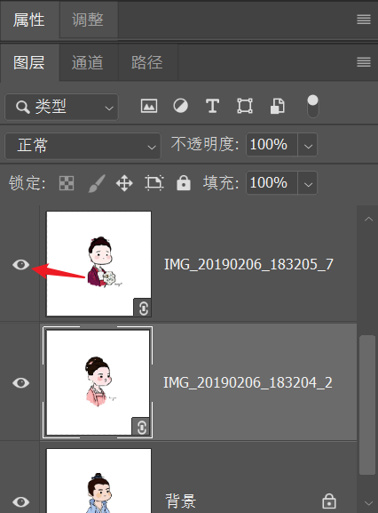
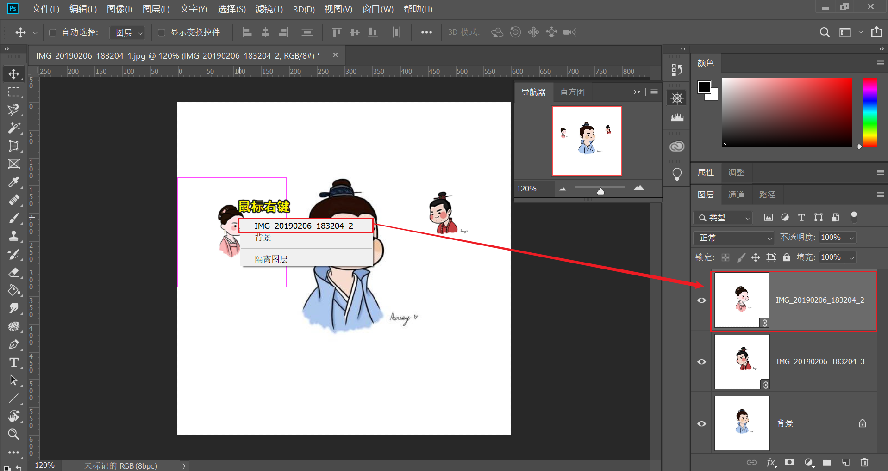
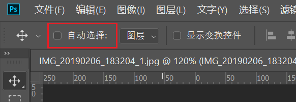
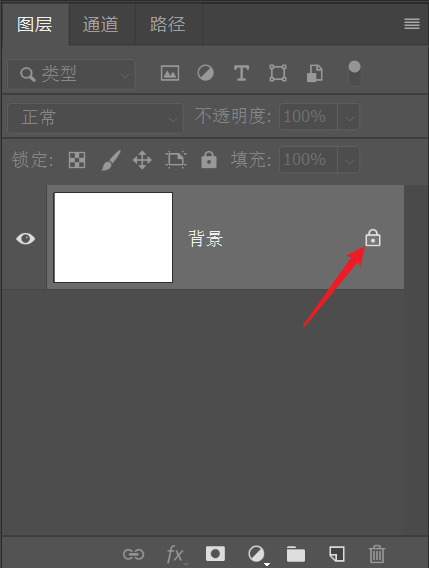

# 图层
图层可以让我们**非破坏性**地编辑图片，并独立地（选中图层）移动对象。

## 显示/隐藏图层
**操作**：
方法一：点击 （面板）`图层` 的眼睛图标，可将相应图层隐藏/显示在文档窗口中。可以按住眼睛图标并**上下拖动**，快速隐藏/显示临近的几个图层。
  
方法二：点击 （面板）`图层` 相应图层 -> （菜单栏）`图层(L)` -> `隐藏图层(R)`
方法二：按住 `Alt` 并点击 （面板）`图层` 的眼睛图标，可以隐藏除了该图层外的所有图层（包括背景图层，隐藏后背景显示为透明格子）。

**快捷键**：选择图层后按 `F3`（默认快捷键为 `Ctrl + ,`

## 选择图层
**操作**：
* 方法一：点击 （面板） `图层` 里的图层选中特定图层
* 方法二（推荐）：选择（工具栏） `移动工具(V)` -> 按住 `Ctrl` 键鼠标左键点选（文档窗口）图片，即可快速选中图片所在的图层（若需要同时选择多个图层可同时按住 `Shift + Ctrl` 后依次鼠标左键点选图片）
* 方法三：选择（工具栏） `移动工具(V)` -> 选择图片鼠标右键 -> 在弹出的图层中选中所需图层
    

* 方法四：勾选（选项栏）`自动选择` 则可实现点击图片自动切换到相应图层，但可能会在图层较多的项目中容易出现误选图层（需要同时选中多个图层，可按住 `Shift` 框选多个图片；要取消其中某些图层，可按住 `Shift` 依次再点选已选择的图层）
    

## 图层次序
图层间存在**次序**，图层面板的最上方的图层对应于文档窗口最前边的图。背景图层被锁定一直作为最底图层。

**操作**：通过对 （面板）`图层` 中的图层进行排序，可以调整图层在文档窗口的叠放次序

**快捷键**：在（面板）`图层` 中选择（激活）需要调整的图层
* `Ctrl + [` 上移一层
* `Ctrl + ]` 下移一层
* `Shift + Ctrl + [` 上移置顶层
* `Shift + Ctrl +]` 下移置底层（背景层在最底层）

## 背景图
Photoshop 始终需要一个图层，因此在创建空白项目时会自动生成一个 `背景` 图层。

背景图是一个特殊图层，锁定而无法移动，需要点击 （面板）`图层` 锁图标，将其转换为普通图层

如果需要将普通图层转换为背景图层
**操作**：选中图层 -> （菜单栏）`图层(L)` -> `新建(N)` -> `背景图层(B)`
**注意**：由于背景图层是不透明的，在转换为背景图层时，若原始图片较小会自动以背景色填充不足部分

## 图片格式
推荐将图片保存为支持图层的格式，如 `PSD` 或 `tiff`