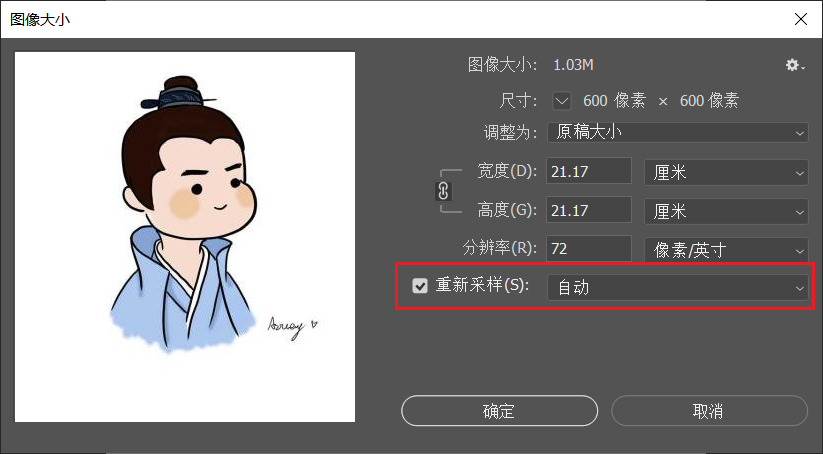

# 图片尺寸与分辨率

显示图像的 `宽度`、`高度` 与 `分率` 等信息

**操作**：（菜单栏）`图像` -> `图像大小(I)...`

* 分辨率显示**每英寸的像素点**
* 行业标准的分辨率为 **`300ppi`**（`ppi`= pixels/inch 像素每英寸 vs `dpi`= dots/inch）
* 将图像大小尺寸单位转换为 `英寸` 可以显示出打印尺寸（默认分辨率下），可以通过 **操作**：（菜单栏）`视图` -> `打印尺寸(z)` 初略地预览图片打印效果（基于显示器）
* 改变分辨率，可改变打印尺寸

**说明**：在修改（增大）图片尺寸，且使用了 `重新采样(s)`，可保持图片分辨率不变，但会显得模糊。
由于增加的像素是 Photoshop 推算得出，依赖现有的像素生成插值（估算得出）。

:warning: 谨慎使用 `重新采样(s)`

*长按鼠标左侧预览图可查看原图，松开鼠标左键可显示修改后的效果图，方便进行对比*