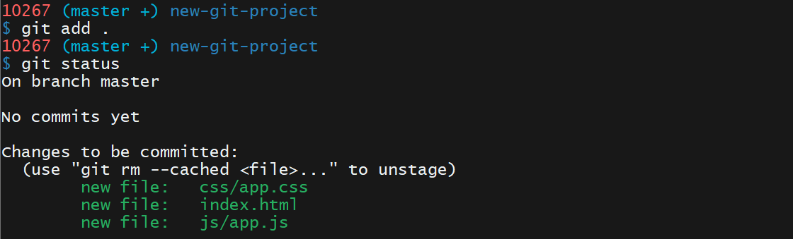
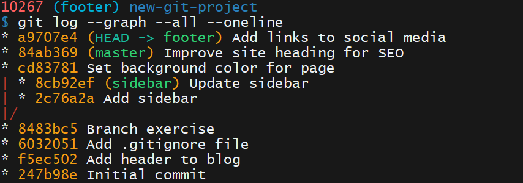

# Git 基础
参考：[Git Book](https://git-scm.com/book/zh/v2)

Git 是一个分布式版本控制系统，其核心功能是追踪文件的变更。版本控制系统的主要目的是保留项目的详细**历史记录**，并且能够在不同的版本上进行工作。保留详细的项目历史记录很重要，可以看出一段时间内项目的进度。如果需要还可以回到项目的某个阶段，并恢复数据或文件。

除了 Git 软件外还有其他版本控制系统，如 [Subversion](https://subversion.apache.org/)、[Mercurial](https://www.mercurial-scm.org/) 等。

版本控制系统模型包括两大主要类型
* **集中式模型**centralized version control systems ：所有用户都连接到一个中央的主仓库 `master repository`
* **分布式模型** distributed version control systems DVCS：每个用户都在自己的计算机上拥有完整的仓库

## 术语
版本控制系统，简称 VCS 是一个管理源代码不同版本的工具。源代码管理器，简称 SCM 是版本控制系统的另一个名称。Git 是一个 SCM（因此也是 VCS！）。Git 网站：[https://git-scm.com/](https://git-scm.com/) （注意它的域名中直接包含“SCM”！）。

参考：[Git 关键术语](_v_attachments/20191120170555447_6092/Git%20关键术语.pdf) | [英文版](_v_attachments/20191120170555447_6092/ud123-git-keyterms.pdf)
### 提交 commit
Git 将数据看做微型文件系统的一组**快照**。每次 commit （在 Git 中保持项目状态）它都对文件当时的状况拍照，并存储对该快照的引用，类似游戏中的保存点，它会保存项目的文件和关于文件的所有信息。commit 是 Git 中的基本单位。

### 仓库 Repository / repo
仓库是一个包含项目内容以及几个文件（在 Mac OS X 上默认地处于**隐藏状态**）的目录，用来与 Git 进行通信。仓库可以存储在本地，或作为远程副本存储在其他计算机上。仓库是由 commit 构建的。

### 工作目录/工作区 Working Directory
工作目录是你在计算机的文件系统中看到的文件。与这些文件形成对比的是保持在仓库中（在 commit 中，在 Mac OS X 上隐藏）的文件。

注意：在使用 Git 时，工作目录与命令行工具的 current working directory （当前工作目录）不一样，后者是 shell 当前正在查看的目录。

### 检出 Checkout
检出是指将仓库中的内容**复制**到工作目录下。

### 暂存区/暂存索引/索引 Staging Area/Staging Index/Index
Git 目录下的一个文件，**存储的是即将进入下个 commit 内容的信息**。可以将暂存区看做准备工作台，Git 将在此区域获取下个 commit。暂存索引中的文件是准备添加到仓库中的文件。

### SHA
`SHA` 是每个 commit 的 ID 编号。以下是 commit 的 `SHA` 示例：`e2adf8ae3e2e4ed40add75cc44cf9d0a869afeb6`。

它是一个**长 40 个字符的字符串（由 0–9 和 a–f 组成），并根据 Git 中的文件或目录结构的内容计算得出**。SHA 的全称是 "Secure Hash Algorithm" 安全哈希算法。

### 分支 Branch
分支是从主开发流程中分支出来的新的开发流程。这种分支开发流程可以在不更改主流程的情况下继续延伸下去。

回到之前关于游戏保存点的示例，你可以将分支看做在游戏中设立保存点后，尝试一个有风险的招式。如果有风险的招式不奏效，则回到保存的位置。**令分支非常强大的关键之处是你可以在一个分支上设定保存点，然后切换到另一个分支并继续设定保存点。**

## Git 三大区域
Git 管理着三大区域，文件就在这三个区域之间移动：
* **工作区域 working directory**：在工作区域对文件进行修改
* **暂存区 staging index**：暂存等待保存进入仓库的文件
* **仓库 repository**：通过 `commit` 命令将修改过或新建的且已在暂存区的文件保存到仓库中，每个 commit 都有唯一的 ID，即 SHA，可以通过相应的 ID 访问特定的提交

## 基本终端命令
Git 操作在 Git Bash 终端中进行，常用的 Shell 命令：
* `ls` 列出当前目录的文件（夹）。当前目录，即 shell 正在查看的目录。
* `mkdir` 新建目录
* `cd` 更改目录
* `rm` 删除文件和目录
* `pwd` 输出工作目录（绝对路径）

## 新建仓库
参考：
- [git init 文档](https://git-scm.com/docs/git-init)
- [git init 教程](https://www.atlassian.com/git/tutorials/setting-up-a-repository)

在对 Git 仓库进行 commit 或执行任何其他操作之前，需要一个实际存在的仓库。使用 `git init` 命令新建一个仓库

示例
```shell
# 任务
# 创建一个目录 udacity-git-course
# 在该目录中创建另一个目录 new-git-project
# 切换当前路径到 new-git-project 目录下

# 创建目录并切换到目录
mkdir -p udacity-git-course/new-git-project && cd $_

# 在当前目录下初始化生成一个空的 Git 仓库，创建成功后终端提示符会添加 master 关键字
git init
```
解释：
* 创建目录 `mkdir` 设置的参数 `-p` 表示如果目录已存在则不会报错，递归创建
* 在 Git Bash 里复制操作快捷键为 `Ctrl + Insert` 粘贴快捷键为 `Shift + Insert`
* 命令 `$_` 扩展到上一个命令的最后一个参数，或上一个命令（若上一个命令没有设置参数时）


`git init` 命令的作用是在**当前目录**下初始化生成一个空的 Git 仓库，并将所有用于跟踪内容所必要文件和目录存储于 `.git`目录下（该目录开头有个点 `.`，表示在 Mac/Linux 上它将是一个隐藏目录）。`.git` 目录实际就是一个**存储项目（当前目录下的项目）各版本的库**，Git 会将所有 commit 记录在这里，并跟踪所有内容！


:warning: 警告：**请勿直接修改 .git 目录下的任何文件**。这是仓库的核心。如果你更改了文件名或文件内容，Git 可能就无法跟踪你保存在仓库中的文件，可能会丢失很多内容！可以查看这些文件，但是请勿编辑或删除这些文件。


`.git` 中各项内容及作用：
* `config` 文件：存储了所有与项目有关的配置设置，配置文件设置的配置值仅适用于当前仓库
* `description` 文件：此文件仅用于 GitWeb 程序，可忽略
* `hooks` 目录：存放客户端或服务器端脚本，以便用来连接到 Git 的不同生命周期事件
* `info` 目录：包含**全局排除文件**
* `objects` 目录：存储提交的所有 commit
* `refs` 目录：此目录存储了指向 commit 的指针（通常是「分支」和「标签」）

## 克隆仓库
参考：
- [git 克隆文档](https://git-scm.com/docs/git-clone)
- [git 克隆教程](https://www.atlassian.com/git/tutorials/setting-up-a-repository)

克隆仓库是制作完全相同的仓库副本，如在制作 Web 项目可以克隆模板，简化配置步骤。使用 `git clone [url]` 命令并传入需要克隆的 Git 仓库的路径（通常是 URL），以创建仓库副本。

**注意**：在克隆任何内容之前**验证终端位置**，输入 `pwd` 命令查询工作目录，确保命令行工具已定位于正确的目录下。由于无法创建嵌套的 Git 仓库，因此需要确保终端的**当前工作目录没有位于 Git 仓库中**。克隆项目会新建一个目录，并在这个目录下初始化一个 `.git` 文件夹，从远程仓库拉取下所有数据放入 `.git` 文件夹，然后从中**读取最新版本的文件**的拷贝到新建目录下。

示例
```shell
# 切换当前目录至合理位置（无 Git 仓库），如 udcity-git-course
$ git clone https://github.com/udacity/course-git-blog-project
```


**提示**：在克隆仓库时，会在当前目录下创建一个名为与远程仓库相同的目录（默认使用原仓库名），若需要自定义本地仓库的名字可在运行上述命令结束后，打开 Finder/Windows Explorer 手动重命名或在终端上使用 `mv` 重命名；也可以在命令后直接指定本地创建的仓库名字 `git clone [url] project_name`

**注意**：使用 `git clone` 命令会在当前工作目录下创建新的仓库，但 shell 工作目录并不改变（根据终端的提示符进行判断，如果位于 Git 仓库目录下，提示符将包含一个用小括号包含的关键字 `master`），需要使用 `cd` 命令切换到新的仓库中才可以对仓库进行后续操作。

## 仓库状态
参考：
- [git status 文档](https://git-scm.com/docs/git-status)
- [git status 教程](https://www.atlassian.com/git/tutorials/inspecting-a-repository/git-status)

命令 `git status` 查询仓库状态，返回关于仓库的信息，如：
* 目前所在的分支
* 已在工作目录中被创建但 Git 尚未开始跟踪的新文件
* Git 正在跟踪的已修改文件
* ……

示例：

解释：
* `On branch master` 表示 Git 位于 `master` 分支（默认分支）上
* `Your branch is up-to-date with 'origin/master'.` 由于该仓库是从远程仓库克隆而创建的，这部分告诉我们项目是否与所复制的仓库**保持同步状态**（目前显示是最新状态）
* `nothing to commit, working directory clean` 表示没有任何待定（提交到仓库）的更改


解释：新建仓库状态与克隆所建（有内容的）仓库类似，但是由于其并未包含任何 commit 所以会返回 `No commits yet` 的信息

**注意**：
* 应该在任何一个其他 git 命令之前和之后运行 `git status` 命令，确保修改得到了正确的处理（提交）
* 在一段时间之后再回到某个项目时，始终先运行 `git status` 命令以检出该项目，并初步了解仓库的操作信息

## 查看仓库历史
在版本控制中应该**频繁**提交**详细**的记录，以便追踪项目逐步进展情况。Git 会自动记录创建提交时的日期时间和所作的内容更改，用户只需要设置每次 commit 标题或说明。

使用命令 `git log` 或 `git show` 查看查看仓库历史记录：
* `git log` 显示仓库中所有 commit 的信息
* `git show` 显示有关给定 commit 的信息，因此需要提供所需查询的 commit ID（即 SHA）

### 命令 git log


命令 `git log` 默认情况下返回 commit 的以下信息：
* SHA：每个 commit 的完整 SHA。每个 SHA 都是唯一的（即每个 commit 都产生独一无二标记），一般不需要查看整个 SHA，只需知道前 6-8 个字符即可
* 作者：即提交信息，可在 `user.name` 中设置
* 日期
* 消息：提交者填写的注释信息，以描述该次 commit 的作用。

#### 选项 `--oneline`
命令 `git log` 可以设置选项 `--oneline` 以显示简化版的历史信息，**每个 commit 显示一行**，包括该提交的 SHA 的前七个字符，以及提交说明

#### 选项 `--stat`
命令 `git log` 可以设置选项 `--stat`（代表 statistics 统计）以显示 commit 中**被更改的文件以及添加或删除的行数**。以 `+` 或 `-` 号表示添加或删除的行数，最后显示一个摘要包含修改/删除的总文件数和总行数
    

#### 选项 `-p`
命令 `git log` 可以设置[选项](https://git-scm.com/docs/git-diff#_generating_patches_with_p) `-p`（或 `--p` 代表 patch 修补）以显示具体的修改内容（以对比形式 `diff` 列出）

示例：

**解释**：

* 🔵 `diff` 标注行表示正在对比的文件（可能是文件名文件，但也支持追踪重命名后的两个同源文件），其中第一版（原版）文件以目录 `a` 表示，第二版文件以目录 `b` 表示（这两个 `a`、`b` 目录并不会在库里实际可见），下方 `--- a/index.html` 和 `+++ b/index.html` 表意一样
* 🔶 `index` 标注行表示文件第一版的哈希值 `0382322` 和第二版的哈希值 `43f5b28`（与 SHA 不同）通常不重要可忽略
* ❤️ `---` 表示旧版本，`+++` 表示当前版本
* 🔍 `@@` 标注行展示代码定位和数量，`-` 表示原版本，`+` 表示当前版本。他们后面两个数字分别表示：第一个数字是起始代码的位置（行号），第二个数字表示显示代码的数量（行数）
    * `-15,83` 表示旧版本代码从第 15 行开始，显示了 83 行（即原始版本截取了 83 行代码显示）
    * `+15,85` 表示当前版本从第 15 行开始，由于增添了代码，所以第二版本显示了 85 行
* ✏️ 代码行中显示了在 commit 中实际进行的更改
    * 代码行开头标注减号 `-` 表示该行在文件原始版本中，但是被 commit 删除的行
    * 代码行开头标注加号 `+` 表示该行是 commit 新加的行

注意：git 以行为单位追踪修改，对于行的操作可以是删除会插入。但实际操作可能只是增添了一个空格或缩进（而非把整一行删除后在插入），而补丁输出显示所有行先被删掉，然后在新的缩进位置又被重新添加。可以对命令 `git log -p` 设置选项 `-w` **忽略空格更改**，在查询具体代码修改时不显示这一类的更改

### 命令 git show
使用命令 `git log` 可以查询所有的 commit，而通过设置参数提供 SHA（作为最后一个参数，只需提供七个字符）则可以只显示在所提供的 SHA **之前提交的所有 commit 信息**。

若只需查看特定一个 commit 可以使用命令 `git show`，默认显示最近依次 commit，可以将 SHA 作为最后一个参数访问特定的 commit。默认显示信息和命令 `git log -p` 类似：
* commit
* 作者
* 日期
* commit 消息
* 补丁信息

此外该命令也可以设置类似的选项：
* `--stat` 显示更改了多少文件，以及添加/删除的行数
* `-p` 或 `--patch` - 显示默认补丁信息
* `-w` 忽略空格变化

## 添加 commit
为了让 git 跟踪项目的新建的文件，要将这些文件提交到仓库。但是提交文件需要先放入暂存区，因此流程为：在**工作区**的修改需要使用命令 `git.add` 将它们添加到**暂存区** stage，然后使用命令 `git.commit` 将暂存区文件提交到**仓库**

### 添加到暂存区
命令 `git add` 将新建或修改文件添加到暂存区，在添加暂存区之前应该使用命令 `git status` 查看工作区作出了几个更改（文件）


示例：在目录 `new-git-project` 仓库中新建了三个文件 `index.html`、`css/app.css`、`js/app.js`，将其添加到暂存区 stage 中


解释：新建三个文件后使用命令 `git status` 输出提示为 `Untracked files` 包含这三个文件，即 git 还没有跟踪这些文件。


解释：使用命令 `git add <file>` 将 `<file>` 文件添加到暂存区。使用命令 `git status` 查询输出显示 `index.html` 现在位于 `"Changes to be committed"` 分类下（该区域显示了位于暂存区的文件，这些文件等待 commit）

**注意**：
`"Changes to be committed"` 下方的帮助文本提示当不小心运行了 `git add` 将文件错误地添加到了暂存区，可使用该命令将文件从暂存区删掉（但该操作与 shell 的 `rm` 命令不同，`unstage` 是指撤销暂存把文件移回工作区，并不破坏文件。相应的将文件从工作目录移到暂存区叫做 `staging`暂存，如果已移动文件，则叫做 `staged` 已暂存）

```shell
# 将 <file> 文件从暂存区删除，
$ git rm --cached <file>
```


提示：
* 命令 `git add <file1> <file2> … <fileN>` 可接受多个文件名，用空格 Space 分隔
* 命令 `git add .` 使用句点 `.` 来代替文件列表，添加当前目录（包含的所有文件以及所有嵌套文件）至暂存区

### 添加到仓库
使用命令 `git commit` 将暂存区的（修改后）文件添加到仓库。运行命令后 git 会调用并打开**代码编辑器**，此时终端会冻结，以等待用户完成在代码编辑器中输入 Commit 消息解释说明；待用户关闭编辑器窗口，终端再输出该次 commit 信息并完成提交

在 Shell 终端输入命令 `git commit` 后 git 打开预设的代码编辑器 Visual Studio Code（默认打开内置的代码编辑器 Vim，可在[配置](D:/UniversalNotebook/Git/配置Git.md)中设置，或参考GitHub 帮助文档 [将文本编辑器与 git 相关联](https://help.github.com/articles/associating-text-editors-with-git/) ）


解释：
* 代码编辑器打开的文件提供能注释，指导填写 commit 信息：
    * 第一段精确地告诉了我们需要执行的操作，为该 commit 提供一条消息
    * 任何以字符 `#` 开头的行将被忽略
    * 这将是初始提交 `Initial commit`
    * 最后列出了提交 commit 的文件列表
* 在代码编辑器第一行输入这次的 commit 信息为 `Initial commit` 以表示这是首次提交
* 关闭 git commit 命令打开的代码编辑器窗口（关闭面板/标签页是不够的）


解释：关闭代码编辑器后终端显示了这次 commit 的信息，包括这次提交对应的 SHA、修改的文件数、更改的代码行数以及被添加的具体文件。

**提示**：如果你要编写的提交说明很简短，可以直接在命令 `git commit` 设置选项 `-m` 传入信息（而不必打开代码编辑器）如示例可以使用命令 `$ git commit -m "Initial commit"`

**注意**：
* 提交 commit 原则是每个 commit 应该记录一项更改。一个 commit 不应包含不相关的更改，对于多项更改先进行一项更改，提交该更改，然后再进行第二项更改。如果一个更改有 bug，你需要撤消该更改时，则不用同时撤消另一个更改。
* 编写 Git Commit Message 建议，参考 [如何编写 Git Commit Message](https://chris.beams.io/posts/git-commit/)（[译文](https://www.jianshu.com/p/0117334c75fc) ）、[Commit message 和 Change log 编写指南](http://www.ruanyifeng.com/blog/2016/01/commit_message_change_log.html)
    * 消息篇幅简短（少于 60 个字符）
    * 解释提交的作用（不是如何更改（这是命令 `git log -p` 的目的，通过展示具体的代码可知）或为何更改！）
    * 可以添加解释提交的原因。在代码编辑器中编写提交说明时，第一行是消息本身，**消息之后空一行**，然后输入正文或说明，包括关于为何需要该 commit 的原因详情（例如 URL 链接）。（而查看时如果使用了命令 `git log --oneline` 只能查看说明（第一行），应使用 `git log` 或 `git show` 以查看完整的说明正文）
    * 请勿使用单词 `and`（如果你必须使用则说明这一次提交可能进行了太多的更改，将这些更改拆分为独立的 commit）
    * 在编写提交说明时保持一致性，可以使用短语句式 `This commit will…`

## 相关 commit 引用
可以使用 SHA、标签、分支和 `HEAD` 指针引用 commit。有时候这些并不足够，可能需要引用相对于另一个 commit 的 commit。可以使用特殊的「祖先引用」字符来告诉 git 这些相对引用：

- `^`表示父 commit
- `~`表示第一个父 commit，该字符 `~`（与 `^` 字符相比）作用主要体现在通过合并而创建的 commit 中。合并 commit 具有两个父级，`^` 引用表示第一个父 commit，即当你运行 `git merge` 时所处的分支；而 `^2` 表示第二个父 commit，即被合并的分支。

常用的 commit 相对引用：
- 父 commit
    - `HEAD^`
    - `HEAD~`
    - `HEAD~1`
- 祖父 commit
    - `HEAD^^`
    - `HEAD~2`
- 曾祖父 commit
    - `HEAD^^^`
    - `HEAD~3`

## 撤销 commit
撤销 commit 可以将相应的提交从仓库中删除，但使用时需慎重。

### 修改最近一次 commit
命令 `git commit --amend` 更改最近的 commit。

* 修改 commit 信息：如果工作目录没有内容（也就是仓库中没有任何未 commit 的更改），运行命令 `git commit --amend` 代码编辑器将打开，并显示原始 commit 消息。此时可以纠正拼错的单词或提供重新表述，然后保存文件并关闭编辑器，以更新最近一次 commit 消息。

* 增添修改：若提交中有纰漏，可以再次编辑文件，暂存文件，但在提交时使用命令 `git commit --amend` 以更新最近的 commit，而不是创建新的 commit（以避免针对完全相同的任务由于更新纰漏造成两次提交）

### 还原 commit
参考：
- [git-revert](https://git-scm.com/docs/git-revert)
- [git revert](https://www.atlassian.com/git/tutorials/undoing-changes) Atlassian 教程

还原 revert 是指 git 执行和 commit 中的更改**完全相反的更改**。命令 `git revert <SHA-of-commit-to-revert>` 撤销目标 commit 同时创建一个新的 commit 记录这次还原更改（提交信息推荐使用默认提供的 commit 消息）

### 重置 commit
参考：
- [git-reset ](https://git-scm.com/docs/git-reset)
- [Git 工具 - 重置揭密](https://git-scm.com/book/zh/v2/Git-%E5%B7%A5%E5%85%B7-%E9%87%8D%E7%BD%AE%E6%8F%AD%E5%AF%86)
- [祖先引用](https://git-scm.com/book/en/v2/Git-Tools-Revision-Selection#Ancestry-References)|[中](https://git-scm.com/book/zh/v2/Git-工具-选择修订版本)

:warning: 重置 reset 会清除 commit！它所包含的内容也会消失，请谨慎使用。命令 `git rest <reference-to-commit>` 移动 `HEAD` 指针「回滚」到相对引用所对应的 commit，并清除当前分支该 commit 前方的所有提交，根据命令设置的选项对这些 commit 的更改「撤回」到相应的空间


* 命令设置选项 `--mixed`（默认值）把移动后 `HEAD` 指针前的 commit 中做出的更改移至工作目录中
* 命令设置选项 `--soft` 把移动后 `HEAD` 指针前的 commit 中做出的更改移至暂存区
* 命令设置选项 `--hard` 更改被清除。

示例：重置到父 commit 命令设置选项 `--mixed`
    


提示：
* 可以重置到 SHA 所对应的特定 commit 使用命令 `git reset <SHA>`
* 在执行 reset 操作前请 :bulb:备份分支:bulb:，通常会在最近的 commit 上创建一个 `backup` 分支，以便出现错误可以返回这些 commit

    ```shell
    $ git branch backup
    ```

* 恢复原有 commit 只需要（先从工作目录中删除未 commit 的更改）将当前分支指向 `backup` 分支即可，会进行快进合并将 `backup` 合并到当前分支，把当前分支向上移动到和 `backup` 一样的点

    示例：示例中使用 `git reset HEAD^` 将分支重置到 父 commit，撤回的更改即文件 `index.html` 移到工作区。要恢复分支所有 commit 需要先删除工作区的 `index.html` 文件

    ```shell
    $ git checkout -- index.html
    $ git merge backup
    ```
* git 会在完全清除任何内容之前，持续跟踪大约 30 天。使用命令 `git reflog`可调用这些内容 。请参阅以下链接以了解详情
    - [git-reflog](https://git-scm.com/docs/git-reflog)
    - [重写历史记录](https://www.atlassian.com/git/tutorials/rewriting-history)
    - [reflog，你的安全屏障](http://gitready.com/intermediate/2009/02/09/reflog-your-safety-net.html)

## 压制 commit
参考：
- [Git 分支 - 变基](https://git-scm.com/book/en/v2/Git-Branching-Rebasing) | [中](https://git-scm.com/book/zh/v2/Git-分支-变基)
- [git-rebase](https://git-scm.com/docs/git-rebase)
- [Atlassian 博客](https://www.atlassian.com/git/tutorials/rewriting-history#git-rebase)

命令 `git rebase` 将多个 commit 压制 squash，即将多个 commit 合并成一个 commit。`git rebase` 也称为 **变基**，将 commit 移动到一个新基底 base 上，如命令 `git rebase -i HEAD~3` （选项 `-i` 代表 交互式 逐步操作，推荐使用）告诉 Git 使用 `HEAD~3` 作为其他所有 commit （`HEAD~2`、`HEAD~1` 和 `HEAD`）将连接到的基底。

示例：使用命令 `git rebase -i HEAD~3` 将最近三个 commit 压制为一个
[压制 commit 操作视频演示](_v_attachments/20191120170555447_6092/压制%20commit.mp4) | [中文字幕](_v_attachments/20191120170555447_6092/压制%20commit.srt)
解释：
* 在此操作中我必要进行**强制推送**分支。我不得不这样做，因为 GitHub 试图阻止我意外删除 commit。因为我使用了 `git rebase` 命令，实际上清除三个分别记录我添加了佛罗里达、巴黎和苏格兰的 commit。我使用 git rebase 将这些 commit 合并或压制为单个 commit，相当于创建一个具有新 SHA 的提交。当我尝试使用 `git push` 将此 commit 推送至 GitHub 时，GitHub 知道接受此推送会删除那三个单独 commit，所以它拒绝了（这实际上是对你的一种帮助，确保你已经审查过正在推送的 commit 和 GitHub 上的 commit，以验证你不会意外覆盖你在远程仓库上存储的内容！）。因此，我不得不使用 `git push -f` 强制推送这些 commit。
* 命令 `git rebase` 根据选项不同可执行不同的命令
    - 设置选项 `p` 或 `pick` 表示 commit **保持原样**
    - 设置选项 `r`或 `reword` 表示保留 commit 的内容，但修改 commit 说明
    - 设置选项 `e` 或 `edit` 表示保留 commit 的内容，但先不要执行 commit，以便：
        - 添加新内容或文件
        - 删除内容或文件
        - 修改即将 commit 的内容
    - 设置选项 `s` 或 `squash` 表示将此 commit 的更改**结合**到之前的 commit 中（列表中位于其上面的 commit ）
    - 设置选项 `f` 或 `fixup` 表示将此 commit 的更改结合到前一个 commit 中，但删除提交说明
    - 设置选项 `x` 或 `exec` 表示运行 shell 命令
    - 设置选项 `d` 或 `drop` 表示删除 commit

**注意**：`git rebase` 命令非常强大，可以帮助你编辑提交说明、重新排序 commit、合并 commit 等，但可能由于变基破环远程协作的流程。如果你在与其他开发者协作，那么他们可能已经在使用你推送的 commit。如果你随后使用 `git rebase` 来进行更改，并强行推送 commit，则其他开发者现在将无法与远程仓库同步。他们需要对自己的 Git 仓库进行一些复杂的手术，使它们的仓库回到工作状态……甚至可能连这一点都做不了；他们可能得抛弃之前的所有工作，使用你新变基过且强制推送的 commit 重新开始。**因此如果你已推送了你想进行变基的 commit，则不应变基。**

## 查看更改
命令 `git diff` 查看当前工作区**已加入 git 跟踪的文件，但是尚未提交的更改**。实际上 `git log -p` 其实就是在后台使用了 `git diff`。命令 `git diff` 输出工作区修改的具体信息：
* 已经修改的文件
* 添加/删除的行所在的位置
* 执行的实际更改

示例：在 `index.html` 中重新组织标题的措辞，将标题从`Expedition` 改为 `Adventure`


## 忽略文件
参考：
- [忽略文件](https://git-scm.com/book/en/v2/Git-Basics-Recording-Changes-to-the-Repository#Ignoring-Files)|[中](https://git-scm.com/book/zh/v2/Git-基础-记录每次更新到仓库)
- [gitignore 匹配模式](https://git-scm.com/docs/gitignore#_pattern_format) git 文档
- [忽略文件](https://help.github.com/articles/ignoring-files/) GitHub 文档
- [gitignore.io](https://www.gitignore.io/)：提供了针对不同编程语言预设的 `.gitignore` 文件下载

文件 `.gitignore` 用来告诉 git 不应跟踪的文件。如果想将某些文件保留在项目的目录结构中，但却不想提交到项目中进行跟踪，可以将这些文件记录在 `.gitignore`文件中

示例：在项目目录下新建了 `project.docx` 文件，但不需要进行跟踪.将该文件添加到 `.gitignore` 文件中，并通过命令 `git status` 查看监测状态

**注意**：
* `.gitignore` 文件应该放在 `.git` 目录所在的目录（一般是项目的根目录）
* 由于在 Windows 系统中无法创建没有文件名的文件，推荐使用代码编辑器如 VS Code 创建 `.gitignore`
* 使用**通配符**批量忽略文件名符合规则的文件。常见通配符如下
    * `*` 字符匹配 0 个或多个字符
    * `?` 字符匹配 1 个字符
    * `[abc]` 与 `a`、`b` 或 `c` 匹配

## 标签
参考：
- git 基础知识 - [添加标签](https://git-scm.com/book/en/v2/Git-Basics-Tagging)|[中](https://git-scm.com/book/zh/v2/Git-基础-打标签)
- [git tag](https://git-scm.com/docs/git-tag)

命令 `git tag` 可对特定的 commit 进行标记，以更适合阅读和记忆的方式将该 commit 与其他提交区分出来。标签是关联相应 commit 的永久指针（与之相对的是分支指针 `<HEAD>` 随 commit 移动）。

示例

解释：
* 命令 `git tag <tag_name>` 为最近的 commit 添加轻量级标签，可以设置选项 `-a` 创建带注释的标签，提供更详细的信息，一般在标签注释中可以记录如下信息
    * 标签创建者
    * 标签创建日期
    * 标签消息
* 需要对特定（以前）commit 添加标签，可以在命令 `git tag` 最后设置 commit 相对应的 SHA，如 `$ git tag -a v1.0 a87984`

### 查询标签
查询标签有多种方法
* 命令 `git tag` 返回所有标签
* 命令 `git log`（在 2.13 版 git 中，`git log` 命令已改为自动启用 `--decorate` 选项） 或 `git log --decorate` 返回的标签与 SHA 位于同一行


### 删除标签
使用命令 `git tag -d <tag_name>`（选项 `-d` 表示 delete 删除）删除指定的 git 标签 `<tag_name>`


## 分支
参考：
- [git 分支 - 分支的新建与合并](https://git-scm.com/book/en/v2/Git-Branching-Basic-Branching-and-Merging)|[中](https://git-scm.com/book/zh/v2/Git-分支-分支的新建与合并)
- [了解 git 分支](http://learngitbranching.js.org/)
- [git 分支教程](https://www.atlassian.com/git/tutorials/using-branches) Atlassian 博客

分支是允许我们**对同一个项目进行不同操作**的隔离环境，分支常用来进行开发或对项目进行修正而不会影响到项目（因为更改是在分支上进行的）。

### 创建分支
git 默认分支为 `MASTER`，可通过命令 `git branch new_branch` 创建新分支，且指向最新的 commit。当需要在以前的 commit 处创建分支，可以在命令最后设置相应 SHA 即 `git branch new_branch SHA_num`

注意：创建了新分支后，但是它还不是当前分支，需要使用命令 `git checkout branch_name` 切换到该分支。

提示：使用切换分支命令同时添加选项 `-b` 可以实现**创建并切换到新分支** `git checkout -b new_branch`
### 查看分支
命令 `git branch` 列出仓库所有的分支名称时，活跃分支名称旁边会显示一个**星号**。此外Shell 提示符（括号中）也有显示活跃分支/当前分支。


使用命令 `git log` 或 `git log --decorate` 查看日志时也会显示分支，其中 `HEAD` 指向的是当前分支


使用命令 `git log` 并设置选项 `--graph` 和 `--all` 可以显示仓库中所有分支和 commit，并在最左侧使用符号进行可视化


### 切换分支
命令 `git checkout branch_name` 将 `HEAD` 指针（`HEAD` 表示当前分支，即活跃分支）切换到指定分支上，在进行 commit 时，该 commit 将添加到当前分支上。添加选项 `-b` 可以同时实现创建并切换到新分支 `git checkout -b new_branch`

示例
```shell
$ git checkout -b footer master
```
解释：创建新的 `footer` 分支并让此分支的**起点位置**与 `master` 分支的一样

注意：执行该命令时会删除工作区中 git 所跟踪的所有文件和目录（因此应在切换分支前使用 `git status` 查看是否有未提交的修改，应先把更新的文件提交到仓库）由于当前分支 git 跟踪的文件已存储在仓库中，因此什么也不会丢失。然后转到另一分支时，git 会提取该分支指向的 commit 所对应的所有文件和目录到工作区。

**删除分支**
命令 `git branch -d branch_name` 删除特定的分支

注意：
* 无法删除当前所在的分支，需要切换到 master 分支，或者创建并切换到新的分支再删除当前分支
* 如果某个分支上有任何其他分支上都没有包含的 commit（也就是这个 commit 是要被删除的分支独有的），git 不会删除该分支。**要强制删除，你需要使用大写的 `D` 选项 `- git branch -D barnch_name`**

### 合并分支
参考：
- [分支合并](https://git-scm.com/book/en/v2/Git-Branching-Basic-Branching-and-Merging#Basic-Merging)|[中](https://git-scm.com/book/zh/v2/Git-分支-分支的新建与合并)
- [git-merge](https://git-scm.com/docs/git-merge)
- [git 合并](https://www.atlassian.com/git/tutorials/git-merge) Atlassian 博客

主题分支的作用是可以做出不影响 master 分支的更改。在主题分支上做出更改后，如果觉得不想要该分支上的更改，则可以删掉该分支；若决定要保留更改，则可以将该分支上的更改与其他分支上的更改合并。将分支组合到一起称为合并，git 中有两种类型的合并，即**普通合并**和**快进合并 fast forward**，合并分支时会提交 commit 并添加到检出分支/当前分支上。

命令 `git merge` 用来合并 git 分支
```shell
$ git merge <name-of-branch-to-merge-in>
```
解释：发生合并时 git 查看分支的历史记录，并寻找两个分支的 commit 历史记录中都有的单个 commit 进行覆盖，而单个分支上更改的代码行进行合并（合并指的是另一个分支上的更改将出现在当前检出的分支上，即合并是将其他分支合并到当前（检出的）分支上，不是将两个分支合并到一个新的分支上），提交一个 commit 并添加到检出分支/当前分支（另一分支不影响），以记录合并操作

[合并演示视频](_v_attachments/20191120170555447_6092/gQiWicrreJg.mp4)

提示：如果在错误的分支上进行了合并，可使用命令 `git reset --hard HEAD^`撤消合并（字符 `^` 表示相对 commit 引用，即父级 commit）

#### 快进合并
快进合并是将当前检出的分支向前移动，直到它指向与另一个分支（另一分支在 检出分支 前面）指向的 commit 一样为止。快进合并只需要将分支指针向前移动至另一分支（前方的）commit 即可

示例


#### 普通合并
普通合并是两个完全不一样的分支进行合并。在进行 commit 时，需要提供 commit 消息，代码编辑器打开时 git 已经提供了默认消息（也可以更改消息，但通常都会直接使用默认的合并 commit 消息），可直接关闭编辑器以确认使用该 commit 消息。


#### 合并冲突
参考：
- [遇到冲突时的分支合并](https://git-scm.com/book/en/v2/Git-Branching-Basic-Branching-and-Merging#Basic-Merge-Conflicts)|[中](https://git-scm.com/book/zh/v2/Git-分支-分支的新建与合并)
- [冲突如何被显示](https://git-scm.com/docs/git-merge#_how_conflicts_are_presented)

大部分情况下 git 将能够成功地合并分支，但相同的行在要合并的不同分支上做出了更改时，就会出现合并冲突。如果出现合并冲突，git 将在合并途中暂停并告诉你存在冲突。要解决文件中的冲突：

* 打开代码编辑器，找到合并冲突指示符所标注的行（一个文件可能在多个部分存在合并冲突，因此检查整个文件中的合并冲突指示符可搜索 `<<<` 以查找到所有指示符）
* 决定保留哪些行，并删掉不需要的行（包括冲突指示符）
* 保存文件
* 暂存文件
* 提交 commit（推荐使用自动生成的合并 commit 消息）

示例

解释：git 尝试合并在两个分支上都更改了的文件 `index.html`，但是出现冲突。提示 `"Automatic merge failed; fix conflicts and then commit the result"` 对冲突文件进行处理后再提交。也可以使用命令 `git status` 查询冲突信息。


解释：使用代码编辑器查看冲突文件，其中具有多种合并冲突指示符
* `<<<<<<< HEAD` 此行下方的所有内容（直到下个指示符）显示了当前分支上的行
* `||||||| merged common ancestors` 此行下方的所有内容（直到下个指示符）显示了**原始行的内容**（即检出分支和合并的另一分支共有 commit （较前）中的版本）
* `=======` 表示原始行内容的结束位置，之后的所有行（直到下个指示符）是被合并的当前分支上的行的内容
* `>>>>>>> heading-update` 是要被合并的分支（此例中是 `heading-update` 分支）上的行结束指示符


解释：选择保留哪个标题（版本）后，删掉不需要的版本和所有包含合并冲突指示符的行，并保存文件。添加到暂存区，然后 commit（提交信息推荐用自动生成的合并 commit 消息）

