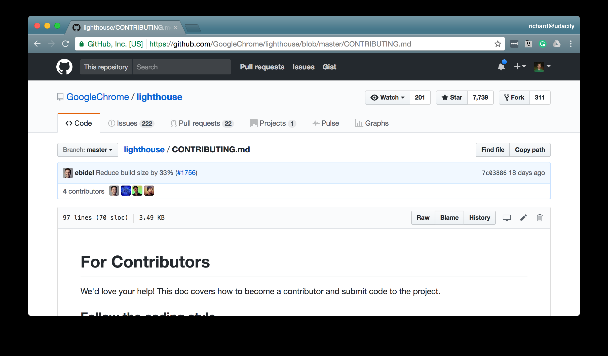
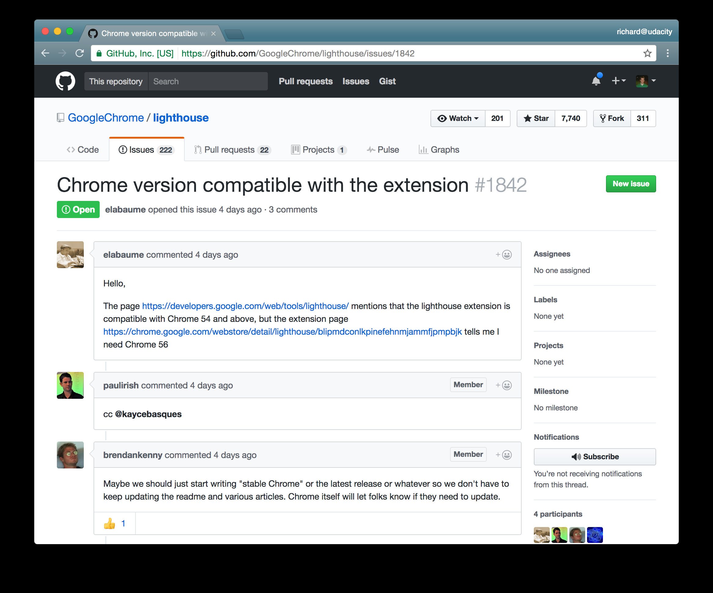

# Github协作指南

## CONTRIBUTING
在参与项目中做出贡献时，需要遵循项目规则可查看 `CONTRIBUTING.md`，如查看代码样式、贡献者许可协议等。

示例

## Issues
除了遵顼 `CONTRIBUTING.md` 列出的规则，还需要查看 GitHub 的问题跟踪器 Issues。这里的 **Issues 问题** 并不代表实际存在错误，它可以是需要对项目进行的任何改变。查看是否有哪些与你要贡献的内容类似，如果有则订阅该 Issue 并阅读现有的对话评论以获取相关的信息及帮助。如果 Issues 列表没有与你要做的事情类似的内容，那么你可以创建自己的新 Issue。问题跟踪器最重要的一个方面在于，每个问题都可以有自己的**评论区**，使开发者围绕这个问题展开对话。

与编写描述性的提交说明一样，你在创建问题时，要给它一个信息丰富的标题，简要说明你想要做的事情。然后，在评论部分，提供大量关于此更改的详细信息，可以是你为什么认为此更改有必要，也可以是它如何改进项目。GitHub 问题页面支持 Markdown，所以当你创建了自己的问题后，可以使用 Markdown 编排格式，并通过包含链接、图像、项目符号列表和代码块按照你想要的方式进行编写。

## 特性分支
组织你想贡献给项目的一系列 commit 或更改的最佳方法，是将它们全部放在一个**特性分支**上。特性分支仅保存单个概念或单个更改区域的 commit，相对应的主分支是用来保存整个项目的所有 commit 的默认分支。

特性分支的名称应该使用一个清晰的**描述性名称**，以便在列出所有分支时可以立即根据名称确定要在分支中做哪些更改。 有时项目会对特性分支的命名有特定要求。例如，如果一个分支将要解决错误修复，那么许多项目会要求添加一个 `bugfix-` 前缀。回到我们处理登录表单错误的分支，它得被命名为 `bugfix-login-form`。所以一定要阅读 `CONTRIBUTING.md`

## 编写描述性的提交说明
以清晰描述分支会包含哪些更改的同时，还需要编写清晰、描述性的提交说明。你的分支名称和提交说明描述得越清楚，项目维护者用于询问你的代码的用途，或者自己去深入了解代码的时间就越少。项目维护者需要做的工作越少，将你的更改纳入项目的速度就越快。

## 创建短小而明确的 commit
请确保在对项目 commit 更改时，使用短小的 commit。不要进行大量 commit，记录 10 多个文件和数百行代码的更改。最好频繁多次地进行小的 commit，只记录很少数量的文件和代码更改。

如果开发者不喜欢你的大量 commit 中的一部分更改，他们不可能说「我赞成 commit A，只是不赞成改变边栏背景颜色的那部分。」一个 commit 不能分解成几个小块，所以确保你的 commit 足够小，每个只集中解决一个更改。这样，维护者可以说「我赞成 commit A、B、C、D 和 F，但不赞成 commit E」。

## 更新 README
如果你添加的任何代码更改会使项目发生极大的变化，则应更新 README 文件以向其他人说明此更改。