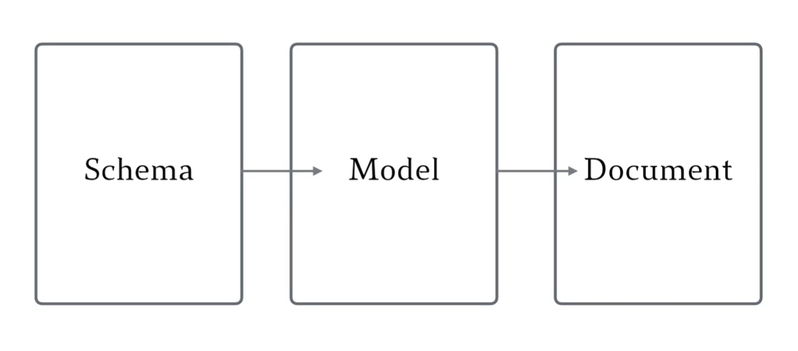

---
tags:
  - nosql
  - mongodb
  - mongoose
---

# Mongoose

参考：:cinema: [MongoDB and Mongoose](https://www.youtube.com/playlist?list=PLhGp6N0DI_1QJMb63oecYZ3lLjrF4PnIs) | freeCodeCamp

MongoDB 是一种文档对象数据库，试图解决内存中的对象和持久化的存储之间的转换和映射问题。Mongoose 是基于 MongoDB 数据库进行数据存储和管理的 Node.js 模块，因此数据存储十分灵活且易于拓展，**同时它结合了关系型数据库中 Shema 的概念，使得数据结构更严谨和管理**，更为优雅地解决 MongoDB 在对象建模上的一系列问题。

## 核心概念


* **Schema 模式**：类似于关系型数据库中的字段设置，**描述了一类数据规范**，包括这类数据可能包含的字段，并规定每个字段的数据类型等，它们是否可以为空，以及允许存储的最长和最短值等。
* **Model 模型**：从 Schema 产生的**构造器**，可以产生 Document 文档，通过查找、创建、删除 Document 来操作文档。
* **Document 文档**：本质上是 Model 的**实例**，每一条数据（对象）就是以一个 Document 实例来存储。

## 安装
参考：
* [MongoDB](https://www.mongodb.com/)
* [MongoDB 中文网](https://www.mongodb.org.cn/)
* [Mongoose Document](https://mongoosejs.com/docs/guide.html)
* [Mongoose.js 中文网](http://mongoosejs.net/)

:bulb: mongoose 是一个 nodejs 模块，相当于协助 node 与 MongoDB 沟通的中间者，数据依然存储在 MongoDB Server 上，因此需要在系统中先安装 MongoDB 或使用 docker 容器的方式直接启动。
:bulb: 也可以使用在线云数据库 [MongoDB Atlas](https://www.mongodb.com/cloud/atlas)（有[免费额度](https://www.mongodb.com/pricing)）。

在项目中安装 mongoose 模块

```bash
yarn add mongoose
```

## 基本用法
1. 导入 mongoose 模块

```js
const mongoose = require('mongoose');
```

2. 连接数据库

```js
# 连接到本地 MongoDB 的 nodegist 数据库
await mongoose.connect('mongodb://localhost/nodegist', { useNewUrlParser: true });
```

:bulb: 连接数据库是一个异步操作，返回一个状态待定 pending 的连接，可以通过监听时事件 `open` 或 `error` 来获取连接成功提醒和失败警告。只有连接成功后才可以进行数据库操作，==**因此数据库的操作都在回调函数中**==。

```
var db = mongoose.connection;
db.on('error', console.error.bind(console, 'connection error:'));
db.once('open', function() {
  // we're connected!
});
```

3. 定义 schema，可以将其看作是 model 的配置对象，设置了 MongoDB 的集合 collection 存储的文档 document 应该具有的字段及其字段值的数据类型，可以使用 `required`、`unique`、`default` 限制字段或设置默认值。

```js
const GistSchema = new mongoose.Schema({
  name: {type: String, required: true},   // 必添字段
  type: [String],   // 数组，元素是字符串
  code: {type: String},
  author_id: {type: String, unique: true},   // 字段值需要唯一
  created_at: {type: Date, default: Date.now}   // 默认值为当前时间
});
```

:bulb: schema 是 model 的构建（配置）模块，可以通过 schema 的组合（继承）来构建出复杂的 model。

4. 创建 model，第一个参数是 Model 的名称（Schema 创建 Model，相当于数据库中的 Collection 名称，使用单数单词，Mongoose 会自动在数据库中自动匹配/创建复数名称的 Collection），第二个参数是基于的 Schema

```js
const GistModel = mongoose.model('Gist', GistSchema);
```

:bulb: model 是基于 Schema 定义的**构造函数**，实例化后可以得到文档，就是一条数据记录。

5. 使用 model 实例化创建 document，然后就可以对 document 进行操作。

```js
const gist = new GistModel({
    name: 'test_gist',
    type: 'javascript',
    code: 'console.log("hello world!");',
    author_id: 'Ben',
    created_at: '123'
});
```

:bulb: 也可以先创建一个**空的文档 document**，该文档相当于一个对象 object，然后可以按照对象新增属性的方式，再添加 Schema 中预设的字段的值

```js
let  gist = new GistModel();
gist.name = 'test_gist';
gist.type: 'javascript';
gist.code: 'console.log("hello world!");';
gist.author_id: 'Ben';
gist.created_at: '123';
```


## 常用操作

参考：[mongoose API Docs](https://mongoosejs.com/docs/api.html)

### 存储
* `<documentName>.save((error, doc) => {// do something})` 每个 document 会在调用他的 `save` 方法后保存到数据库。当数据库返回数据时会执行回调函数，:bulb: 它的第一个参数是 `error`

```js
doc.save(function(err, data) {
    if(err) console.log(err);
    console.log(data);
})
```

* `<modelName>.create(docArray, (err, data) => {})` 创建**多个 documents** 并保存到数据库的快捷方法，第一个传递的参数是一个对象数组，其中每一个元素（对象）都包含基于 schema 规定的键值对。

```js
let peopleArray = [
  { name: "Hannah", age: 24, favoriteFoods: ["watermelon", "mango"] },
  { name: "Igor", age: 52, favoriteFoods: ["vegetable soup"] }
];

Person.create(peopleArray, (error, People) => {
    if(error){
      console.log(error)
    } else {
      console.log(People)
    }
  });
```
### 查询
* `<modelName>.find(<query>, (error, docs) => {// do something})` 查询所有符合条件的模型所对应的实例，以数组的形式返回。**如果不传递查询条件 `<query>`，返回数据库中所有数据**；如果希望获取特定的数据，可以传递 `<query>` 作为（可选）第一个参数

```js
// 获取所有 name 以 "fluff" 开头的文档数据
Kitten.find({ name: /^fluff/ }, callback);
```

* `<modelName>.findOne(<query>, (error, doc) => {// do something})` 查询符合条件的模型所对应的实例的第一个。

* `<modelName>.findById(id, (error, doc) => {// do something})` **MongoDB 会为每个文档创建一个字段 `_id`，可以通过该值查询文档**。

:bulb: 由于与数据库的交互是**异步**的，可以使用**链式**调用的方式来实现复杂的查询：

* 使用[方法 `.sort()`](https://mongoosejs.com/docs/api/query.html#query_Query-sort) 对查询结果进行排序，如设置为 `{age: 'asc'}` 文档基于字段 `age` 升序 ascending 排列；如果需要降序可以将字段对应的值设置为 `desc`
* 使用[方法 `.limit(n)`](https://mongoosejs.com/docs/api/query.html#query_Query-limit) 限制返回的文档数量最多为 `n`
* 使用[方法 `.select()`](https://mongoosejs.com/docs/api/query.html#query_Query-select) 设置提取返回文档的指定字段，可以传入 `+fieldName` 或 `-fieldName` 参数以表示返回的数据中包含或不包含相应的字段（默认返回 `_id` 字段）
* 使用[方法 `.exec()`](https://mongoosejs.com/docs/api/query.html#query_Query-exec) 设置回调函数，它会执行查询方法，并在数据库返回响应时执行其中预设的函数

```js
Person.find({favoriteFoods: {$all: ['Salad']}})
  .sort({age: 'asc'})
  .limit(3)
  .select(['name', 'age'])
  .exec((err, data) => {
    if(err) console.log(err);
    console.log(data);
})
```

### 更新
**旧方法**：通过 3 步实现文档更新，从数据库获取需要文档，编辑修改文档，将修改后的文档保存回数据库。:thumbsdown: 但该方法会形成深度嵌套。

1. 使用 `.find` 及类似方法获取文档
2. 在回调函数中修改文档
3. 调用 `.save()` 将修改后的文档保存回数据库中，由于文档已存在 `_id` 字段，因此会覆盖掉数据库原有相应文档。

**新方法**：使用 mongoose 提供的内置方法 `.findOneAndUpdate()` 方法更方便地实现文档的更新。

方法 `<modelName>.findOneAndUpdate(<query>, <update_properties>, <options>, <callback>)` 可以实现一步更新文档：
* 通过 `<query>` 查询文档
* 在 `<update_properties>` 设置需要更新的字段
* （可选）`<options>` 可以设置更新行为，如设置 `{new: true}` 返回更新后的文档
* `<callback>` 回调函数会在数据库返回响应后执行

```js
Person.findOneAndUpdate(
  {name: 'Ben'},   // 查询字段 name 的值为 Ben 的文档 
  {age: 26},   // 更新文档字段 age 的值为 26
  {new: true},   // 返回修改后的值
  (err, data) => {
    if(err) console.log(err);
    console.log(data);
  }
)
```

:bulb: 也可以使用方法 `findByIdAndUpdate()` 基于的 `_id` 字段更新文档。

### 删除
* `<modelName>.findOneAndRemove(<query>, (error, doc) => {// do something})` 删除匹配的一个文档，并且被移除的文档会作为数据库响应的 `data` 参数返回。

:bulb: 也可以使用方法 `.findByIdAndRemove()` 基于 ID 删除文档。

* `<modelName>.remove(<query>, (error, JSONStatus) => {// do something})` 删除匹配的所有文档，返回一个 JSON status 状态码。如果只想删除第一个匹配的文档，可以添加配置项 `{single: true}` 作为（可选）第二个参数。


