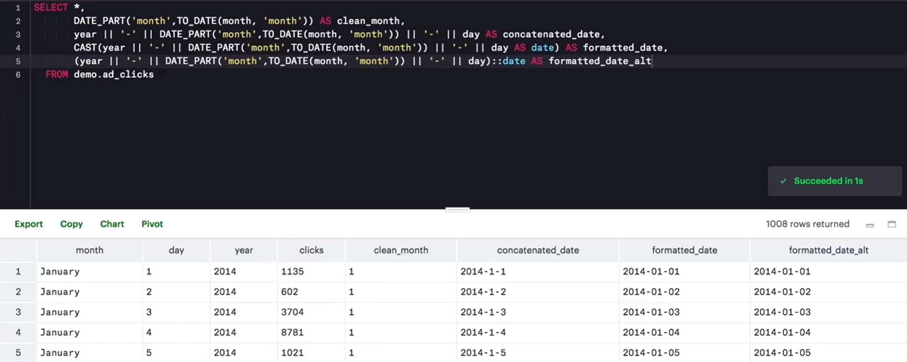

---
tags:
  - sql
---

# SQL 数据清理

# 数据清理
原始的数据结构或内容可能并不适合直接进行分析，SQL 提供了许多内置的函数对数据进行清理，如提取部分数据、数据类型转换、处理 `NULL` 等。

## LEFT、RIGHT、LENGTH
函数 `LEFT`、`RIGHT`、`LENGTH` 可用于从特定索引位置提取子字符串

* 函数 `LEFT(col_name, num)` 从起点（或左侧）开始，获取给定字段（列）`col_name` 每行一定数量 `num` 的字符。如使用 `LEFT(phone_number, 3)` 获取电话号码中的前三位，一般时区号。

- 函数 `RIGHT(col_name, num)` 从末尾（或右侧）开始，获取给定字段（列）`col_name` 每行一定数量 `num` 的字符。如使用 `RIGHT(phone_number, 8)` 获取电话号码的最后 8 位。

- 函数 `LENGTH(col_name)` 获取给定字段（列）`col_name` 每行的字符数。如 `LENGTH(phone_number)` 得出每个电话号码的字符长度。

```sql
-- 选择网址 URL 最后 3 个字符，即域名
SELECT RIGHT(website, 3) AS domain, COUNT(*) num_companies
FROM accounts
GROUP BY 1
ORDER BY 2 DESC;
```

:bulb: 函数 `LEFT`、`RIGHT` 等一般针对字符串数据，但是也可以操作数字或日期类型的数据，系统会将它们转换为字符串。

## POSTION、STRPOS
函数 `POSTION` 或 `STRPOS` 用于获取特定（子）字符在字符串中的索引，如 `POSITION(',' IN city_state)` 获取字段（列） `city_state` 每一行字符串中逗号 `,` 的索引位置。

`STRPOS` 和 `POSITION` 提供的结果相同，但是语法不太一样，前面的示例使用 `STRPOS` 函数就是 `STRPOS(city_state, ‘,’)`

```sql
-- 原始数据在字段 primary_poc 存储了名字，名字和姓氏之间用空格分隔
-- 使用 POSITION(' ' IN primary_poc) 取得空格的索引
-- 使用 LEFT 提取姓氏
-- 使用 RIGHT 提取名字
SELECT primary_poc,
        LEFT(primary_poc, POSITION(' ' IN primary_poc) - 1) AS first_name,
        RIGHT(primary_poc, LENGTH(primary_poc) - POSITION(' ' IN primary_poc)) AS last_name
FROM accounts
```

:warning: 在 SQL 中第一个位置的索引是 1，而很多编程语言的索引是从 0 开始。

:bulb: 函数 `POSITION` 和 `STRPOS` 查询的是字符的索引，而**字符需要区分大小写**。

## LOWER、UPPER
使用函数 `LOWER（col_name)` 或 `UPPER(col_name)` 让给定字段（列）中所有字符变成小写或大写。

## CONCAT
函数 `CONCAT` 将给定的字段（列）的值组合在一起形成新的列，也可以为每一个都添加相同的数据形成特定的格式，如 `CONCAT(first_name, ' ', last_name)` 将存储在不同列中的名字和姓氏组合到一起形成全名，中间用空格 `' '` 分隔。

:bulb: 可以使用管道字符 `||` 执行不同字段数据的连接，如上述示例用管道字符实现方式为 `first_name || ' ' || last_name`

## REPLACE
使用函数  `replace(string_text, from raw_text, to new_text)` 将给定的字段（列）的值 `string_text` 中的匹配的部分 `raw_text` 替换成 `new_text`

## CAST
函数 `CAST(expression AS target_type)` [将数据转换为指定的数据类型](https://www.postgresqltutorial.com/postgresql-cast/)，如将字符串转换为数值或日期（但字符串的值应该是 sql 可理解的）`CAST(date_column AS DATE)` :bulb: 可以使用简写方式 `date_column::DATE`



## COALESCE
函数 `COALESCE(val1, val2, ...., val_n)` 返回的是的第一个非 `NULL` 值，如果函数内的所有参数都为空值，则返回 `NULL`，可以使用这个特性将给定字段（列）中的空值替换为特定值

```sql
-- 由于使用左连接组合表格，因此查询获得的表格可能出现 NULL 单元格
-- 使用 COALESCE 函数将字段 total_amt_usd 为 NULL 的单元格替换为 0
SELECT COALESCE(o.total_amt_usd, 0) total_amt_usd
FROM accounts a
LEFT JOIN orders o
ON a.id = o.account_id;
```