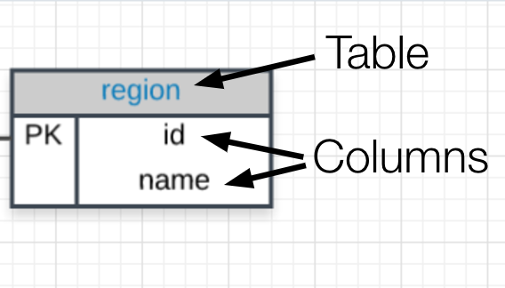
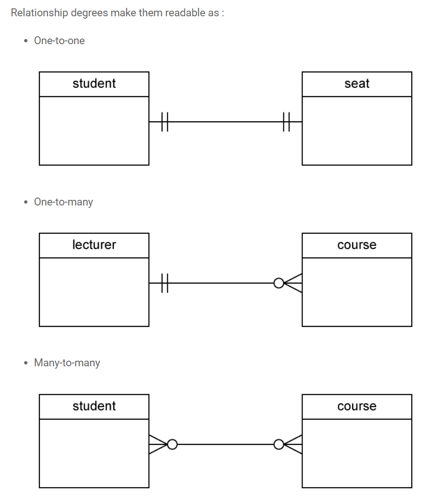

# SQL 实体关系图

一般在数据库中将数据存储为表格形式，表格之间的关系可以使用 **Entity Relationship Diagram，ERD 实体关系图**表示。

ERD 是一种基于电子表格的关系图，以可视化的方式展示这些正在分析的数据表格的关系，ERD 由多个部分组成包括：

* 顶部为表的名称，每个表为一个实例（即数据库中的一个电子表数据）
* 表名称下有实例的属性（即电子表的每一个列）

    

* 表配合工作的方式，通过 [Crow's Foot 表示法](http://www.vertabelo.com/blog/technical-articles/crow-s-foot-notation)显示实例之间的关联（这些关联对于使用 SQL 和关系型数据库十分重要性）， 常见的关系有：

    * 一对一
    * 多对一

    

    :bulb: 而如果另一侧实例/表格可能没有对应则使用空心圆表示

