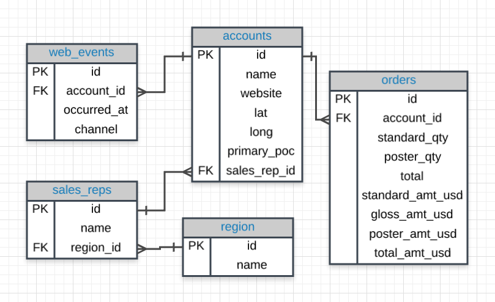
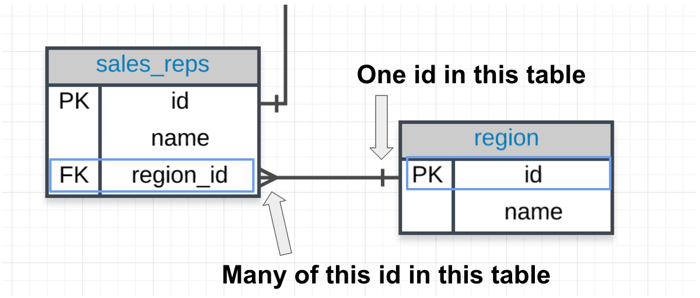
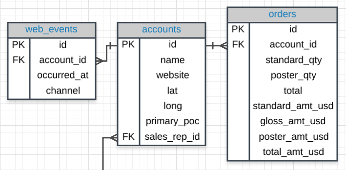
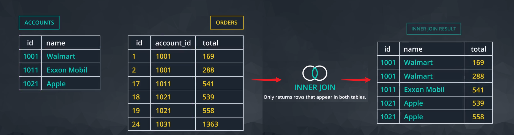
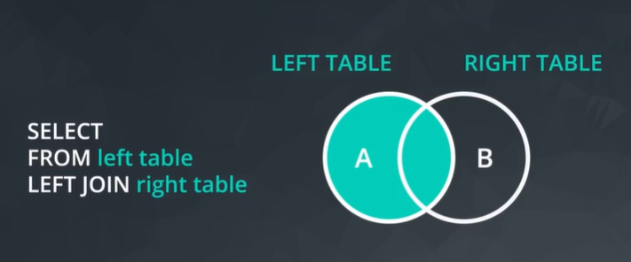
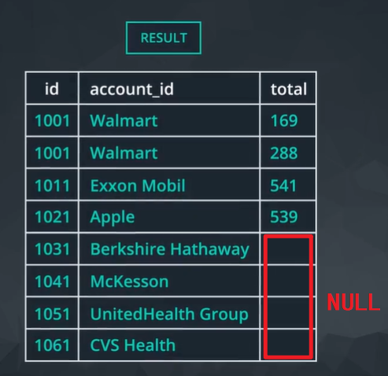

# SQL 组合表格

按照规范化在创建数据库时一般将数据按照逻辑进行分组/拆分，存储在不同的实体（表格）中，**而不同的表格之间的数据通过特定字段/属性进行对照关联**，这种分离关联的结构可以实现快速高效的数据访问和操纵。

## 键
数据拆分到不同的表格中，每个表格存储着不同的字段，但是必须有一个字段（一般称为 `id`）它的每行值都唯一的，一般称这样的字段为**主键 PK，primary key**，用于**唯一标识**每一行的数据。



表格可能存在另一个字段作为键，称为 **外键 FK，foreign key**，它始终**与另一个表格的外键相关联**，表格之间就是基于这些键来进行组合的。



在上述示例图中，鱼尾纹表示法 Crow's foot 显示 **FK 与 PK 对应关系是多对一**，即 FK 有多个重复值，而 PK 每一行的值都是唯一的，因此按照 FK 和 PK 关系将这两个表格组合时，**表格 region 的每行就可能需要「复制」多个与相应的 sales_reps 的行组合**。

## JOIN
由于在关系型数据库中数据拆分存储在不同的实体（表格）中，因此常常需要使用 `JOIN` 语句将各种「分散」在不同表格的各种信息读取出来组合为一个更完整的表格。

语句 `JOIN` 的作用与语句 `FROM` 类似，它指定了需要「组合」数据所来源的表格，结合语句 `ON` 指明这些表格之间的关系是基于哪个字段

`ON` 指定两个表格中「相连」的方式，:bulb: 一般将表格的**外键**与另一个表格的**主键**相等（基于这两列的值进行表格组合），即当这两个字段的值相同时，就会将两表格中相应的数据项（相应的那一行）进行组合

```sql
/*
分别从两个表格组合后的数据中取出相应字段的值
需要使用点记法指定某列所来自哪个表格
*/
SELECT orders.account_id,
    orders.standard_qty,
    orders.gloss_qty,
    orders.poster_qty,
    accounts.website,
    accounts.primary_poc
FROM orders
-- 组合 accounts 表格
JOIN accounts
/*
组合的标准是
当 orders 表格中字段 account_id 与 accounts 表格中的字段 id 相同时
将两个表格中相应的行组合
*/
ON orders.account_id = accounts.id;
```

:bulb: 连接两个表格时，一个来自 `FROM`，另一个来自 `JOIN`。然后在语句 `ON` 中始终让**主键**等于**外键**，基于这个规则可以将多个表格组合为一个大表格。



```sql
-- 组合三个表格
SELECT web_events.channel, accounts.name, orders.total
FROM web_events
JOIN accounts
ON web_events.account_id = accounts.id
JOIN orders
ON accounts.id = orders.account_id
```

:bulb: 类似为派生列设置别名，我们也可以在用 `SELECT` 选择列或用 `FROM` 或 `JOIN` 选择表格时设置别名，使用语句 `AS` 或直接在其后设置别名，一般使用单个小写字母；然后就可以在其他语句部分使用别名代表相应的表格，可以提高编写代码的效率。

```sql
FROM tablename AS t1
JOIN tablename2 AS t2

-- 以下方法也是为表格设置别名
FROM tablename t1
JOIN tablename2 t2
```

## 不同的组合方式
当组合两个实例（表格）时，两者各行不一定一一完全匹配，因此会有两种组合 JOIN 方式：

* 内连接 INNER JOIN：**默认组合方式**，只获取并组合两个表格中匹配的行，相当于韦恩图中的交集
* 外连接 OUTER JOIN：除了获取匹配的行，还可以获取其他未匹配的行，连接后某些行的某些字段出现空缺就会使用 `NULL` 填充。这里又分为三种情况：
    * 左连接 `LEFT JOIN`：基于 LEFT TABLE 进行组合，即**获取 `FROM` 中的表格中的所有行**，即使它们不存在于 `JOIN` 语句中。
    * 右连接 `RIGHT JOIN`：基于 RIGHT TABLE 进行组合，即**获取 `JOIN` 中的表格中的所有行**，即使它们不存在于 `FROM` 语句中。
    * 全连接 `FULL OUTER JOIN`：相当于韦恩图中的**并集**分别时，以两个表格作为基础进行组合

### 内连接 INNER JOIN


```sql
SELECT a.id, a.name, o.total
FROM orders o
JOIN accounts a
ON o.account_id = a.id
```

### 外连接 OUTER JOIN


使用语句 `FROM` 选择的表格是 `left_table`，使用语句 `JOIN` 选择的表格是 `right_table`



一般外连接都使用左连接的形式，语句为 `LEFT JOIN`（因为左连接和右连接实际上是可以互换的，通过交换 FROM 和 JOIN 选择的表格，并将组合语句修改为 `RIGHT JOIN`），基于这个约定因此一般将 `FROM` 选择的表格作为外连接的基准，连接后部分数据（部分行）的相应字段就会出现空缺，使用 `NULL` 填充这些单元格。

```sql
SELECT *
FROM left_table
LEFT JOIN right_table
```



:warning: 当数据库执行表格组合时，如果在语句 `ON` 中使用了条件指令，**将先执行筛选后再进行表格组合**，即会用筛选后的表格子集来进行组合；这与组合后再使用 `WHERE` 条件来过滤该结果集是不同的，特别是在使用外连接时，因为内连接仅返回两个表格中匹配的行，将 `WHERE`  过滤器移到内连接的 `ON` 条件中将与使其保留在中产生的结果一样。

:bulb: 还有其他类型的高级 **JOIN** 语句仅适用于非常特定的情况，如 [`UNION` 和 `UNION ALL`](http://www.sqlservertutorial.net/sql-server-basics/sql-server-union/)、[`CROSS JOIN`](http://www.sqlservertutorial.net/sql-server-basics/sql-server-cross-join/)、[`SELF JOIN`](http://www.sqlservertutorial.net/sql-server-basics/sql-server-self-join/)。