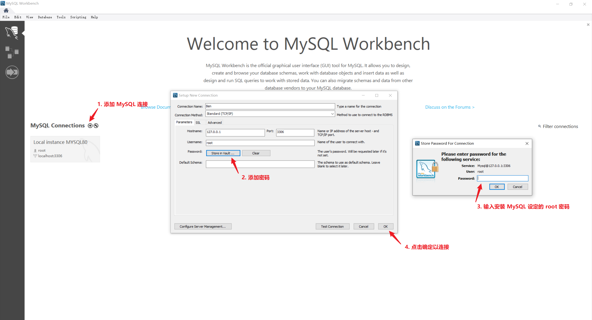
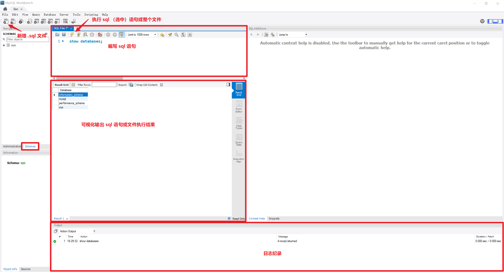

# MySQL 简介

MySQL 是 Oracle 推出的关系型数据库，是十分流行的 Web server 数据库，可在官网免费下载用于学习。

在[官网](https://www.mysql.com/)选择合适系统的 MySQL Community Server [安装器（MSI 安装文件）](https://dev.mysql.com/downloads/installer/)或[压缩包（需要解压并进行配置）](https://dev.mysql.com/downloads/mysql/)并进行安装，安装步骤参考[这里](https://blog.csdn.net/qq_34531925/article/details/78022905)，然后参考[这里](https://blog.csdn.net/wangyan_z/article/details/81089211)修改默认 Data 路径。

:bulb: 可以使用 MySQL Command Line Client 命令行界面连接操作数据库，（推荐）也可以使用 [MySQL Workbench](https://dev.mysql.com/downloads/workbench/) 一款官方推出软件以可视化方式来连接操作数据库。

:bulb: MySQL Workbench 常用快捷键：
* 执行整篇 sql 脚本 `Ctrl + Shift + Enter`
* 执行当前行 `Ctrl + Enter`
* 注释/取消注释 `Ctrl + /`
* 格式化 sql 语句 `Ctrl + B`

## 主要数据类型
MySQL 支持的主要数据类型：
* `INT` (4o: +- 2 000 000 000)
* `BIGINT` (8o: +-9.10^18)
* `FLOAT`(M,D)
* `TIME` (HH:MM)
* `DATE` (AAAA-MM-JJ)
* `VARCHAR` (single-line; explicit size)
* `TEXT` (multi-lines; max size=65535)
* `LOGNTEXT`